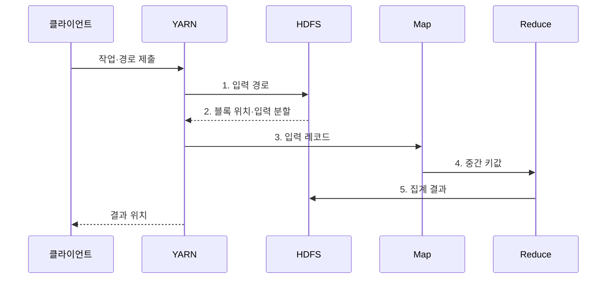

---
sidebar:
  order: 116
  label: "116. 빅데이터 분산 처리: Hadoop·MapReduce·HDFS"
  badge:
    text: "기출 · 30%"
    variant: note
title: "빅데이터 분산 처리: Hadoop·MapReduce·HDFS"
date: "2026-07-30T23:56:11+09:00"
tags:
  - "notes-software"
weight: 116
extra:
  question_no: "116"
  source_status: "기출"
  source_history: "120회"
  priority: 30
  priority_note: "120회 기출 후 저빈도, 배치 분산처리 기초"
---

## 미리 알고가기

- **아파치 하둡(Apache Hadoop)**: 분산 저장과 대규모 배치 처리를 위한 오픈 소스 생태계
- **하둡 분산 파일 시스템(Hadoop Distributed File System, HDFS)**: 파일을 블록으로 나누어 여러 데이터 노드에 복제하는 저장 계층이다.
- **네임노드(NameNode)**: HDFS의 파일 이름·블록 위치·복제 상태 등 메타데이터를 관리하는 노드이다.
- **데이터노드(DataNode)**: HDFS의 실제 파일 블록을 저장하고 읽기·쓰기 요청을 처리하는 노드이다.
- **입력 분할(Input Split)**: Map Task의 논리 입력 범위이며 HDFS 블록 경계와 항상 같지는 않음
- **맵리듀스(MapReduce)**: Map이 중간 키값을 만들고 Shuffle·Sort가 같은 키를 모은 뒤 Reduce가 집계하는 배치 처리 모델이다.
- **맵 태스크(Map Task)**: 입력 레코드를 읽어 중간 키와 값을 생성하는 병렬 작업이다.
- **리듀스 태스크(Reduce Task)**: 같은 키로 모인 값들을 집계해 최종 결과를 만드는 작업이다.
- **셔플·정렬(Shuffle and Sort)**: Map 출력을 키별 파티션으로 전송하고 같은 키끼리 정렬·그룹화하는 단계이다.
- **파티셔너(Partitioner)**: 중간 키가 어느 Reduce 파티션으로 갈지 결정하는 구성요소이다.
- **얀(Yet Another Resource Negotiator, YARN)**: 클러스터 자원 할당과 응용 작업 실행을 관리하는 계층이다.
- **리소스매니저(ResourceManager)**: 클러스터 전체 자원을 응용별로 할당하는 YARN 구성요소이다.
- **노드매니저(NodeManager)**: 각 노드에서 컨테이너 자원과 작업 프로세스를 실행·감시하는 구성요소이다.
- **애플리케이션마스터(ApplicationMaster)**: 한 응용의 작업 계획·자원 요청·실행 상태를 조정하는 구성요소이다.
- **컴바이너(Combiner)**: Map 출력을 로컬에서 부분 집계해 셔플 전송량을 줄이는 선택적 처리이다.
- **데이터 지역성(Data Locality)**: 데이터를 멀리 전송하는 대신 저장된 노드 가까이에서 연산을 실행하는 원칙이다.
- **키 편향(Key Skew)**: 일부 키에 값이 몰려 특정 Reduce 작업의 완료가 늦어지는 현상이다.
- **중앙 처리 장치(Central Processing Unit, CPU)**: YARN 컨테이너가 작업에 할당하는 연산 자원이다.
- **컨테이너(Container)**: YARN이 CPU·메모리 자원을 묶어 작업 프로세스에 할당하는 실행 단위
- **재실행(Re-execution)**: 실패한 태스크를 다른 복제 블록이나 노드에서 다시 수행해 배치 작업을 복구하는 방식
- **입출력(Input/Output, I/O)**: MapReduce의 디스크 기록·셔플 지연을 만드는 동작이다.
- **방향성 비순환 그래프(Directed Acyclic Graph, DAG)**: 방향을 갖고 순환하지 않는 작업 의존 관계이다.
- **멱등성(Idempotency)**: 같은 출력을 반복 기록해도 결과가 한 번 실행한 것과 같은 성질이다.

## Ⅰ. 개요

- 정의/개념: HDFS·YARN·MapReduce를 결합한 **분산 배치 체계**
- 배경/필요성: 단일 서버는 대용량 파일의 저장·집계 시간이 **한 장비 용량**에 종속

### 쉽게 이해하기 (학습용)
- 파일을 작업자에게 나눠 맡기고 같은 열쇠 결과를 한곳에 모아 집계하는 처리이다.

## Ⅱ. 특징

- **분산 저장**: HDFS 블록 분할·복제
- **키 처리**: Map·Shuffle·Reduce 집계
- **실패 복구**: 복제 블록으로 태스크 재실행

### 쉽게 이해하기 (학습용)
- 대용량 파일과 장애 재실행에는 강하지만 반복과 저지연 작업에는 느리다.

## Ⅲ. 구조 및 구성요소

| 구성요소 | 책임 |
|:---|:---|
| HDFS | **입력 블록·결과** 저장 |
| YARN | **컨테이너·상태** 관리 |
| Input Split | Map의 **논리 입력 범위** |
| Map·Combiner | **중간 키값·부분 집계** 생성 |
| Shuffle·Sort·Reduce | **키 그룹화·최종 집계** 수행 |

### 쉽게 이해하기 (학습용)

- 파일 창고, 작업 배정자, 입력 묶음, 이름표 작업자, 집계자로 구성된다.

## Ⅳ. 흐름도

**동작 원리**

1. **입력 경로**: YARN이 HDFS에 처리할 파일 경로 전달
2. **블록 위치·입력 분할**: HDFS가 지역성 기반 실행 정보 반환
3. **입력 레코드**: YARN이 Map에 분할별 레코드 전달
4. **중간 키값**: Map이 Reduce 파티션에 키·값 쌍 전달
5. **집계 결과**: Reduce가 키별 결과를 HDFS에 기록

### 쉽게 이해하기 (학습용)

- 파일 조각을 가까운 작업자에게 맡기고 같은 이름표의 결과를 모아 합산한다.

## Ⅴ. 종류 및 비교

| 분산 처리 엔진 | Hadoop MapReduce | 메모리 분산 엔진 | 단일 서버 |
|:---|:---|:---|:---|
| 적용 기준 | **대형 정렬·집계** | **반복·대화형 분석** | 한 노드 이내 **소규모 작업** |
| 핵심 특징 | **디스크 기반 단계 처리** | **메모리 캐시·DAG** | **로컬 파일·메모리** |
| 한계 | **셔플·높은 시작 지연** | **메모리·클러스터 비용** | **용량 상한·단일 장애** |

### 쉽게 이해하기 (학습용)

- Map은 이름표를 붙이고 Shuffle은 같은 이름표를 모으며 Reduce는 모인 값을 계산한다.

## Ⅵ. 실무 고려사항 및 대책

| 고려사항 | 위험 조건 | 대책 | 효과 |
|:---|:---|:---|:---|
| 작은 파일 | 파일마다 메타데이터·태스크 시작 비용 발생 | 병합·컨테이너 형식 사용 | **태스크 시작 비용** 감소 |
| 키 편향 | 일부 키에 중간값이 집중되어 Reduce 지연 | 샘플링·키 분할 적용 | **Reduce 병목** 완화 |
| 셔플 | 중간값 전량 전송으로 망·디스크 포화 | Combiner·압축·작업 수 조정 | **전송·입출력 부하** 감소 |
| 지역성 | 원격 블록 처리로 네트워크 전송 증가 | 블록 배치·자원 균형 | **원격 전송** 감소 |
| 재실행 | 실패 작업의 중복 기록으로 결과 오염 | 멱등 출력·임시 경로 사용 | **중복 부작용** 방지 |

### 쉽게 이해하기 (학습용)

- 작은 파일을 미리 묶고 한 키에 일이 몰리지 않게 나누면 작업 준비와 마지막 병목을 줄일 수 있다.

## Ⅶ. 결론

- 대형 일괄 집계는 **MapReduce**, 반복·대화형 분석은 **메모리 분산 엔진** 선택

### 쉽게 이해하기 (학습용)

- 큰 파일을 한 번에 나눠 계산하는 데 강하지만 빠른 반복 작업에는 다른 엔진이 더 알맞다.
