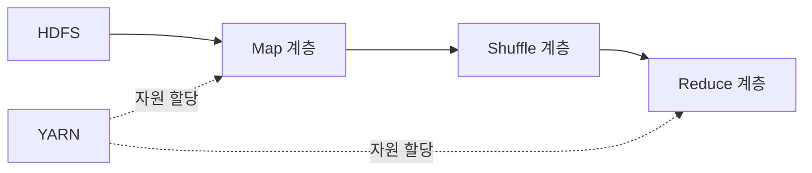
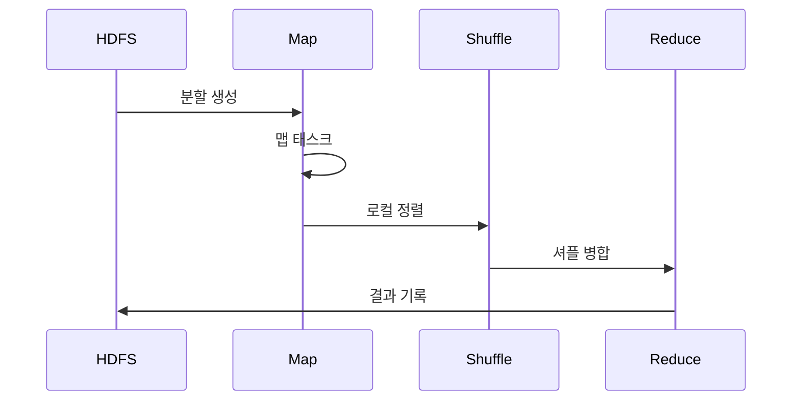

---
sidebar:
  order: 116
  label: "116. 빅데이터 분산 처리 — Hadoop·MapReduce·HDFS (Hadoop MapReduce)"
  badge:
    text: "기출 · 30%"
    variant: note
title: "빅데이터 분산 처리 — Hadoop·MapReduce·HDFS (Hadoop MapReduce)"
date: "2026-07-27T23:59:59+09:00"
tags:
  - "notes-software"
weight: 116
extra:
  question_no: "116"
  source_status: "기출"
  source_history: "120회"
  priority: 30
  priority_note: "120회 기출 후 저빈도, 배치 분산처리 기초"
---

## 미리 알고가기

- **아파치 하둡(Apache Hadoop)**: 분산 저장과 대규모 배치 처리를 위한 오픈 소스 생태계
- **하둡 분산 파일 시스템(Hadoop Distributed File System, HDFS)**: 영문 첫 글자를 딴 HDFS를 '에이치디에프에스'로 읽으며 파일을 블록으로 나누어 여러 데이터 노드에 복제하는 저장 계층임
- **네임노드(NameNode)**: HDFS의 파일 이름·블록 위치·복제 상태 등 메타데이터를 관리하는 노드임
- **데이터노드(DataNode)**: HDFS의 실제 파일 블록을 저장하고 읽기·쓰기 요청을 처리하는 노드임
- **입력 분할(Input Split)**: Map Task의 논리 입력 범위이며 HDFS 블록 경계와 항상 같지는 않음
- **맵리듀스(MapReduce)**: Map이 중간 키값을 만들고 Shuffle·Sort가 같은 키를 모은 뒤 Reduce가 집계하는 배치 처리 모델임
- **맵 태스크(Map Task)**: 입력 레코드를 읽어 중간 키와 값을 생성하는 병렬 작업임
- **리듀스 태스크(Reduce Task)**: 같은 키로 모인 값들을 집계해 최종 결과를 만드는 작업임
- **셔플·정렬(Shuffle and Sort)**: Map 출력을 키별 파티션으로 전송하고 같은 키끼리 정렬·그룹화하는 단계임
- **파티셔너(Partitioner)**: 중간 키가 어느 Reduce 파티션으로 갈지 결정하는 구성요소임
- **얀(Yet Another Resource Negotiator, YARN)**: 각 단어의 첫 글자를 딴 약어를 '얀'으로 읽으며 클러스터 자원 할당과 응용 작업 실행을 관리하는 계층임
- **리소스매니저(ResourceManager)**: 클러스터 전체 자원을 응용별로 할당하는 YARN 구성요소임
- **노드매니저(NodeManager)**: 각 노드에서 컨테이너 자원과 작업 프로세스를 실행·감시하는 구성요소임
- **애플리케이션마스터(ApplicationMaster)**: 한 응용의 작업 계획·자원 요청·실행 상태를 조정하는 구성요소임
- **컴바이너(Combiner)**: Map 출력을 로컬에서 부분 집계해 셔플 전송량을 줄이는 선택적 처리임
- **데이터 지역성(Data Locality)**: 데이터를 멀리 전송하는 대신 저장된 노드 가까이에서 연산을 실행하는 원칙임
- **키 편향(Key Skew)**: 일부 키에 값이 몰려 특정 Reduce 작업만 오래 걸리는 현상임
- **중앙 처리 장치(Central Processing Unit, CPU)**: 영문 첫 글자를 딴 CPU를 '시피유'로 읽으며 YARN 컨테이너가 작업에 할당하는 연산 자원임
- **컨테이너(Container)**: YARN이 CPU·메모리 자원을 묶어 작업 프로세스에 할당하는 실행 단위
- **재실행(Re-execution)**: 실패한 태스크를 다른 복제 블록이나 노드에서 다시 수행해 배치 작업을 복구하는 방식
- **입출력(Input/Output, I/O)**: '아이오'로 읽고 슬래시로 입력과 출력을 함께 나타내며 MapReduce의 디스크 기록·셔플 지연을 만드는 동작임

## Ⅰ. 개요

- 정의/개념: HDFS 데이터의 **키 기반 배치 병렬 처리**
- 기존 한계: 단일 서버는 **대용량 저장·처리·장애복구 한계**

### 쉽게 이해하기 (학습용)
- 파일을 작업자에게 나눠 맡기고 같은 열쇠 결과를 한곳에 모아 집계하는 처리임

## Ⅱ. 특징

- **HDFS 복제·태스크 재실행**으로 장애 복구
- **데이터 지역성·YARN**으로 분산 자원 할당
- **Map·Shuffle·Reduce**로 키별 집계 수행

### 쉽게 이해하기 (학습용)
- 대용량 파일과 장애 재실행에는 강하지만 반복과 저지연 작업에는 느림

## Ⅲ. 아키텍처 및 구성요소

| 설계 요소 | 설명 |
|:---|:---|
| HDFS | **파일 메타데이터·복제 블록** 관리 |
| YARN | **자원 할당·컨테이너 실행** 관리 |
| Map 계층 | 입력 분할에서 **중간 키값** 생성 |
| Shuffle 계층 | 키별 **전송·정렬·그룹화** 수행 |
| Reduce 계층 | 키별 값을 **집계·결과 기록** |

> 요약: 분산 저장과 자원을 제공하고 단계별로 입력 분할을 결과로 변환함

### 쉽게 이해하기 (학습용)
- 파일 창고와 자원 관리자 및 나누기와 운반 등 집계 단계로 구성됨

## Ⅳ. 원리 및 절차 흐름도

| 절차 | 설명 |
|:---|:---|
| 분할 생성 | HDFS 파일의 **논리 입력 범위** 생성 |
| 맵 태스크 | 레코드별 **중간 키값** 생성 |
| 로컬 정렬 | 키를 **Reduce 파티션별 정렬** |
| 셔플 병합 | 같은 키의 값을 **전송·그룹화** |
| 결과 기록 | 키별 **집계 결과를 HDFS에 저장** |

> 요약: Map 결과를 정렬해 Reduce가 집계한다

### 쉽게 이해하기 (학습용)
- 조각을 읽고 같은 키를 정렬한 뒤 결과를 분산 파일에 기록함

## Ⅴ. 종류 및 비교

| 배치 처리 방식 | Hadoop MapReduce | 단일 서버 처리 |
|:---|:---|:---|
| 적용 기준 | 대용량 파일 **정렬·일괄 집계** | 단일 서버 규모의 **저지연 작업** |
| 핵심 특징 | **분산 블록·키 셔플·재실행** | 로컬 **저장·연산 자원** 사용 |
| 한계 | 셔플·디스크 I/O·**키 편향** | 용량 상한·**단일 장애점** |

> 요약: 분산 블록은 대용량 배치, 단일 서버는 저지연에 맞다

### 쉽게 이해하기 (학습용)
- Hadoop MapReduce는 자료가 있는 여러 작업장에서 나눠 처리하고 단일 서버는 한 작업장에서 처리함

## Ⅵ. 실무 사례

1. 로그 파일 **병합**으로 Map 태스크 수 감소

### 쉽게 이해하기 (학습용)
- 작은 로그 파일을 묶으면 입력 분할과 Map Task 수가 줄어 작업 시작·관리 비용을 낮출 수 있음

## Ⅶ. 결론

- 대용량 배치는 **MapReduce**, 반복 분석은 **Spark**

### 쉽게 이해하기 (학습용)
- Hadoop MapReduce는 대용량 일괄 정렬·집계와 장애 재실행에 맞고 저지연 반복 분석에는 메모리 중심 엔진이 더 적합함
