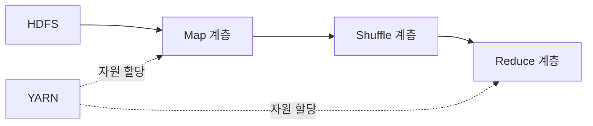
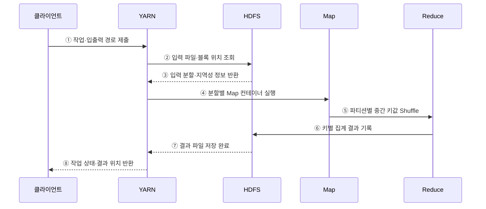

---
sidebar:
  order: 116
  label: "116. 빅데이터 분산 처리 — Hadoop·MapReduce·HDFS (Hadoop MapReduce)"
  badge:
    text: "기출 · 30%"
    variant: note
title: "빅데이터 분산 처리 — Hadoop·MapReduce·HDFS (Hadoop MapReduce)"
date: "2026-07-27T23:59:59+09:00"
tags:
  - "notes-software"
weight: 116
extra:
  question_no: "116"
  source_status: "기출"
  source_history: "120회"
  priority: 30
  priority_note: "120회 기출 후 저빈도, 배치 분산처리 기초"
---

## 미리 알고가기

- **아파치 하둡(Apache Hadoop)**: 분산 저장과 대규모 배치 처리를 위한 오픈 소스 생태계
- **하둡 분산 파일 시스템(Hadoop Distributed File System, HDFS)**: 영문 첫 글자를 딴 HDFS를 '에이치디에프에스'로 읽으며 파일을 블록으로 나누어 여러 데이터 노드에 복제하는 저장 계층임
- **네임노드(NameNode)**: HDFS의 파일 이름·블록 위치·복제 상태 등 메타데이터를 관리하는 노드임
- **데이터노드(DataNode)**: HDFS의 실제 파일 블록을 저장하고 읽기·쓰기 요청을 처리하는 노드임
- **입력 분할(Input Split)**: Map Task의 논리 입력 범위이며 HDFS 블록 경계와 항상 같지는 않음
- **맵리듀스(MapReduce)**: Map이 중간 키값을 만들고 Shuffle·Sort가 같은 키를 모은 뒤 Reduce가 집계하는 배치 처리 모델임
- **맵 태스크(Map Task)**: 입력 레코드를 읽어 중간 키와 값을 생성하는 병렬 작업임
- **리듀스 태스크(Reduce Task)**: 같은 키로 모인 값들을 집계해 최종 결과를 만드는 작업임
- **셔플·정렬(Shuffle and Sort)**: Map 출력을 키별 파티션으로 전송하고 같은 키끼리 정렬·그룹화하는 단계임
- **파티셔너(Partitioner)**: 중간 키가 어느 Reduce 파티션으로 갈지 결정하는 구성요소임
- **얀(Yet Another Resource Negotiator, YARN)**: 각 단어의 첫 글자를 딴 약어를 '얀'으로 읽으며 클러스터 자원 할당과 응용 작업 실행을 관리하는 계층임
- **리소스매니저(ResourceManager)**: 클러스터 전체 자원을 응용별로 할당하는 YARN 구성요소임
- **노드매니저(NodeManager)**: 각 노드에서 컨테이너 자원과 작업 프로세스를 실행·감시하는 구성요소임
- **애플리케이션마스터(ApplicationMaster)**: 한 응용의 작업 계획·자원 요청·실행 상태를 조정하는 구성요소임
- **컴바이너(Combiner)**: Map 출력을 로컬에서 부분 집계해 셔플 전송량을 줄이는 선택적 처리임
- **데이터 지역성(Data Locality)**: 데이터를 멀리 전송하는 대신 저장된 노드 가까이에서 연산을 실행하는 원칙임
- **키 편향(Key Skew)**: 일부 키에 값이 몰려 특정 Reduce 작업만 오래 걸리는 현상임
- **중앙 처리 장치(Central Processing Unit, CPU)**: 영문 첫 글자를 딴 CPU를 '시피유'로 읽으며 YARN 컨테이너가 작업에 할당하는 연산 자원임
- **컨테이너(Container)**: YARN이 CPU·메모리 자원을 묶어 작업 프로세스에 할당하는 실행 단위
- **재실행(Re-execution)**: 실패한 태스크를 다른 복제 블록이나 노드에서 다시 수행해 배치 작업을 복구하는 방식
- **입출력(Input/Output, I/O)**: '아이오'로 읽고 슬래시로 입력과 출력을 함께 나타내며 MapReduce의 디스크 기록·셔플 지연을 만드는 동작임

## Ⅰ. 개요

- Hadoop은 HDFS의 분산 저장, YARN의 자원 관리, MapReduce의 병렬 배치 처리를 결합한 대용량 데이터 처리 생태계이다.
- MapReduce는 입력을 나눠 Map한 뒤 중간 키를 Shuffle·Sort하고 Reduce하여 결과를 만드는 장애 복구 가능한 배치 모델이다.

### 쉽게 이해하기 (학습용)
- 파일을 작업자에게 나눠 맡기고 같은 열쇠 결과를 한곳에 모아 집계하는 처리임

## Ⅱ. 특징

- **분산 저장**: HDFS가 파일을 블록으로 나누고 여러 DataNode에 복제한다.
- **자원 관리**: YARN이 컨테이너를 할당하고 태스크를 실행·감시한다.
- **키 기반 처리**: Map 출력은 파티션·정렬되어 같은 키가 같은 Reduce로 모인다.
- **실패 복구**: 불변 입력과 복제 블록을 이용해 실패한 태스크를 재실행한다.

### 쉽게 이해하기 (학습용)
- 대용량 파일과 장애 재실행에는 강하지만 반복과 저지연 작업에는 느림

## Ⅲ. 아키텍처 및 구성요소

**도표안 A — 구조도**

**도표안 B — sequenceDiagram**

| 구성요소 | 역할 |
|:---|:---|
| HDFS | 파일 메타데이터·복제 블록·결과 저장 |
| YARN | 응용별 자원 요청·컨테이너 실행·상태 관리 |
| Input Split | Map Task가 읽을 논리 입력 범위 |
| Map·Combiner | 레코드를 중간 키값으로 변환·선택적 부분 집계 |
| Partitioner·Shuffle·Sort | Reduce 대상 결정·전송·키별 그룹화 |
| Reduce | 키별 값 집계와 최종 결과 기록 |

**동작 원리**

- ① 클라이언트가 작업 코드와 HDFS 입출력 경로를 YARN에 제출한다.
- ② YARN이 HDFS에 입력 파일과 블록 위치를 조회한다.
- ③ HDFS가 논리 입력 분할과 데이터 지역성 정보를 반환한다.
- ④ YARN이 분할 가까운 노드에 Map 컨테이너를 할당한다.
- ⑤ Map 출력이 파티션별로 정렬·전송되어 같은 키가 Reduce에 모인다.
- ⑥ Reduce가 키별 값을 집계해 HDFS에 결과를 기록한다.
- ⑦ HDFS가 결과 파일의 저장 완료를 YARN에 알린다.
- ⑧ YARN이 클라이언트에 작업 상태와 결과 위치를 반환한다.

### 쉽게 이해하기 (학습용)

- 파일 조각을 가까운 작업자에게 맡기고 같은 이름표의 결과를 모아 합산한다.

## Ⅳ. 종류 및 비교

| 비교 항목 | Hadoop MapReduce | 메모리 중심 분산 엔진 | 단일 서버 처리 |
|:---|:---|:---|
| 처리 방식 | 단계별 디스크 기반 배치 | 메모리 캐시·DAG 실행 | 로컬 파일·메모리 실행 |
| 강점 | 대규모 일괄 처리·태스크 재실행 | 반복·대화형·복합 파이프라인 | 단순성·낮은 시작 비용 |
| 적합한 작업 | 대형 정렬·집계·ETL | 반복 분석·머신러닝·저지연 배치 | 한 노드에 맞는 작업 |
| 주요 한계 | 셔플·중간 파일·높은 시작 지연 | 메모리·셔플·클러스터 비용 | 용량 상한·단일 장애점 |

| MapReduce 단계 | 입력 | 출력 |
|:---|:---|:---|
| Map | 입력 레코드 | 중간 키·값 |
| Shuffle·Sort | 모든 Map의 중간 출력 | 키별 그룹 |
| Reduce | 한 키의 값 목록 | 최종 키·집계값 |

### 쉽게 이해하기 (학습용)

- Map은 이름표를 붙이고 Shuffle은 같은 이름표를 모으며 Reduce는 모인 값을 계산한다.

## Ⅴ. 실무 고려사항 및 대책

| 고려사항 | 위험 | 대책 |
|:---|:---|:---|
| 작은 파일 | NameNode 메타데이터·태스크 시작 비용 폭증 | 수집 단계 병합·컨테이너 파일 형식 사용 |
| 키 편향 | 한 Reduce만 오래 실행 | 샘플링·커스텀 Partitioner·키 분할 |
| 셔플 | 네트워크·디스크 병목 | Combiner 가능성·압축·Reduce 수 조정 |
| 데이터 지역성 | 원격 블록 전송 증가 | 지역성 대기·블록 배치·자원 균형 |
| 실패 재실행 | 부작용 있는 태스크 중복 처리 | 결정적·멱등 출력과 임시 경로 사용 |
| 엔진 선택 | 저지연·반복 작업에 MapReduce 강제 | 지연·반복·데이터 규모로 엔진 비교 |

> **적용 사례**: 시간별 작은 로그를 큰 컬럼형 파일로 묶어 Input Split과 Map Task 수를 줄이고 키별 셔플 분포를 확인한다.

### 쉽게 이해하기 (학습용)

- 작은 파일을 미리 묶고 한 키에 일이 몰리지 않게 나누면 작업 준비와 마지막 병목을 줄일 수 있다.

## Ⅵ. 결론

- Hadoop MapReduce는 HDFS의 대용량 파일을 데이터 가까이서 병렬 처리하고 키별 Shuffle·Reduce로 집계하는 배치 모델이다.
- 파일 수·키 편향·셔플량·반복 횟수·지연 요구를 측정해 적합한 작업에만 적용해야 한다.

### 쉽게 이해하기 (학습용)

- 큰 파일을 한 번에 나눠 계산하는 데 강하지만 빠른 반복 작업에는 다른 엔진이 더 알맞다.
