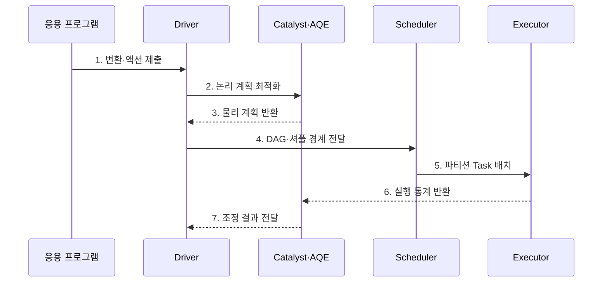

---
sidebar:
  order: 117
  label: "117. Apache Spark"
  badge:
    text: "기출 · 30%"
    variant: note
title: "Apache Spark"
date: "2026-07-27T23:59:59+09:00"
tags:
  - "notes-software"
weight: 117
extra:
  question_no: "117"
  source_status: "기출"
  source_history: "120회"
  priority: 30
  priority_note: "120회 기출 후 저빈도, 인메모리 처리 정본"
---

## 미리 알고가기

- **아파치 스파크(Apache Spark)**: 작업 의존성을 그래프로 구성하고 파티션별 태스크를 병렬 실행하는 분산 처리 엔진이다.
- **방향성 비순환 그래프(Directed Acyclic Graph, DAG)**: ‘대그’ 또는 ‘디에이지’로 읽고 영문 첫 글자를 딴 약어이며, 연산 의존성을 순환 없는 방향 간선으로 표현한 그래프
- **변환(Transformation)**: 데이터의 필터·조인 등 새 결과 정의를 만들되 즉시 실행하지 않는 지연 연산이다.
- **액션(Action)**: 저장·수집·개수 계산처럼 실제 실행과 결과 생성을 요구하는 연산이다.
- **드라이버(Driver)**: 응용의 실행 계획을 만들고 작업·단계·태스크를 조정하는 프로세스이다.
- **스파크 세션(SparkSession)**: 데이터프레임·SQL 기능을 사용하는 응용 진입점이며 드라이버에서 실행 계획을 생성한다.
- **작업(Job)**: 하나의 액션을 계산하기 위해 필요한 전체 실행 단위이다.
- **단계(Stage)**: 셔플 경계를 기준으로 나눈 태스크 묶음이다.
- **태스크(Task)**: 한 파티션에 같은 단계의 연산을 수행하는 최소 실행 단위이다.
- **실행자(Executor)**: 워커 노드에서 태스크를 실행하고 캐시·셔플 데이터를 보관하는 프로세스이다.
- **스케줄러(Scheduler)·클러스터 관리자(Cluster Manager)**: 스케줄러는 단계를 태스크로 나누고 클러스터 관리자는 실행자에 계산 자원을 할당한다.
- **셔플(Shuffle)**: 조인·집계 전에 같은 키의 데이터를 파티션 사이에서 다시 분배하는 동작이며 단계 경계와 네트워크·디스크 비용을 만듦
- **데이터프레임(DataFrame)**: 이름과 자료형이 있는 열로 구성된 분산 데이터 표현이다.
- **구조적 질의 언어(Structured Query Language, SQL)**: 영문 첫 글자를 딴 SQL을 '에스큐엘'로 읽으며 Spark에서 데이터프레임 실행 계획을 표현하는 질의 언어이다.
- **카탈리스트(Catalyst)**: Spark SQL의 논리·물리 계획을 변환하고 최적화하는 구성요소이다.
- **적응형 질의 실행(Adaptive Query Execution, AQE)**: 영문 첫 글자를 딴 AQE를 '에이큐이'로 읽으며 실행 중 통계로 조인 방식과 파티션 계획을 조정한다.
- **캐시·영속화(Cache/Persist)**: 슬래시로 두 저장 방식을 함께 나타내며 반복할 파티션을 메모리나 디스크에 보관해 재계산을 줄이다.
- **응용 프로그램 인터페이스(Application Programming Interface, API)**: 영문 첫 글자를 딴 API를 '에이피아이'로 읽으며 구조적 스트리밍이 연속 입력을 정의하는 호출 접점이다.
- **구조적 스트리밍(Structured Streaming)**: DataFrame API로 연속 입력을 증분 처리하는 Spark SQL 기반 스트림 엔진이다.
- **체크포인트(Checkpoint)**: 재시작에 필요한 진행 위치와 상태 메타데이터를 안정 저장한 복구 지점이다.
- **상태 저장소(State Store)**: 키별 누적값·윈도 상태를 배치 사이에 유지하는 저장소이다.
- **워터마크(Watermark)**: 늦게 도착한 이벤트를 기다릴 한계를 정해 오래된 상태를 정리하는 기준 시각이다.
- **하둡 맵리듀스(Hadoop MapReduce)**: 중간 결과를 파일에 기록하며 맵(Map)과 리듀스(Reduce) 단계로 대용량 일괄 데이터를 처리하는 분산 실행 방식이다.
- **입출력(Input/Output, I/O)**: '아이오'로 읽고 슬래시로 입력과 출력을 함께 나타내며 맵리듀스의 반복 디스크 접근 비용을 뜻한다.

## Ⅰ. 개요

- 정의/개념: DAG로 파티션 태스크를 실행하는 **분산 처리 엔진**
- 배경/필요성: 반복·복합 분석의 재계산 축소

### 쉽게 이해하기 (학습용)
- 계산을 작업 그래프로 묶고 자주 쓰는 중간 자료를 재사용하는 엔진임

## Ⅱ. 특징

- **지연 실행**: Action에서 계산 시작
- **DAG 스케줄링**: 셔플 경계로 Stage 분할
- **계획 보정**: Catalyst·AQE로 실행 최적화

### 쉽게 이해하기 (학습용)
- 반복 분석은 빠르지만 파티션 쏠림과 메모리 상태 등을 관리해야 함

## Ⅲ. 구조 및 구성요소

| 구성요소 | 책임 |
|:---|:---|
| Driver·SparkSession | 계획·Job 조정 |
| Catalyst·AQE | 계획 최적화·보정 |
| Scheduler·Cluster Manager | Stage·Task·자원 할당 |
| Executor·Partition | 태스크·캐시·셔플 실행 |
| Checkpoint·State Store | 진행 위치·상태 복구 |

### 쉽게 이해하기 (학습용)

- 계획자, 최적화 담당자, 작업 배정자, 실행자, 복구 저장소로 구성된다.

## Ⅳ. 흐름도

**동작 원리**

- **1. 변환·액션 제출**: 실행을 시작
- **2. 논리 계획 최적화**: 연산 순서를 분석
- **3. 물리 계획 반환**: 실행 방식을 결정
- **4. DAG·셔플 경계 전달**: Stage를 분리
- **5. 파티션 Task 배치**: 실행자에 할당
- **6. 실행 통계 반환**: 행·셔플량을 보고
- **7. 조정 결과 전달**: 계획을 보결정

### 쉽게 이해하기 (학습용)

- 계산표를 먼저 최적화하고 셔플 경계로 나눠 여러 실행자에게 맡긴 뒤 실제 크기로 계획을 보정한다.

## Ⅴ. 종류 및 비교

| 판단 기준 | Spark Batch·SQL | Structured Streaming | Hadoop MapReduce |
|:---|:---|:---|
| 적용 기준 | 반복·복합 배치 | 연속 증분 처리 | 대형 단순 배치 |
| 핵심 특징 | DAG·SQL·캐시 | Micro-batch·상태 | 파일 기반 단계 실행 |
| 한계 | 메모리·셔플·편향 | 상태·늦은 이벤트 | 디스크 I/O·시작 지연 |

> 기존 DStream 기반 Spark Streaming은 레거시이며 새 스트림 파이프라인은 Structured Streaming을 우선 검토

### 쉽게 이해하기 (학습용)

- Spark는 계산 그래프를 이어 실행하고 필요한 중간 자료만 캐시해 반복 작업을 줄인다.

## Ⅵ. 실무 고려사항 및 대책

| 고려사항 | 대책 | 효과 |
|:---|:---|:---|
| 파티션 | 입력·코어·셔플량으로 조정 | 유휴·스케줄 비용 감소 |
| 키 편향 | AQE·키 분할·사전 집계 | 느린 Task 완화 |
| 캐시 | 재사용·재계산 비용으로 결정 | 메모리 압박 방지 |
| 셔플 | 필터·브로드캐스트·분할 설계 | 망·디스크 부하 감소 |
| 스트림 상태 | Watermark·TTL·상태 지표 | 상태 무한 증가 방지 |

> **적용 사례**: 편향 조인은 AQE와 키 분할을 적용하고 가장 느린 Task 시간·셔플 읽기량·디스크 유출이 줄었는지 확인

### 쉽게 이해하기 (학습용)

- 평균 작업시간보다 가장 늦은 파티션과 셔플·상태 크기를 보고 병목을 고친다.

## Ⅶ. 결론

- **반복 횟수·셔플량·편향·상태 크기**로 Spark 실행 방식을 결정

### 쉽게 이해하기 (학습용)

- 작업 그래프가 좋아도 한 파티션이나 상태가 커지면 느려지므로 실제 실행량을 보고 조정한다.
