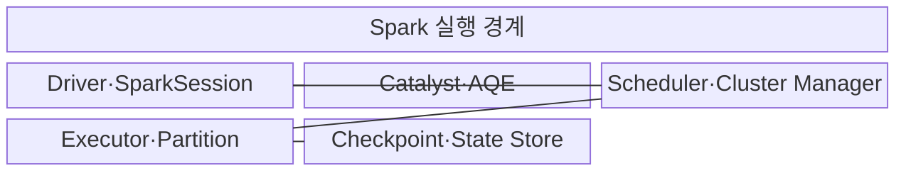
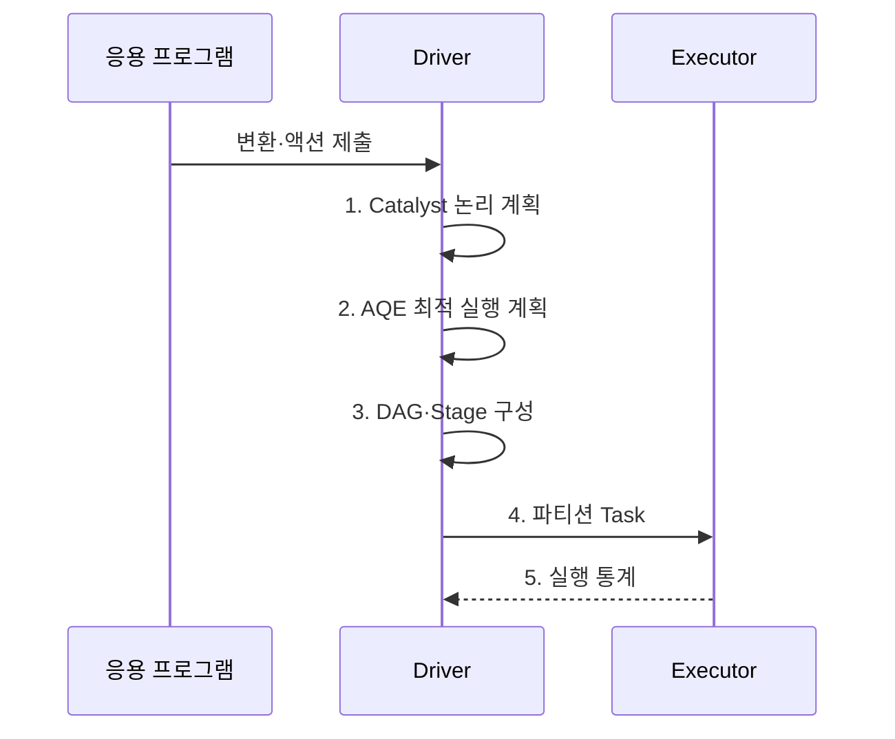

---
sidebar:
  order: 117
  label: "117. Apache Spark"
  badge:
    text: "기출 · 30%"
    variant: note
title: "Apache Spark"
date: "2026-08-02T12:00:00+09:00"
tags:
  - "notes-software"
weight: 117
extra:
  question_no: "117"
  source_status: "기출"
  source_history: "120회"
  priority: 30
  priority_note: "120회 기출 후 저빈도, 인메모리 처리 정본"
---

## Ⅰ. 개요

핵심 용어

- **분산 처리 엔진**: DAG로 작업 의존성을 구성하고 파티션별 태스크를 병렬 실행하는 엔진이다.

- 정의/개념: **Apache Spark**는 연산을 DAG로 계획하고 데이터를 파티션 태스크로 나누어 메모리 중심으로 실행하는 범용 분산 처리 엔진
- 배경/필요성: MapReduce의 단계별 디스크 기록은 반복 분석마다 **입출력 지연** 유발

#### 한줄 요약
- 계산을 작업 그래프로 묶고 자주 쓰는 중간 자료를 재사용하는 엔진이다.

## Ⅱ. 특징

핵심 용어

- **DAG 스케줄링**: 셔플 경계를 기준으로 작업을 Stage와 Task로 나누어 실행하는 특성이다.

- **지연 실행**: Action에서 계산 시작
- **DAG 스케줄링**: 셔플 경계로 Stage 분할
- **계획 보정**: Catalyst·AQE로 실행 최적화

#### 한줄 요약
- 반복 분석은 빠르지만 파티션 쏠림과 메모리 상태 등을 관리해야 한다.

## Ⅲ. 구조 및 구성요소

핵심 용어

- **Catalyst·AQE**: 논리·물리 실행 계획을 최적화하고 실행 중 통계로 보정하는 구성요소이다.

| 구성요소 | 책임 |
|:---|:---|
| Driver·SparkSession | **계획·Job** 조정 |
| Catalyst·AQE | **계획 최적화·보정** |
| Scheduler·Cluster Manager | **Stage·Task·자원** 할당 |
| Executor·Partition | **태스크·캐시·셔플** 실행 |
| Checkpoint·State Store | **진행 위치·상태** 복구 |

#### 한줄 요약

- 계획자, 최적화 담당자, 작업 배정자, 실행자, 복구 저장소로 구성된다.

## Ⅳ. 흐름도

핵심 용어

- **5. 실행 통계**: 실제 행 수와 셔플량을 AQE에 전달해 실행 계획을 조정하는 정보이다.

**동작 원리**

1. **Catalyst 논리 계획**: Driver가 지연 연산을 논리 그래프로 구성
2. **AQE 최적 실행 계획**: 실행 통계에 맞춰 조인·스캔 방식 선택
3. **DAG·Stage 구성**: Driver가 셔플 경계별 실행 단계 생성
4. **파티션 Task**: Driver가 Executor에 파티션 작업 배치
5. **실행 통계**: Executor가 Driver에 행 수·셔플량 전달

#### 한줄 요약

- 계산표를 먼저 최적화하고 셔플 경계로 나눠 여러 실행자에게 맡긴 뒤 실제 크기로 계획을 보정한다.

## Ⅴ. 종류 및 비교

핵심 용어

- **Structured Streaming**: DataFrame API로 연속 입력을 증분 처리하고 상태를 관리하는 스트림 처리 방식이다.

| Spark 처리 방식 | Spark Batch·SQL | Structured Streaming | Hadoop MapReduce |
|:---|:---|:---|:---|
| 적용 기준 | **반복·복합 배치** | **연속 증분 처리** | **대형 단순 배치** |
| 핵심 특징 | **DAG·SQL·캐시** | **Micro-batch·상태** | **파일 기반 단계 실행** |
| 한계 | **메모리·셔플·편향** | **상태·늦은 이벤트** | **디스크 I/O·시작 지연** |

#### 한줄 요약

- Spark는 계산 그래프를 이어 실행하고 필요한 중간 자료만 캐시해 반복 작업을 줄인다.

## Ⅵ. 실무 고려사항 및 대책

핵심 용어

- **일부 키에 조인·집계 레코드 집중**: 키 편향으로 일부 파티션의 Task만 길어지는 문제이다.

| 문제 | 대책 | 효과 |
|:---|:---|:---|
| 파티션 수가 코어·입력량과 불균형 | 입력·코어·셔플량으로 조정 | **유휴·스케줄 비용** 감소 |
| 일부 키에 조인·집계 레코드 집중 | AQE·키 분할·사전 집계 | **느린 Task** 완화 |
| 재사용 없는 데이터가 메모리 점유 | 재사용·재계산 비용으로 결정 | **메모리 압박** 방지 |
| 대형 조인으로 네트워크·디스크 포화 | 필터·브로드캐스트·분할 설계 | **셔플 부하** 감소 |
| 워터마크 없이 키별 상태 누적 | Watermark·TTL·상태 지표 | **상태 무한 증가** 방지 |

#### 한줄 요약

- 평균 작업시간보다 가장 늦은 파티션과 셔플·상태 크기를 보고 병목을 고친다.

## Ⅶ. 결론

핵심 용어

- **Spark Batch**: 반복 계산과 복합 배치 분석에 DAG·SQL·캐시를 활용하는 처리 방식이다.

- 반복 배치는 **Spark Batch**, 연속 증분 처리는 **Structured Streaming** 선택

#### 한줄 요약

- 작업 그래프가 좋아도 한 파티션이나 상태가 커지면 느려지므로 실제 실행량을 보고 조정한다.
