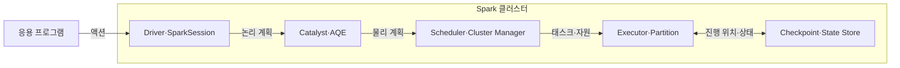
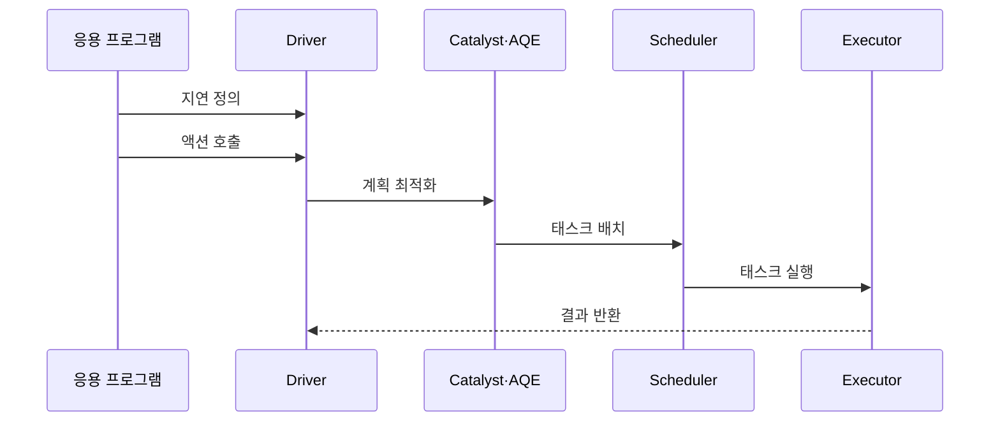

---
sidebar:
  order: 117
  label: "117. Apache Spark"
  badge:
    text: "기출 · 30%"
    variant: note
title: "Apache Spark"
date: "2026-07-27T23:59:59+09:00"
tags:
  - "notes-software"
weight: 117
extra:
  question_no: "117"
  source_status: "기출"
  source_history: "120회"
  priority: 30
  priority_note: "120회 기출 후 저빈도, 인메모리 처리 정본"
---

## 미리 알고가기

- **아파치 스파크(Apache Spark)**: 작업 의존성을 그래프로 구성하고 파티션별 태스크를 병렬 실행하는 분산 처리 엔진임
- **방향성 비순환 그래프(Directed Acyclic Graph, DAG)**: ‘대그’ 또는 ‘디에이지’로 읽고 영문 첫 글자를 딴 약어이며, 연산 의존성을 순환 없는 방향 간선으로 표현한 그래프
- **변환(Transformation)**: 데이터의 필터·조인 등 새 결과 정의를 만들되 즉시 실행하지 않는 지연 연산임
- **액션(Action)**: 저장·수집·개수 계산처럼 실제 실행과 결과 생성을 요구하는 연산임
- **드라이버(Driver)**: 응용의 실행 계획을 만들고 작업·단계·태스크를 조정하는 프로세스임
- **스파크 세션(SparkSession)**: 데이터프레임·SQL 기능을 사용하는 응용 진입점이며 드라이버에서 실행 계획을 생성함
- **작업(Job)**: 하나의 액션을 계산하기 위해 필요한 전체 실행 단위임
- **단계(Stage)**: 셔플 경계를 기준으로 나눈 태스크 묶음임
- **태스크(Task)**: 한 파티션에 같은 단계의 연산을 수행하는 최소 실행 단위임
- **실행자(Executor)**: 워커 노드에서 태스크를 실행하고 캐시·셔플 데이터를 보관하는 프로세스임
- **스케줄러(Scheduler)·클러스터 관리자(Cluster Manager)**: 스케줄러는 단계를 태스크로 나누고 클러스터 관리자는 실행자에 계산 자원을 할당함
- **셔플(Shuffle)**: 조인·집계 전에 같은 키의 데이터를 파티션 사이에서 다시 분배하는 동작이며 단계 경계와 네트워크·디스크 비용을 만듦
- **데이터프레임(DataFrame)**: 이름과 자료형이 있는 열로 구성된 분산 데이터 표현임
- **구조적 질의 언어(Structured Query Language, SQL)**: 영문 첫 글자를 딴 SQL을 '에스큐엘'로 읽으며 Spark에서 데이터프레임 실행 계획을 표현하는 질의 언어임
- **카탈리스트(Catalyst)**: Spark SQL의 논리·물리 계획을 변환하고 최적화하는 구성요소임
- **적응형 질의 실행(Adaptive Query Execution, AQE)**: 영문 첫 글자를 딴 AQE를 '에이큐이'로 읽으며 실행 중 통계로 조인 방식과 파티션 계획을 조정함
- **캐시·영속화(Cache/Persist)**: 슬래시로 두 저장 방식을 함께 나타내며 반복할 파티션을 메모리나 디스크에 보관해 재계산을 줄임
- **응용 프로그램 인터페이스(Application Programming Interface, API)**: 영문 첫 글자를 딴 API를 '에이피아이'로 읽으며 구조적 스트리밍이 연속 입력을 정의하는 호출 접점임
- **구조적 스트리밍(Structured Streaming)**: DataFrame API로 연속 입력을 증분 처리하는 Spark SQL 기반 스트림 엔진임
- **체크포인트(Checkpoint)**: 재시작에 필요한 진행 위치와 상태 메타데이터를 안정 저장한 복구 지점임
- **상태 저장소(State Store)**: 키별 누적값·윈도 상태를 배치 사이에 유지하는 저장소임
- **워터마크(Watermark)**: 늦게 도착한 이벤트를 기다릴 한계를 정해 오래된 상태를 정리하는 기준 시각임
- **하둡 맵리듀스(Hadoop MapReduce)**: 중간 결과를 파일에 기록하며 맵(Map)과 리듀스(Reduce) 단계로 대용량 일괄 데이터를 처리하는 분산 실행 방식임
- **입출력(Input/Output, I/O)**: '아이오'로 읽고 슬래시로 입력과 출력을 함께 나타내며 맵리듀스의 반복 디스크 접근 비용을 뜻함

## Ⅰ. 개요

- **정의/개념**: DAG 기반 **배치·SQL·스트림 분산 처리**
- **기존 한계**: MapReduce의 반복 디스크 I/O로 **반복 분석 지연**

### 쉽게 이해하기 (학습용)
- 계산을 작업 그래프로 묶고 자주 쓰는 중간 자료를 재사용하는 엔진임

## Ⅱ. 특징

- **지연 연산·액션**으로 DAG 실행 계획 확정
- **캐시·계보 재계산**으로 반복 처리·복구 지원
- **Catalyst·AQE**로 질의·파티션 계획 최적화

### 쉽게 이해하기 (학습용)
- 반복 분석은 빠르지만 파티션 쏠림과 메모리 상태 등을 관리해야 함

## Ⅲ. 아키텍처 및 구성요소

| 설계 요소 | 설명 |
|:---|:---|
| Driver·SparkSession | **실행 계획·작업 조정** 담당 |
| Catalyst·AQE | **논리·물리 계획 최적화** |
| Scheduler·Cluster Manager | **단계 분할·자원 할당** |
| Executor·Partition | **태스크·캐시·셔플** 처리 |
| Checkpoint·State Store | **스트림 진행 위치·상태** 저장 |

> 요약: 최적화된 계획을 단계별로 나누고 실행자가 파티션과 상태를 처리함

### 쉽게 이해하기 (학습용)
- 지휘자와 질의 최적화기 및 작업 스케줄러와 여러 실행자로 구성됨

## Ⅳ. 원리 및 절차 흐름도

| 절차 | 설명 |
|:---|:---|
| 지연 정의 | 필터·조인의 **연산 의존성** 구성 |
| 액션 호출 | 결과 요청으로 **DAG 실행** 시작 |
| 계획 최적화 | 통계로 **연산·파티션** 조정 |
| 태스크 배치 | 셔플 경계별 **단계·태스크** 생성 |
| 태스크 실행 | 실행자가 **파티션 연산** 수행 |
| 결과 반환 | 액션 결과를 **드라이버에 반환** |

> 요약: 액션이 계획을 확정하면 지휘자가 태스크를 배치하고 결과를 처리함

### 쉽게 이해하기 (학습용)
- 호출이 그래프를 확정하면 경계별로 나누어 파티션 태스크를 실행함

## Ⅴ. 종류 및 비교

| 분산 처리 엔진 | Apache Spark | Hadoop MapReduce |
|:---|:---|:---|
| 적용 기준 | 반복 분석·SQL·**상태 스트림** | 파일 기반 **대용량 일괄 집계** |
| 핵심 특징 | **DAG·메모리 캐시** 재사용 | **Map·Reduce 파일 단계** |
| 한계 | 메모리 압박·**셔플 편향** | 반복 디스크 I/O·**긴 지연** |

> 요약: Spark는 캐시, MapReduce는 파일 단계가 핵심이다

### 쉽게 이해하기 (학습용)
- Spark는 계산 그래프의 중간 자료를 재사용하고 MapReduce는 단계마다 파일을 넘김

## Ⅵ. 실무 사례

1. **편향 키 분산**으로 조인 파티션 재분배
2. **워터마크·체크포인트**로 스트림 상태 제한

### 쉽게 이해하기 (학습용)
- 편향 조인은 큰 키를 재분배하고 가장 느린 태스크 시간과 셔플 전송량이 줄었는지 확인함
- 상태 스트림은 체크포인트와 워터마크를 적용하고 상태 크기와 장애 후 재시작 시간이 요구를 만족하는지 검증함

## Ⅶ. 결론

- 반복·스트림은 **Spark**, 단순 배치는 **MapReduce**

### 쉽게 이해하기 (학습용)
- 느린 파티션과 커지는 스트림 상태를 보고 파티션 수와 캐시 범위를 조정함
