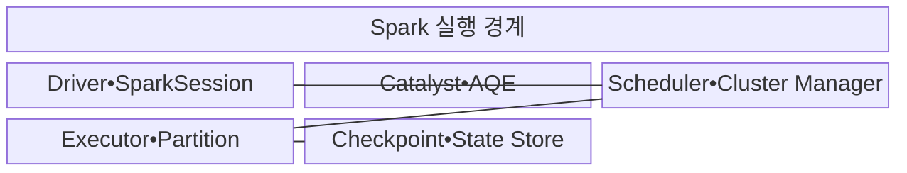

---
sidebar:
  order: 117
  label: "117. Apache Spark"
  badge:
    text: "기출 • 30%"
    variant: note
title: "Apache Spark"
date: "2026-08-03T09:14:20+09:00"
tags:
  - "notes-software"
weight: 117
extra:
  question_no: "117"
  source_status: "기출"
  source_history: "120회"
  priority: 30
  priority_note: "120회 기출 후 저빈도, 인메모리 처리 정본"
---

## Ⅰ. 개요

핵심 용어

- **Apache Spark 분산 처리 엔진**: 방향성 비순환 그래프(Directed Acyclic Graph, DAG)로 작업 의존성을 구성하고 파티션별 태스크를 메모리 중심으로 병렬 실행하는 엔진이다.

- 정의/개념: 연산을 방향성 비순환 그래프(Directed Acyclic Graph, DAG)로 계획하고 데이터를 파티션 태스크로 나누어 메모리 중심으로 실행하는 **Apache Spark 분산 처리 엔진**
- 배경/필요성: MapReduce의 단계별 디스크 기록은 반복 분석마다 **입출력 지연** 유발

#### 한줄 요약
- 계산을 작업 그래프로 묶고 자주 쓰는 중간 자료를 재사용하는 엔진이다.

## Ⅱ. 특징

핵심 용어

- **DAG 스케줄링**: 셔플 경계를 기준으로 작업을 Stage와 Task로 나누어 실행하는 특성이다.
- **지연 실행(Lazy Evaluation)**: 변환을 즉시 수행하지 않고 Action이 호출될 때 전체 실행 계획을 구성하는 방식이다.
- **Catalyst•적응형 질의 실행(Adaptive Query Execution, AQE)**: 논리•물리 계획을 최적화하고 실행 중 통계로 조인•파티션 계획을 보정하는 기능이다.

- **지연 실행**: Action에서 계산 시작
- **방향성 비순환 그래프(Directed Acyclic Graph, DAG) 스케줄링**: 셔플 경계로 Stage 분할
- **계획 보정**: Catalyst•적응형 질의 실행(Adaptive Query Execution, AQE) 기반 실행 최적화

#### 한줄 요약
- 반복 분석은 빠르지만 파티션 쏠림과 메모리 상태 등을 관리해야 한다.

## Ⅲ. 구조 및 구성요소

핵심 용어

- **Driver•SparkSession**: 응용의 실행 계획과 Job을 구성하고 클러스터 작업을 조정하는 구성요소이다.
- **Catalyst•적응형 질의 실행(Adaptive Query Execution, AQE)**: 논리•물리 실행 계획을 최적화하고 실행 중 통계로 보정하는 구성요소이다.
- **Scheduler•Cluster Manager**: Stage와 Task를 나누고 실행 자원을 Executor에 할당하는 구성요소이다.
- **Executor•Partition**: 파티션별 태스크와 캐시 및 셔플 연산을 실행하는 구성요소이다.
- **Checkpoint•State Store**: 스트림 진행 위치와 상태를 영속화해 장애 뒤 복구하는 구성요소이다.

| 구성요소 | 책임 |
|:---|:---|
| Driver•SparkSession | **계획•Job** 조정 |
| Catalyst•AQE | **계획 최적화•보정** |
| Scheduler•Cluster Manager | **Stage•Task•자원** 할당 |
| Executor•Partition | **태스크•캐시•셔플** 실행 |
| Checkpoint•State Store | **진행 위치•상태** 복구 |

#### 한줄 요약

- 계획자, 최적화 담당자, 작업 배정자, 실행자, 복구 저장소로 구성된다.

## Ⅳ. 흐름도

핵심 용어

- **5. 실행 통계**: 실제 행 수와 셔플량을 적응형 질의 실행(Adaptive Query Execution, AQE)에 전달해 실행 계획을 조정하는 정보이다.
- **1. Catalyst 논리 계획**: Driver가 지연 연산을 최적화 가능한 논리 그래프로 구성한 계획이다.
- **2. 적응형 질의 실행(Adaptive Query Execution, AQE) 최적 계획**: 실행 중 통계로 조인 방식과 파티션 수를 다시 선택한 계획이다.
- **3. 방향성 비순환 그래프(Directed Acyclic Graph, DAG)•Stage 구성**: 셔플 경계를 기준으로 실행 단계를 나누는 단계이다.
- **4. 파티션 Task**: Driver가 Executor에 배치하는 파티션 단위 작업이다.

**동작 원리**

1. **Catalyst 논리 계획**: Driver가 지연 연산을 논리 그래프로 구성
2. **적응형 질의 실행(Adaptive Query Execution, AQE) 최적 실행 계획**: 실행 통계에 맞춰 조인•스캔 방식 선택
3. **방향성 비순환 그래프(Directed Acyclic Graph, DAG)•Stage 구성**: Driver가 셔플 경계별 실행 단계 생성
4. **파티션 Task**: Driver가 Executor에 파티션 작업 배치
5. **실행 통계**: Executor가 Driver에 행 수•셔플량 전달

#### 한줄 요약

- 계산표를 먼저 최적화하고 셔플 경계로 나눠 여러 실행자에게 맡긴 뒤 실제 크기로 계획을 보정한다.

## Ⅴ. 종류 및 비교

핵심 용어

- **Structured Streaming**: 데이터프레임 응용 프로그램 인터페이스(DataFrame Application Programming Interface, DataFrame API)로 연속 입력을 증분 처리하고 상태를 관리하는 스트림 처리 방식이다.
- **Spark Batch•구조화 질의 언어(Structured Query Language, SQL)**: 방향성 비순환 그래프와 캐시로 반복•복합 일괄 분석을 처리하는 방식이다.
- **Hadoop MapReduce**: 파일 기반 Map•Shuffle•Reduce 단계를 디스크에 기록하며 대형 단순 배치를 처리하는 엔진이다.
- **데이터프레임 응용 프로그램 인터페이스(DataFrame Application Programming Interface, DataFrame API)**: 스키마가 있는 분산 데이터를 표 형태 연산으로 다루는 접점이다.

| Spark 처리 방식 | Spark Batch•SQL | Structured Streaming | Hadoop MapReduce |
|:---|:---|:---|:---|
| 적용 기준 | **반복•복합 배치** | **연속 증분 처리** | **대형 단순 배치** |
| 핵심 특징 | **방향성 비순환 그래프(Directed Acyclic Graph, DAG)•구조화 질의 언어(Structured Query Language, SQL)•캐시** | **Micro-batch•상태** | **파일 기반 단계 실행** |
| 한계 | **메모리•셔플•편향** | **상태•늦은 이벤트** | **디스크 입출력(Input/Output, I/O)•시작 지연** |

#### 한줄 요약

- Spark는 계산 그래프를 이어 실행하고 필요한 중간 자료만 캐시해 반복 작업을 줄인다.

## Ⅵ. 실무 고려사항 및 대책

핵심 용어

- **입력•코어•셔플량 기반 파티션 조정**: 데이터 양과 병렬 자원 및 네트워크 이동량에 맞춰 파티션 수를 정하는 활동이다.
- **적응형 질의 실행(Adaptive Query Execution, AQE)•키 분할•사전 집계**: 편향 키를 여러 파티션으로 나누고 셔플 전 데이터 양을 줄이는 통제이다.
- **재사용•재계산 비용 기반 캐시 결정**: 반복 사용할 데이터만 메모리에 유지하고 일회성 결과는 재계산 비용과 비교하는 기준이다.
- **필터•브로드캐스트•분할 설계**: 조인 전 행을 줄이고 작은 입력을 복제하거나 큰 입력의 배치를 맞춰 셔플을 줄이는 방식이다.
- **워터마크(Watermark)•키 유효 시간(Time To Live, TTL)•상태 지표**: 늦은 이벤트 허용 범위와 상태 만료 시간을 정하고 상태 크기를 관찰하는 통제이다.

| 문제 | 대책 | 효과 |
|:---|:---|:---|
| 파티션 수가 코어•입력량과 불균형 | **입력•코어•셔플량 기반 파티션 조정** | **유휴•스케줄 비용** 감소 |
| 일부 키에 조인•집계 레코드 집중 | **적응형 질의 실행(Adaptive Query Execution, AQE)•키 분할•사전 집계** | **느린 Task** 완화 |
| 재사용 없는 데이터가 메모리 점유 | **재사용•재계산 비용 기반 캐시 결정** | **메모리 압박** 방지 |
| 대형 조인으로 네트워크•디스크 포화 | **필터•브로드캐스트•분할 설계** | **셔플 부하** 감소 |
| 워터마크 없이 키별 상태 누적 | **워터마크(Watermark)•키 유효 시간(Time To Live, TTL)•상태 지표** | **상태 무한 증가** 방지 |

#### 한줄 요약

- 평균 작업시간보다 가장 늦은 파티션과 셔플•상태 크기를 보고 병목을 고친다.

## Ⅶ. 결론

핵심 용어

- **Spark Batch**: 반복 계산과 복합 배치 분석에 DAG•SQL•캐시를 활용하는 처리 방식이다.

- 반복 배치는 **Spark Batch**, 연속 증분 처리는 **Structured Streaming** 선택

#### 한줄 요약

- 작업 그래프가 좋아도 한 파티션이나 상태가 커지면 느려지므로 실제 실행량을 보고 조정한다.
