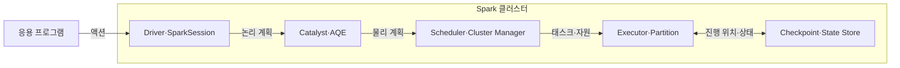
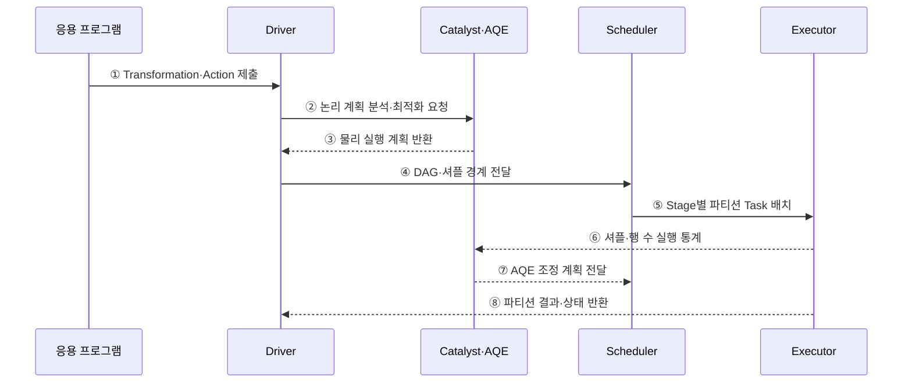

---
sidebar:
  order: 117
  label: "117. Apache Spark"
  badge:
    text: "기출 · 30%"
    variant: note
title: "Apache Spark"
date: "2026-07-27T23:59:59+09:00"
tags:
  - "notes-software"
weight: 117
extra:
  question_no: "117"
  source_status: "기출"
  source_history: "120회"
  priority: 30
  priority_note: "120회 기출 후 저빈도, 인메모리 처리 정본"
---

## 미리 알고가기

- **아파치 스파크(Apache Spark)**: 작업 의존성을 그래프로 구성하고 파티션별 태스크를 병렬 실행하는 분산 처리 엔진임
- **방향성 비순환 그래프(Directed Acyclic Graph, DAG)**: ‘대그’ 또는 ‘디에이지’로 읽고 영문 첫 글자를 딴 약어이며, 연산 의존성을 순환 없는 방향 간선으로 표현한 그래프
- **변환(Transformation)**: 데이터의 필터·조인 등 새 결과 정의를 만들되 즉시 실행하지 않는 지연 연산임
- **액션(Action)**: 저장·수집·개수 계산처럼 실제 실행과 결과 생성을 요구하는 연산임
- **드라이버(Driver)**: 응용의 실행 계획을 만들고 작업·단계·태스크를 조정하는 프로세스임
- **스파크 세션(SparkSession)**: 데이터프레임·SQL 기능을 사용하는 응용 진입점이며 드라이버에서 실행 계획을 생성함
- **작업(Job)**: 하나의 액션을 계산하기 위해 필요한 전체 실행 단위임
- **단계(Stage)**: 셔플 경계를 기준으로 나눈 태스크 묶음임
- **태스크(Task)**: 한 파티션에 같은 단계의 연산을 수행하는 최소 실행 단위임
- **실행자(Executor)**: 워커 노드에서 태스크를 실행하고 캐시·셔플 데이터를 보관하는 프로세스임
- **스케줄러(Scheduler)·클러스터 관리자(Cluster Manager)**: 스케줄러는 단계를 태스크로 나누고 클러스터 관리자는 실행자에 계산 자원을 할당함
- **셔플(Shuffle)**: 조인·집계 전에 같은 키의 데이터를 파티션 사이에서 다시 분배하는 동작이며 단계 경계와 네트워크·디스크 비용을 만듦
- **데이터프레임(DataFrame)**: 이름과 자료형이 있는 열로 구성된 분산 데이터 표현임
- **구조적 질의 언어(Structured Query Language, SQL)**: 영문 첫 글자를 딴 SQL을 '에스큐엘'로 읽으며 Spark에서 데이터프레임 실행 계획을 표현하는 질의 언어임
- **카탈리스트(Catalyst)**: Spark SQL의 논리·물리 계획을 변환하고 최적화하는 구성요소임
- **적응형 질의 실행(Adaptive Query Execution, AQE)**: 영문 첫 글자를 딴 AQE를 '에이큐이'로 읽으며 실행 중 통계로 조인 방식과 파티션 계획을 조정함
- **캐시·영속화(Cache/Persist)**: 슬래시로 두 저장 방식을 함께 나타내며 반복할 파티션을 메모리나 디스크에 보관해 재계산을 줄임
- **응용 프로그램 인터페이스(Application Programming Interface, API)**: 영문 첫 글자를 딴 API를 '에이피아이'로 읽으며 구조적 스트리밍이 연속 입력을 정의하는 호출 접점임
- **구조적 스트리밍(Structured Streaming)**: DataFrame API로 연속 입력을 증분 처리하는 Spark SQL 기반 스트림 엔진임
- **체크포인트(Checkpoint)**: 재시작에 필요한 진행 위치와 상태 메타데이터를 안정 저장한 복구 지점임
- **상태 저장소(State Store)**: 키별 누적값·윈도 상태를 배치 사이에 유지하는 저장소임
- **워터마크(Watermark)**: 늦게 도착한 이벤트를 기다릴 한계를 정해 오래된 상태를 정리하는 기준 시각임
- **하둡 맵리듀스(Hadoop MapReduce)**: 중간 결과를 파일에 기록하며 맵(Map)과 리듀스(Reduce) 단계로 대용량 일괄 데이터를 처리하는 분산 실행 방식임
- **입출력(Input/Output, I/O)**: '아이오'로 읽고 슬래시로 입력과 출력을 함께 나타내며 맵리듀스의 반복 디스크 접근 비용을 뜻함

## Ⅰ. 개요

- Apache Spark는 연산 의존성을 DAG로 계획하고 데이터 파티션별 태스크를 실행하는 대규모 분산 분석 엔진이다.
- 배치·SQL·머신러닝·Structured Streaming을 공통 실행 엔진에서 처리하고 반복 데이터는 캐시해 재계산을 줄일 수 있다.

### 쉽게 이해하기 (학습용)
- 계산을 작업 그래프로 묶고 자주 쓰는 중간 자료를 재사용하는 엔진임

## Ⅱ. 특징

- **지연 실행**: Transformation은 계획만 만들고 Action이 Job 실행을 시작한다.
- **DAG 스케줄링**: 셔플 경계로 Stage를 나누고 파티션마다 Task를 생성한다.
- **질의 최적화**: Catalyst가 논리·물리 계획을 만들고 AQE가 실행 통계로 계획을 조정한다.
- **재사용·복구**: Cache/Persist는 반복 계산을 줄이고 계보·체크포인트는 실패 복구를 지원한다.

### 쉽게 이해하기 (학습용)
- 반복 분석은 빠르지만 파티션 쏠림과 메모리 상태 등을 관리해야 함

## Ⅲ. 아키텍처 및 구성요소

**도표안 A — 구조도**

**도표안 B — sequenceDiagram**

| 구성요소 | 역할 |
|:---|:---|
| Driver·SparkSession | 응용 진입점·실행 계획·Job 조정 |
| Catalyst·AQE | 논리·물리 계획과 런타임 재최적화 |
| Scheduler·Cluster Manager | Stage·Task 생성과 자원 할당 |
| Executor·Partition | 태스크 실행·캐시·셔플 데이터 보관 |
| Checkpoint·State Store | 스트림 진행 위치와 키별 상태 복구 |

**동작 원리**

- ① 응용이 지연 Transformation과 실행을 촉발할 Action을 Driver에 제출한다.
- ② Driver가 DataFrame·SQL의 논리 계획 최적화를 요청한다.
- ③ Catalyst가 비용과 규칙을 반영한 물리 실행 계획을 반환한다.
- ④ Driver가 DAG와 셔플 경계를 Scheduler에 전달한다.
- ⑤ Scheduler가 Stage별로 파티션 Task를 Executor에 배치한다.
- ⑥ Executor가 셔플 크기·실제 행 수 등의 실행 통계를 보고한다.
- ⑦ AQE가 통계에 따라 파티션 병합·조인 방식 등의 조정 계획을 전달한다.
- ⑧ Executor가 완료한 파티션 결과와 상태를 Driver에 반환한다.

### 쉽게 이해하기 (학습용)

- 계산표를 먼저 최적화하고 셔플 경계로 나눠 여러 실행자에게 맡긴 뒤 실제 크기로 계획을 보정한다.

## Ⅳ. 종류 및 비교

| 처리 영역 | Spark Batch·SQL | Structured Streaming | Hadoop MapReduce |
|:---|:---|:---|
| 입력 | 유한 데이터셋 | 연속 데이터 스트림 | 유한 파일 집합 |
| 실행 | DAG 기반 Job·Stage·Task | 기본 Micro-batch, 증분 상태 처리 | Map·Shuffle·Reduce 단계 |
| 강점 | SQL·반복·복합 파이프라인 | DataFrame API·이벤트 시간·복구 상태 | 대형 단순 배치·파일 기반 재실행 |
| 주요 위험 | 메모리·셔플·편향 | 상태 증가·늦은 이벤트·Sink 보장 | 중간 디스크 I/O·긴 시작 지연 |

> 기존 DStream 기반 Spark Streaming은 레거시이며 새 스트림 파이프라인은 Structured Streaming을 우선 검토한다.

### 쉽게 이해하기 (학습용)

- Spark는 계산 그래프를 이어 실행하고 필요한 중간 자료만 캐시해 반복 작업을 줄인다.

## Ⅴ. 실무 고려사항 및 대책

| 고려사항 | 위험 | 대책 |
|:---|:---|:---|
| 파티션 | 너무 적거나 많아 자원 유휴·스케줄 오버헤드 | 입력 크기·코어·셔플 크기로 조정 |
| 키 편향 | 일부 Task만 장시간 실행 | AQE skew join·키 분할·사전 집계 |
| 캐시 | 무조건 캐시해 메모리 압박·GC | 재사용 횟수·재계산 비용으로 범위 결정 |
| 셔플 | 네트워크·디스크 유출 | 필터 선적용·브로드캐스트·파티션 설계 |
| 스트림 상태 | 고카디널리티 키로 상태 무한 증가 | 이벤트 시간·Watermark·TTL·상태 지표 |
| 전달 보장 | “Exactly-once”를 모든 Sink에 일반화 | Source·Checkpoint·Sink의 멱등/트랜잭션 확인 |

> **적용 사례**: 편향 조인은 AQE와 키 분할을 적용하고 가장 느린 Task 시간·셔플 읽기량·디스크 유출이 줄었는지 확인한다.

### 쉽게 이해하기 (학습용)

- 평균 작업시간보다 가장 늦은 파티션과 셔플·상태 크기를 보고 병목을 고친다.

## Ⅵ. 결론

- Spark는 DAG·분산 태스크·SQL 최적화로 배치와 스트림 분석을 통합하는 엔진이다.
- 파티션 편향·셔플·캐시·스트림 상태·체크포인트·Sink 보장을 실제 실행 지표로 검증해야 한다.

### 쉽게 이해하기 (학습용)

- 작업 그래프가 좋아도 한 파티션이나 상태가 커지면 느려지므로 실제 실행량을 보고 조정한다.
