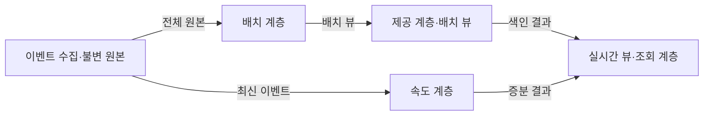
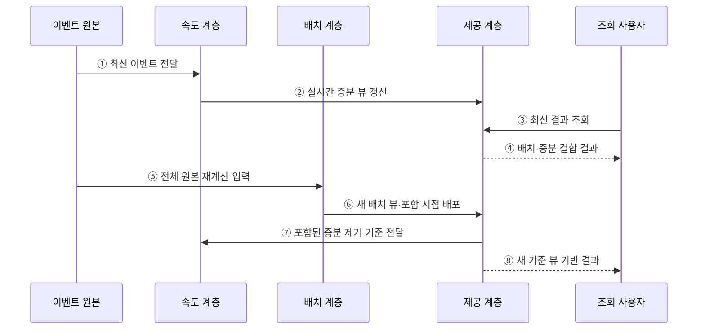

---
sidebar:
  order: 118
  label: "118. 람다 아키텍처 (Lambda Architecture)"
  badge:
    text: "기출 · 50%"
    variant: note
title: "람다 아키텍처 (Lambda Architecture)"
date: "2026-07-27T23:59:59+09:00"
tags:
  - "notes-software"
weight: 118
extra:
  question_no: "118"
  source_status: "기출"
  source_history: "120회"
  priority: 50
  priority_note: "120회 기출, 배치·속도 계층 비교 기준"
---

## 미리 알고가기

- **람다 아키텍처(Lambda Architecture)**: 전체 원본을 재계산하는 배치 계층과 최근 이벤트를 증분 처리하는 속도 계층을 병행하는 구조임
- **람다(Lambda, $\lambda$)**: 그리스 문자 `람다`라고 읽으며 이 아키텍처 이름에서는 수학 변수로 쓰이지 않고 배치·속도 계층을 병행하는 고유 명칭으로 관례적으로 사용함
- **배치 계층(Batch Layer)**: 불변 원본 데이터로 배치 뷰를 재생성함
- **속도 계층(Speed Layer)**: 최신 배치 뷰에 아직 포함되지 않은 이벤트로 실시간 뷰를 갱신함
- **제공 계층(Serving Layer)**: 배치 뷰를 색인하고 조회 시 실시간 뷰와 결합해 최신 결과를 제공함
- **이중 로직 관리**: 배치와 실시간 경로에 같은 규칙을 두 번 구현해 결과 차이를 통제하는 작업임
- **불변 원본(Immutable Master Data)**: 기존 기록을 덮어쓰지 않고 이벤트를 추가해 전체 재계산이 가능하도록 보존한 데이터임
- **뷰(View)**: 원본을 특정 조회 목적에 맞게 계산·색인한 결과임
- **증분 처리(Incremental Processing)**: 새로 들어온 데이터만 기존 결과에 반영하는 처리 방식임
- **이벤트 재생(Event Replay)**: 보관한 이벤트를 과거 순서대로 다시 읽어 상태나 결과를 재생성하는 작업임
- **카파 아키텍처(Kappa Architecture)**: 하나의 스트림 처리 경로에서 실시간 처리와 과거 이벤트 재생을 함께 수행하는 구조임

## Ⅰ. 개요

- 람다 아키텍처는 불변 원본을 재계산하는 배치 계층과 최신 이벤트를 증분 처리하는 속도 계층의 결과를 함께 제공하는 구조이다.
- 배치 정확성과 실시간 최신성을 결합하지만 같은 업무 로직을 두 경로에 구현·운영하는 복잡성이 생긴다.

### 쉽게 이해하기 (학습용)
- 전체 장부와 최신분 임시 장부를 따로 만들고 조회할 때 합친다.

## Ⅱ. 특징

- **불변 원본**은 모든 이벤트를 추가형으로 보존해 결과를 다시 만들 수 있게 한다.
- **배치 계층**은 전체 원본으로 정확한 기준 뷰를 주기적으로 만든다.
- **속도 계층**은 새 배치 뷰에 아직 포함되지 않은 이벤트를 빠르게 반영한다.
- **제공 계층**은 기준 배치 뷰와 미반영 증분을 중복 없이 결합한다.

### 쉽게 이해하기 (학습용)
- 최신성을 얻는 대신 같은 계산을 두 경로에서 일치하게 유지해야 한다.

## Ⅲ. 아키텍처 및 구성요소

**도표안 A — 구조도**

**도표안 B — sequenceDiagram**

| 구성요소 | 역할 |
|:---|:---|
| 불변 원본 | 모든 사실을 추가형 이벤트로 보존 |
| 배치 계층 | 전체 원본으로 기준 뷰 재생성 |
| 속도 계층 | 배치 미반영 최신 이벤트를 증분 계산 |
| 제공 계층 | 배치 뷰 색인·원자 교체·증분 결합 |
| 처리 위치·버전 | 배치 포함 범위와 증분 제거 기준 관리 |

**동작 원리**

- ① 새 이벤트가 속도 계층에 전달된다.
- ② 속도 계층이 최신 이벤트만 계산해 실시간 증분 뷰를 갱신한다.
- ③ 사용자가 제공 계층에 최신 결과를 요청한다.
- ④ 제공 계층이 배치 기준값과 아직 포함되지 않은 증분을 결합한다.
- ⑤ 배치 계층이 불변 원본을 다시 계산한다.
- ⑥ 새 배치 뷰와 포함 완료 시점을 제공 계층에 원자적으로 배포한다.
- ⑦ 제공 계층이 이미 배치에 포함된 증분의 제거 기준을 전달한다.
- ⑧ 이후 조회는 새 배치 기준과 남은 증분을 사용한다.

### 쉽게 이해하기 (학습용)

- 임시 장부로 최신분을 보여주다가 전체 장부가 완성되면 겹친 임시 기록을 치운다.

## Ⅳ. 종류 및 비교

| 비교 항목 | Lambda Architecture | Kappa Architecture |
|:---|:---|:---|
| 처리 경로 | 배치와 속도 두 경로 | 단일 스트림 처리 경로 |
| 과거 재처리 | 원본 전체로 배치 뷰 재생성 | 이벤트 로그를 같은 처리기로 재생 |
| 장점 | 기준 재계산과 빠른 증분 분리 | 코드·운영 경로 단일화 |
| 적합 조건 | 전체 재계산이 중요하고 이중 로직 통제 가능 | 로그 보존·재생 처리량이 충분 |
| 주요 위험 | 구현 중복·결과 불일치·뷰 결합 | 대규모 재생 지연·상태 마이그레이션 |

> 스트림 엔진의 재처리·정확성 기능이 충분하면 Kappa나 단일 증분 파이프라인이 더 단순할 수 있다.

### 쉽게 이해하기 (학습용)
- 람다는 두 장부를 만들고, 카파는 같은 처리기로 과거 기록까지 다시 읽는다.

## Ⅴ. 실무 고려사항 및 대책

| 고려사항 | 위험 | 대책 |
|:---|:---|:---|
| 이중 로직 | 같은 규칙의 구현 차이 | 공통 명세·테스트 벡터·결과 대사 |
| 중복 경계 | 배치와 속도 결과의 이중 계산·누락 | 이벤트 ID·포함 시점·Watermark 관리 |
| 뷰 교체 | 조회 중 부분 배포 | 버전된 뷰와 원자적 포인터 전환 |
| 재계산 | 전체 처리시간·비용 증가 | 파티션 재계산·우선순위 조정 |
| 늦은 이벤트 | 이미 닫힌 배치 결과 불일치 | 허용 지연·재계산·정정 이벤트 정책 |
| 필요성 | 실시간 요구가 낮은데 이중 경로 도입 | 허용 지연과 단일 경로 대안 비교 |

> **적용 사례**: 매출 대시보드는 배치 뷰의 포함 시각 이후 이벤트만 속도 뷰에서 더하고 새 배치 배포 시 동일 구간을 대사한다.

### 쉽게 이해하기 (학습용)
- 두 장부의 시간 경계를 명시해야 같은 거래를 두 번 더하거나 빠뜨리지 않는다.

## Ⅵ. 결론

- 람다 아키텍처는 배치 재계산의 정확성과 속도 계층의 최신성을 결합한다.
- 이중 로직·포함 시점·뷰 교체·대사 비용을 감당할 가치가 있을 때만 적용해야 한다.

### 쉽게 이해하기 (학습용)
- 빠른 임시 답과 정확한 전체 답을 함께 운영할 수 있을 때 쓰는 구조이다.
