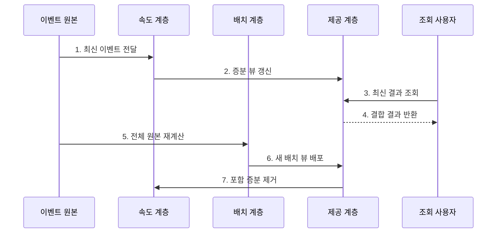

---
sidebar:
  order: 118
  label: "118. 람다 아키텍처 (Lambda Architecture)"
  badge:
    text: "기출 · 50%"
    variant: note
title: "람다 아키텍처 (Lambda Architecture)"
date: "2026-07-27T23:59:59+09:00"
tags:
  - "notes-software"
weight: 118
extra:
  question_no: "118"
  source_status: "기출"
  source_history: "120회"
  priority: 50
  priority_note: "120회 기출, 배치·속도 계층 비교 기준"
---

## 미리 알고가기

- **람다 아키텍처(Lambda Architecture)**: 전체 원본을 재계산하는 배치 계층과 최근 이벤트를 증분 처리하는 속도 계층을 병행하는 구조임
- **람다(Lambda, $\lambda$)**: 그리스 문자 `람다`라고 읽으며 이 아키텍처 이름에서는 수학 변수로 쓰이지 않고 배치·속도 계층을 병행하는 고유 명칭으로 관례적으로 사용함
- **배치 계층(Batch Layer)**: 불변 원본 데이터로 배치 뷰를 재생성함
- **속도 계층(Speed Layer)**: 최신 배치 뷰에 아직 포함되지 않은 이벤트로 실시간 뷰를 갱신함
- **제공 계층(Serving Layer)**: 배치 뷰를 색인하고 조회 시 실시간 뷰와 결합해 최신 결과를 제공함
- **이중 로직 관리**: 배치와 실시간 경로에 같은 규칙을 두 번 구현해 결과 차이를 통제하는 작업임
- **불변 원본(Immutable Master Data)**: 기존 기록을 덮어쓰지 않고 이벤트를 추가해 전체 재계산이 가능하도록 보존한 데이터임
- **뷰(View)**: 원본을 특정 조회 목적에 맞게 계산·색인한 결과임
- **증분 처리(Incremental Processing)**: 새로 들어온 데이터만 기존 결과에 반영하는 처리 방식임
- **이벤트 재생(Event Replay)**: 보관한 이벤트를 과거 순서대로 다시 읽어 상태나 결과를 재생성하는 작업임
- **카파 아키텍처(Kappa Architecture)**: 하나의 스트림 처리 경로에서 실시간 처리와 과거 이벤트 재생을 함께 수행하는 구조임

## Ⅰ. 개요

- 정의/개념: 배치 재계산과 **실시간 증분 결과를 결합**
- **배경/필요성**: 기준 정확성과 최신 결과 동시 제공

### 쉽게 이해하기 (학습용)
- 전체 장부와 최신분 임시 장부를 따로 만들고 조회할 때 합친다.

## Ⅱ. 특징

- **불변 원본**: 전체 결과 재생성 가능
- **이중 처리**: 배치 기준·실시간 증분 병행
- **결과 결합**: 포함 시점으로 중복·누락 통제

### 쉽게 이해하기 (학습용)
- 최신성을 얻는 대신 같은 계산을 두 경로에서 일치하게 유지해야 한다.

## Ⅲ. 구조 및 구성요소

| 구성요소 | 책임 |
|:---|:---|
| 불변 원본 | 모든 사실 추가형 보존 |
| 배치 계층 | 전체 기준 뷰 재생성 |
| 속도 계층 | 최신 이벤트 증분 계산 |
| 제공 계층 | 뷰 교체·증분 결합 |
| 처리 위치·버전 | 포함 범위·제거 기준 관리 |

### 쉽게 이해하기 (학습용)

- 원본 장부, 전체 계산자, 최신 계산자, 조회 장부, 시간표로 구성된다.

## Ⅳ. 흐름도

**동작 원리**

- **1. 최신 이벤트 전달**: 속도 경로로 보낸다.
- **2. 증분 뷰 갱신**: 최신분을 계산한다.
- **3. 최신 결과 조회**: 제공 계층에 요청한다.
- **4. 결합 결과 반환**: 기준과 증분을 합친다.
- **5. 전체 원본 재계산**: 기준 뷰를 만든다.
- **6. 새 배치 뷰 배포**: 원자적으로 교체한다.
- **7. 포함 증분 제거**: 중복 구간을 정리한다.

### 쉽게 이해하기 (학습용)

- 임시 장부로 최신분을 보여주다가 전체 장부가 완성되면 겹친 임시 기록을 치운다.

## Ⅴ. 종류 및 비교

| 판단 기준 | Lambda Architecture | Kappa Architecture |
|:---|:---|:---|
| 적용 기준 | 전체 재계산 중요 | 로그 재생 처리량 충분 |
| 핵심 특징 | 배치·속도 이중 경로 | 단일 스트림 경로 |
| 한계 | 로직 중복·결과 불일치 | 재생 지연·상태 이관 |

> 스트림 엔진의 재처리·정확성 기능이 충분하면 Kappa나 단일 증분 파이프라인이 더 단순할 수 있다.

### 쉽게 이해하기 (학습용)
- 람다는 두 장부를 만들고, 카파는 같은 처리기로 과거 기록까지 다시 읽는다.

## Ⅵ. 실무 고려사항 및 대책

| 고려사항 | 대책 | 효과 |
|:---|:---|:---|
| 이중 로직 | 공통 명세·결과 대사 | 구현 차이 탐지 |
| 중복 경계 | 이벤트 ID·포함 시점 관리 | 이중 계산·누락 방지 |
| 뷰 교체 | 버전 뷰·원자 포인터 전환 | 부분 배포 방지 |
| 재계산 | 파티션·우선순위 조정 | 처리시간·비용 통제 |
| 늦은 이벤트 | 지연 창·정정 정책 정의 | 닫힌 결과 불일치 복구 |

> **적용 사례**: 매출 대시보드는 배치 뷰의 포함 시각 이후 이벤트만 속도 뷰에서 더하고 새 배치 배포 시 동일 구간을 대사한다.

### 쉽게 이해하기 (학습용)
- 두 장부의 시간 경계를 명시해야 같은 거래를 두 번 더하거나 빠뜨리지 않는다.

## Ⅶ. 결론

- **허용 지연·재계산 가치·이중 로직 비용**으로 Lambda 적용을 정한다.

### 쉽게 이해하기 (학습용)
- 빠른 임시 답과 정확한 전체 답을 함께 운영할 수 있을 때 쓰는 구조이다.
