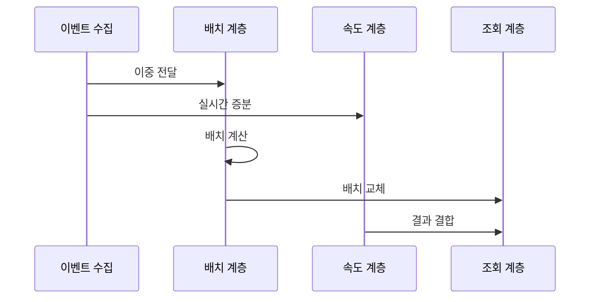

---
sidebar:
  order: 118
  label: "118. 람다 아키텍처 (Lambda Architecture)"
  badge:
    text: "기출 · 50%"
    variant: note
title: "람다 아키텍처 (Lambda Architecture)"
date: "2026-07-27T23:59:59+09:00"
tags:
  - "notes-software"
weight: 118
extra:
  question_no: "118"
  source_status: "기출"
  source_history: "120회"
  priority: 50
  priority_note: "120회 기출, 배치·속도 계층 비교 기준"
---

## 미리 알고가기

- **람다 아키텍처(Lambda Architecture)**: 전체 원본을 재계산하는 배치 계층과 최근 이벤트를 증분 처리하는 속도 계층을 병행하는 구조임
- **람다(Lambda, $\lambda$)**: 그리스 문자 `람다`라고 읽으며 이 아키텍처 이름에서는 수학 변수로 쓰이지 않고 배치·속도 계층을 병행하는 고유 명칭으로 관례적으로 사용함
- **배치 계층(Batch Layer)**: 불변 원본 데이터로 배치 뷰를 재생성함
- **속도 계층(Speed Layer)**: 최신 배치 뷰에 아직 포함되지 않은 이벤트로 실시간 뷰를 갱신함
- **제공 계층(Serving Layer)**: 배치 뷰를 색인하고 조회 시 실시간 뷰와 결합해 최신 결과를 제공함
- **이중 로직 관리**: 배치와 실시간 경로에 같은 규칙을 두 번 구현해 결과 차이를 통제하는 작업임
- **불변 원본(Immutable Master Data)**: 기존 기록을 덮어쓰지 않고 이벤트를 추가해 전체 재계산이 가능하도록 보존한 데이터임
- **뷰(View)**: 원본을 특정 조회 목적에 맞게 계산·색인한 결과임
- **증분 처리(Incremental Processing)**: 새로 들어온 데이터만 기존 결과에 반영하는 처리 방식임
- **이벤트 재생(Event Replay)**: 보관한 이벤트를 과거 순서대로 다시 읽어 상태나 결과를 재생성하는 작업임
- **카파 아키텍처(Kappa Architecture)**: 하나의 스트림 처리 경로에서 실시간 처리와 과거 이벤트 재생을 함께 수행하는 구조임

## Ⅰ. 개요

- **정의/개념**: **배치 뷰·실시간 증분 뷰**의 결합 구조
- **기존 한계**: 배치 전용 처리는 **최신 이벤트 반영 지연**

### 쉽게 이해하기 (학습용)
- 전체 장부와 임시 장부를 동시에 만들고 조회 시 두 결과를 합침

## Ⅱ. 특징

- **배치·속도 이중 경로**로 정확성·최신성 확보
- **불변 원본 재계산**으로 배치 뷰 교체
- 이중 로직의 **구현 비용·결과 불일치** 발생

### 쉽게 이해하기 (학습용)
- 실시간성을 얻지만 같은 계산을 배치와 실시간으로 두 번 구현해야 함

## Ⅲ. 아키텍처 및 구성요소

| 설계 요소 | 설명 |
|:---|:---|
| 이벤트 수집·불변 원본 | 이벤트를 **추가형 원본**으로 보존 |
| 배치 계층 | 전체 원본으로 **배치 뷰 재생성** |
| 속도 계층 | 최신 이벤트로 **증분 뷰 갱신** |
| 제공 계층 | 배치 결과를 **색인·교체** |
| 조회 계층 | **배치·증분 뷰 결합** 응답 |

> 요약: 이벤트를 원본과 속도로 나누어 처리하고 조회 시 두 뷰를 결합함

### 쉽게 이해하기 (학습용)
- 불변 원본과 두 계층의 계산 및 결과를 합치는 조회 계층으로 구성됨

## Ⅳ. 원리 및 절차 흐름도

| 절차 | 설명 |
|:---|:---|
| 이중 전달 | 이벤트를 **원본·속도 계층**에 전달 |
| 실시간 증분 | 배치 미반영 **최신 이벤트** 계산 |
| 배치 계산 | 전체 원본으로 **배치 뷰 재생성** |
| 배치 교체 | 새 배치 뷰로 **기존 뷰 교체** |
| 결과 결합 | 배치 뷰와 **미반영 증분** 결합 |

> 요약: 속도 계층의 임시 결과는 재계산한 새 배치 뷰 배포 시 대체됨

### 쉽게 이해하기 (학습용)
- 최신 임시 결과를 제공하고 전체 재계산이 끝나면 새 뷰로 교체함

## Ⅴ. 종류 및 비교

| 데이터 처리 아키텍처 | Lambda Architecture | Kappa Architecture |
|:---|:---|:---|
| 적용 기준 | 전체 재계산·**실시간 뷰** 병행 | 단일 스트림의 **처리·재생** 통합 |
| 핵심 특징 | **배치·속도 이중 경로** | **단일 스트림 경로** |
| 한계 | 이중 로직·**결과 불일치** | 재생 처리량·**상태 복구 지연** |

> 요약: 람다는 두 결과를 결합하고 카파는 이벤트를 한 경로로 재생함

### 쉽게 이해하기 (학습용)
- 전자는 두 경로를 쓰고 후자는 하나의 경로와 로그 재생으로 계산함

## Ⅵ. 실무 사례

1. 대시보드는 **배치·실시간 뷰**를 조회 시 결합
2. 특성 집계는 **불변 원본**으로 배치 뷰 재생성

### 쉽게 이해하기 (학습용)
- 대시보드는 실시간 뷰와 배치 뷰의 같은 시점 결과를 비교해 이중 계산 로직의 불일치를 찾음
- 특성 집계는 원본 전체로 뷰를 재생성하고 완료 시간과 교체 중 누락 여부를 측정해 복구 능력을 검증함

## Ⅶ. 결론

- 이중 경로 통제 시 **Lambda**, 단일 경로는 **Kappa**

### 쉽게 이해하기 (학습용)
- 배치와 실시간 계산 결과가 다르지 않게 관리할 수 있을 때 두 경로를 함께 씀
