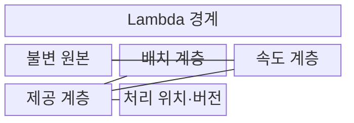
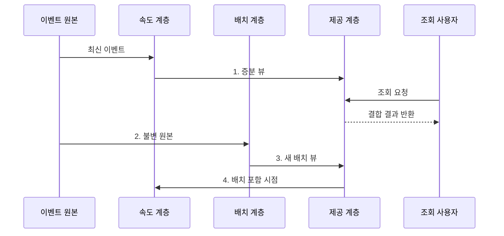

---
sidebar:
  order: 118
  label: "118. 람다 아키텍처 (Lambda Architecture)"
  badge:
    text: "기출 · 50%"
    variant: note
title: "람다 아키텍처 (Lambda Architecture)"
date: "2026-08-02T12:00:00+09:00"
tags:
  - "notes-software"
weight: 118
extra:
  question_no: "118"
  source_status: "기출"
  source_history: "120회"
  priority: 50
  priority_note: "120회 기출, 배치·속도 계층 비교 기준"
---

## Ⅰ. 개요

핵심 용어

- **데이터 처리 아키텍처**: 배치 전체 재계산과 실시간 증분 처리를 결합해 최신 결과를 제공하는 구조이다.

- 정의/개념: **람다 아키텍처**는 전체 데이터를 다시 계산하는 배치 계층과 최신 이벤트를 증분 처리하는 속도 계층의 결과를 결합하는 데이터 처리 아키텍처
- 배경/필요성: 증분 처리만으로는 과거 오류를 반영한 **전체 결과 재생성 불가**

### 쉽게 이해하기 (학습용)
- 전체 장부와 최신분 임시 장부를 따로 만들고 조회할 때 합친다.

## Ⅱ. 특징

핵심 용어

- **이중 처리**: 같은 업무 계산을 배치 경로와 실시간 경로에서 병행하는 특성이다.

- **불변 원본**: 전체 결과 재생성 가능
- **이중 처리**: 배치 기준·실시간 증분 병행
- **결과 결합**: 포함 시점으로 중복·누락 통제

### 쉽게 이해하기 (학습용)
- 최신성을 얻는 대신 같은 계산을 두 경로에서 일치하게 유지해야 한다.

## Ⅲ. 구조 및 구성요소

핵심 용어

- **처리 위치·버전**: 배치와 속도 뷰의 포함 범위와 중복 제거 기준을 관리하는 구성요소이다.

| 구성요소 | 책임 |
|:---|:---|
| 불변 원본 | 모든 사실을 **추가형**으로 보존 |
| 배치 계층 | **전체 기준 뷰** 재생성 |
| 속도 계층 | 최신 이벤트 **증분 계산** |
| 제공 계층 | **뷰 교체·증분 결합** |
| 처리 위치·버전 | **포함 범위·제거 기준** 관리 |

### 쉽게 이해하기 (학습용)

- 원본 장부, 전체 계산자, 최신 계산자, 조회 장부, 시간표로 구성된다.

## Ⅳ. 흐름도

핵심 용어

- **4. 배치 포함 시점**: 새 배치 뷰에 포함된 이벤트 경계를 속도 계층에 전달하는 단계이다.

**동작 원리**

1. **증분 뷰**: 속도 계층이 최신 이벤트 계산 결과 전달
2. **불변 원본**: 이벤트 저장소가 전체 재계산 데이터를 전달
3. **새 배치 뷰**: 배치 계층이 재생성한 기준 결과 게시
4. **배치 포함 시점**: 제공 계층이 속도 계층에 제거 경계 전달

### 쉽게 이해하기 (학습용)

- 임시 장부로 최신분을 보여주다가 전체 장부가 완성되면 겹친 임시 기록을 치운다.

## Ⅴ. 종류 및 비교

핵심 용어

- **Kappa Architecture**: 하나의 스트림 처리 경로에서 실시간 처리와 과거 이벤트 재생을 수행하는 구조이다.

| 데이터 처리 아키텍처 | Lambda Architecture | Kappa Architecture |
|:---|:---|:---|
| 적용 기준 | **전체 재계산** 중요 | **로그 재생 처리량** 충분 |
| 핵심 특징 | **배치·속도 이중 경로** | **단일 스트림 경로** |
| 한계 | **로직 중복·결과 불일치** | **재생 지연·상태 이관** |

### 쉽게 이해하기 (학습용)
- 람다는 두 장부를 만들고, 카파는 같은 처리기로 과거 기록까지 다시 읽는다.

## Ⅵ. 실무 고려사항 및 대책

핵심 용어

- **두 경로의 규칙 변경 시 결과 분기**: 배치와 속도 계층의 중복 구현이 서로 다른 결과를 만드는 문제이다.

| 문제 | 대책 | 효과 |
|:---|:---|:---|
| 두 경로의 규칙 변경 시 결과 분기 | 공통 명세·결과 대사 | **구현 차이** 탐지 |
| 배치·속도 뷰의 포함 구간 중첩 | 이벤트 ID·포함 시점 관리 | **이중 계산·누락** 방지 |
| 생성 중인 배치 뷰가 조회에 노출 | 버전 뷰·원자 포인터 전환 | **부분 배포** 방지 |
| 전체 원본 재처리로 자원 경합 | 파티션·우선순위 조정 | **처리시간·비용** 통제 |
| 마감 뒤 이벤트로 기준 뷰 불일치 | 지연 창·정정 정책 정의 | **닫힌 결과 오류** 복구 |

### 쉽게 이해하기 (학습용)
- 두 장부의 시간 경계를 명시해야 같은 거래를 두 번 더하거나 빠뜨리지 않는다.

## Ⅶ. 결론

핵심 용어

- **Lambda**: 전체 재계산의 가치가 이중 로직 유지 비용보다 클 때 선택하는 아키텍처이다.

- 전체 재계산 가치가 이중 로직 비용보다 크면 **Lambda**, 아니면 **Kappa** 선택

### 쉽게 이해하기 (학습용)
- 빠른 임시 답과 정확한 전체 답을 함께 운영할 수 있을 때 쓰는 구조이다.
