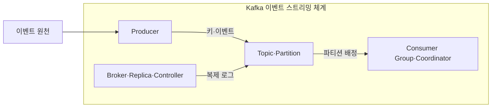
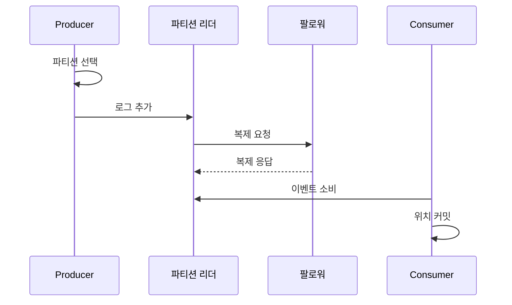

---
sidebar:
  order: 119
  label: "119. Apache Kafka 이벤트 스트리밍 (Apache Kafka)"
  badge:
    text: "미출제 · 70%"
    variant: note
title: "Apache Kafka 이벤트 스트리밍 (Apache Kafka)"
date: "2026-07-25T11:08:00+09:00"
tags:
  - "notes-software"
weight: 119
extra:
  question_no: "119"
  source_status: "미출제"
  source_history: ""
  priority: 70
  priority_note: "Kafka 로그·파티션·소비자 확장성이 높음"
---

## 미리 알고가기

- **아파치 카프카(Apache Kafka)**: 이벤트를 복제된 파티션 로그에 보존하고 여러 소비자가 독립적으로 읽게 하는 이벤트 스트리밍 플랫폼임
- **토픽(Topic)**: 이벤트를 분류하는 논리 단위이며 여러 파티션으로 분할됨
- **파티션(Partition)**: 이벤트를 오프셋 순서로 추가하는 복제 로그이자 병렬 처리 단위임
- **오프셋(Offset)**: 파티션 안에서 이벤트 위치를 식별하는 증가 번호임
- **소비자 그룹(Consumer Group)**: 파티션을 그룹 내 소비자에게 나눠 병렬로 읽음
- **동기화 복제본 집합(In-Sync Replicas, ISR)**: 영문 첫 글자를 딴 ISR을 '아이에스알'로 읽으며 리더 로그를 따라가 장애 시 승격될 복제본 집합임
- **프로듀서(Producer)**: 이벤트의 키와 값을 직렬화해 토픽 파티션으로 보내는 클라이언트임
- **브로커(Broker)**: 파티션 로그와 복제본을 저장하고 생산·소비 요청을 처리하는 서버임
- **소비자(Consumer)**: 배정된 파티션에서 이벤트를 읽고 처리 위치를 관리하는 클라이언트임
- **리더 복제본(Leader Replica)**: 한 파티션의 쓰기와 읽기 요청을 대표로 처리하는 복제본임
- **팔로워 복제본(Follower Replica)**: 리더 로그를 복제해 장애 시 승격 가능성을 유지하는 복제본임
- **보존 정책(Retention Policy)**: 소비 여부와 별개로 이벤트를 유지할 시간이나 로그 크기를 정하는 규칙임
- **로그 압축(Log Compaction)**: 키별 최신 레코드를 남겨 현재 상태를 재구성할 수 있게 하는 정리 방식임
- **멱등성 프로듀서(Idempotent Producer)**: 같은 생산 세션의 재시도로 파티션 로그에 중복 레코드가 생기는 것을 억제하는 프로듀서임
- **트랜잭션 프로듀서(Transactional Producer)**: 여러 레코드와 소비 오프셋을 하나의 Kafka 트랜잭션으로 커밋하는 프로듀서임
- **소비자 지연(Consumer Lag)**: 파티션의 최신 오프셋과 소비자 그룹이 처리 완료한 오프셋의 차이임
- **재균형(Rebalance)**: 그룹 구성 변화에 따라 파티션을 소비자들에게 다시 배정하는 절차임
- **컨트롤러(Controller)·그룹 코디네이터(Group Coordinator)**: 컨트롤러는 파티션 메타데이터와 리더 변경을 관리하고 그룹 코디네이터는 소비자 등록·재균형·오프셋 커밋을 조정함

## Ⅰ. 개요

- 정의/개념: 이벤트를 복제 로그에 보존·재생한다
- **배경/필요성**: 생산자와 소비자의 시간·장애를 분리한다

### 쉽게 이해하기 (학습용)
- 이벤트를 분산 일지에 보존하고 여러 독자가 각자 읽는 플랫폼임

## Ⅱ. 특징

- 같은 키를 한 파티션에 기록해 처리 순서를 보장한다
- 그룹 오프셋은 장애 뒤 재처리 시작점을 복원한다
- 팔로워 복제는 리더 장애 때 로그 손실을 막는다
- 보존·압축 정책은 재생 범위와 저장 비용을 정한다
- 멱등성·트랜잭션은 재시도 중복과 부분 커밋을 막는다

### 쉽게 이해하기 (학습용)
- 병렬성과 재처리는 좋으나 순서 보장과 편중 및 재배정을 관리해야 함

## Ⅲ. 아키텍처 및 구성요소

| 설계 요소 | 설명 |
|:---|:---|
| Producer | 키·값을 직렬화해 파티션에 전송 |
| Topic·Partition | 이벤트 로그와 병렬 범위를 분할 |
| Broker·Replica·Controller | 로그 복제·메타데이터·리더 관리 |
| Consumer Group·Coordinator | 파티션 배정·그룹 오프셋 관리 |

> 요약: 기록·복제·소비 위치를 분리 관리

### 쉽게 이해하기 (학습용)
- 작성자와 번호가 붙은 일지 및 사본 서버와 독자 그룹 등으로 구성됨

## Ⅳ. 원리 및 절차 흐름도

| 절차 | 설명 |
|:---|:---|
| 파티션 선택 | 키·정책으로 대상 파티션 결정 |
| 로그 추가 | 리더가 다음 오프셋에 이벤트 추가 |
| 복제 요청 | 팔로워에 새 로그 복제를 요청 |
| 복제 응답 | 승인 조건 충족 후 생산자에 응답 |
| 이벤트 소비 | 배정 파티션에서 이벤트를 읽음 |
| 위치 커밋 | 처리 완료 오프셋을 그룹에 저장 |

> 요약: 키·복제·오프셋으로 로그 처리

### 쉽게 이해하기 (학습용)
- 프로듀서는 키로 파티션을 정해 기록하고 소비자는 처리 완료 오프셋을 저장해 장애 뒤 재시작 위치를 결정함

## Ⅴ. 종류 및 비교

| 판단 기준 | Apache Kafka | 전통 작업 큐 |
|:---|:---|:---|
| 핵심 특징 | 보존 로그·소비자 오프셋 | 전달 후 제거·브로커 상태 |
| 적용 기준 | 이벤트 보존·다중 소비·재처리 | 경쟁 소비·일회성 작업 분배 |
| 주요 위험 | 파티션 편향·오프셋 오류 | 소비 후 복구·감사 한계 |

> 요약: 파티션 로그에 보존하고 오프셋으로 병렬 소비와 재처리를 지원함

### 쉽게 이해하기 (학습용)
- 작업 큐는 일회 전달에, Kafka는 보존 로그와 재생에 초점을 둠

## Ⅵ. 실무 사례

1. 서비스 키로 응용 로그의 파티션 부하를 분산한다
2. 업무 키로 변경 이벤트의 처리 순서를 유지한다

### 쉽게 이해하기 (학습용)
- 응용 로그 수집은 파티션별 생산량과 소비자 지연을 비교해 편중과 처리 부족을 구분함
- 변경 이벤트는 같은 업무 키를 같은 파티션에 보내 순서를 유지하고 ISR 감소와 오프셋 지연을 함께 감시함

## Ⅶ. 결론

- 키 순서·재처리 범위로 파티션과 보존 기간을 정한다

### 쉽게 이해하기 (학습용)
- 같은 순서가 필요한 이벤트는 같은 키로 묶고 다시 읽을 기간만큼 로그를 보존함
