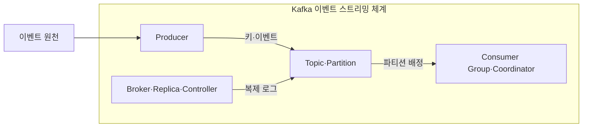
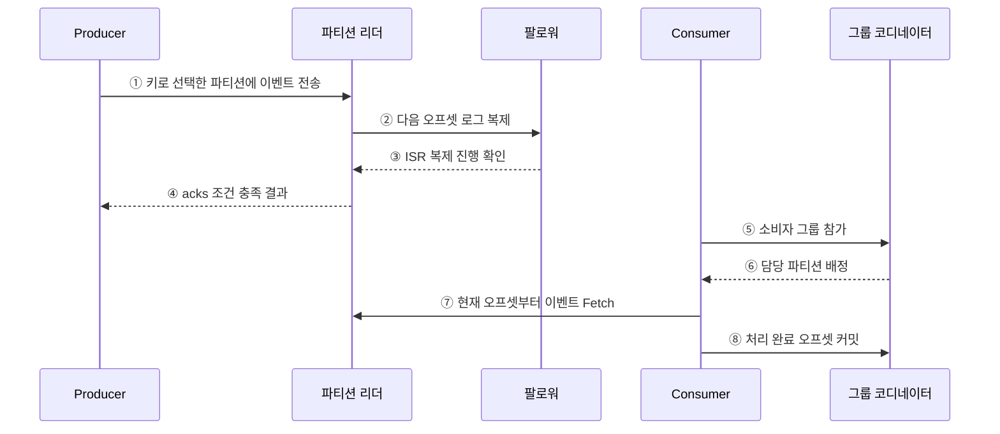

---
sidebar:
  order: 119
  label: "119. Apache Kafka 이벤트 스트리밍 (Apache Kafka)"
  badge:
    text: "미출제 · 70%"
    variant: note
title: "Apache Kafka 이벤트 스트리밍 (Apache Kafka)"
date: "2026-07-25T11:08:00+09:00"
tags:
  - "notes-software"
weight: 119
extra:
  question_no: "119"
  source_status: "미출제"
  source_history: ""
  priority: 70
  priority_note: "Kafka 로그·파티션·소비자 확장성이 높음"
---

## 미리 알고가기

- **아파치 카프카(Apache Kafka)**: 이벤트를 복제된 파티션 로그에 보존하고 여러 소비자가 독립적으로 읽게 하는 이벤트 스트리밍 플랫폼임
- **토픽(Topic)**: 이벤트를 분류하는 논리 단위이며 여러 파티션으로 분할됨
- **파티션(Partition)**: 이벤트를 오프셋 순서로 추가하는 복제 로그이자 병렬 처리 단위임
- **오프셋(Offset)**: 파티션 안에서 이벤트 위치를 식별하는 증가 번호임
- **소비자 그룹(Consumer Group)**: 파티션을 그룹 내 소비자에게 나눠 병렬로 읽음
- **동기화 복제본 집합(In-Sync Replicas, ISR)**: 영문 첫 글자를 딴 ISR을 '아이에스알'로 읽으며 리더 로그를 따라가 장애 시 승격될 복제본 집합임
- **프로듀서(Producer)**: 이벤트의 키와 값을 직렬화해 토픽 파티션으로 보내는 클라이언트임
- **브로커(Broker)**: 파티션 로그와 복제본을 저장하고 생산·소비 요청을 처리하는 서버임
- **소비자(Consumer)**: 배정된 파티션에서 이벤트를 읽고 처리 위치를 관리하는 클라이언트임
- **리더 복제본(Leader Replica)**: 한 파티션의 쓰기와 읽기 요청을 대표로 처리하는 복제본임
- **팔로워 복제본(Follower Replica)**: 리더 로그를 복제해 장애 시 승격 가능성을 유지하는 복제본임
- **보존 정책(Retention Policy)**: 소비 여부와 별개로 이벤트를 유지할 시간이나 로그 크기를 정하는 규칙임
- **로그 압축(Log Compaction)**: 키별 최신 레코드를 남겨 현재 상태를 재구성할 수 있게 하는 정리 방식임
- **멱등성 프로듀서(Idempotent Producer)**: 같은 생산 세션의 재시도로 파티션 로그에 중복 레코드가 생기는 것을 억제하는 프로듀서임
- **트랜잭션 프로듀서(Transactional Producer)**: 여러 레코드와 소비 오프셋을 하나의 Kafka 트랜잭션으로 커밋하는 프로듀서임
- **소비자 지연(Consumer Lag)**: 파티션의 최신 오프셋과 소비자 그룹이 처리 완료한 오프셋의 차이임
- **재균형(Rebalance)**: 그룹 구성 변화에 따라 파티션을 소비자들에게 다시 배정하는 절차임
- **컨트롤러(Controller)·그룹 코디네이터(Group Coordinator)**: 컨트롤러는 파티션 메타데이터와 리더 변경을 관리하고 그룹 코디네이터는 소비자 등록·재균형·오프셋 커밋을 조정함

## Ⅰ. 개요

- Apache Kafka는 이벤트를 복제된 토픽 파티션 로그에 보존하고 여러 소비자 그룹이 각자의 오프셋으로 독립 처리·재생하게 하는 플랫폼이다.
- 생산과 소비의 시간·속도·장애를 분리하고 파티션 단위로 순서와 병렬성을 제공한다.

### 쉽게 이해하기 (학습용)
- 이벤트를 분산 일지에 보존하고 여러 독자가 각자 읽는 플랫폼임

## Ⅱ. 특징

- **파티션 로그**: 같은 키를 같은 파티션에 보내면 그 파티션 안의 기록·소비 순서를 유지한다.
- **독립 소비**: 각 소비자 그룹이 파티션 배정과 처리 완료 오프셋을 별도로 관리한다.
- **보존·재생**: 소비 여부와 무관하게 시간·크기 또는 키별 압축 정책으로 이벤트를 보존한다.
- **복제·장애 전환**: 리더 로그를 ISR에 복제하고 장애 시 적합한 복제본을 승격한다.
- **전달 보장 도구**: 멱등 생산과 Kafka 트랜잭션은 정해진 범위의 중복·부분 커밋을 통제한다.

### 쉽게 이해하기 (학습용)
- 병렬성과 재처리는 좋으나 순서 보장과 편중 및 재배정을 관리해야 함

## Ⅲ. 아키텍처 및 구성요소

**도표안 A — 구조도**

**도표안 B — sequenceDiagram**

| 구성요소 | 역할 |
|:---|:---|
| Producer | 키·값 직렬화·파티션 선택·재시도 |
| Topic·Partition·Offset | 이벤트 분류·병렬 로그·위치 식별 |
| Broker·Leader·Follower | 로그 저장·읽기/쓰기·복제 |
| Controller | 파티션 메타데이터와 리더 변경 관리 |
| Consumer Group·Coordinator | 파티션 배정·재균형·그룹 오프셋 관리 |

**동작 원리**

- ① Producer가 키로 파티션을 선택해 이벤트를 리더에 전송한다.
- ② 리더가 다음 오프셋에 이벤트를 추가하고 팔로워에 복제한다.
- ③ ISR 팔로워가 복제 진행 위치를 리더에 확인한다.
- ④ 리더가 Producer의 `acks` 조건을 충족한 결과를 반환한다.
- ⑤ Consumer가 그룹 코디네이터에 참가한다.
- ⑥ 코디네이터가 그룹 내 한 소비자에 각 파티션을 배정한다.
- ⑦ Consumer가 배정 파티션의 현재 위치부터 이벤트를 읽는다.
- ⑧ 처리가 끝난 다음 재시작 기준이 될 오프셋을 커밋한다.

### 쉽게 이해하기 (학습용)

- 작성자는 번호 붙은 일지에 기록하고 독자는 마지막으로 처리한 번호를 책갈피로 저장한다.

## Ⅳ. 종류 및 비교

| 비교 항목 | Apache Kafka | 전통 작업 큐 |
|:---|:---|:---|
| 데이터 수명 | 소비와 독립된 로그 보존 | 처리·승인 후 제거 중심 |
| 소비 상태 | 그룹별 오프셋 | 메시지별 대기·전달·승인 상태 |
| 다중 소비 | 그룹마다 같은 이벤트 독립 처리 | 같은 큐에서는 경쟁 소비 중심 |
| 재처리 | 오프셋을 이동해 재생 | 별도 재게시·보관 기능 필요 |
| 적합한 용도 | 이벤트 기록·CDC·스트림 파이프라인 | 개별 작업 분배·명령 처리 |
| 주요 위험 | 파티션·순서·Lag·재균형 | Poison 메시지·재전달·대기열 적체 |

| 보존 방식 | 남기는 기준 | 적합한 목적 |
|:---|:---|:---|
| Delete Retention | 시간·크기 초과 세그먼트 삭제 | 기간 내 사건 재생 |
| Log Compaction | 키별 최신 레코드 중심 보존 | 현재 상태 재구성 |
| 병행 | 압축 후 기간·크기 삭제 | 상태와 보존 상한 동시 관리 |

### 쉽게 이해하기 (학습용)

- 작업 큐는 일을 나눠 끝내는 데, Kafka는 사건을 남겨 여러 독자가 다시 읽는 데 초점을 둔다.

## Ⅴ. 실무 고려사항 및 대책

| 고려사항 | 위험 | 대책 |
|:---|:---|:---|
| 파티션 키 | 핫 파티션·필요한 순서 분산 | 순서 경계와 키 분포를 함께 검증 |
| 파티션 수 | 병렬성 부족 또는 메타데이터·재균형 증가 | 처리량·소비자 수·성장 계획으로 산정 |
| Producer 보장 | 재시도 중복·순서 역전 | 멱등성·acks·재시도 설정과 앱 중복 구분 |
| Offset | 처리 전 커밋으로 유실, 처리 후 커밋으로 중복 | 처리·외부 부작용·커밋 순서와 멱등성 설계 |
| Consumer Lag | 평균은 정상이나 특정 파티션 적체 | 파티션별 Lag·처리시간·재균형 감시 |
| 보존 | 재처리 기간 부족·디스크 고갈 | 복구 시나리오 기반 시간·크기·압축 설정 |

> **적용 사례**: 주문 이벤트는 주문 ID를 키로 사용해 주문 내부 순서를 지키고 파티션별 생산량·Lag로 핫키와 소비 처리 부족을 구분한다.

### 쉽게 이해하기 (학습용)

- 같은 주문의 순서는 한 일지에서 지키고 각 일지의 밀린 양을 따로 봐야 한다.

## Ⅵ. 결론

- Kafka는 파티션 로그·복제·소비자 그룹·오프셋으로 이벤트 생산과 소비를 분리하고 재생을 지원한다.
- 순서 경계·키 분포·보존 범위·전달 보장·외부 부작용의 멱등성을 함께 설계해야 한다.

### 쉽게 이해하기 (학습용)

- 같은 순서가 필요한 사건은 한 일지에 쓰고 다시 읽을 기간만큼 보존한다.
