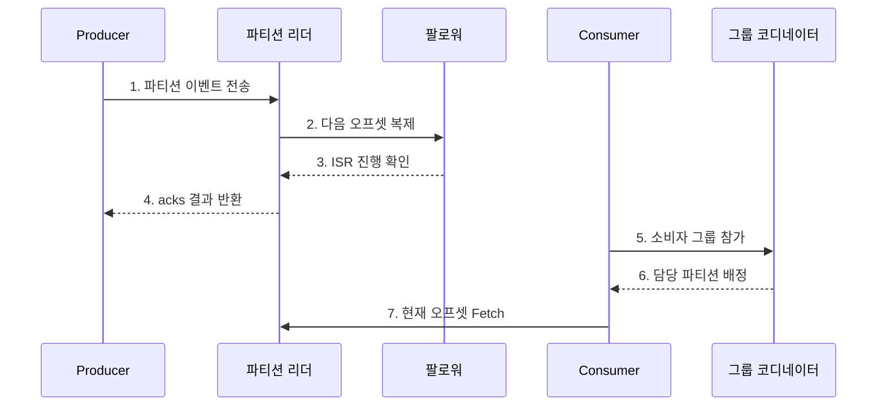

---
sidebar:
  order: 119
  label: "119. Apache Kafka 이벤트 스트리밍 (Apache Kafka)"
  badge:
    text: "미출제 · 70%"
    variant: note
title: "Apache Kafka 이벤트 스트리밍 (Apache Kafka)"
date: "2026-07-25T11:08:00+09:00"
tags:
  - "notes-software"
weight: 119
extra:
  question_no: "119"
  source_status: "미출제"
  source_history: ""
  priority: 70
  priority_note: "Kafka 로그·파티션·소비자 확장성이 높음"
---

## 미리 알고가기

- **아파치 카프카(Apache Kafka)**: 이벤트를 복제된 파티션 로그에 보존하고 여러 소비자가 독립적으로 읽게 하는 이벤트 스트리밍 플랫폼임
- **토픽(Topic)**: 이벤트를 분류하는 논리 단위이며 여러 파티션으로 분할됨
- **파티션(Partition)**: 이벤트를 오프셋 순서로 추가하는 복제 로그이자 병렬 처리 단위임
- **오프셋(Offset)**: 파티션 안에서 이벤트 위치를 식별하는 증가 번호임
- **소비자 그룹(Consumer Group)**: 파티션을 그룹 내 소비자에게 나눠 병렬로 읽음
- **동기화 복제본 집합(In-Sync Replicas, ISR)**: 영문 첫 글자를 딴 ISR을 '아이에스알'로 읽으며 리더 로그를 따라가 장애 시 승격될 복제본 집합임
- **프로듀서(Producer)**: 이벤트의 키와 값을 직렬화해 토픽 파티션으로 보내는 클라이언트임
- **브로커(Broker)**: 파티션 로그와 복제본을 저장하고 생산·소비 요청을 처리하는 서버임
- **소비자(Consumer)**: 배정된 파티션에서 이벤트를 읽고 처리 위치를 관리하는 클라이언트임
- **리더 복제본(Leader Replica)**: 한 파티션의 쓰기와 읽기 요청을 대표로 처리하는 복제본임
- **팔로워 복제본(Follower Replica)**: 리더 로그를 복제해 장애 시 승격 가능성을 유지하는 복제본임
- **보존 정책(Retention Policy)**: 소비 여부와 별개로 이벤트를 유지할 시간이나 로그 크기를 정하는 규칙임
- **로그 압축(Log Compaction)**: 키별 최신 레코드를 남겨 현재 상태를 재구성할 수 있게 하는 정리 방식임
- **멱등성 프로듀서(Idempotent Producer)**: 같은 생산 세션의 재시도로 파티션 로그에 중복 레코드가 생기는 것을 억제하는 프로듀서임
- **트랜잭션 프로듀서(Transactional Producer)**: 여러 레코드와 소비 오프셋을 하나의 Kafka 트랜잭션으로 커밋하는 프로듀서임
- **소비자 지연(Consumer Lag)**: 파티션의 최신 오프셋과 소비자 그룹이 처리 완료한 오프셋의 차이임
- **재균형(Rebalance)**: 그룹 구성 변화에 따라 파티션을 소비자들에게 다시 배정하는 절차임
- **컨트롤러(Controller)·그룹 코디네이터(Group Coordinator)**: 컨트롤러는 파티션 메타데이터와 리더 변경을 관리하고 그룹 코디네이터는 소비자 등록·재균형·오프셋 커밋을 조정함

## Ⅰ. 개요

- 정의/개념: 이벤트를 **복제 파티션 로그에 보존·재생**
- **배경/필요성**: 생산·소비 속도와 장애의 분리

### 쉽게 이해하기 (학습용)
- 이벤트를 분산 일지에 보존하고 여러 독자가 각자 읽는 플랫폼임

## Ⅱ. 특징

- **파티션 순서**: 같은 키의 기록 순서 유지
- **독립 소비**: 그룹별 오프셋·배정 관리
- **보존·복제**: 재생과 리더 장애 전환 지원

### 쉽게 이해하기 (학습용)
- 병렬성과 재처리는 좋으나 순서 보장과 편중 및 재배정을 관리해야 함

## Ⅲ. 구조 및 구성요소

| 구성요소 | 책임 |
|:---|:---|
| Producer | 키·값 전송·재시도 |
| Topic·Partition·Offset | 분류·병렬 로그·위치 |
| Broker·Leader·Follower | 저장·읽기·쓰기·복제 |
| Controller | 메타데이터·리더 변경 |
| Consumer Group·Coordinator | 배정·재균형·오프셋 |

### 쉽게 이해하기 (학습용)

- 작성자, 번호 일지, 사본 서버, 관리자, 독자 모임으로 구성된다.

## Ⅳ. 흐름도

**동작 원리**

- **1. 파티션 이벤트 전송**: 키로 일지를 고른다.
- **2. 다음 오프셋 복제**: 순서 번호를 붙인다.
- **3. ISR 진행 확인**: 사본 위치를 확인한다.
- **4. acks 결과 반환**: 생산 결과를 보낸다.
- **5. 소비자 그룹 참가**: 독자를 등록한다.
- **6. 담당 파티션 배정**: 일지를 나눈다.
- **7. 현재 오프셋 Fetch**: 처리 위치부터 읽는다.

### 쉽게 이해하기 (학습용)

- 작성자는 번호 붙은 일지에 기록하고 독자는 마지막으로 처리한 번호를 책갈피로 저장한다.

## Ⅴ. 종류 및 비교

| 판단 기준 | Apache Kafka | 전통 작업 큐 |
|:---|:---|:---|
| 적용 기준 | 사건 기록·재생 | 개별 작업 분배 |
| 핵심 특징 | 그룹별 오프셋·로그 보존 | 처리·승인 후 제거 |
| 한계 | 순서·Lag·재균형 | 재전달·대기열 적체 |

### 쉽게 이해하기 (학습용)

- 작업 큐는 일을 나눠 끝내는 데, Kafka는 사건을 남겨 여러 독자가 다시 읽는 데 초점을 둔다.

## Ⅵ. 실무 고려사항 및 대책

| 고려사항 | 대책 | 효과 |
|:---|:---|:---|
| 파티션 키 | 순서 경계·키 분포 검증 | 핫 파티션 방지 |
| 파티션 수 | 처리량·소비자 수로 산정 | 병렬성·재균형 균형 |
| Producer | 멱등성·acks·재시도 설정 | 중복·역전 억제 |
| Offset | 처리·커밋 순서·멱등성 설계 | 유실·중복 통제 |
| Consumer Lag | 파티션별 지연 감시 | 국소 적체 탐지 |

> **적용 사례**: 주문 이벤트는 주문 ID를 키로 사용해 주문 내부 순서를 지키고 파티션별 생산량·Lag로 핫키와 소비 처리 부족을 구분한다.

### 쉽게 이해하기 (학습용)

- 같은 주문의 순서는 한 일지에서 지키고 각 일지의 밀린 양을 따로 봐야 한다.

## Ⅶ. 결론

- **순서 경계·키 분포·보존 범위·멱등성**으로 Kafka를 설계한다.

### 쉽게 이해하기 (학습용)

- 같은 순서가 필요한 사건은 한 일지에 쓰고 다시 읽을 기간만큼 보존한다.
