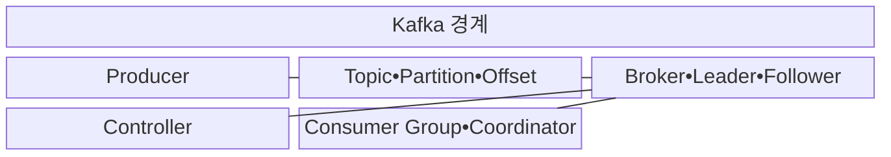
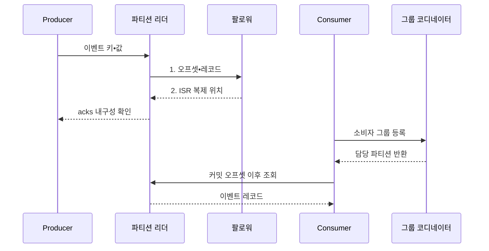

---
sidebar:
  order: 119
  label: "119. Apache Kafka 이벤트 스트리밍 (Apache Kafka)"
  badge:
    text: "미출 • 70%"
    variant: note
title: "Apache Kafka 이벤트 스트리밍 (Apache Kafka)"
date: "2026-08-04T13:19:00+09:00"
tags:
  - "notes-software"
weight: 119
extra:
  question_no: "119"
  source_status: "미출"
  source_history: ""
  priority: 70
  priority_note: "Kafka 로그•파티션•소비자 확장성이 높음"
---

## Ⅰ. 개요

핵심 용어

- **Apache Kafka 이벤트 스트리밍 플랫폼**: 생산자가 발행한 이벤트를 복제된 파티션 로그에 순서대로 보존하고 여러 소비자가 독립적으로 읽게 하는 분산 플랫폼이다.

- 정의/개념: 생산자가 발행한 이벤트를 복제된 파티션 로그에 순서대로 보존하고 소비자가 독립적으로 읽게 하는 **Apache Kafka 이벤트 스트리밍 플랫폼**
- 배경/필요성: 직접 연동은 소비자 지연•장애가 **생산자 처리 중단** 으로 전파

#### 한줄 요약
- 이벤트를 분산 일지에 보존하고 여러 독자가 각자 읽는 플랫폼이다.

## Ⅱ. 특징

핵심 용어

- **파티션 순서**: 같은 키의 이벤트를 하나의 파티션에 기록해 로그 순서를 유지하는 특성이다.
- **독립 소비**: 소비자 그룹마다 파티션 배정과 처리 오프셋을 별도로 관리하는 특성이다.
- **로그 보존**: 이벤트를 정한 기간 유지해 과거 재생을 지원하는 특성이다.
- **로그 복제**: 복제본을 유지해 리더 장애를 견디는 특성이다.
- **로그 압축(Log Compaction)**: 키별 최신 레코드를 보존해 상태를 재구성할 수 있게 하는 정리 방식이다.
- **트랜잭션 프로듀서(Transactional Producer)**: 여러 레코드와 소비 오프셋을 하나의 트랜잭션으로 원자 커밋하는 생산자이다.

- **파티션 순서**: 같은 키의 기록 순서 유지
- **독립 소비**: 그룹별 오프셋•배정 관리
- **보존•복제**: 재생과 리더 장애 전환 지원
- **로그 압축**: 키별 최신 레코드로 상태 재구성
- **트랜잭션 프로듀서**: 레코드•소비 오프셋 원자 커밋

#### 한줄 요약
- 병렬성과 재처리는 좋으나 순서 보장과 편중 및 재배정을 관리해야 한다.

## Ⅲ. 구조 및 구성요소

핵심 용어

- **Consumer Group**: 토픽 파티션을 나눠 병렬 소비하는 클라이언트 집합이다.
- **Coordinator**: 소비자 등록과 파티션 배정•재균형을 조정하는 구성요소이다.
- **생산자(Producer)**: 이벤트의 키와 값을 주제 파티션으로 전송하고 실패를 재시도하는 클라이언트이다.
- **주제(Topic)**: 이벤트를 업무 범주별로 분류하는 이름이다.
- **파티션(Partition)**: 토픽을 병렬 처리하도록 나눈 순서 로그이다.
- **오프셋(Offset)**: 파티션 로그 안에서 증가하는 레코드 위치이다.
- **브로커(Broker)**: 파티션 로그를 저장하고 요청을 처리하는 서버이다.
- **리더(Leader)**: 파티션의 읽기와 쓰기를 담당하는 복제본이다.
- **팔로워(Follower)**: 리더 로그를 복제하는 사본이다.
- **컨트롤러(Controller)**: 클러스터 메타데이터와 파티션 리더 변경을 조정하는 구성요소이다.

| 구성요소 | 책임 |
|:---|:---|
| Producer | **키•값 전송•재시도** |
| Topic•Partition•Offset | **분류•병렬 로그•위치** |
| Broker•Leader•Follower | **저장•읽기•쓰기•복제** |
| Controller | **메타데이터•리더** 변경 |
| Consumer Group•Coordinator | **배정•재균형•오프셋** 관리 |

#### 한줄 요약

- 작성자, 번호 일지, 사본 서버, 관리자, 독자 모임으로 구성된다.

## Ⅳ. 흐름도

핵심 용어

- **동기화 복제본 집합(In-Sync Replicas, ISR)**: 리더의 로그를 허용 지연 안에서 따라온 복제본 집합이다.
- **2. ISR 복제 위치**: 팔로워가 리더와 같은 순서로 반영한 마지막 오프셋을 반환하는 정보이다.
- **1. 오프셋•레코드**: 리더가 증가 위치를 부여해 동기화 복제본에 전달하는 이벤트 기록이다.
- **확인 응답(Acknowledgements, acks)**: 생산자 성공 응답 전에 필요한 리더•복제본의 내구성 확인 수준이다.

**동작 원리**

1. **오프셋•레코드**: 리더가 증가 번호와 이벤트를 팔로워에 전달
2. **ISR 복제 위치**: 팔로워가 같은 순서로 반영한 오프셋 반환

#### 한줄 요약

- 작성자는 번호 붙은 일지에 기록하고 독자는 마지막으로 처리한 번호를 책갈피로 저장한다.

## Ⅴ. 종류 및 비교

핵심 용어

- **전통 작업 큐**: 작업을 한 소비자에게 분배하고 처리•승인 뒤 대기열에서 제거하는 메시징 방식이다.
- **소비 지연(Consumer Lag)**: 생산된 최신 오프셋과 소비자가 처리•커밋한 오프셋의 차이이다.

| 메시징 방식 | Apache Kafka | 전통 작업 큐 |
|:---|:---|:---|
| 적용 기준 | **사건 기록•재생** | **개별 작업 분배** |
| 핵심 특징 | **그룹별 오프셋•로그 보존** | **처리•승인 후 제거** |
| 한계 | **순서•소비 지연(Consumer Lag)•재균형** | **재전달•대기열 적체** |

#### 한줄 요약

- 작업 큐는 일을 나눠 끝내는 데, Kafka는 사건을 남겨 여러 독자가 다시 읽는 데 초점을 둔다.

## Ⅵ. 실무 고려사항 및 대책

핵심 용어

- **순서 경계**: 함께 순서를 보장할 사건 범위이다.
- **키 분포 검증**: 실제 키별 요청 편중을 확인하는 활동이다.
- **처리량 기반 파티션 산정**: 목표 병렬 처리량에 맞춰 파티션 수를 정하는 기준이다.
- **소비자 수 기반 파티션 산정**: 그룹별 최대 소비자 수에 맞춰 파티션 수를 정하는 기준이다.
- **멱등성 설정**: 생산자 재시도의 중복 기록을 억제하는 통제이다.
- **acks 설정**: 성공 전에 필요한 복제본 확인 수준을 정하는 통제이다.
- **재시도 설정**: 전송 실패 시 재전송 횟수와 간격을 정하는 통제이다.
- **처리•커밋 순서**: 업무 처리 성공 뒤 오프셋을 커밋하는 원칙이다.
- **멱등성 설계**: 재처리에도 중복 효과를 막는 소비자 설계이다.
- **파티션별 지연 감시**: 각 로그의 소비 오프셋 차이를 관찰하는 활동이다.
- **소비자 확장**: 병목 그룹의 처리 인스턴스를 늘리는 대응이다.

| 문제 | 대책 | 효과 |
|:---|:---|:---|
| 편향 키로 특정 파티션에 생산 집중 | **순서 경계•키 분포 검증** | **핫 파티션** 방지 |
| 소비자보다 적거나 과도한 파티션 설정 | **처리량•소비자 수 기반 파티션 산정** | **병렬성•재균형** 균형 |
| 재시도 중 중복•순서 역전 발생 | **멱등성•acks•재시도 설정** | **중복•역전** 억제 |
| 처리 전 커밋 또는 처리 후 미커밋 | **처리•커밋 순서•멱등성 설계** | **유실•중복** 통제 |
| 처리량이 생산량보다 낮아 적체 증가 | **파티션별 지연 감시•소비자 확장** | **국소 적체** 해소 |

#### 한줄 요약

- 같은 주문의 순서는 한 일지에서 지키고 각 일지의 밀린 양을 따로 봐야 한다.

## Ⅶ. 결론

핵심 용어

- **선택 기준**: 사건 재생•다중 소비와 일회성 작업 분배의 비교 축이다.

- 사건 재생•다중 소비가 필요하면 **Apache Kafka** 선택, 일회성 작업 분배에는 **작업 큐** 선택

#### 한줄 요약

- 같은 순서가 필요한 사건은 한 일지에 쓰고 다시 읽을 기간만큼 보존한다.
