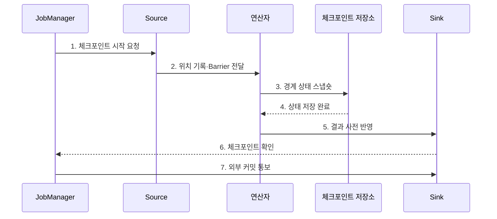

---
sidebar:
  order: 120
  label: "120. Apache Flink 스트림 처리 (Apache Flink)"
  badge:
    text: "미출제 · 50%"
    variant: note
title: "Apache Flink 스트림 처리 (Apache Flink)"
date: "2026-07-25T11:10:00+09:00"
tags:
  - "notes-software"
weight: 120
extra:
  question_no: "120"
  source_status: "미출제"
  source_history: ""
  priority: 50
  priority_note: "Flink 상태·이벤트시간 스트림 처리 현안"
---

## 미리 알고가기

- **아파치 플링크(Apache Flink)**: 이벤트 시간과 분산 상태를 중심으로 연속 데이터 흐름을 처리하는 스트림 처리 엔진이다.
- **이벤트 시간(Event Time)**: 이벤트가 발생한 시각이며 처리 서버의 현재 시각과 구분됨
- **워터마크(Watermark)**: 이벤트 시간이 특정 시점까지 진행됐음을 알리는 표식이다.
- **키별 상태(Keyed State)**: 같은 키의 이벤트가 공유하며 키 그룹에 따라 병렬 연산자에 분할되는 상태이다.
- **체크포인트(Checkpoint)**: 장애 복구를 위해 소스 위치와 연산자 상태를 일관된 시점으로 자동 저장한 스냅숏이다.
- **세이브포인트(Savepoint)**: 중지·재개·업그레이드·병렬도 변경을 위해 운영자가 생성하는 실행 상태 이미지이다.
- **역압력(Backpressure)**: 하위 연산자의 처리 지연이 상위 연산자의 전송 속도를 제한하는 상태이다.
- **상태 백엔드(State Backend)**: 실행 중 상태를 보관하고 체크포인트·세이브포인트용 스냅숏을 만드는 구성요소이다.
- **잡매니저(JobManager)**: 작업 스케줄링·체크포인트·장애 복구를 조정하는 프로세스이다.
- **태스크매니저(TaskManager)**: 연산자 서브태스크를 실행하고 슬롯·상태·데이터 교환을 담당하는 프로세스이다.
- **슬롯(Slot)**: TaskManager의 자원을 병렬 서브태스크에 할당하는 논리 단위이다.
- **연산자(Operator)**: 입력 이벤트에 필터·변환·집계 등의 계산을 수행하는 처리 단계이다.
- **체크포인트 장벽(Checkpoint Barrier)**: 스트림을 따라 이동하며 같은 체크포인트에 포함될 이벤트 경계를 표시하는 제어 레코드이다.
- **싱크(Sink)**: 처리 결과를 데이터베이스·파일·메시지 시스템 등 외부 저장소에 내보내는 연산자이다.
- **스파크 구조적 스트리밍(Spark Structured Streaming)**: 데이터프레임과 SQL 실행 엔진으로 연속 입력을 증분 처리하는 Spark 기반 스트림 엔진이며 Flink의 비교 대상이다.
- **구조적 질의 언어(Structured Query Language, SQL)**: 영문 첫 글자를 딴 SQL을 '에스큐엘'로 읽으며 Spark 스트리밍의 선언형 변환을 표현한다.

## Ⅰ. 개요

- 정의/개념: 이벤트 시간과 상태로 연속 흐름을 처리하는 **엔진**
- 배경/필요성: 지연 이벤트 처리와 일관된 상태 복구

### 쉽게 이해하기 (학습용)
- 뒤섞인 이벤트를 발생 시간과 키별 상태로 연속 처리하는 스트림 엔진임

## Ⅱ. 특징

- **이벤트 시간**: Watermark로 완료 기준 결정
- **키별 상태**: 같은 키의 누적 상태 관리
- **일관 복구**: Barrier·Checkpoint로 경계 저장

### 쉽게 이해하기 (학습용)
- 낮은 지연을 제공하지만 워터마크와 상태 및 체크포인트 비용을 관리해야 함

## Ⅲ. 구조 및 구성요소

| 구성요소 | 책임 |
|:---|:---|
| JobManager | 스케줄·복구 조정 |
| TaskManager·Slot | 서브태스크·교환 실행 |
| Source·Watermark | 이벤트·시간 표식 생성 |
| 연산자·State Backend | 키 계산·상태 스냅숏 |
| Checkpoint Storage·Sink | 복구 이미지·결과 보존 |

### 쉽게 이해하기 (학습용)

- 작업 관리자, 실행자, 시간표, 상태 계산자, 복구·출력 저장소로 구성된다.

## Ⅳ. 흐름도

**동작 원리**

- **1. 체크포인트 시작 요청**: 복구 촬영을 시작
- **2. 위치 기록·Barrier 전달**: 입력 경계를 표시
- **3. 경계 상태 스냅숏**: 키 상태를 저장
- **4. 상태 저장 완료**: 영속 결과를 확인
- **5. 결과 사전 반영**: Sink에 경계를 전달
- **6. 체크포인트 확인**: 모든 경로를 확인
- **7. 외부 커밋 통보**: 결과를 확결정

### 쉽게 이해하기 (학습용)

- 흐름에 사진 촬영선을 흘려 보내 입력 위치·계산 상태·출력 경계를 같은 시점으로 맞춘다.

## Ⅴ. 종류 및 비교

| 판단 기준 | Apache Flink | Spark Structured Streaming |
|:---|:---|:---|
| 적용 기준 | 저지연·세밀한 상태 | Spark SQL·배치 통합 |
| 핵심 특징 | 연속 흐름·Barrier 복구 | Micro-batch·상태 재실행 |
| 한계 | 상태·역압력 병목 | 배치 지연·셔플 비용 |

> 선택 기준: **요구 지연·이벤트 시간·상태 크기·종단 보장·운영 생태계**

### 쉽게 이해하기 (학습용)

- Flink는 흐르는 사건을 계속 처리하고 Spark는 기본적으로 작은 묶음의 연속으로 처리한다.

## Ⅵ. 실무 고려사항 및 대책

| 고려사항 | 대책 | 효과 |
|:---|:---|:---|
| Watermark | 지연 분포·허용시간으로 설정 | 누락·상태 증가 균형 |
| 상태 크기 | TTL·윈도·키 분포 조정 | 저장 폭증 방지 |
| Checkpoint | 지속시간·실패율·I/O 감시 | 복구 촬영 병목 완화 |
| 역압력 | 병목 연산자·Sink 분석 | 전체 지연 원인 제거 |
| Savepoint | UID·호환성·복원 리허설 | 업그레이드 실패 방지 |

> **적용 사례**: 거래 탐지는 계정별 상태와 실제 지연 분포 기반 Watermark를 사용하고 늦은 이벤트 비율·상태 크기·Checkpoint 시간을 함께 감시

### 쉽게 이해하기 (학습용)

- 늦은 거래를 기다리는 시간과 그동안 쌓이는 계정 상태의 크기를 함께 정해야 한다.

## Ⅶ. 결론

- **지연 분포·상태 크기·역압력·복구 비용**으로 Flink를 설계

### 쉽게 이해하기 (학습용)

- 얼마나 늦게까지 기다리고 얼마만큼의 상태를 어떻게 복구할지 정하는 스트림 엔진이다.
