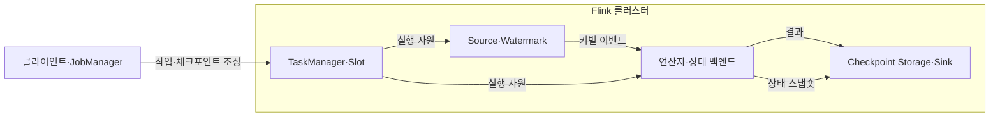
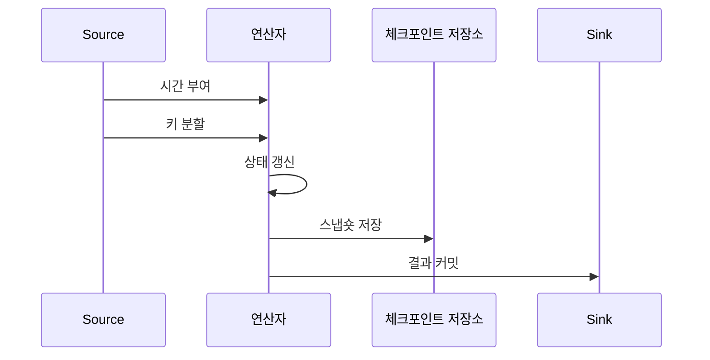

---
sidebar:
  order: 120
  label: "120. Apache Flink 스트림 처리 (Apache Flink)"
  badge:
    text: "미출제 · 50%"
    variant: note
title: "Apache Flink 스트림 처리 (Apache Flink)"
date: "2026-07-25T11:10:00+09:00"
tags:
  - "notes-software"
weight: 120
extra:
  question_no: "120"
  source_status: "미출제"
  source_history: ""
  priority: 50
  priority_note: "Flink 상태·이벤트시간 스트림 처리 현안"
---

## 미리 알고가기

- **아파치 플링크(Apache Flink)**: 이벤트 시간과 분산 상태를 중심으로 연속 데이터 흐름을 처리하는 스트림 처리 엔진임
- **이벤트 시간(Event Time)**: 이벤트가 발생한 시각이며 처리 서버의 현재 시각과 구분됨
- **워터마크(Watermark)**: 이벤트 시간이 특정 시점까지 진행됐음을 알리는 표식임
- **키별 상태(Keyed State)**: 같은 키의 이벤트가 공유하며 키 그룹에 따라 병렬 연산자에 분할되는 상태임
- **체크포인트(Checkpoint)**: 장애 복구를 위해 소스 위치와 연산자 상태를 일관된 시점으로 자동 저장한 스냅숏임
- **세이브포인트(Savepoint)**: 중지·재개·업그레이드·병렬도 변경을 위해 운영자가 생성하는 실행 상태 이미지임
- **역압력(Backpressure)**: 하위 연산자의 처리 지연이 상위 연산자의 전송 속도를 제한하는 상태임
- **상태 백엔드(State Backend)**: 실행 중 상태를 보관하고 체크포인트·세이브포인트용 스냅숏을 만드는 구성요소임
- **잡매니저(JobManager)**: 작업 스케줄링·체크포인트·장애 복구를 조정하는 프로세스임
- **태스크매니저(TaskManager)**: 연산자 서브태스크를 실행하고 슬롯·상태·데이터 교환을 담당하는 프로세스임
- **슬롯(Slot)**: TaskManager의 자원을 병렬 서브태스크에 할당하는 논리 단위임
- **연산자(Operator)**: 입력 이벤트에 필터·변환·집계 등의 계산을 수행하는 처리 단계임
- **체크포인트 장벽(Checkpoint Barrier)**: 스트림을 따라 이동하며 같은 체크포인트에 포함될 이벤트 경계를 표시하는 제어 레코드임
- **싱크(Sink)**: 처리 결과를 데이터베이스·파일·메시지 시스템 등 외부 저장소에 내보내는 연산자임
- **스파크 구조적 스트리밍(Spark Structured Streaming)**: 데이터프레임과 SQL 실행 엔진으로 연속 입력을 증분 처리하는 Spark 기반 스트림 엔진이며 Flink의 비교 대상임
- **구조적 질의 언어(Structured Query Language, SQL)**: 영문 첫 글자를 딴 SQL을 '에스큐엘'로 읽으며 Spark 스트리밍의 선언형 변환을 표현함

## Ⅰ. 개요

- **정의/개념**: 이벤트 시간과 분산 상태로 스트림을 처리한다
- **배경/필요성**: 지연 이벤트 순서와 장애 상태를 복구한다

### 쉽게 이해하기 (학습용)
- 뒤섞인 이벤트를 발생 시간과 키별 상태로 연속 처리하는 스트림 엔진임

## Ⅱ. 특징

- 키 분할·연산자 체인은 처리량을 병렬로 늘린다
- 워터마크는 윈도를 닫아 상태 무한 증가를 막는다
- 상태 백엔드는 키 상태를 보존해 장애 결과를 복구한다
- 장벽은 소스 위치·상태를 맞춰 중복 결과를 막는다
- 역압력은 입력을 늦춰 메모리 고갈과 유실을 막는다
- 체크포인트는 복구, 세이브포인트는 변경에 사용한다

### 쉽게 이해하기 (학습용)
- 낮은 지연을 제공하지만 워터마크와 상태 및 체크포인트 비용을 관리해야 함

## Ⅲ. 아키텍처 및 구성요소

| 설계 요소 | 설명 |
|:---|:---|
| 클라이언트·JobManager | 작업 제출·스케줄링·복구 조정 |
| TaskManager·Slot | 서브태스크 실행 자원과 데이터 교환 |
| Source·Watermark | 이벤트·발생 시각·시간 진행 생성 |
| 연산자·상태 백엔드 | 키별 연산과 작업 상태 관리 |
| Checkpoint Storage·Sink | 상태 스냅숏 저장·결과 반영 |

> 요약: 관리자가 작업을 조정하고 연산자는 워터마크와 키별 상태로 계산함

### 쉽게 이해하기 (학습용)
- 작업 관리자와 실행 슬롯 및 상태와 복구 사진 저장소로 구성됨

## Ⅳ. 원리 및 절차 흐름도

| 절차 | 설명 |
|:---|:---|
| 시간 부여 | 발생 시각을 추출하고 워터마크 전달 |
| 키 분할 | 같은 키를 동일 병렬 연산자에 전달 |
| 상태 갱신 | 워터마크에 따라 상태·윈도 갱신 |
| 스냅숏 저장 | 소스 위치·연산자 상태를 함께 저장 |
| 결과 커밋 | 체크포인트와 연계해 싱크에 반영 |

> 요약: 키별 상태·복구 결과를 함께 확정

### 쉽게 이해하기 (학습용)
- 이벤트 시각을 부여해 키별 상태를 갱신하고 결과를 확정함

## Ⅴ. 종류 및 비교

| 판단 기준 | Apache Flink | Spark Structured Streaming |
|:---|:---|:---|
| 핵심 특징 | 이벤트를 연속 데이터 흐름으로 처리함 | 기본적으로 입력을 작은 배치로 증분 처리함 |
| 적용 기준 | 저지연 이벤트 시간·상태 처리 | 배치·SQL과 통합된 스트림 분석 |
| 주요 위험 | 상태 크기·체크포인트·역압력 병목 | 배치 간 지연·상태 갱신 비용 |

> 요약: Flink는 연속 처리, Spark는 증분 배치가 중심이다

### 쉽게 이해하기 (학습용)
- Flink는 이벤트를 계속 흘려 처리하고 Spark는 작은 묶음으로 나눠 처리함

## Ⅵ. 실무 사례

1. 계정 상태·워터마크로 지연 거래를 처리한다
2. 체크포인트로 변경 상태·소스 위치를 복구한다

### 쉽게 이해하기 (학습용)
- 거래 탐지는 계정별 상태와 워터마크를 적용하고 늦은 이벤트 비율·처리 지연·역압력 시간을 함께 확인함
- 변경 집계는 체크포인트 크기와 소요 시간, 장애 후 복구 시간을 측정해 상태 증가가 복구 목표를 해치지 않는지 검증함

## Ⅶ. 결론

- 지연 허용·상태 크기로 워터마크와 저장 주기를 정한다

### 쉽게 이해하기 (학습용)
- 늦은 이벤트를 기다릴 시간과 복구할 상태 크기에 맞춰 저장 주기를 정함
