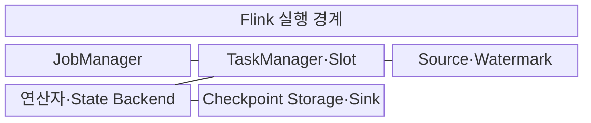
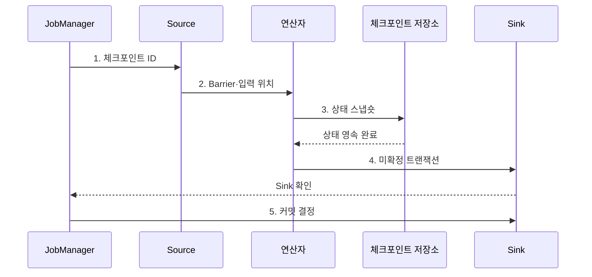

---
sidebar:
  order: 120
  label: "120. Apache Flink 스트림 처리 (Apache Flink)"
  badge:
    text: "미출 · 50%"
    variant: note
title: "Apache Flink 스트림 처리 (Apache Flink)"
date: "2026-08-02T12:00:00+09:00"
tags:
  - "notes-software"
weight: 120
extra:
  question_no: "120"
  source_status: "미출"
  source_history: ""
  priority: 50
  priority_note: "Flink 상태·이벤트시간 스트림 처리 현안"
---

## Ⅰ. 개요

핵심 용어

- **스트림 처리 엔진**: 이벤트 시간과 분산 상태를 이용해 연속 데이터 흐름을 처리하는 엔진이다.

- 정의/개념: 이벤트 시간과 분산 상태로 연속 흐름을 처리하는 **스트림 처리 엔진**
- 배경/필요성: 처리 시각 기준 집계는 늦은 이벤트의 **시간 창 반영 불가**

### 쉽게 이해하기 (학습용)
- 뒤섞인 이벤트를 발생 시간과 키별 상태로 연속 처리하는 스트림 엔진이다.

## Ⅱ. 특징

핵심 용어

- **일관 복구**: 체크포인트 장벽으로 소스 위치·연산자 상태·출력 경계를 같은 시점에 저장하는 특성이다.

- **이벤트 시간**: Watermark로 완료 기준 결정
- **키별 상태**: 같은 키의 누적 상태 관리
- **일관 복구**: Barrier·Checkpoint로 경계 저장

### 쉽게 이해하기 (학습용)
- 낮은 지연을 제공하지만 워터마크와 상태 및 체크포인트 비용을 관리해야 한다.

## Ⅲ. 구조 및 구성요소

핵심 용어

- **연산자·State Backend**: 키별 계산 상태를 보관하고 복구용 스냅숏을 만드는 구성요소이다.

| 구성요소 | 책임 |
|:---|:---|
| JobManager | **스케줄·복구** 조정 |
| TaskManager·Slot | **서브태스크·데이터 교환** 실행 |
| Source·Watermark | **이벤트·시간 표식** 생성 |
| 연산자·State Backend | **키 계산·상태 스냅숏** |
| Checkpoint Storage·Sink | **복구 이미지·결과** 보존 |

### 쉽게 이해하기 (학습용)

- 작업 관리자, 실행자, 시간표, 상태 계산자, 복구·출력 저장소로 구성된다.

## Ⅳ. 흐름도

핵심 용어

- **3. 상태 스냅숏**: 연산자가 키 상태와 소스 처리 위치를 체크포인트 저장소에 기록하는 단계이다.

**동작 원리**

1. **체크포인트 ID**: JobManager가 Source에 촬영 식별자 전달
2. **Barrier·입력 위치**: Source가 연산자에 동일 처리 경계 전달
3. **상태 스냅숏**: 연산자가 키 상태와 소스 위치를 저장
4. **미확정 트랜잭션**: 연산자가 Sink에 결과를 사전 반영
5. **커밋 결정**: JobManager가 확인된 Sink 트랜잭션 확정

### 쉽게 이해하기 (학습용)

- 흐름에 사진 촬영선을 흘려 보내 입력 위치·계산 상태·출력 경계를 같은 시점으로 맞춘다.

## Ⅴ. 종류 및 비교

핵심 용어

- **Apache Flink**: 연속 저지연 처리와 세밀한 이벤트 시간·상태 관리에 적합한 스트림 엔진이다.

| 스트림 처리 엔진 | Apache Flink | Spark Structured Streaming |
|:---|:---|:---|
| 적용 기준 | **저지연·세밀한 상태** | **Spark SQL·배치 통합** |
| 핵심 특징 | **연속 흐름·Barrier 복구** | **Micro-batch·상태 재실행** |
| 한계 | **상태·역압력 병목** | **배치 지연·셔플 비용** |

### 쉽게 이해하기 (학습용)

- Flink는 흐르는 사건을 계속 처리하고 Spark는 기본적으로 작은 묶음의 연속으로 처리한다.

## Ⅵ. 실무 고려사항 및 대책

핵심 용어

- **만료 없는 키·윈도 상태가 계속 누적**: 상태 보존 기한이 없어 저장 공간과 체크포인트 크기가 계속 증가하는 문제이다.

| 문제 | 대책 | 효과 |
|:---|:---|:---|
| 허용 지연이 실제 도착 분포보다 짧음 | 지연 분포·허용시간으로 설정 | **지연 이벤트 누락·상태 증가** 통제 |
| 만료 없는 키·윈도 상태가 계속 누적 | TTL·윈도·키 분포 조정 | **저장 폭증** 방지 |
| 스냅숏 시간이 주기보다 길어 중첩 | 지속시간·실패율·I/O 감시 | **체크포인트 병목** 완화 |
| 느린 연산자·Sink가 상류 전송 제한 | 병목 연산자·Sink 분석 | **전체 지연 원인** 제거 |
| 연산자 UID 변경으로 상태 연결 실패 | UID·호환성·복원 리허설 | **업그레이드 실패** 방지 |

### 쉽게 이해하기 (학습용)

- 늦은 거래를 기다리는 시간과 그동안 쌓이는 계정 상태의 크기를 함께 정해야 한다.

## Ⅶ. 결론

핵심 용어

- **Structured Streaming**: Spark SQL과 배치 처리를 통합해 연속 입력을 증분 처리할 때 선택하는 방식이다.

- 연속 저지연·세밀한 상태는 **Flink**, 배치 통합은 **Structured Streaming** 선택

### 쉽게 이해하기 (학습용)

- 얼마나 늦게까지 기다리고 얼마만큼의 상태를 어떻게 복구할지 정하는 스트림 엔진이다.
