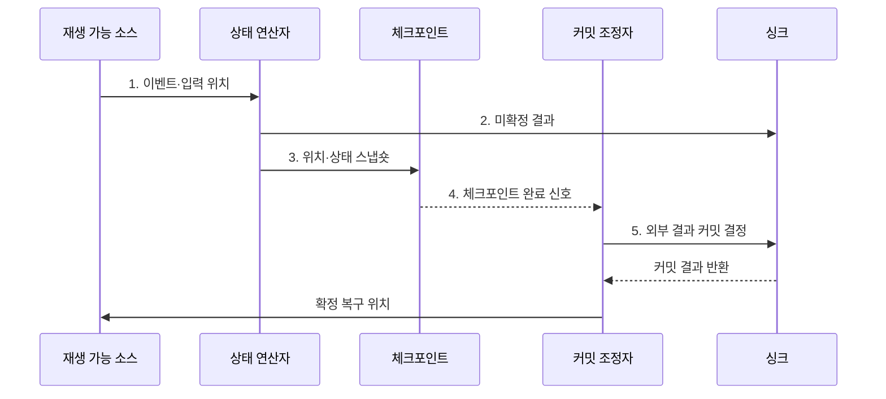

---
sidebar:
  order: 121
  label: "121. 정확히 한 번 처리 Exactly-Once (Exactly-Once Semantics)"
  badge:
    text: "미출 · 50%"
    variant: note
title: "정확히 한 번 처리 Exactly-Once (Exactly-Once Semantics)"
date: "2026-07-30T23:40:55+09:00"
tags:
  - "notes-software"
weight: 121
extra:
  question_no: "121"
  source_status: "미출"
  source_history: ""
  priority: 50
  priority_note: "Exactly-once는 중복 방지·커밋 설계 핵심"
---

## 미리 알고가기

- **최대 한 번(At-most-once)**: 이벤트 결과가 한 번 이하로 반영되어 장애 시 손실될 수 있는 처리 보장이다.
- **최소 한 번(At-least-once)**: 이벤트를 재시도해 결과가 한 번 이상 반영되므로 중복될 수 있는 처리 보장이다.
- **정확히 한 번(Exactly-once)**: 장애·재시도 뒤에도 각 이벤트의 논리적 결과가 한 번만 반영되는 처리 보장이다.
- **재생 가능한 소스(Replayable Source)**: 마지막 확정 입력 위치부터 이벤트를 다시 제공할 수 있는 데이터 원천이다.
- **상태 연산자(Stateful Operator)**: 이벤트를 처리하면서 키별 누적값이나 진행 상태를 유지하는 연산 단계이다.
- **체크포인트(Checkpoint)**: 입력 위치와 연산 상태를 일관된 복구 시점으로 저장한 스냅숏이다.
- **싱크(Sink)**: 처리 결과를 데이터베이스·파일·메시지 시스템 등에 기록하는 출력 대상이다.
- **멱등 연산(Idempotent Operation)**: 같은 요청을 여러 번 수행해도 최종 상태가 한 번 수행한 결과와 같은 연산이다.
- **멱등 키(Idempotency Key)**: 같은 논리 요청의 재시도를 식별해 중복 반영을 거부하거나 재사용하게 하는 키이다.
- **2단계 커밋(Two-phase Commit, 2PC)**: 준비와 확정 단계를 나눠 여러 자원의 커밋 결과를 일치시키는 분산 트랜잭션 규약이다.
- **트랜잭셔널 아웃박스(Transactional Outbox)**: 업무 상태와 전송할 이벤트를 같은 트랜잭션에 기록한 뒤 별도 전달기가 이벤트를 발행하는 패턴이다.
- **결정적 연산(Deterministic Operation)**: 같은 입력과 상태에서 실행할 때마다 같은 결과를 산출하는 연산이다.

## Ⅰ. 개요

- 정의/개념: 재시도에도 이벤트의 **논리적 결과**를 한 번만 반영하는 **처리 보장**
- 배경/필요성: 재시도만으로는 장애 구간의 **결과 중복·누락** 방지 불가

### 쉽게 이해하기 (학습용)
- 이벤트를 다시 읽더라도 장부에는 한 번 반영된 효과를 만듦

## Ⅱ. 특징

- 실행 횟수와 **논리적 결과** 반영 횟수 분리
- 확정된 입력 위치·상태부터 **재생 복구**
- 소스·상태·싱크의 **원자 커밋** 연결

### 쉽게 이해하기 (학습용)
- 정확히 한 번은 내부 함수 호출 횟수가 아니라 재시도 뒤 최종 장부에 남는 논리적 효과가 한 번임을 뜻함

## Ⅲ. 구조 및 구성요소

| 구성요소 | 책임 |
|:---|:---|
| 재생 가능 소스 | 이벤트와 **확정 입력 위치** 보존 |
| 상태 연산자 | 키별 **연산 상태·결과** 계산 |
| 체크포인트 | 입력 위치·상태의 **일관된 복구점** 저장 |
| 커밋 조정자 | 상태와 외부 결과의 **원자적 확정** 조정 |
| 트랜잭션·멱등 싱크 | 재시도에도 **결과 한 번 반영** |

### 쉽게 이해하기 (학습용)

- 재생 원본, 계산 상태, 복구 사진, 확정 관리자, 중복 방지 장부로 구성된다.

## Ⅳ. 흐름도

**동작 원리**

1. **이벤트·입력 위치**: 처리 결과와 재생 시작점을 같은 논리 경계에 연결
2. **미확정 결과**: 외부 결과를 확정 전 트랜잭션 영역에 기록
3. **위치·상태 스냅숏**: 입력 위치와 연산 상태를 동일 복구점에 영속화
4. **체크포인트 완료 신호**: 모든 연산자의 복구점 저장 성공 확인
5. **외부 결과 커밋 결정**: 체크포인트 성공 구간의 결과만 원자적으로 확정

### 쉽게 이해하기 (학습용)

- 읽던 위치와 계산 상태의 사진이 안전하게 저장된 뒤 그 구간의 외부 결과를 확정한다.

## Ⅴ. 종류 및 비교

| 처리 보장 | Exactly-Once | At-Least-Once | At-Most-Once |
|:---|:---|:---|:---|
| 적용 기준 | **중복·누락**을 모두 통제할 때 | 누락 방지·**중복 허용** 시 | 중복 방지·**누락 허용** 시 |
| 핵심 특징 | 재생과 **원자 커밋** 결합 | 성공까지 **재시도** | 실패 시 **재시도 생략** |
| 한계 | **체크포인트·멱등성** 비용 | **중복 제거·보상** 비용 | 장애 구간의 **데이터 손실** |

### 쉽게 이해하기 (학습용)

- 다시 실행해도 장부 효과가 한 번만 남도록 입력·계산·출력의 확정을 묶는다.

## Ⅵ. 실무 고려사항 및 대책

| 고려사항 | 대책 | 효과 |
|:---|:---|:---|
| 일부 구성요소만 보장하면 종단에서 **중복 결과** 발생 | 소스·상태·싱크의 **원자 경계** 명시 | **종단 처리 보장** 범위 오해 방지 |
| 업무 식별자가 바뀌면 재시도 **중복 식별** 실패 | 안정적인 **멱등 키** 전달 | **중복 결과 반영** 방지 |
| 상태와 외부 출력의 커밋 시점 차이로 **부분 확정** | **2PC·트랜잭셔널 아웃박스**로 결과 확정 | 실패 시 **상태·출력 일관성** 유지 |
| 비결정적 연산은 재생 시 **결과 불일치** 발생 | **결정값 기록·결정적 연산** 적용 | **재생 결과 일관성** 확보 |

### 쉽게 이해하기 (학습용)

- 같은 결제 번호가 다시 와도 새 거래로 세지 않고 처음 결과를 재사용한다.

## Ⅶ. 결론

- 중복·손실 비용이 모두 크면 **원자 커밋** 가능 범위에 **Exactly-once** 적용

### 쉽게 이해하기 (학습용)

- 몇 번 다시 실행됐는지가 아니라 최종 장부에 몇 번 반영됐는지가 기준이다.
