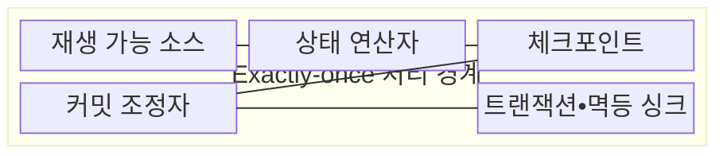
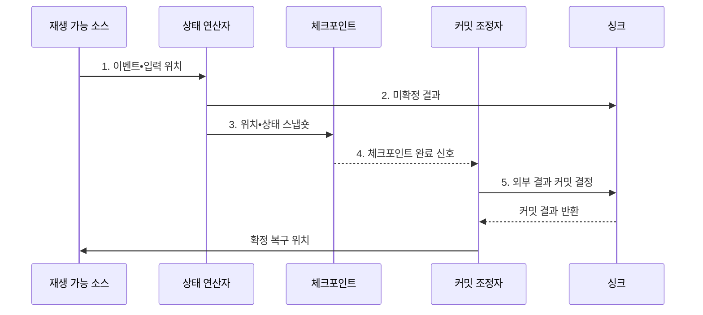

---
sidebar:
  order: 121
  label: "121. 정확히 한 번 처리 Exactly-Once (Exactly-Once Semantics)"
  badge:
    text: "미출 • 50%"
    variant: note
title: "정확히 한 번 처리 Exactly-Once (Exactly-Once Semantics)"
date: "2026-08-04T13:21:00+09:00"
tags:
  - "notes-software"
weight: 121
extra:
  question_no: "121"
  source_status: "미출"
  source_history: ""
  priority: 50
  priority_note: "Exactly-once는 중복 방지•커밋 설계 핵심"
---

## Ⅰ. 개요

핵심 용어

- **정확히 한 번 처리(Exactly-Once Semantics)**: 장애와 재시도 뒤에도 이벤트의 논리적 결과를 한 번만 반영하도록 하는 처리 보장이다.

- 정의/개념: 재시도에도 이벤트의 **논리적 결과** 를 한 번만 반영하는 **처리 보장**
- 배경/필요성: 재시도만으로는 장애 구간의 **결과 중복•누락** 방지 불가

#### 한줄 요약
- 이벤트를 다시 읽더라도 장부에는 한 번 반영된 효과를 만듦

## Ⅱ. 특징

핵심 용어

- **재생 복구**: 확정된 입력 위치와 연산 상태부터 이벤트를 다시 처리해 결과를 복원하는 특성이다.
- **논리적 결과**: 실제 함수 실행 횟수와 관계없이 최종 장부에 반영되는 업무 효과이다.
- **원자 커밋**: 소스 입력 위치와 연산 상태 및 외부 결과를 모두 함께 확정하거나 취소하는 방식이다.

- 실행 횟수와 **논리적 결과** 반영 횟수 분리
- 확정된 입력 위치•상태부터 **재생 복구**
- 소스•상태•싱크의 **원자 커밋** 연결

#### 한줄 요약
- 정확히 한 번은 내부 함수 호출 횟수가 아니라 재시도 뒤 최종 장부에 남는 논리적 효과가 한 번임을 뜻함

## Ⅲ. 구조 및 구성요소

핵심 용어

- **체크포인트**: 입력 위치와 연산 상태를 하나의 일관된 복구점으로 저장하는 구성요소이다.
- **재생 가능 소스**: 이벤트와 확정 입력 위치를 보존해 장애 뒤 같은 구간을 다시 읽을 수 있는 입력이다.
- **상태 연산자**: 키별 계산 상태와 결과를 유지하는 처리 구성요소이다.
- **커밋 조정자**: 체크포인트 완료와 외부 결과의 원자적 확정을 조정하는 구성요소이다.
- **트랜잭션 싱크**: 체크포인트 완료 뒤 외부 결과를 원자 확정하는 출력 대상이다.
- **멱등 싱크**: 재시도에도 같은 결과를 한 번만 반영하는 출력 대상이다.

| 구성요소 | 책임 |
|:---|:---|
| 재생 가능 소스 | 이벤트와 **확정 입력 위치** 보존 |
| 상태 연산자 | 키별 **연산 상태•결과** 계산 |
| 체크포인트 | 입력 위치•상태의 **일관된 복구점** 저장 |
| 커밋 조정자 | 상태와 외부 결과의 **원자적 확정** 조정 |
| 트랜잭션•멱등 싱크 | 재시도에도 **결과 한 번 반영** |

#### 한줄 요약

- 재생 원본, 계산 상태, 복구 사진, 확정 관리자, 중복 방지 장부로 구성된다.

## Ⅳ. 흐름도

핵심 용어

- **5. 외부 결과 커밋 결정**: 체크포인트가 성공한 처리 구간의 결과만 원자적으로 확정하는 단계이다.
- **1. 이벤트•입력 위치**: 처리할 사건과 장애 복구 시 다시 읽을 위치를 연결한 입력이다.
- **2. 미확정 결과**: 체크포인트 성공 전까지 외부 트랜잭션 영역에만 기록한 출력이다.
- **3. 위치•상태 스냅숏**: 입력 위치와 연산 상태를 동일 복구점으로 영속화한 자료이다.
- **4. 체크포인트 완료 신호**: 모든 연산자의 복구점 저장이 성공했음을 커밋 조정자에 알리는 신호이다.

**동작 원리**

1. **이벤트•입력 위치**: 처리 결과와 재생 시작점을 같은 논리 경계에 연결
2. **미확정 결과**: 외부 결과를 확정 전 트랜잭션 영역에 기록
3. **위치•상태 스냅숏**: 입력 위치와 연산 상태를 동일 복구점에 영속화
4. **체크포인트 완료 신호**: 모든 연산자의 복구점 저장 성공 확인
5. **외부 결과 커밋 결정**: 체크포인트 성공 구간의 결과만 원자적으로 확정

#### 한줄 요약

- 읽던 위치와 계산 상태의 사진이 안전하게 저장된 뒤 그 구간의 외부 결과를 확정한다.

## Ⅴ. 종류 및 비교

핵심 용어

- **최소 한 번 처리(At-Least-Once)**: 성공할 때까지 재시도해 누락을 막지만 중복 처리를 허용하는 보장이다.
- **최대 한 번 처리(At-Most-Once)**: 실패 시 재시도하지 않아 중복을 막지만 장애 구간의 누락을 허용하는 보장이다.

| 처리 보장 | 정확히 한 번 처리 | 최소 한 번 처리 | 최대 한 번 처리 |
|:---|:---|:---|:---|
| 적용 기준 | **중복•누락** 을 모두 통제할 때 | 누락 방지•**중복 허용** 시 | 중복 방지•**누락 허용** 시 |
| 핵심 특징 | 재생과 **원자 커밋** 결합 | 성공까지 **재시도** | 실패 시 **재시도 생략** |
| 한계 | **체크포인트•멱등성** 비용 | **중복 제거•보상** 비용 | 장애 구간의 **데이터 손실** |

#### 한줄 요약

- 다시 실행해도 장부 효과가 한 번만 남도록 입력•계산•출력의 확정을 묶는다.

## Ⅵ. 실무 고려사항 및 대책

핵심 용어

- **부분 확정**: 내부 상태만 확정되거나 외부 결과만 기록돼 종단 결과가 불일치하는 문제이다.
- **원자 경계**: 소스 위치•연산 상태•싱크 결과 가운데 처리 보장에 포함할 범위를 명시한 경계이다.
- **멱등 키**: 같은 업무 요청의 재시도를 동일 작업으로 식별해 중복 효과를 막는 안정적인 키이다.
- **2단계 커밋(Two-Phase Commit, 2PC)**: 참여자의 준비와 확정 단계를 조정하는 원자 커밋 방식이다.
- **트랜잭셔널 아웃박스**: 업무 변경과 발행 레코드를 한 거래에 저장하는 방식이다.
- **결정값 기록**: 현재 시각과 난수 같은 값을 원본에 남기는 재생 통제이다.
- **결정적 연산**: 같은 입력에서 항상 같은 출력을 만드는 연산이다.

| 문제 | 대책 | 효과 |
|:---|:---|:---|
| 일부 구성요소만 보장하면 종단에서 **중복 결과** 발생 | 소스•상태•싱크의 **원자 경계** 명시 | **종단 처리 보장** 범위 오해 방지 |
| 업무 식별자가 바뀌면 재시도 **중복 식별** 실패 | 안정적인 **멱등 키** 전달 | **중복 결과 반영** 방지 |
| 상태와 외부 출력의 커밋 시점 차이로 **부분 확정** | **2PC•트랜잭셔널 아웃박스** 기반 결과 확정 | 실패 시 **상태•출력 일관성** 유지 |
| 비결정적 연산은 재생 시 **결과 불일치** 발생 | **결정값 기록•결정적 연산** 적용 | **재생 결과 일관성** 확보 |

#### 한줄 요약

- 같은 결제 번호가 다시 와도 새 거래로 세지 않고 처음 결과를 재사용한다.

## Ⅶ. 결론

핵심 용어

- **적용 기준**: 중복•손실 비용과 원자 커밋 가능 범위의 비교 축이다.

- 중복•손실 비용이 모두 크면 **원자 커밋** 범위에 **정확히 한 번 처리** 적용

#### 한줄 요약

- 몇 번 다시 실행됐는지가 아니라 최종 장부에 몇 번 반영됐는지가 기준이다.
