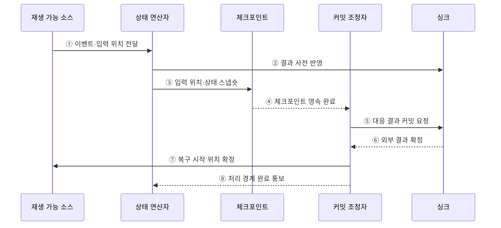

---
sidebar:
  order: 121
  label: "121. 정확히 한 번 처리 Exactly-Once (Exactly-Once Semantics)"
  badge:
    text: "미출제 · 50%"
    variant: note
title: "정확히 한 번 처리 Exactly-Once (Exactly-Once Semantics)"
date: "2026-07-25T11:12:00+09:00"
tags:
  - "notes-software"
weight: 121
extra:
  question_no: "121"
  source_status: "미출제"
  source_history: ""
  priority: 50
  priority_note: "Exactly-once는 중복 방지·커밋 설계 핵심"
---

## 미리 알고가기

- **최대 한 번(At-most-once)**: 이벤트 결과가 한 번 이하로 반영되어 장애 시 손실될 수 있는 처리 보장임
- **최소 한 번(At-least-once)**: 이벤트를 재시도해 결과가 한 번 이상 반영되므로 중복될 수 있는 처리 보장임
- **정확히 한 번(Exactly-once)**: 장애·재시도 뒤에도 각 이벤트의 논리적 결과가 한 번만 반영되는 처리 보장임
- **재생 가능한 소스(Replayable Source)**: 마지막 확정 입력 위치부터 이벤트를 다시 제공할 수 있는 데이터 원천임
- **상태 연산자(Stateful Operator)**: 이벤트를 처리하면서 키별 누적값이나 진행 상태를 유지하는 연산 단계임
- **체크포인트(Checkpoint)**: 입력 위치와 연산 상태를 일관된 복구 시점으로 저장한 스냅숏임
- **싱크(Sink)**: 처리 결과를 데이터베이스·파일·메시지 시스템 등에 기록하는 출력 대상임
- **멱등 연산(Idempotent Operation)**: 같은 요청을 여러 번 수행해도 최종 상태가 한 번 수행한 결과와 같은 연산임
- **멱등 키(Idempotency Key)**: 같은 논리 요청의 재시도를 식별해 중복 반영을 거부하거나 재사용하게 하는 키임
- **2단계 커밋(Two-phase Commit, 2PC)**: 단계 수 2와 영문 첫 글자를 합친 2PC를 '투피시'로 읽으며 준비·확정 단계로 외부 결과의 커밋을 조정함

## Ⅰ. 개요

- Exactly-once는 장애와 재시도로 이벤트가 여러 번 실행될 수 있어도 최종 시스템에 남는 **논리적 효과를 한 번**으로 만드는 처리 의미이다.
- 재생 가능한 입력·일관된 상태 복구·트랜잭션 또는 멱등 Sink를 하나의 커밋 경계로 연결해야 한다.

### 쉽게 이해하기 (학습용)
- 이벤트를 다시 읽더라도 장부에는 한 번 반영된 효과를 만듦

## Ⅱ. 특징

- **논리적 보장**: 사용자 코드나 네트워크 전송 횟수가 아니라 외부 결과의 한 번 반영을 뜻한다.
- **재생과 복구**: 실패 시 확정 입력 위치와 연산자 상태로 돌아가 다시 처리한다.
- **출력 조정**: Checkpoint 완료와 Sink 커밋을 원자적으로 연계하거나 멱등 키로 중복을 제거한다.
- **종단 보장**: Source·처리 엔진·Sink 중 하나라도 요구 조건을 지키지 못하면 전체 Exactly-once는 성립하지 않는다.

### 쉽게 이해하기 (학습용)
- 정확히 한 번은 내부 함수 호출 횟수가 아니라 재시도 뒤 최종 장부에 남는 논리적 효과가 한 번임을 뜻함

## Ⅲ. 아키텍처 및 구성요소

**도표안 A — 구조도**

**도표안 B — sequenceDiagram**

| 구성요소 | 역할 |
|:---|:---|
| 재생 가능 Source | 이벤트와 확정 처리 위치 보존 |
| 상태 연산자 | 키별 상태와 결과 계산 |
| Checkpoint | 입력 위치·연산 상태의 일관된 복구점 저장 |
| 커밋 조정자 | Checkpoint와 외부 결과의 확정 순서 조정 |
| 트랜잭션·멱등 Sink | 완료된 처리 경계의 결과만 한 번 반영 |

**동작 원리**

- ① Source가 재생 위치와 이벤트를 상태 연산자에 전달한다.
- ② 연산자가 계산 결과를 Sink의 미확정 영역이나 멱등 경로에 기록한다.
- ③ 같은 처리 경계의 입력 위치와 연산 상태를 Checkpoint에 저장한다.
- ④ Checkpoint 저장소가 복구 이미지의 영속 완료를 조정자에 알린다.
- ⑤ 조정자가 해당 경계에 대응하는 Sink 결과의 커밋을 요청한다.
- ⑥ Sink가 외부 결과를 확정하고 중복 커밋을 차단한다.
- ⑦ 조정자가 장애 시 돌아갈 Source 위치를 확정한다.
- ⑧ 연산자에 처리 경계 완료를 알려 다음 결과를 진행한다.

### 쉽게 이해하기 (학습용)

- 읽던 위치와 계산 상태의 사진이 안전하게 저장된 뒤 그 구간의 외부 결과를 확정한다.

## Ⅳ. 종류 및 비교

| 비교 항목 | Exactly-Once | At-Least-Once | At-Most-Once |
|:---|:---|:---|:---|
| 처리 횟수 | 논리 효과 한 번 | 한 번 이상 | 한 번 이하 |
| 장애 전략 | 재생·상태 복구·중복 제거/원자 커밋 | 성공 확인 전까지 재시도 | 전달 후 즉시 확정 또는 재시도 생략 |
| 허용 결과 | 중복·누락 모두 통제 | 중복 허용, 누락 방지 | 누락 허용, 중복 방지 |
| 비용 | Checkpoint·트랜잭션·멱등 저장 | 중복 처리·보상 | 데이터 손실 |
| 적합 예 | 금액 집계·상태 전이 | 멱등 로그 수집·알림 | 손실 가능한 실시간 지표 |

> Exactly-once는 범위를 명시해야 한다. Kafka 내부 트랜잭션이 임의의 외부 HTTP API 효과까지 자동으로 한 번만 만들지는 않는다.

### 쉽게 이해하기 (학습용)

- 다시 실행해도 장부 효과가 한 번만 남도록 입력·계산·출력의 확정을 묶는다.

## Ⅴ. 실무 고려사항 및 대책

| 고려사항 | 위험 | 대책 |
|:---|:---|:---|
| 보장 범위 | 엔진 내부 보장을 종단 보장으로 오해 | Source·상태·Sink·외부 부작용 경계 명시 |
| 멱등 키 | 재시도마다 새 키를 생성 | 업무 요청에서 안정적인 고유 키 전달 |
| 상태·출력 | 상태 확정과 외부 쓰기 사이 부분 실패 | 2PC·Transactional Outbox·원자 Upsert 적용 |
| 중복 보존 | 중복 키를 너무 일찍 삭제 | 최대 재시도·재생 기간보다 길게 유지 |
| 비결정성 | 재생 시 시간·난수·외부 조회 결과 변화 | 입력에 결정값 기록·결정적 연산 사용 |
| 비용 | 불필요한 전체 Exactly-once | 업무 손실·중복 비용으로 필요한 구간만 적용 |

> **적용 사례**: 결제 집계는 결제 ID를 멱등 키로 저장하고 같은 이벤트가 재생되면 기존 처리 결과를 반환해 합계를 한 번만 증가시킨다.

### 쉽게 이해하기 (학습용)

- 같은 결제 번호가 다시 와도 새 거래로 세지 않고 처음 결과를 재사용한다.

## Ⅵ. 결론

- Exactly-once는 물리 실행 횟수가 아니라 장애 후에도 최종 논리 효과를 한 번으로 만드는 종단 처리 보장이다.
- 재생·Checkpoint·커밋·멱등성의 범위와 실패 지점을 실제 Sink까지 검증해야 한다.

### 쉽게 이해하기 (학습용)

- 몇 번 다시 실행됐는지가 아니라 최종 장부에 몇 번 반영됐는지가 기준이다.
