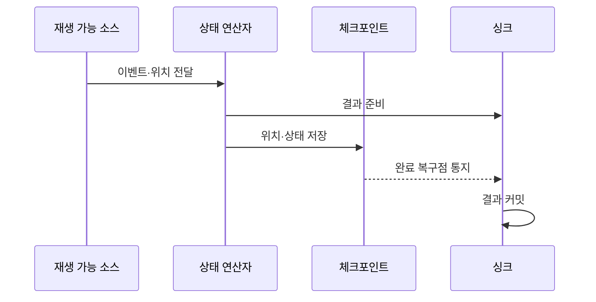

---
sidebar:
  order: 121
  label: "121. 정확히 한 번 처리 Exactly-Once (Exactly-Once Semantics)"
  badge:
    text: "미출제 · 50%"
    variant: note
title: "정확히 한 번 처리 Exactly-Once (Exactly-Once Semantics)"
date: "2026-07-25T11:12:00+09:00"
tags:
  - "notes-software"
weight: 121
extra:
  question_no: "121"
  source_status: "미출제"
  source_history: ""
  priority: 50
  priority_note: "Exactly-once는 중복 방지·커밋 설계 핵심"
---

## 미리 알고가기

- **최대 한 번(At-most-once)**: 이벤트 결과가 한 번 이하로 반영되어 장애 시 손실될 수 있는 처리 보장임
- **최소 한 번(At-least-once)**: 이벤트를 재시도해 결과가 한 번 이상 반영되므로 중복될 수 있는 처리 보장임
- **정확히 한 번(Exactly-once)**: 장애·재시도 뒤에도 각 이벤트의 논리적 결과가 한 번만 반영되는 처리 보장임
- **재생 가능한 소스(Replayable Source)**: 마지막 확정 입력 위치부터 이벤트를 다시 제공할 수 있는 데이터 원천임
- **상태 연산자(Stateful Operator)**: 이벤트를 처리하면서 키별 누적값이나 진행 상태를 유지하는 연산 단계임
- **체크포인트(Checkpoint)**: 입력 위치와 연산 상태를 일관된 복구 시점으로 저장한 스냅숏임
- **싱크(Sink)**: 처리 결과를 데이터베이스·파일·메시지 시스템 등에 기록하는 출력 대상임
- **멱등 연산(Idempotent Operation)**: 같은 요청을 여러 번 수행해도 최종 상태가 한 번 수행한 결과와 같은 연산임
- **멱등 키(Idempotency Key)**: 같은 논리 요청의 재시도를 식별해 중복 반영을 거부하거나 재사용하게 하는 키임
- **2단계 커밋(Two-phase Commit, 2PC)**: 단계 수 2와 영문 첫 글자를 합친 2PC를 '투피시'로 읽으며 준비·확정 단계로 외부 결과의 커밋을 조정함

## Ⅰ. 개요

- 정의/개념: 장애·재시도에도 결과를 한 번만 반영한다
- **배경/필요성**: 입력·상태·출력의 중복과 누락을 막는다

### 쉽게 이해하기 (학습용)
- 이벤트를 다시 읽더라도 장부에는 한 번 반영된 효과를 만듦

## Ⅱ. 특징

- 입력·상태·출력을 한 경계로 묶어 부분 반영을 막는다
- 재생 입력은 실패 구간을 다시 처리해 누락을 없앤다
- 완료 체크포인트의 출력만 커밋해 중복을 막는다
- 싱크가 원자성을 못 지키면 정확히 한 번이 깨진다

### 쉽게 이해하기 (학습용)
- 정확히 한 번은 내부 함수 호출 횟수가 아니라 재시도 뒤 최종 장부에 남는 논리적 효과가 한 번임을 뜻함

## Ⅲ. 아키텍처 및 구성요소

| 설계 요소 | 설명 |
|:---|:---|
| 재생 가능 소스 | 이벤트·처리 위치를 보존해 실패 구간 재생 |
| 상태 연산자 | 이벤트 처리 상태를 체크포인트에 포함 |
| 체크포인트 | 입력 위치·연산 상태를 같은 복구점에 저장 |
| 트랜잭션·멱등 싱크 | 완료 복구점의 결과만 한 번 반영 |

> 요약: 입력·상태·출력을 같은 복구 경계로 결합한다

### 쉽게 이해하기 (학습용)
- 입력을 다시 읽을 위치와 처리 상태 및 외부 결과를 하나의 복구 지점으로 묶는다

## Ⅳ. 원리 및 절차 흐름도

| 절차 | 설명 |
|:---|:---|
| 이벤트·위치 전달 | 재생 위치와 이벤트를 함께 전달 |
| 결과 준비 | 외부 결과를 미확정 상태로 저장 |
| 위치·상태 저장 | 입력 위치와 연산 상태를 함께 저장 |
| 완료 복구점 통지 | 스냅샷 완료를 싱크에 전달 |
| 결과 커밋 | 완료 복구점에 대응하는 결과만 확정 |

> 요약: 스냅샷 뒤 싱크를 커밋해 한 번의 효과를 만든다

### 쉽게 이해하기 (학습용)
- 입력 위치와 상태 사진을 확정한 뒤 외부 결과를 커밋함

## Ⅴ. 종류 및 비교

| 판단 기준 | Exactly-Once | At-Least-Once | At-Most-Once |
|:---|:---|:---|:---|
| 핵심 특징 | 논리적 결과를 한 번만 반영함 | 재시도로 한 번 이상 반영함 | 재시도하지 않아 한 번 이하 반영함 |
| 적용 기준 | 중복·손실을 모두 허용하지 않음 | 중복 처리가 가능하고 손실은 허용하지 않음 | 손실을 허용하고 최소 지연을 우선함 |
| 주요 위험 | 체크포인트·커밋 조정 비용 | 재시도에 따른 결과 중복 | 장애 시 이벤트 손실 |

> 요약: 재생 입력과 스냅샷 및 멱등 싱크로 중복과 손실을 통제함

### 쉽게 이해하기 (학습용)
- 정확히 한 번은 입력 재생·상태 복구·싱크 원자성의 지연과 저장 비용을 허용할 때 적용함

## Ⅵ. 실무 사례

1. 결제 집계는 멱등 키로 중복 반영을 제거함

### 쉽게 이해하기 (학습용)
- 결제 집계는 같은 결제 키가 다시 와도 기존 결과를 재사용해 장부 증가가 한 번만 일어나게 함

## Ⅶ. 결론

- 중복·손실 불허 시 종단 싱크 원자성까지 검증한다

### 쉽게 이해하기 (학습용)
- 정확히 한 번 처리는 엔진 내부가 아니라 최종 싱크까지 입력·상태·출력의 원자적 복구 경계를 검증해야 성립함
