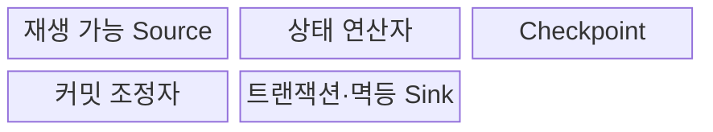
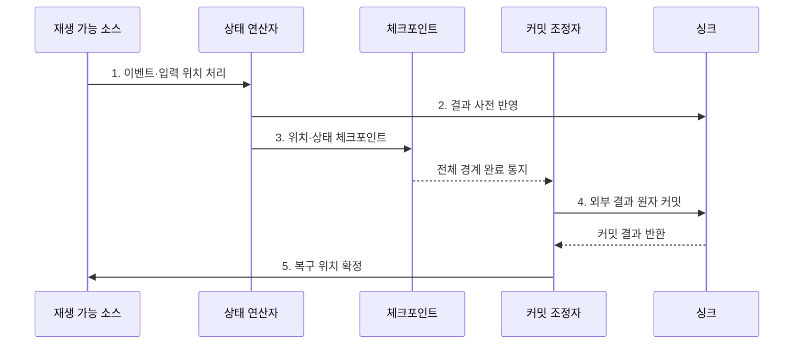

---
sidebar:
  order: 121
  label: "121. 정확히 한 번 처리 Exactly-Once (Exactly-Once Semantics)"
  badge:
    text: "미출제 · 50%"
    variant: note
title: "정확히 한 번 처리 Exactly-Once (Exactly-Once Semantics)"
date: "2026-07-30T20:00:00+09:00"
tags:
  - "notes-software"
weight: 121
extra:
  question_no: "121"
  source_status: "미출제"
  source_history: ""
  priority: 50
  priority_note: "Exactly-once는 중복 방지·커밋 설계 핵심"
---

## 미리 알고가기

- **최대 한 번(At-most-once)**: 이벤트 결과가 한 번 이하로 반영되어 장애 시 손실될 수 있는 처리 보장이다.
- **최소 한 번(At-least-once)**: 이벤트를 재시도해 결과가 한 번 이상 반영되므로 중복될 수 있는 처리 보장이다.
- **정확히 한 번(Exactly-once)**: 장애·재시도 뒤에도 각 이벤트의 논리적 결과가 한 번만 반영되는 처리 보장이다.
- **재생 가능한 소스(Replayable Source)**: 마지막 확정 입력 위치부터 이벤트를 다시 제공할 수 있는 데이터 원천이다.
- **상태 연산자(Stateful Operator)**: 이벤트를 처리하면서 키별 누적값이나 진행 상태를 유지하는 연산 단계이다.
- **체크포인트(Checkpoint)**: 입력 위치와 연산 상태를 일관된 복구 시점으로 저장한 스냅숏이다.
- **싱크(Sink)**: 처리 결과를 데이터베이스·파일·메시지 시스템 등에 기록하는 출력 대상이다.
- **멱등 연산(Idempotent Operation)**: 같은 요청을 여러 번 수행해도 최종 상태가 한 번 수행한 결과와 같은 연산이다.
- **멱등 키(Idempotency Key)**: 같은 논리 요청의 재시도를 식별해 중복 반영을 거부하거나 재사용하게 하는 키이다.
- **2단계 커밋(Two-phase Commit, 2PC)**: 단계 수 2와 영문 첫 글자를 합친 2PC를 '투피시'로 읽으며 준비·확정 단계로 외부 결과의 커밋을 조정한다.

## Ⅰ. 개요

- 정의/개념: 재시도 후에도 논리 효과를 한 번만 남기는 **처리 보장**
- 배경/필요성: 장애 복구 중 결과 중복·누락 통제

### 쉽게 이해하기 (학습용)
- 이벤트를 다시 읽더라도 장부에는 한 번 반영된 효과를 만듦

## Ⅱ. 특징

- **논리 보장**: 실행 횟수와 결과 횟수 분리
- **재생 복구**: 확정 위치·상태부터 재처리
- **종단 조정**: Source·상태·Sink 커밋 연결

### 쉽게 이해하기 (학습용)
- 정확히 한 번은 내부 함수 호출 횟수가 아니라 재시도 뒤 최종 장부에 남는 논리적 효과가 한 번임을 뜻함

## Ⅲ. 구조 및 구성요소

| 구성요소 | 책임 |
|:---|:---|
| 재생 가능 Source | 이벤트·확정 위치 보존 |
| 상태 연산자 | 키 상태·결과 계산 |
| Checkpoint | 위치·상태 복구점 저장 |
| 커밋 조정자 | 상태·외부 결과 확정 조정 |
| 트랜잭션·멱등 Sink | 결과 한 번 반영 |

### 쉽게 이해하기 (학습용)

- 재생 원본, 계산 상태, 복구 사진, 확정 관리자, 중복 방지 장부로 구성된다.

## Ⅳ. 흐름도

**동작 원리**

- **1. 이벤트·입력 위치 처리**: 결과와 재처리 기준을 같은 논리 경계에 연결
- **2. 결과 사전 반영**: 미확정 영역에 기록
- **3. 위치·상태 체크포인트**: 입력 위치와 연산자 상태를 동일 복구점에 영속화
- **4. 외부 결과 원자 커밋**: 전체 체크포인트 성공 시에만 사전 반영 결과 확정
- **5. 복구 위치 확정**: 장애 시 확정 체크포인트부터 입력과 상태를 함께 복원

### 쉽게 이해하기 (학습용)

- 읽던 위치와 계산 상태의 사진이 안전하게 저장된 뒤 그 구간의 외부 결과를 확정한다.

## Ⅴ. 종류 및 비교

| 판단 기준 | Exactly-Once | At-Least-Once | At-Most-Once |
|:---|:---|:---|:---|
| 적용 기준 | 중복·누락 모두 통제 | 누락 방지·중복 허용 | 중복 방지·누락 허용 |
| 핵심 특징 | 재생·원자 커밋 | 성공까지 재시도 | 재시도 생략 |
| 한계 | 체크포인트·멱등 비용 | 중복·보상 비용 | 데이터 손실 |

> 범위 원칙: Kafka 내부 트랜잭션과 **외부 HTTP API 효과 보장** 분리

### 쉽게 이해하기 (학습용)

- 다시 실행해도 장부 효과가 한 번만 남도록 입력·계산·출력의 확정을 묶는다.

## Ⅵ. 실무 고려사항 및 대책

| 고려사항 | 대책 | 효과 |
|:---|:---|:---|
| 보장 범위 | Source·상태·Sink 경계 명시 | 내부 보장 오해 방지 |
| 멱등 키 | 안정적인 업무 고유 키 전달 | 재시도 중복 제거 |
| 상태·출력 | 2PC·Outbox·원자 Upsert | 부분 실패 방지 |
| 중복 보존 | 재생 기간보다 길게 유지 | 늦은 중복 차단 |
| 비결정성 | 결정값 기록·결정적 연산 | 재생 결과 차이 방지 |

> **적용 사례**: 결제 ID의 멱등 키 저장과 재생 시 기존 결과 반환으로 **합계 중복 반영 방지**

### 쉽게 이해하기 (학습용)

- 같은 결제 번호가 다시 와도 새 거래로 세지 않고 처음 결과를 재사용한다.

## Ⅶ. 결론

- **중복 비용·손실 비용·Sink 능력**으로 Exactly-once 범위를 결정

### 쉽게 이해하기 (학습용)

- 몇 번 다시 실행됐는지가 아니라 최종 장부에 몇 번 반영됐는지가 기준이다.
