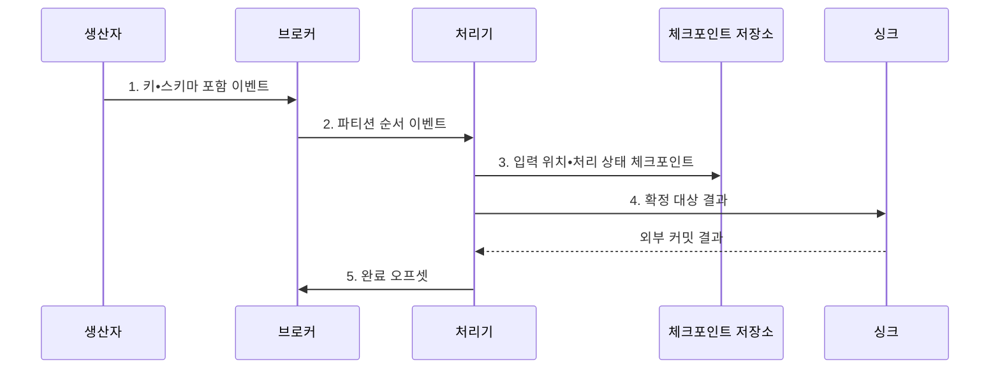

---
sidebar:
  order: 122
  label: "122. 실시간 스트리밍 플랫폼 (Real-Time Streaming Platform)"
  badge:
    text: "미출 • 50%"
    variant: note
title: "실시간 스트리밍 플랫폼 (Real-Time Streaming Platform)"
date: "2026-08-05T01:09:42+09:00"
tags:
  - "notes-software"
weight: 122
extra:
  question_no: "122"
  source_status: "미출"
  source_history: ""
  priority: 50
  priority_note: "실시간 수집•처리•저장 통합 설계 가치"
---

## Ⅰ. 개요

<details>
<summary>핵심 용어</summary>

- **실시간 스트리밍 플랫폼(Real-Time Streaming Platform)**: 연속 이벤트를 보존하고 상태 처리해 서비스 저장소에 낮은 지연으로 반영하는 체계이다.

</details>

- 정의/개념: 연속 이벤트를 보존•상태 처리해 서비스에 반영하는 **스트리밍 체계**
- 배경/필요성: 생산자와 처리기의 직결은 입력 급증 시 **처리 지연•손실** 확대

#### 한줄 요약
- 우체국이 편지를 일단 쌓아 두고 분류하듯, 브로커가 연속 이벤트를 보존해 처리 속도 차이를 흡수함

## Ⅱ. 특징

<details>
<summary>핵심 용어</summary>

- **종단 복구**: 입력 위치와 처리 상태 및 외부 출력을 같은 복구 경계로 연결하는 특성이다.
- **계층 분리**: 브로커가 생산자와 처리기의 장애 전파를 차단하는 특성이다.
- **입력 완충**: 브로커가 이벤트를 보존해 처리 속도 차이를 흡수하는 특성이다.
- **이벤트 시간**: 사건 발생 시각을 기준으로 윈도를 계산하는 시간 체계이다.
- **워터마크**: 늦은 이벤트를 기다릴 경계를 나타내는 시간 표식이다.

</details>

- 브로커의 **분리•완충** 으로 생산자와 처리기의 속도 차이 흡수
- **이벤트 시간•워터마크** 로 지연 이벤트의 윈도 집계
- 입력 위치•상태•출력을 연결한 **종단 복구**

#### 한줄 요약
- 브로커는 이벤트를 보존하고 처리기는 상태를 계산하므로 두 계층의 위치•상태•출력 복구 경계를 맞춰야 함

## Ⅲ. 구조 및 구성요소

<details>
<summary>핵심 용어</summary>

- **브로커**: 이벤트를 받아 보존하고 소비자에게 전달하는 구성요소이다.
- **파티션 로그**: 이벤트의 순서와 재생 위치를 보존하는 구성요소이다.
- **생산자**: 원천 이벤트를 브로커로 보내는 구성요소이다.
- **커넥터**: 외부 원천 이벤트를 수집하고 스키마에 맞춰 직렬화하는 구성요소이다.
- **스트림 처리기**: 이벤트 시간과 키별 상태로 윈도•집계•변환을 수행하는 구성요소이다.
- **체크포인트**: 입력 위치와 연산 상태를 같은 복구점으로 저장한 자료이다.
- **상태 저장소**: 스트림 연산의 키별 상태를 보존하는 구성요소이다.
- **싱크**: 처리 결과를 외부 저장소에 반영하는 구성요소이다.
- **서빙 계층**: 처리 결과를 서비스의 저지연 조회에 제공하는 계층이다.

</details>

```text
+-------------------------- 실시간 스트리밍 플랫폼 --------------------------+
|                                                                             |
|  [생산자•커넥터] -------- [브로커•파티션 로그] -------- [스트림 처리기]    |
|                                                            /       \        |
|                                                           /         \       |
|                                      [체크포인트•상태 저장소]   [싱크•서빙 계층]
|                                                                             |
+-----------------------------------------------------------------------------+
```

선의 의미: 생산자•커넥터와 브로커•파티션 로그의 선은 수집 이벤트의 직렬화•보존 관계, 브로커와 스트림 처리기의 선은 순서•재생 위치가 있는 이벤트 제공 관계, 스트림 처리기에서 갈라지는 선은 입력 위치•연산 상태의 복구점 보존과 처리 결과의 저장•저지연 조회 관계를 뜻한다.

| 구성요소 | 책임 |
|:---|:---|
| 생산자•커넥터 | 이벤트 수집과 **스키마 직렬화** |
| 브로커•파티션 로그 | 이벤트 **보존•순서•재생** |
| 스트림 처리기 | 이벤트 시간 기반 **윈도•상태 집계** |
| 체크포인트•상태 저장소 | 입력 위치•연산 상태의 **복구점** 보존 |
| 싱크•서빙 계층 | 처리 결과 저장과 **저지연 조회** 제공 |

#### 한줄 요약

- 작성자, 사건 일지, 계산자, 복구 사진, 서비스 장부로 구성된다.

## Ⅳ. 흐름도

<details>
<summary>핵심 용어</summary>

- **4. 확정 대상 결과**: 복구점과 연결된 처리 결과만 트랜잭션이나 멱등 방식으로 외부에 반영하는 단계이다.
- **1. 키•스키마 포함 이벤트**: 파티션 순서 경계와 해석 규칙을 함께 담아 브로커에 보존한 사건이다.
- **2. 파티션 순서 이벤트**: 파티션별 오프셋 순서로 처리기에 전달하는 이벤트 흐름이다.
- **3. 입력 위치•처리 상태 체크포인트**: 같은 시점의 오프셋과 키 상태를 저장한 복구점이다.
- **5. 완료 오프셋**: 외부 결과 반영까지 끝난 입력 위치를 재시작 기준으로 확정한 값이다.

</details>



**동작 원리**

1. **키•스키마 포함 이벤트**: 파티션 키로 순서 경계를 정하고 스키마와 함께 보존
2. **파티션 순서 이벤트**: 파티션별 오프셋 순서로 처리기에 전달
3. **입력 위치•처리 상태 체크포인트**: 동일 시점의 오프셋과 연산 상태를 복구점에 저장
4. **확정 대상 결과**: 복구점과 연결된 결과만 트랜잭션•멱등 방식으로 반영
5. **완료 오프셋**: 외부 반영이 끝난 위치를 장애 후 재시작 기준으로 확정

#### 한줄 요약

- 일지 위치와 계산 상태, 외부 장부 결과를 같은 경계로 맞춰 다시 시작해도 틀어지지 않게 한다.

## Ⅴ. 종류 및 비교

<details>
<summary>핵심 용어</summary>

- **Apache Flink**: 저지연 이벤트 시간 처리와 복잡한 키 상태 계산에 적합한 스트림 처리 엔진이다.
- **Apache Kafka**: 복제된 파티션 로그로 사건을 보존하고 여러 소비자가 독립 재생하게 하는 브로커이다.
- **Spark Structured Streaming**: Spark 배치 생태계와 통합해 연속 입력을 마이크로배치 중심으로 증분 처리하는 방식이다.

</details>

| 스트리밍 플랫폼 | Apache Kafka | Apache Flink | Spark Structured Streaming |
|:---|:---|:---|:---|
| 적용 기준 | 다중 소비와 **이벤트 재생** 중심 | 저지연•복잡한 **상태 처리** 중심 | 배치와 **스트림 처리** 통합 |
| 핵심 특징 | **파티션 로그•오프셋** 기반 보존 | **이벤트 시간•키 상태** 기반 처리 | **마이크로배치•상태 저장소** 기반 처리 |
| 한계 | 파티션 편향•**소비 지연량** 증가 | 상태 확장•**역압력** 제어 부담 | 마이크로배치 지연•**데이터 재분배** 비용 |

#### 한줄 요약

- Kafka는 사건을 남기고 Flink•Spark는 사건을 계산하며 Sink는 서비스할 결과를 보관한다.

## Ⅵ. 실무 고려사항 및 대책

<details>
<summary>핵심 용어</summary>

- **핫키**: 한 파티션에 이벤트와 상태를 집중시키는 편향 키이다.
- **처리 지연**: 이벤트 입력부터 결과 반영까지 걸리는 시간이다.
- **스키마 호환성**: 신규•기존 소비자가 변경된 이벤트를 함께 해석하는 성질이다.
- **버전 규칙**: 허용할 스키마 진화 범위를 정하는 기준이다.
- **파티션 키**: 함께 순서를 지킬 사건과 실제 분포를 반영해 이벤트의 로그 위치를 결정하는 키이다.
- **허용 지연**: 워터마크 뒤에도 늦은 사건을 추가 수용할 시간이다.
- **상태 만료**: 보존 기한이 지난 키 상태를 제거하는 통제이다.
- **키별 용량 한도**: 하나의 키가 사용할 저장 공간을 제한하는 통제이다.

</details>

| 문제 | 대책 | 효과 |
|:---|:---|:---|
| 생산자별 스키마 변경이 다르면 **소비자 역직렬화** 실패 | **스키마 호환성•버전 규칙** 적용 | 신규•기존 소비자의 **동시 처리** 유지 |
| 특정 키의 입력 집중으로 **핫키•처리 지연** 발생 | 순서 경계와 분포를 반영한 **파티션 키** 선택 | 파티션별 **처리량 편차** 완화 |
| 늦은 이벤트가 윈도 종료 뒤 도착해 **집계 누락** 발생 | **워터마크•허용 지연** 정책 설정 | **이벤트 시간 집계** 정확도 향상 |
| 키 상태가 만료 없이 누적돼 **상태 저장소** 급증 | **상태 만료•키별 용량 한도** 설정 | 상태 크기와 **복구 시간** 제한 |

#### 한줄 요약

- 같은 장치 사건은 순서대로 처리하되 한 장치가 전체 처리량을 독점하지 않는지 확인한다.

## Ⅶ. 결론

<details>
<summary>핵심 용어</summary>

- **책임 분리**: 이벤트 보존과 상태 계산을 다른 계층에 배치하는 원칙이다.

</details>

- 재생 보존과 상태 계산이 모두 필요하면 **브로커•처리 엔진** 분리 구축

#### 한줄 요약

- 사건 위치•계산 상태•최종 결과가 같은 시점으로 복구되어야 믿을 수 있다.
