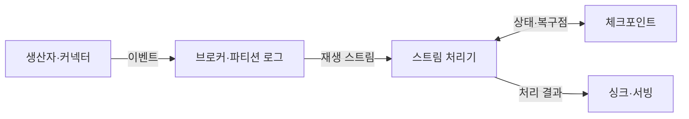
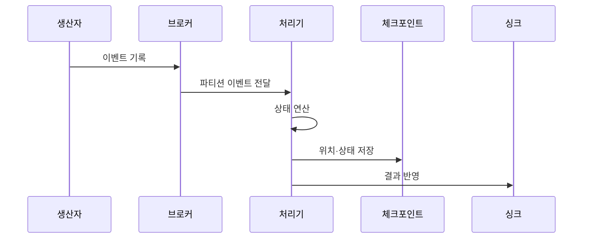

---
sidebar:
  order: 122
  label: "122. 실시간 스트리밍 플랫폼 (Real-Time Streaming Platform)"
  badge:
    text: "미출제 · 50%"
    variant: note
title: "실시간 스트리밍 플랫폼 (Real-Time Streaming Platform)"
date: "2026-07-25T11:14:00+09:00"
tags:
  - "notes-software"
weight: 122
extra:
  question_no: "122"
  source_status: "미출제"
  source_history: ""
  priority: 50
  priority_note: "실시간 수집·처리·저장 통합 설계 가치"
---

## 미리 알고가기

- **실시간 스트리밍 플랫폼(Real-time Streaming Platform)**: 연속 이벤트를 수집·보존·상태 처리해 서비스 저장소에 반영하는 체계임
- **이벤트 브로커(Event Broker)**: 생산자와 처리기를 분리하고 이벤트를 파티션 로그에 보존하는 시스템임
- **스트림 처리 엔진(Stream Processing Engine)**: 필터·조인·윈도·집계를 연속 데이터에 적용하는 시스템임
- **이벤트 시간(Event Time)**: 이벤트가 실제로 발생한 시각임
- **워터마크(Watermark)**: 이벤트 시간이 특정 시점까지 진행됐음을 알려 윈도 종료와 상태 정리를 돕는 기준임
- **상태 저장소(State Store)**: 키별 집계와 조인을 이어 계산하도록 중간 결과를 보존하는 저장소임
- **체크포인트(Checkpoint)**: 입력 위치와 처리 상태를 일관된 복구 시점으로 저장한 스냅숏임
- **싱크(Sink)**: 처리 결과를 데이터베이스·검색 색인·캐시 등에 기록하는 출력 대상임
- **서빙 계층(Serving Layer)**: 처리 결과를 서비스가 낮은 지연으로 조회하도록 저장·제공하는 계층임
- **소비 지연량(Consumer Lag)**: 브로커의 최신 위치와 처리기가 완료한 위치 사이에 쌓인 이벤트 수임
- **역압력(Backpressure)**: 하위 연산자의 처리 지연이 상위 단계의 전송 속도를 제한하는 상태임
- **스키마 호환성(Schema Compatibility)**: 이벤트 구조가 바뀌어도 기존 생산자와 소비자가 정한 규칙 안에서 함께 동작하는 성질임
- **아파치 카프카(Apache Kafka)**: 이벤트를 복제 파티션 로그에 보존·재생하는 이벤트 스트리밍 플랫폼임
- **아파치 플링크(Apache Flink)**: 이벤트 시간과 분산 상태를 중심으로 연속 흐름을 처리하는 엔진임
- **데이터프레임 응용 인터페이스(DataFrame Application Programming Interface, DataFrame API)**: API를 '에이피아이'로 읽으며 열 구조의 연속 입력과 변환을 코드로 정의하는 Spark 접점임
- **구조적 질의 언어(Structured Query Language, SQL)**: 영문 첫 글자를 딴 SQL을 '에스큐엘'로 읽으며 Spark의 선언형 스트림 연산을 표현함
- **스파크 구조적 스트리밍(Spark Structured Streaming)**: DataFrame API로 연속 입력을 증분 처리하는 Spark SQL 기반 스트림 엔진임

## Ⅰ. 개요

- 정의/개념: 연속 이벤트를 수집·상태 처리·서빙한다
- **배경/필요성**: 장애 중 누적 이벤트와 상태를 복구한다

### 쉽게 이해하기 (학습용)
- 이벤트를 보관하고 계산 결과를 즉시 서비스 저장소로 보냄

## Ⅱ. 특징

- 파티션 키는 순서·병렬도를 정해 편향 지연을 만든다
- 로그·체크포인트는 실패 구간 재생으로 누락을 막는다
- 워터마크는 윈도를 닫아 상태 무한 증가를 막는다
- 멱등·트랜잭션 싱크는 재처리 중복 결과를 막는다

### 쉽게 이해하기 (학습용)
- 브로커는 이벤트를 보존하고 처리기는 상태를 계산하므로 두 계층의 위치·상태·출력 복구 경계를 맞춰야 함

## Ⅲ. 아키텍처 및 구성요소

| 설계 요소 | 설명 |
|:---|:---|
| 생산자·커넥터 | 이벤트 수집·스키마 호환성 관리 |
| 브로커·파티션 로그 | 이벤트 보존·생산자와 처리기 분리 |
| 스트림 처리기 | 윈도·조인·집계를 병렬 실행 |
| 체크포인트 | 입력 위치·키별 상태를 복구점에 저장 |
| 싱크·서빙 | 결과 반영·소비 지연·역압력 관측 |

> 요약: 브로커가 이벤트를 보존하고 엔진이 상태 연산한 결과를 전달함

### 쉽게 이해하기 (학습용)
- 생산자가 보낸 이벤트를 브로커가 보존하고 처리기가 복구 상태와 결과를 각각 저장한다

## Ⅳ. 원리 및 절차 흐름도

| 절차 | 설명 |
|:---|:---|
| 이벤트 기록 | 키·스키마를 포함한 이벤트를 로그에 보존 |
| 파티션 이벤트 전달 | 키가 정한 파티션 순서로 처리기에 전달 |
| 상태 연산 | 이벤트 시간·키 상태로 윈도·조인 계산 |
| 위치·상태 저장 | 입력 위치와 처리 상태를 함께 저장 |
| 결과 반영 | 트랜잭션·멱등 쓰기로 서빙에 기록 |

> 요약: 위치와 상태를 체크포인트에 저장한 뒤 서빙 저장소에 반영함

### 쉽게 이해하기 (학습용)
- 이벤트를 일지에 기록하고 상태 복구 지점을 저장해 서빙에 반영함

## Ⅴ. 종류 및 비교

| 판단 기준 | Apache Kafka | Apache Flink | Spark Structured Streaming |
|:---|:---|:---|:---|
| 핵심 특징 | 파티션 로그로 이벤트 보존·전달 | 상태 기반 연속 스트림 처리 | 증분 스트림·배치 통합 처리 |
| 적용 기준 | 생산자·소비자 분리·재생 | 저지연 이벤트 시간 연산 | 배치 기반 분석과 스트림 통합 |
| 주요 위험 | 파티션 불균형·소비 지연 | 큰 상태·체크포인트 지연 | 마이크로배치 지연·상태 증가 |

> 요약: 카프카가 보존하고 플링크나 스파크가 계산해 싱크에 반영함

### 쉽게 이해하기 (학습용)
- Kafka는 이벤트를 보존하고 Flink와 Spark는 저장된 이벤트를 상태 기반으로 계산한다

## Ⅵ. 실무 사례

1. 장치 키로 이상 탐지 이벤트 순서를 유지한다

### 쉽게 이해하기 (학습용)
- 장치 이벤트를 같은 파티션에 두면 장치별 순서를 유지하면서 파티션 수만큼 병렬 처리할 수 있음

## Ⅶ. 결론

- 순서·지연·복구 기준으로 브로커와 처리기를 고른다

### 쉽게 이해하기 (학습용)
- 실시간 플랫폼의 신뢰성은 개별 도구 속도보다 입력 위치·상태·출력이 같은 논리 시점으로 복구되는지에 달려 있음
