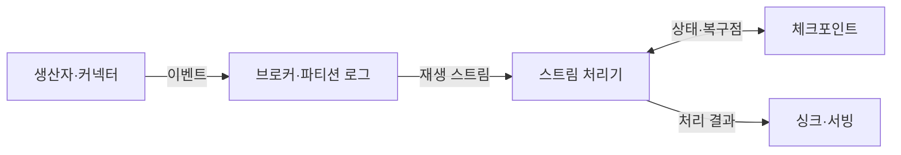
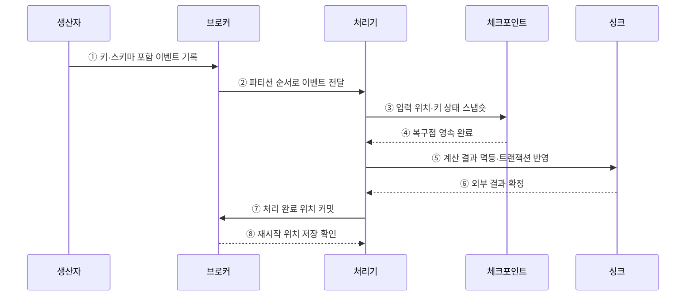

---
sidebar:
  order: 122
  label: "122. 실시간 스트리밍 플랫폼 (Real-Time Streaming Platform)"
  badge:
    text: "미출제 · 50%"
    variant: note
title: "실시간 스트리밍 플랫폼 (Real-Time Streaming Platform)"
date: "2026-07-25T11:14:00+09:00"
tags:
  - "notes-software"
weight: 122
extra:
  question_no: "122"
  source_status: "미출제"
  source_history: ""
  priority: 50
  priority_note: "실시간 수집·처리·저장 통합 설계 가치"
---

## 미리 알고가기

- **실시간 스트리밍 플랫폼(Real-time Streaming Platform)**: 연속 이벤트를 수집·보존·상태 처리해 서비스 저장소에 반영하는 체계임
- **이벤트 브로커(Event Broker)**: 생산자와 처리기를 분리하고 이벤트를 파티션 로그에 보존하는 시스템임
- **스트림 처리 엔진(Stream Processing Engine)**: 필터·조인·윈도·집계를 연속 데이터에 적용하는 시스템임
- **이벤트 시간(Event Time)**: 이벤트가 실제로 발생한 시각임
- **워터마크(Watermark)**: 이벤트 시간이 특정 시점까지 진행됐음을 알려 윈도 종료와 상태 정리를 돕는 기준임
- **상태 저장소(State Store)**: 키별 집계와 조인을 이어 계산하도록 중간 결과를 보존하는 저장소임
- **체크포인트(Checkpoint)**: 입력 위치와 처리 상태를 일관된 복구 시점으로 저장한 스냅숏임
- **싱크(Sink)**: 처리 결과를 데이터베이스·검색 색인·캐시 등에 기록하는 출력 대상임
- **서빙 계층(Serving Layer)**: 처리 결과를 서비스가 낮은 지연으로 조회하도록 저장·제공하는 계층임
- **소비 지연량(Consumer Lag)**: 브로커의 최신 위치와 처리기가 완료한 위치 사이에 쌓인 이벤트 수임
- **역압력(Backpressure)**: 하위 연산자의 처리 지연이 상위 단계의 전송 속도를 제한하는 상태임
- **스키마 호환성(Schema Compatibility)**: 이벤트 구조가 바뀌어도 기존 생산자와 소비자가 정한 규칙 안에서 함께 동작하는 성질임
- **아파치 카프카(Apache Kafka)**: 이벤트를 복제 파티션 로그에 보존·재생하는 이벤트 스트리밍 플랫폼임
- **아파치 플링크(Apache Flink)**: 이벤트 시간과 분산 상태를 중심으로 연속 흐름을 처리하는 엔진임
- **데이터프레임 응용 인터페이스(DataFrame Application Programming Interface, DataFrame API)**: API를 '에이피아이'로 읽으며 열 구조의 연속 입력과 변환을 코드로 정의하는 Spark 접점임
- **구조적 질의 언어(Structured Query Language, SQL)**: 영문 첫 글자를 딴 SQL을 '에스큐엘'로 읽으며 Spark의 선언형 스트림 연산을 표현함
- **스파크 구조적 스트리밍(Spark Structured Streaming)**: DataFrame API로 연속 입력을 증분 처리하는 Spark SQL 기반 스트림 엔진임

## Ⅰ. 개요

- 실시간 스트리밍 플랫폼은 연속 이벤트를 수집·보존하고 이벤트 시간과 키별 상태로 처리해 서비스 저장소에 반영하는 체계이다.
- 브로커·처리 엔진·Checkpoint·Sink의 진행 위치를 연결해 장애 후 누락과 중복을 통제한다.

### 쉽게 이해하기 (학습용)
- 이벤트를 보관하고 계산 결과를 즉시 서비스 저장소로 보냄

## Ⅱ. 특징

- **분리·완충**: 브로커가 생산자와 처리기의 속도·장애를 분리하고 이벤트를 재생 가능하게 보존한다.
- **순서·병렬성**: 파티션 키가 같은 키의 순서와 처리 병렬도·편향을 결정한다.
- **시간·상태**: Watermark·Window·State Store가 늦은 이벤트와 누적 계산을 관리한다.
- **종단 복구**: 입력 위치·연산 상태·Sink 결과를 같은 논리 경계로 복구해야 한다.

### 쉽게 이해하기 (학습용)
- 브로커는 이벤트를 보존하고 처리기는 상태를 계산하므로 두 계층의 위치·상태·출력 복구 경계를 맞춰야 함

## Ⅲ. 아키텍처 및 구성요소

**도표안 A — 구조도**

**도표안 B — sequenceDiagram**

| 구성요소 | 역할 |
|:---|:---|
| 생산자·커넥터 | 이벤트 수집·직렬화·스키마 호환 관리 |
| 브로커·파티션 로그 | 이벤트 보존·순서·완충·재생 |
| 스트림 처리기 | 이벤트 시간·Window·Join·상태 집계 |
| Checkpoint·State Store | 입력 위치와 키별 상태의 복구점 저장 |
| Sink·Serving | 계산 결과 저장과 저지연 서비스 조회 |

**동작 원리**

- ① 생산자가 키와 버전된 스키마를 포함한 이벤트를 브로커에 기록한다.
- ② 브로커가 파티션 내부 순서대로 처리 엔진에 이벤트를 전달한다.
- ③ 처리기가 입력 위치와 키별 연산 상태를 Checkpoint에 저장한다.
- ④ Checkpoint 저장소가 복구점의 영속 완료를 알린다.
- ⑤ 처리기가 계산 결과를 멱등 또는 트랜잭션 방식으로 Sink에 반영한다.
- ⑥ Sink가 외부 결과의 확정을 반환한다.
- ⑦ 처리기가 안전하게 완료한 입력 위치를 브로커에 커밋한다.
- ⑧ 브로커가 장애 후 사용할 재시작 위치의 저장을 확인한다.

### 쉽게 이해하기 (학습용)

- 일지 위치와 계산 상태, 외부 장부 결과를 같은 경계로 맞춰 다시 시작해도 틀어지지 않게 한다.

## Ⅳ. 종류 및 비교

| 역할·제품 | Apache Kafka | Apache Flink | Spark Structured Streaming |
|:---|:---|:---|:---|
| 주 역할 | 이벤트 로그·완충·재생 | 연속 상태 스트림 처리 | Spark SQL 기반 증분 처리 |
| 시간·상태 | 오프셋·보존 중심 | Event Time·Watermark·Keyed State | Watermark·State Store·Micro-batch |
| 적합 조건 | 다중 생산·소비와 재생 | 저지연·복잡한 이벤트 시간·상태 | 배치·SQL 생태계와 스트림 통합 |
| 주요 위험 | 파티션 편향·Lag·보존 비용 | 상태·Checkpoint·Backpressure | 배치 지연·셔플·상태 증가 |

> Kafka도 스트림 처리 API를 제공하고 처리 엔진도 Source 기능을 갖지만, 플랫폼 설계에서는 보존·처리·서빙 책임을 명확히 구분해야 한다.

### 쉽게 이해하기 (학습용)

- Kafka는 사건을 남기고 Flink·Spark는 사건을 계산하며 Sink는 서비스할 결과를 보관한다.

## Ⅴ. 실무 고려사항 및 대책

| 고려사항 | 위험 | 대책 |
|:---|:---|:---|
| 이벤트 계약 | 생산자·소비자 스키마 불일치 | Registry·호환 규칙·버전·기본값 운영 |
| 파티션 키 | 순서 분산 또는 핫키 | 업무 순서 경계와 실제 분포로 선택 |
| 시간 | 처리시간을 발생시간으로 오해 | 이벤트 시각·Watermark·늦은 데이터 정책 |
| 상태 | 긴 윈도·고카디널리티로 폭증 | TTL·윈도·키 예산·상태 크기 경보 |
| 종단 보장 | 엔진 Exactly-once만 확인 | Source 재생·Checkpoint·Sink 원자성 검증 |
| 병목 | Sink 지연이 전체 Backpressure 유발 | 단계별 처리율·Lag·역압력·Sink 한도 감시 |

> **적용 사례**: 장치 ID를 파티션 키로 사용해 장치별 순서를 유지하고 파티션별 입력률·Lag·상태 크기로 편향을 감시한다.

### 쉽게 이해하기 (학습용)

- 같은 장치 사건은 순서대로 처리하되 한 장치가 전체 처리량을 독점하지 않는지 확인한다.

## Ⅵ. 결론

- 실시간 스트리밍 플랫폼은 브로커의 보존, 처리 엔진의 시간·상태 계산, Sink의 결과 확정을 하나의 복구 경계로 연결한다.
- 순서·스키마·지연·상태·종단 전달 보장을 개별 도구가 아닌 전체 경로에서 검증해야 한다.

### 쉽게 이해하기 (학습용)

- 사건 위치·계산 상태·최종 결과가 같은 시점으로 복구되어야 믿을 수 있다.
