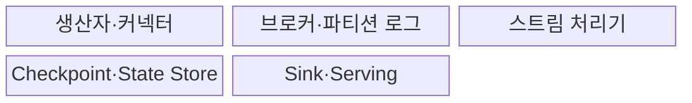
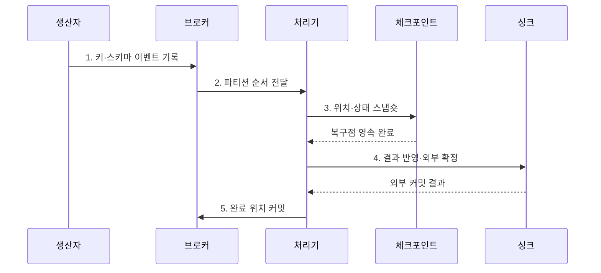

---
sidebar:
  order: 122
  label: "122. 실시간 스트리밍 플랫폼 (Real-Time Streaming Platform)"
  badge:
    text: "미출제 · 50%"
    variant: note
title: "실시간 스트리밍 플랫폼 (Real-Time Streaming Platform)"
date: "2026-07-30T20:00:00+09:00"
tags:
  - "notes-software"
weight: 122
extra:
  question_no: "122"
  source_status: "미출제"
  source_history: ""
  priority: 50
  priority_note: "실시간 수집·처리·저장 통합 설계 가치"
---

## 미리 알고가기

- **실시간 스트리밍 플랫폼(Real-time Streaming Platform)**: 연속 이벤트를 수집·보존·상태 처리해 서비스 저장소에 반영하는 체계이다.
- **이벤트 브로커(Event Broker)**: 생산자와 처리기를 분리하고 이벤트를 파티션 로그에 보존하는 시스템이다.
- **스트림 처리 엔진(Stream Processing Engine)**: 필터·조인·윈도·집계를 연속 데이터에 적용하는 시스템이다.
- **이벤트 시간(Event Time)**: 이벤트가 실제로 발생한 시각이다.
- **워터마크(Watermark)**: 이벤트 시간이 특정 시점까지 진행됐음을 알려 윈도 종료와 상태 정리를 돕는 기준이다.
- **상태 저장소(State Store)**: 키별 집계와 조인을 이어 계산하도록 중간 결과를 보존하는 저장소이다.
- **체크포인트(Checkpoint)**: 입력 위치와 처리 상태를 일관된 복구 시점으로 저장한 스냅숏이다.
- **싱크(Sink)**: 처리 결과를 데이터베이스·검색 색인·캐시 등에 기록하는 출력 대상이다.
- **서빙 계층(Serving Layer)**: 처리 결과를 서비스가 낮은 지연으로 조회하도록 저장·제공하는 계층이다.
- **소비 지연량(Consumer Lag)**: 브로커의 최신 위치와 처리기가 완료한 위치 사이에 쌓인 이벤트 수이다.
- **역압력(Backpressure)**: 하위 연산자의 처리 지연이 상위 단계의 전송 속도를 제한하는 상태이다.
- **스키마 호환성(Schema Compatibility)**: 이벤트 구조가 바뀌어도 기존 생산자와 소비자가 정한 규칙 안에서 함께 동작하는 성질이다.
- **아파치 카프카(Apache Kafka)**: 이벤트를 복제 파티션 로그에 보존·재생하는 이벤트 스트리밍 플랫폼이다.
- **아파치 플링크(Apache Flink)**: 이벤트 시간과 분산 상태를 중심으로 연속 흐름을 처리하는 엔진이다.
- **데이터프레임 응용 인터페이스(DataFrame Application Programming Interface, DataFrame API)**: API를 '에이피아이'로 읽으며 열 구조의 연속 입력과 변환을 코드로 정의하는 Spark 접점이다.
- **구조적 질의 언어(Structured Query Language, SQL)**: 영문 첫 글자를 딴 SQL을 '에스큐엘'로 읽으며 Spark의 선언형 스트림 연산을 표현한다.
- **스파크 구조적 스트리밍(Spark Structured Streaming)**: DataFrame API로 연속 입력을 증분 처리하는 Spark SQL 기반 스트림 엔진이다.

## Ⅰ. 개요

- 정의/개념: 연속 이벤트를 보존·처리·서빙하는 **스트리밍 체계**
- 배경/필요성: 생산·처리 분리와 종단 복구

### 쉽게 이해하기 (학습용)
- 이벤트를 보관하고 계산 결과를 즉시 서비스 저장소로 보냄

## Ⅱ. 특징

- **분리·완충**: 브로커로 속도·장애 격리
- **시간·상태**: Watermark·Window로 누적 계산
- **종단 복구**: 위치·상태·출력 경계 연결

### 쉽게 이해하기 (학습용)
- 브로커는 이벤트를 보존하고 처리기는 상태를 계산하므로 두 계층의 위치·상태·출력 복구 경계를 맞춰야 함

## Ⅲ. 구조 및 구성요소

| 구성요소 | 책임 |
|:---|:---|
| 생산자·커넥터 | 수집·직렬화·스키마 |
| 브로커·파티션 로그 | 보존·순서·완충·재생 |
| 스트림 처리기 | 시간·윈도·상태 집계 |
| Checkpoint·State Store | 위치·상태 복구점 |
| Sink·Serving | 결과 저장·서비스 조회 |

### 쉽게 이해하기 (학습용)

- 작성자, 사건 일지, 계산자, 복구 사진, 서비스 장부로 구성된다.

## Ⅳ. 흐름도

**동작 원리**

- **1. 키·스키마 이벤트 기록**: 브로커에 전달
- **2. 파티션 순서 전달**: 처리기로 전달
- **3. 위치·상태 스냅숏**: 복구 경계를 저장
- **4. 결과 반영·외부 확정**: 복구점과 결합된 트랜잭션·멱등 방식으로 Sink 결과 확정
- **5. 완료 위치 커밋**: 외부 반영 성공 위치를 브로커의 재시작 기준으로 저장

### 쉽게 이해하기 (학습용)

- 일지 위치와 계산 상태, 외부 장부 결과를 같은 경계로 맞춰 다시 시작해도 틀어지지 않게 한다.

## Ⅴ. 종류 및 비교

| 판단 기준 | Apache Kafka | Apache Flink | Spark Structured Streaming |
|:---|:---|:---|:---|
| 적용 기준 | 다중 소비·재생 | 저지연·복잡한 상태 | 배치·SQL 통합 |
| 핵심 특징 | 파티션 로그·오프셋 | 이벤트 시간·키 상태 | Micro-batch·State Store |
| 한계 | 편향·Lag·보존 비용 | 상태·역압력 | 배치 지연·셔플 |

> 설계 원칙: 제품 기능 중첩과 무관한 **보존·처리·서빙 책임 분리**

### 쉽게 이해하기 (학습용)

- Kafka는 사건을 남기고 Flink·Spark는 사건을 계산하며 Sink는 서비스할 결과를 보관한다.

## Ⅵ. 실무 고려사항 및 대책

| 고려사항 | 대책 | 효과 |
|:---|:---|:---|
| 이벤트 계약 | 호환 규칙·버전 운영 | 스키마 불일치 방지 |
| 파티션 키 | 순서 경계·분포로 선택 | 핫키·순서 분산 방지 |
| 시간 | Watermark·지연 정책 정의 | 발생시간 오류 통제 |
| 상태 | TTL·키 예산·크기 경보 | 상태 폭증 방지 |
| 종단 보장 | Source·Checkpoint·Sink 검증 | 누락·중복 통제 |

> **적용 사례**: 장치 ID를 파티션 키로 사용해 장치별 순서를 유지하고 파티션별 입력률·Lag·상태 크기로 편향을 감시

### 쉽게 이해하기 (학습용)

- 같은 장치 사건은 순서대로 처리하되 한 장치가 전체 처리량을 독점하지 않는지 확인한다.

## Ⅶ. 결론

- **순서·스키마·지연·상태·Sink 보장**으로 스트리밍 경계를 결정

### 쉽게 이해하기 (학습용)

- 사건 위치·계산 상태·최종 결과가 같은 시점으로 복구되어야 믿을 수 있다.
