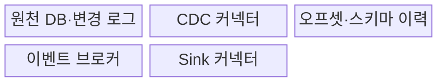
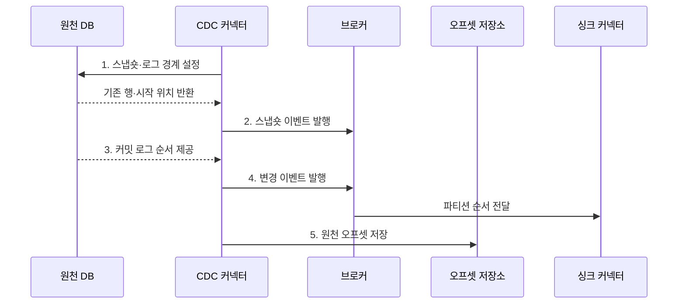

---
sidebar:
  order: 123
  label: "123. 변경 데이터 캡처 CDC (Change Data Capture)"
  badge:
    text: "미출제 · 50%"
    variant: note
title: "변경 데이터 캡처 CDC (Change Data Capture)"
date: "2026-07-30T20:00:00+09:00"
tags:
  - "notes-software"
weight: 123
extra:
  question_no: "123"
  source_status: "미출제"
  source_history: ""
  priority: 50
  priority_note: "CDC는 변경 이벤트·동기화 설계에 중요"
---

## 미리 알고가기

- **데이터베이스(Database, DB)**: 영문 앞뒤 글자를 딴 DB를 '디비'로 읽으며 CDC가 읽을 원천 행과 변경 로그를 보존한다.
- **변경 데이터 캡처(Change Data Capture, CDC)**: 영문 첫 글자를 딴 CDC를 '시디시'로 읽으며 데이터베이스의 삽입·수정·삭제를 이벤트로 추출한다.
- **변경 로그(Change Log)**: 데이터베이스가 복구·복제를 위해 기록하는 트랜잭션 이력이다.
- **초기 스냅숏(Initial Snapshot)**: 기존 전체 데이터를 읽어 변경 스트림의 시작 기준을 만드는 과정이다.
- **로그 순서 번호(Log Sequence Number, LSN)**: 영문 첫 글자를 딴 LSN을 '엘에스엔'으로 읽으며 SQL Server·PostgreSQL 로그의 변경 순서와 재시작 위치를 식별한다.
- **시스템 변경 번호(System Change Number, SCN)**: 영문 첫 글자를 딴 SCN을 '에스시엔'으로 읽으며 Oracle에서 커밋된 변경 순서를 식별한다.
- **구조적 질의 언어(Structured Query Language, SQL)**: 영문 첫 글자를 딴 SQL을 '에스큐엘'로 읽으며 SQL Server·MySQL 같은 관계형 데이터베이스 제품명에 쓰이다.
- **바이너리 로그 위치(Binary Log Position)**: '마이에스큐엘'로 읽는 MySQL 로그에서 CDC가 다시 읽을 파일과 위치이다.
- **변경 이벤트(Change Event)**: 삽입·수정·삭제 종류, 테이블, 키, 변경값과 거래 메타데이터를 표현한 이벤트이다.
- **스키마 이력(Schema History)**: 과거 변경 로그를 당시 테이블 구조로 해석할 수 있게 구조 변화를 보존한 기록이다.
- **CDC 커넥터(CDC Connector)**: 원천 변경 로그를 읽어 공통 변경 이벤트로 변환·발행하는 구성요소이다.
- **이벤트 브로커(Event Broker)**: 변경 이벤트를 보존하고 생산자와 여러 소비자를 분리하는 시스템이다.
- **오프셋(Offset)**: CDC 커넥터가 발행을 완료하고 재시작할 로그 위치를 나타내는 값이다.
- **싱크 커넥터(Sink Connector)**: 변경 이벤트를 검색 색인·분석 저장소 등 대상 시스템에 반영하는 구성요소이다.
- **멱등 반영(Idempotent Apply)**: 같은 변경 이벤트를 여러 번 적용해도 대상의 최종 상태가 같게 하는 처리이다.
- **데이터베이스 트리거(Database Trigger)**: 특정 테이블의 삽입·수정·삭제 때 데이터베이스가 자동 실행하는 절차이다.

## Ⅰ. 개요

- 정의/개념: DB 변경 로그를 이벤트로 전달하는 **증분 추출 기법**
- 배경/필요성: 전체 복사 없이 동기화 지연·부하 축소

### 쉽게 이해하기 (학습용)
- 원본 장부를 매번 복사하지 않고 바뀐 부분만 찾아 다른 시스템에 전달함

## Ⅱ. 특징

- **초기 경계**: Snapshot·변경 로그 위치 연결
- **재시작**: 확정 로그 위치부터 재생
- **스키마 해석**: 시점별 구조로 변경 판독

### 쉽게 이해하기 (학습용)
- CDC는 첫 전체 복사와 이후 로그 사이의 빈 구간을 없애고 마지막 확정 위치부터 안전하게 다시 읽어야 함

## Ⅲ. 구조 및 구성요소

| 구성요소 | 책임 |
|:---|:---|
| 원천 DB·변경 로그 | 행·커밋·삭제 기록 제공 |
| CDC 커넥터 | 로그를 변경 이벤트로 변환 |
| 오프셋·스키마 이력 | 재시작 위치·구조 저장 |
| 이벤트 브로커 | 이벤트 보존·순서 전달 |
| Sink 커넥터 | 대상에 멱등 반영 |

### 쉽게 이해하기 (학습용)

- 원본 장부, 일지 판독기, 책갈피, 전달 일지, 대상 반영기로 구성된다.

## Ⅳ. 흐름도

**동작 원리**

- **1. 스냅숏·로그 경계 설정**: 초기 행과 이후 변경 로그가 끊기거나 겹치지 않는 시작 위치 확보
- **2. 스냅숏 이벤트 발행**: 기준 시점의 기존 행을 초기 상태 이벤트로 변환
- **3. 커밋 로그 순서 제공**: 트랜잭션 커밋 순서대로 삽입·수정·삭제 변화 읽기
- **4. 변경 이벤트 발행**: 키·전후 값·스키마·원천 위치를 브로커에 기록
- **5. 원천 오프셋 저장**: 장애 후 마지막 확정 로그 위치부터 재개할 책갈피 영속화

### 쉽게 이해하기 (학습용)

- 첫 전체 복사의 끝과 변경 일지의 시작을 맞추고 마지막 발행 위치를 책갈피로 남긴다.

## Ⅴ. 종류 및 비교

| 판단 기준 | 로그 기반 CDC | 트리거 기반 CDC | 쿼리 기반 CDC |
|:---|:---|:---|:---|
| 적용 기준 | 로그 접근 가능 | 트리거 허용 | 낮은 변경량 |
| 핵심 특징 | 복구 로그 순차 판독 | 변경표 자동 기록 | 수정 시각 주기 조회 |
| 한계 | 로그 만료·제품 종속 | 쓰기 지연·누락 | 경계 경쟁·삭제 누락 |

> 구분 기준: **DB 행 변경 사실인 CDC**와 업무 의도인 도메인 이벤트의 계약 분리

### 쉽게 이해하기 (학습용)

- 변경 일지를 읽는 방식이 가장 자연스럽지만 권한이 없으면 표식이나 주기 조회를 사용한다.

## Ⅵ. 실무 고려사항 및 대책

| 고려사항 | 대책 | 효과 |
|:---|:---|:---|
| Snapshot 경계 | 기준 위치·버퍼·대사 검증 | 누락·중복 방지 |
| 로그 보존 | 중단시간보다 길게 유지 | 재시작 위치 만료 방지 |
| 순서 | 업무 키·원천 버전 비교 | 변경 역전 방지 |
| 삭제 | Tombstone·Delete·대사 | 오래된 대상 제거 |
| 스키마 | 이력·호환 규칙·단계적 DDL | 역직렬화 실패 방지 |

> **적용 사례**: 검색 색인은 원천 기본키와 로그 위치를 버전으로 사용해 생성·수정·삭제를 멱등 반영하고 주기적으로 원본과 대사

### 쉽게 이해하기 (학습용)

- 같은 원본 키와 최신 변경 번호로 검색 문서를 고치고 삭제까지 전달해야 오래된 결과가 남지 않는다.

## Ⅶ. 결론

- **기준 위치·삭제·순서·스키마·보존 기간**으로 CDC를 설계

### 쉽게 이해하기 (학습용)

- 첫 복사와 변경 일지의 경계, 마지막 책갈피, 삭제와 구조 변경까지 맞아야 한다.
