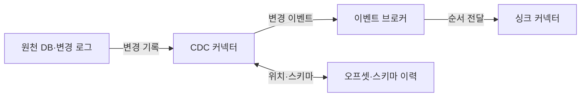
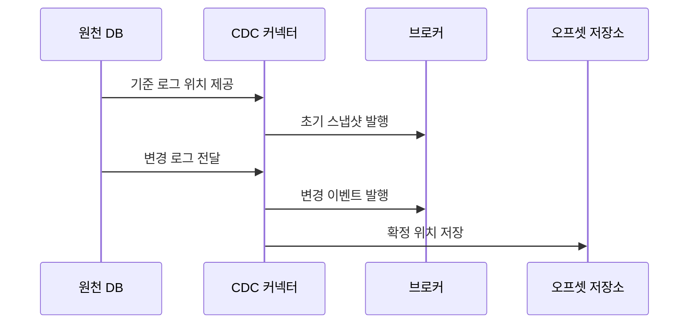

---
sidebar:
  order: 123
  label: "123. 변경 데이터 캡처 CDC (Change Data Capture)"
  badge:
    text: "미출제 · 50%"
    variant: note
title: "변경 데이터 캡처 CDC (Change Data Capture)"
date: "2026-07-25T11:16:00+09:00"
tags:
  - "notes-software"
weight: 123
extra:
  question_no: "123"
  source_status: "미출제"
  source_history: ""
  priority: 50
  priority_note: "CDC는 변경 이벤트·동기화 설계에 중요"
---

## 미리 알고가기

- **데이터베이스(Database, DB)**: 영문 앞뒤 글자를 딴 DB를 '디비'로 읽으며 CDC가 읽을 원천 행과 변경 로그를 보존함
- **변경 데이터 캡처(Change Data Capture, CDC)**: 영문 첫 글자를 딴 CDC를 '시디시'로 읽으며 데이터베이스의 삽입·수정·삭제를 이벤트로 추출함
- **변경 로그(Change Log)**: 데이터베이스가 복구·복제를 위해 기록하는 트랜잭션 이력임
- **초기 스냅숏(Initial Snapshot)**: 기존 전체 데이터를 읽어 변경 스트림의 시작 기준을 만드는 과정임
- **로그 순서 번호(Log Sequence Number, LSN)**: 영문 첫 글자를 딴 LSN을 '엘에스엔'으로 읽으며 SQL Server·PostgreSQL 로그의 변경 순서와 재시작 위치를 식별함
- **시스템 변경 번호(System Change Number, SCN)**: 영문 첫 글자를 딴 SCN을 '에스시엔'으로 읽으며 Oracle에서 커밋된 변경 순서를 식별함
- **구조적 질의 언어(Structured Query Language, SQL)**: 영문 첫 글자를 딴 SQL을 '에스큐엘'로 읽으며 SQL Server·MySQL 같은 관계형 데이터베이스 제품명에 쓰임
- **바이너리 로그 위치(Binary Log Position)**: '마이에스큐엘'로 읽는 MySQL 로그에서 CDC가 다시 읽을 파일과 위치임
- **변경 이벤트(Change Event)**: 삽입·수정·삭제 종류, 테이블, 키, 변경값과 거래 메타데이터를 표현한 이벤트임
- **스키마 이력(Schema History)**: 과거 변경 로그를 당시 테이블 구조로 해석할 수 있게 구조 변화를 보존한 기록임
- **CDC 커넥터(CDC Connector)**: 원천 변경 로그를 읽어 공통 변경 이벤트로 변환·발행하는 구성요소임
- **이벤트 브로커(Event Broker)**: 변경 이벤트를 보존하고 생산자와 여러 소비자를 분리하는 시스템임
- **오프셋(Offset)**: CDC 커넥터가 발행을 완료하고 재시작할 로그 위치를 나타내는 값임
- **싱크 커넥터(Sink Connector)**: 변경 이벤트를 검색 색인·분석 저장소 등 대상 시스템에 반영하는 구성요소임
- **멱등 반영(Idempotent Apply)**: 같은 변경 이벤트를 여러 번 적용해도 대상의 최종 상태가 같게 하는 처리임
- **데이터베이스 트리거(Database Trigger)**: 특정 테이블의 삽입·수정·삭제 때 데이터베이스가 자동 실행하는 절차임

## Ⅰ. 개요

- **정의/개념**: DB 삽입·수정·삭제를 이벤트로 전달한다
- **배경/필요성**: 전체 재복사의 원천 부하와 지연을 줄인다

### 쉽게 이해하기 (학습용)
- 원본 장부를 매번 복사하지 않고 바뀐 부분만 찾아 다른 시스템에 전달함

## Ⅱ. 특징

- 스냅숏과 로그 위치를 이어 변경 누락을 막는다
- 커밋 순서·삭제 보존은 대상 상태 불일치를 막는다
- 확정 오프셋은 장애 뒤 중복·누락 없는 재개를 돕는다
- 스키마 이력은 과거 로그의 열 해석 실패를 막는다

### 쉽게 이해하기 (학습용)
- CDC는 첫 전체 복사와 이후 로그 사이의 빈 구간을 없애고 마지막 확정 위치부터 안전하게 다시 읽어야 함

## Ⅲ. 아키텍처 및 구성요소

| 설계 요소 | 설명 |
|:---|:---|
| 원천 DB·변경 로그 | 변경 기록·초기 스냅샷 기준 제공 |
| CDC 커넥터 | 로그를 공통 변경 이벤트로 변환 |
| 오프셋·스키마 이력 | 재시작 위치·로그 해석 구조 저장 |
| 이벤트 브로커 | 변경 이벤트 보존·소비자 분리 |
| 싱크 커넥터 | 변경 키로 대상에 멱등 반영 |

> 요약: 로그를 해석해 처리 위치와 스키마 이력으로 이벤트를 생성함

### 쉽게 이해하기 (학습용)
- 원천 데이터베이스의 로그를 커넥터가 이벤트로 바꾸고 브로커가 싱크까지 순서대로 전달한다

## Ⅳ. 원리 및 절차 흐름도

| 절차 | 설명 |
|:---|:---|
| 기준 로그 위치 제공 | 스냅샷과 이어질 로그 위치 기록 |
| 초기 스냅샷 발행 | 기존 행을 변경 스트림의 시작값으로 전달 |
| 변경 로그 전달 | 기준 이후 커밋 로그를 순서대로 판독 |
| 변경 이벤트 발행 | 연산·키·변경값을 브로커에 기록 |
| 확정 위치 저장 | 발행 완료 위치를 재시작점으로 저장 |

> 요약: 기준 위치 이후 로그를 변환하고 확정 위치를 저장해 처리함

### 쉽게 이해하기 (학습용)
- 최초 복사 시점과 로그 위치를 연결하고 변경을 보내며 갱신함

## Ⅴ. 종류 및 비교

| 판단 기준 | 로그 기반 CDC | 트리거 기반 CDC | 쿼리 기반 CDC |
|:---|:---|:---|:---|
| 핵심 특징 | 트랜잭션 로그를 순서대로 판독 | 트리거가 변경 테이블에 기록 | 조건·시각으로 변경 행 재조회 |
| 적용 기준 | 로그 접근·순서·삭제 포착 필요 | 로그 접근 불가·트리거 허용 | 단순 주기 동기화·삭제 불필요 |
| 주요 위험 | 로그 보존 만료·스키마 해석 오류 | 원본 쓰기 부하·트리거 누락 | 반복 조회 부하·삭제 누락 |

> 요약: 로그 기반은 위치를 확보하고 나머지는 부하에 따라 선택함

### 쉽게 이해하기 (학습용)
- 로그에 접근할 수 있으면 순서와 삭제를 직접 얻고, 그렇지 않으면 원본 부하와 삭제 포착 요구로 트리거·쿼리 방식을 결정함

## Ⅵ. 실무 사례

1. 검색 색인은 변경 키로 문서를 멱등 반영한다
2. 분석 적재는 확정 위치부터 변경분을 병합한다

### 쉽게 이해하기 (학습용)
- 검색 색인은 같은 원천 키로 생성·수정·삭제를 반영해야 원본에서 사라진 행이 검색 결과에 남지 않음
- 분석 적재는 마지막 확정 위치부터 다시 읽고 중복 이벤트를 병합해야 장애 중 누락과 이중 적재를 함께 줄일 수 있음

## Ⅶ. 결론

- 로그 접근·삭제 포착·원천 부하로 CDC 방식을 고른다

### 쉽게 이해하기 (학습용)
- CDC는 초기 스냅숏과 로그의 경계, 삭제 전파, 재시작 오프셋, 스키마 변경 해석을 함께 검증해야 신뢰할 수 있음
