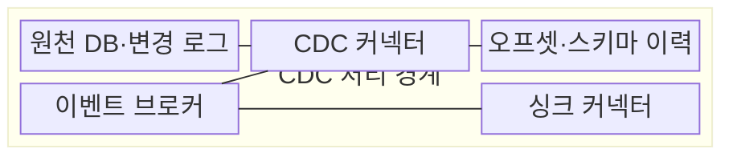
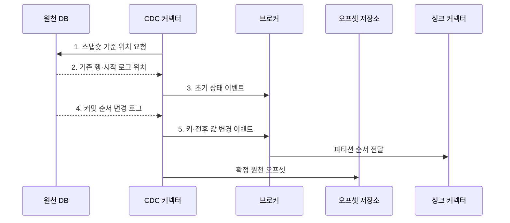

---
sidebar:
  order: 123
  label: "123. 변경 데이터 캡처 CDC (Change Data Capture)"
  badge:
    text: "미출 · 50%"
    variant: note
title: "변경 데이터 캡처 CDC (Change Data Capture)"
date: "2026-08-02T12:00:00+09:00"
tags:
  - "notes-software"
weight: 123
extra:
  question_no: "123"
  source_status: "미출"
  source_history: ""
  priority: 50
  priority_note: "CDC는 변경 이벤트·동기화 설계에 중요"
---

## Ⅰ. 개요

핵심 용어

- **증분 수집 기법**: 원천 데이터의 삽입·수정·삭제를 식별해 변경 이벤트로 추출하는 기법이다.

- 정의/개념: 원천 데이터의 삽입·수정·삭제를 변경 이벤트로 추출하는 **증분 수집 기법**
- 배경/필요성: 주기적 전체 복사는 데이터 증가 시 **원천 부하·동기화 지연** 확대

#### 한줄 요약
- 원본 장부를 매번 복사하지 않고 바뀐 부분만 찾아 다른 시스템에 전달함

## Ⅱ. 특징

핵심 용어

- **초기 스냅숏**: 기존 전체 상태와 후속 변경 로그 사이에 누락 없는 시작 경계를 만드는 과정이다.

- **초기 스냅숏**과 변경 로그 시작 위치의 연속성 보장
- 확정된 **원천 오프셋**부터 변경 로그 재생
- 시점별 **스키마 이력**으로 과거 변경값 해석

#### 한줄 요약
- CDC는 첫 전체 복사와 이후 로그 사이의 빈 구간을 없애고 마지막 확정 위치부터 안전하게 다시 읽어야 함

## Ⅲ. 구조 및 구성요소

핵심 용어

- **오프셋·스키마 이력**: 재시작 로그 위치와 시점별 테이블 구조를 보존하는 구성요소이다.

| 구성요소 | 책임 |
|:---|:---|
| 원천 DB·변경 로그 | 커밋된 **삽입·수정·삭제** 기록 제공 |
| CDC 커넥터 | 원천 로그를 **변경 이벤트**로 변환 |
| 오프셋·스키마 이력 | **재시작 위치·시점별 구조** 보존 |
| 이벤트 브로커 | 변경 이벤트의 **순서·재생** 보장 |
| 싱크 커넥터 | 대상 시스템에 **멱등 반영** |

#### 한줄 요약

- 원본 장부, 일지 판독기, 책갈피, 전달 일지, 대상 반영기로 구성된다.

## Ⅳ. 흐름도

핵심 용어

- **4. 커밋 순서 변경 로그**: 트랜잭션이 확정된 순서대로 행의 삽입·수정·삭제를 제공하는 입력이다.

**동작 원리**

1. **스냅숏 기준 위치 요청**: 초기 행과 이후 로그를 잇는 일관된 경계 지정
2. **기존 행·시작 로그 위치**: 기준 시점의 전체 상태와 후속 로그 시작점 반환
3. **초기 상태 이벤트**: 기존 행을 대상 시스템의 기준 상태로 변환
4. **커밋 순서 변경 로그**: 트랜잭션 커밋 순서대로 삽입·수정·삭제 변화 제공
5. **키·전후 값 변경 이벤트**: 키·변경값·스키마·원천 위치를 브로커에 보존

#### 한줄 요약

- 첫 전체 복사의 끝과 변경 일지의 시작을 맞추고 마지막 발행 위치를 책갈피로 남긴다.

## Ⅴ. 종류 및 비교

핵심 용어

- **로그 기반 CDC**: 원천 변경 로그의 커밋 순서를 판독해 변경 이벤트를 추출하는 방식이다.

| CDC 방식 | 로그 기반 CDC | 트리거 기반 CDC | 쿼리 기반 CDC |
|:---|:---|:---|:---|
| 적용 기준 | 원천 **변경 로그 접근** 가능 | 원천에 **트리거 설치** 가능 | 변경량이 적고 **주기 조회** 허용 |
| 핵심 특징 | 복구 로그의 **커밋 순서** 판독 | 트리거가 **변경표** 자동 기록 | 수정 시각 기준 **증분 쿼리** |
| 한계 | 로그 만료·**제품 종속성** | 원천 쓰기 지연·**트리거 누락** | 조회 경계 경쟁·**삭제 누락** |

#### 한줄 요약

- 변경 일지를 읽는 방식이 가장 자연스럽지만 권한이 없으면 표식이나 주기 조회를 사용한다.

## Ⅵ. 실무 고려사항 및 대책

핵심 용어

- **오래된 행 잔존**: 원천에서 지운 레코드가 대상 시스템에는 계속 남는 문제이다.

| 문제 | 대책 | 효과 |
|:---|:---|:---|
| 스냅숏 중 변경 로그를 놓치면 **초기 상태 누락** 발생 | 기준 위치 고정과 **버퍼·대사 검증** | 초기·후속 변경의 **연속성** 보장 |
| 중단 시간이 로그 보존 기간보다 길면 **재시작 위치 만료** | 최대 중단 시간보다 긴 **로그 보존 기간** 설정 | 전체 재수집 없는 **로그 재생** 보장 |
| 같은 키의 변경 순서가 뒤집히면 **과거 값 재반영** | 업무 키별 **원천 버전 비교** | 최신 상태의 **순서 일관성** 유지 |
| 삭제 이벤트가 빠지면 대상에 **오래된 행 잔존** | **툼스톤·삭제 이벤트** 전달과 원천 대사 | 대상 시스템의 **삭제 상태** 동기화 |

#### 한줄 요약

- 같은 원본 키와 최신 변경 번호로 검색 문서를 고치고 삭제까지 전달해야 오래된 결과가 남지 않는다.

## Ⅶ. 결론

핵심 용어

- **트리거·쿼리 방식**: 변경 로그에 접근할 수 없을 때 변경량과 원천 제약에 따라 선택하는 CDC 방식이다.

- 로그 접근 권한이 있으면 **로그 기반 CDC**, 없으면 변경량에 따라 **트리거·쿼리 방식** 선택

#### 한줄 요약

- 첫 복사와 변경 일지의 경계, 마지막 책갈피, 삭제와 구조 변경까지 맞아야 한다.
