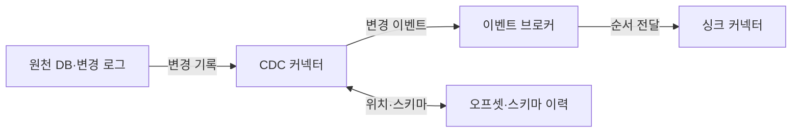
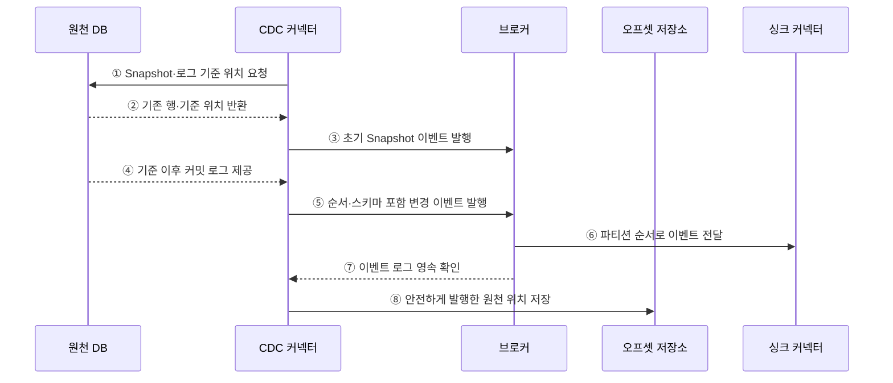

---
sidebar:
  order: 123
  label: "123. 변경 데이터 캡처 CDC (Change Data Capture)"
  badge:
    text: "미출제 · 50%"
    variant: note
title: "변경 데이터 캡처 CDC (Change Data Capture)"
date: "2026-07-25T11:16:00+09:00"
tags:
  - "notes-software"
weight: 123
extra:
  question_no: "123"
  source_status: "미출제"
  source_history: ""
  priority: 50
  priority_note: "CDC는 변경 이벤트·동기화 설계에 중요"
---

## 미리 알고가기

- **데이터베이스(Database, DB)**: 영문 앞뒤 글자를 딴 DB를 '디비'로 읽으며 CDC가 읽을 원천 행과 변경 로그를 보존함
- **변경 데이터 캡처(Change Data Capture, CDC)**: 영문 첫 글자를 딴 CDC를 '시디시'로 읽으며 데이터베이스의 삽입·수정·삭제를 이벤트로 추출함
- **변경 로그(Change Log)**: 데이터베이스가 복구·복제를 위해 기록하는 트랜잭션 이력임
- **초기 스냅숏(Initial Snapshot)**: 기존 전체 데이터를 읽어 변경 스트림의 시작 기준을 만드는 과정임
- **로그 순서 번호(Log Sequence Number, LSN)**: 영문 첫 글자를 딴 LSN을 '엘에스엔'으로 읽으며 SQL Server·PostgreSQL 로그의 변경 순서와 재시작 위치를 식별함
- **시스템 변경 번호(System Change Number, SCN)**: 영문 첫 글자를 딴 SCN을 '에스시엔'으로 읽으며 Oracle에서 커밋된 변경 순서를 식별함
- **구조적 질의 언어(Structured Query Language, SQL)**: 영문 첫 글자를 딴 SQL을 '에스큐엘'로 읽으며 SQL Server·MySQL 같은 관계형 데이터베이스 제품명에 쓰임
- **바이너리 로그 위치(Binary Log Position)**: '마이에스큐엘'로 읽는 MySQL 로그에서 CDC가 다시 읽을 파일과 위치임
- **변경 이벤트(Change Event)**: 삽입·수정·삭제 종류, 테이블, 키, 변경값과 거래 메타데이터를 표현한 이벤트임
- **스키마 이력(Schema History)**: 과거 변경 로그를 당시 테이블 구조로 해석할 수 있게 구조 변화를 보존한 기록임
- **CDC 커넥터(CDC Connector)**: 원천 변경 로그를 읽어 공통 변경 이벤트로 변환·발행하는 구성요소임
- **이벤트 브로커(Event Broker)**: 변경 이벤트를 보존하고 생산자와 여러 소비자를 분리하는 시스템임
- **오프셋(Offset)**: CDC 커넥터가 발행을 완료하고 재시작할 로그 위치를 나타내는 값임
- **싱크 커넥터(Sink Connector)**: 변경 이벤트를 검색 색인·분석 저장소 등 대상 시스템에 반영하는 구성요소임
- **멱등 반영(Idempotent Apply)**: 같은 변경 이벤트를 여러 번 적용해도 대상의 최종 상태가 같게 하는 처리임
- **데이터베이스 트리거(Database Trigger)**: 특정 테이블의 삽입·수정·삭제 때 데이터베이스가 자동 실행하는 절차임

## Ⅰ. 개요

- CDC는 데이터베이스의 커밋된 삽입·수정·삭제를 변경 이벤트로 추출해 다른 시스템에 전달하는 기법이다.
- 전체 테이블을 반복 복사하지 않고 변경분만 전달해 동기화 지연과 원천 조회 부하를 줄인다.

### 쉽게 이해하기 (학습용)
- 원본 장부를 매번 복사하지 않고 바뀐 부분만 찾아 다른 시스템에 전달함

## Ⅱ. 특징

- **초기 경계**: 전체 Snapshot과 그 이후 변경 로그의 위치를 연결해 빈 구간을 막는다.
- **변경 의미**: 연산 종류·키·전후 값·트랜잭션 순서를 이벤트에 담는다.
- **재시작**: 발행을 확인한 로그 위치를 저장해 장애 후 재생 범위를 결정한다.
- **스키마 해석**: 로그 시점의 스키마 이력으로 열 추가·삭제·타입 변경을 해석한다.

### 쉽게 이해하기 (학습용)
- CDC는 첫 전체 복사와 이후 로그 사이의 빈 구간을 없애고 마지막 확정 위치부터 안전하게 다시 읽어야 함

## Ⅲ. 아키텍처 및 구성요소

**도표안 A — 구조도**

**도표안 B — sequenceDiagram**

| 구성요소 | 역할 |
|:---|:---|
| 원천 DB·변경 로그 | Snapshot 데이터와 커밋 순서·삭제 기록 제공 |
| CDC 커넥터 | 제품별 로그를 공통 변경 이벤트로 변환 |
| 오프셋·스키마 이력 | 재시작 위치와 시점별 로그 해석 구조 저장 |
| 이벤트 브로커 | 변경 이벤트 보존·순서·다중 소비자 분리 |
| Sink 커넥터 | 키·버전으로 대상 시스템에 멱등 반영 |

**동작 원리**

- ① CDC 커넥터가 초기 Snapshot과 이어질 로그 기준 위치를 요청한다.
- ② 원천 DB가 일관된 기존 행과 해당 기준 위치를 반환한다.
- ③ 커넥터가 기존 행을 초기 상태 이벤트로 브로커에 발행한다.
- ④ Snapshot 기준 이후의 커밋 로그를 순서대로 읽는다.
- ⑤ 커넥터가 연산·키·값·스키마·순서 정보를 변경 이벤트로 발행한다.
- ⑥ 브로커가 같은 키의 파티션 순서로 Sink에 전달한다.
- ⑦ 브로커가 변경 이벤트의 로그 영속 완료를 커넥터에 확인한다.
- ⑧ 커넥터가 브로커에 안전하게 발행한 원천 로그 위치를 저장한다.

### 쉽게 이해하기 (학습용)

- 첫 전체 복사의 끝과 변경 일지의 시작을 맞추고 마지막 발행 위치를 책갈피로 남긴다.

## Ⅳ. 종류 및 비교

| 비교 항목 | 로그 기반 CDC | 트리거 기반 CDC | 쿼리 기반 CDC |
|:---|:---|:---|:---|
| 포착 원리 | 복구·복제 로그 순차 판독 | DML Trigger가 별도 변경표 기록 | 수정 시각·증가 키로 주기 조회 |
| 장점 | 낮은 원천 질의 부하·삭제·순서 포착 | 로그 API 없이 세밀한 이벤트 생성 | 구현이 단순하고 제품 의존이 적음 |
| 적합 조건 | 로그 접근과 운영 권한 확보 | 트리거 허용·쓰기량 통제 | 낮은 변경량·삭제 별도 처리 |
| 주요 위험 | 로그 만료·제품 종속·스키마 해석 | 쓰기 지연·Trigger 누락·재귀 | 경계 경쟁·반복 조회·삭제 누락 |

> CDC 이벤트는 업무 의도를 직접 담은 도메인 이벤트가 아니라 DB 행 변경 사실이므로 둘의 계약과 소비 목적을 구분해야 한다.

### 쉽게 이해하기 (학습용)

- 변경 일지를 읽는 방식이 가장 자연스럽지만 권한이 없으면 표식이나 주기 조회를 사용한다.

## Ⅴ. 실무 고려사항 및 대책

| 고려사항 | 위험 | 대책 |
|:---|:---|:---|
| Snapshot 경계 | 전체 복사와 로그 사이 누락·중복 | 일관된 기준 위치·버퍼·대사 검증 |
| 로그 보존 | 장기 장애 후 재시작 위치 만료 | 최대 중단시간보다 긴 보존·재Snapshot 절차 |
| 순서 | 파티션 분산·재시도로 변경 역전 | 업무 키 파티션·원천 위치·버전 비교 |
| 삭제 | 물리 삭제 이벤트 누락 | Tombstone·Delete 이벤트·대사 |
| 스키마 | 열 변경으로 역직렬화 실패 | Schema History·호환 규칙·단계적 DDL |
| 민감정보 | 변경 전후 값이 브로커에 확산 | 필드 필터·마스킹·암호화·보존 최소화 |

> **적용 사례**: 검색 색인은 원천 기본키와 로그 위치를 버전으로 사용해 생성·수정·삭제를 멱등 반영하고 주기적으로 원본과 대사한다.

### 쉽게 이해하기 (학습용)

- 같은 원본 키와 최신 변경 번호로 검색 문서를 고치고 삭제까지 전달해야 오래된 결과가 남지 않는다.

## Ⅵ. 결론

- CDC는 초기 Snapshot과 변경 로그를 연결해 DB 변경분을 재생 가능한 이벤트로 전달한다.
- 기준 위치·삭제·순서·스키마·멱등성·로그 보존을 종단에서 검증해야 신뢰할 수 있다.

### 쉽게 이해하기 (학습용)

- 첫 복사와 변경 일지의 경계, 마지막 책갈피, 삭제와 구조 변경까지 맞아야 한다.
