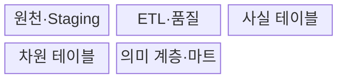
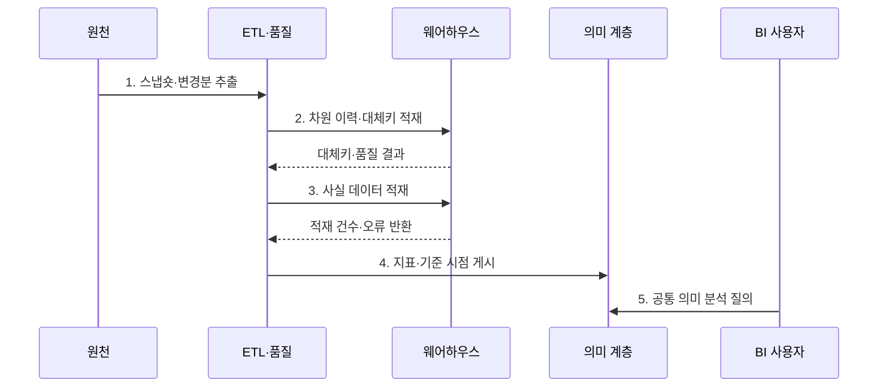

---
sidebar:
  order: 124
  label: "124. 데이터 웨어하우스 (Data Warehouse)"
  badge:
    text: "기출 · 30%"
    variant: note
title: "데이터 웨어하우스 (Data Warehouse)"
date: "2026-07-30T20:00:00+09:00"
tags:
  - "notes-software"
weight: 124
extra:
  question_no: "124"
  source_status: "기출"
  source_history: "122회"
  priority: 30
  priority_note: "122회 기출, 분석 저장소 구조의 기본"
---

## 미리 알고가기

- **온라인 트랜잭션 처리(Online Transaction Processing, OLTP)**: 영문 첫 글자를 딴 OLTP를 '오엘티피'로 읽으며 짧은 거래로 현재 업무 데이터를 처리한다.
- **온라인 분석 처리(Online Analytical Processing, OLAP)**: 영문 첫 글자를 딴 OLAP를 '오엘에이피'로 읽으며 이력 데이터를 여러 관점에서 대량 집계한다.
- **데이터 웨어하우스(Data Warehouse, DW)**: 영문 첫 글자를 딴 DW를 '디더블유'로 읽으며 여러 원천의 이력을 공통 기준으로 통합해 분석에 제공한다.
- **사실 테이블(Fact Table)**: 측정값과 차원 키를 저장하는 분석 모델의 중심 테이블이다.
- **차원 테이블(Dimension Table)**: 시간·고객·상품처럼 측정값을 분류하는 설명 속성을 저장한다.
- **스키마 온 라이트(Schema-on-Write)**: 저장 전에 목표 스키마와 품질 규칙으로 데이터를 변환하는 방식이다.
- **완만하게 변하는 차원(Slowly Changing Dimension, SCD)**: 영문 첫 글자를 딴 SCD를 '에스시디'로 읽으며 차원 속성의 변경 이력을 보존한다.
- **추출·변환·적재(Extract, Transform, Load, ETL)**: 영문 첫 글자를 처리 순서대로 딴 ETL을 '이티엘'로 읽으며 원천을 추출·변환해 목표 저장소에 적재한다.
- **스테이징 영역(Staging Area)**: 원천별 추출 데이터를 변환·검사 전에 임시 저장하는 영역이다.
- **데이터 품질(Data Quality)**: 데이터가 정확성·완전성·일관성·유효성 기준을 만족하는 정도이다.
- **열 지향 저장(Columnar Storage)**: 같은 열의 값을 모아 저장해 압축과 대량 집계를 효율화하는 방식이다.
- **의미 계층(Semantic Layer)**: 원천 열을 매출·고객 수 같은 공통 업무 지표와 용어로 제공하는 계층이다.
- **데이터 마트(Data Mart)**: 특정 부서나 분석 주제에 필요한 데이터를 따로 구성한 분석 저장 영역이다.
- **데이터 거버넌스(Data Governance)**: 데이터 정의·품질·소유권·접근·수명주기를 조직적으로 통제하는 체계이다.

## Ⅰ. 개요

- 정의/개념: 여러 원천 이력을 공통 정의로 통합한 **분석 DB**
- 배경/필요성: 운영 부하 분리와 지표 기준 일원화

### 쉽게 이해하기 (학습용)
- 여러 장부를 공통 기준과 이력으로 정리해 보고서를 만드는 저장소임

## Ⅱ. 특징

- **주제 통합**: 코드·단위·키를 공통화
- **이력 보존**: 기준 시점·유효 기간 유지
- **분석 최적화**: 사실·차원·열 저장 활용

### 쉽게 이해하기 (학습용)
- 데이터 웨어하우스는 여러 부서가 같은 지표 정의를 쓰게 하지만 원천 적재가 늦으면 보고서의 최신 시점도 늦어짐

## Ⅲ. 구조 및 구성요소

| 구성요소 | 책임 |
|:---|:---|
| 원천·Staging | Snapshot·변경분 보관 |
| ETL·품질 | 표준화·중복·누락 검사 |
| 사실 테이블 | 측정값·시점·차원 키 |
| 차원 테이블 | 설명 속성·변경 이력 |
| 의미 계층·마트 | 공통 지표·권한 제공 |

### 쉽게 이해하기 (학습용)

- 원천 보관함, 정제소, 측정 장부, 분류표, 공통 지표 화면으로 구성된다.

## Ⅳ. 흐름도

**동작 원리**

- **1. 스냅숏·변경분 추출**: 기준 시점과 증분 범위를 고정해 원천 데이터 수집
- **2. 차원 이력·대체키 적재**: 업무 기준정보의 유효 기간을 보존하고 연결 키 생성
- **3. 사실 데이터 적재**: 검증된 차원 키에 측정값과 발생 시점을 연결
- **4. 지표·기준 시점 게시**: 적재 대사 후 공통 계산식과 데이터 최신 시점 공개
- **5. 공통 의미 분석 질의**: BI 사용자가 승인된 차원·지표 정의로 일관된 집계 수행

### 쉽게 이해하기 (학습용)

- 서로 다른 이름표를 공통 분류표에 맞춘 뒤 거래 이력을 쌓아 같은 매출 지표를 제공한다.

## Ⅴ. 종류 및 비교

| 판단 기준 | 데이터 웨어하우스 | OLTP DB | 데이터 레이크 |
|:---|:---|:---|
| 적용 기준 | 통합 이력·분석 | 현재 거래 처리 | 원시 데이터 보존 |
| 핵심 특징 | 사실·차원·열 저장 | 정규화 행·인덱스 | 객체·파일·읽기 스키마 |
| 한계 | 적재 지연·모델 비용 | 분석 부하·이력 통합 | 품질·발견성·작은 파일 |

> 선택 기준: 제품 이름보다 **저장 형식·거버넌스·질의 보장** 확인

### 쉽게 이해하기 (학습용)

- OLTP는 지금 거래를 처리하고 웨어하우스는 정리된 이력을 분석하며 레이크는 원본을 넓게 보관한다.

## Ⅵ. 실무 고려사항 및 대책

| 고려사항 | 대책 | 효과 |
|:---|:---|:---|
| Grain | 최소 측정 단위 명시 | 한 행 의미 통일 |
| 차원 이력 | SCD·유효 기간 설계 | 과거 상태 보존 |
| 지표 정의 | 공식·필터·소유자 등록 | 부서별 계산 일치 |
| 적재 품질 | 원천 대사·임계치·격리 | 누락·중복 탐지 |
| 최신성 | Watermark·완료 시점 노출 | 보고 시점 혼동 방지 |

> **적용 사례**: 주문 한 건을 사실 Grain으로 정하고 상품·고객·시간 차원의 유효 시점을 연결해 당시 분류 기준의 매출을 계산

### 쉽게 이해하기 (학습용)

- 한 행이 무엇을 뜻하고 어느 시점의 분류를 쓰는지 정해야 과거 매출이 바뀌지 않는다.

## Ⅶ. 결론

- **사실 Grain·차원 이력·지표 정의·데이터 시점**으로 DW를 설계

### 쉽게 이해하기 (학습용)

- 같은 숫자의 뜻·출처·기준 시점을 모두 설명할 수 있어야 믿을 수 있는 분석 저장소이다.
