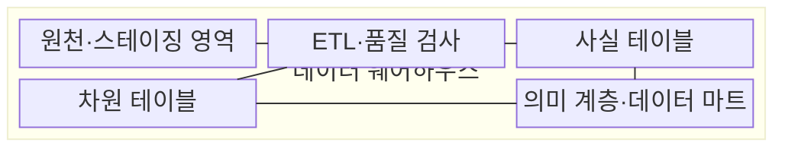
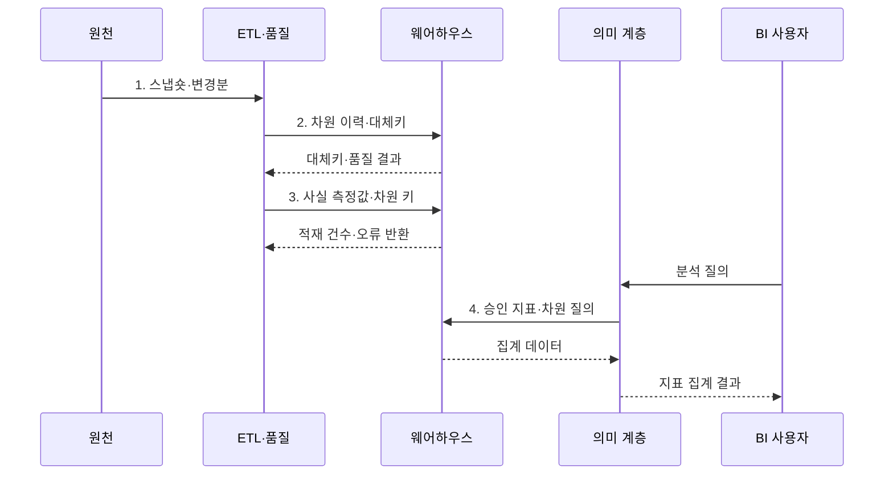

---
sidebar:
  order: 124
  label: "124. 데이터 웨어하우스 (Data Warehouse)"
  badge:
    text: "기출 · 30%"
    variant: note
title: "데이터 웨어하우스 (Data Warehouse)"
date: "2026-07-30T23:43:39+09:00"
tags:
  - "notes-software"
weight: 124
extra:
  question_no: "124"
  source_status: "기출"
  source_history: "122회"
  priority: 30
  priority_note: "122회 기출, 분석 저장소 구조의 기본"
---

## 미리 알고가기

- **온라인 트랜잭션 처리(Online Transaction Processing, OLTP)**: 짧은 거래를 빠르게 기록해 현재 업무 데이터를 처리하는 방식이다.
- **온라인 분석 처리(Online Analytical Processing, OLAP)**: 이력 데이터를 여러 관점에서 대량 집계하는 분석 방식이다.
- **데이터 웨어하우스(Data Warehouse, DW)**: 여러 원천의 이력을 공통 업무 기준으로 통합해 분석에 제공하는 저장소이다.
- **사실 테이블(Fact Table)**: 측정값과 차원 키를 저장하는 분석 모델의 중심 테이블이다.
- **차원 테이블(Dimension Table)**: 시간·고객·상품처럼 측정값을 분류하는 설명 속성을 저장한다.
- **스키마 온 라이트(Schema-on-Write)**: 저장 전에 목표 스키마와 품질 규칙으로 데이터를 변환하는 방식이다.
- **완만하게 변하는 차원(Slowly Changing Dimension, SCD)**: 차원 속성이 바뀐 시점과 과거 값을 보존하는 이력 관리 방식이다.
- **추출·변환·적재(Extract, Transform, Load, ETL)**: 원천 데이터를 추출·변환한 뒤 목표 저장소에 적재하는 처리 방식이다.
- **스테이징 영역(Staging Area)**: 원천별 추출 데이터를 변환·검사 전에 임시 저장하는 영역이다.
- **데이터 품질(Data Quality)**: 데이터가 정확성·완전성·일관성·유효성 기준을 만족하는 정도이다.
- **열 지향 저장(Columnar Storage)**: 같은 열의 값을 모아 저장해 압축과 대량 집계를 효율화하는 방식이다.
- **의미 계층(Semantic Layer)**: 원천 열을 매출·고객 수 같은 공통 업무 지표와 용어로 제공하는 계층이다.
- **데이터 마트(Data Mart)**: 특정 부서나 분석 주제에 필요한 데이터를 따로 구성한 분석 저장 영역이다.
- **데이터 거버넌스(Data Governance)**: 데이터 정의·품질·소유권·접근·수명주기를 조직적으로 통제하는 체계이다.
- **사실 그레인(Fact Grain)**: 사실 테이블 한 행이 나타내는 최소 업무 사건이나 측정 단위이다.
- **대체키(Surrogate Key)**: 원천 업무 키와 분리해 차원 행의 버전과 사실 데이터를 연결하는 내부 식별자이다.
- **데이터 레이크(Data Lake)**: 정형·반정형·비정형 원시 데이터를 원본 형식에 가깝게 보존하는 저장소이다.

> **키워드:** 데이터 웨어하우스 (Data Warehouse)

## Ⅰ. 개요

- 정의/개념: 여러 원천 이력을 공통 업무 정의로 통합해 분석하는 **데이터베이스**
- 배경/필요성: 운영 DB 직접 집계는 **거래 성능 저하·지표 불일치** 유발

### 쉽게 이해하기 (학습용)
- 여러 부서의 장부를 같은 항목표와 시간축으로 다시 묶어 하나의 보고서를 만드는 분석 창고이다.

## Ⅱ. 특징

- 원천별 코드·단위·키를 공통화하는 **주제 지향 통합**
- 기준 시점과 유효 기간을 유지하는 **시계열 이력 보존**
- **사실·차원 모델**과 열 지향 저장을 통한 대량 집계 최적화

### 쉽게 이해하기 (학습용)
- 데이터 웨어하우스는 여러 부서가 같은 지표 정의를 쓰게 하지만 원천 적재가 늦으면 보고서의 최신 시점도 늦어짐

## Ⅲ. 구조 및 구성요소

| 구성요소 | 책임 |
|:---|:---|
| 원천·스테이징 영역 | 원천별 **스냅숏·변경분** 임시 보관 |
| ETL·품질 검사 | 코드 표준화와 **중복·누락** 검사 |
| 사실 테이블 | 업무 사건의 **측정값·시점·차원 키** 저장 |
| 차원 테이블 | 설명 속성과 **변경 이력** 저장 |
| 의미 계층·데이터 마트 | 공통 **업무 지표·조회 권한** 제공 |

### 쉽게 이해하기 (학습용)

- 원천 보관함, 정제소, 측정 장부, 분류표, 공통 지표 화면으로 구성된다.

## Ⅳ. 흐름도

**동작 원리**

1. **스냅숏·변경분**: 기준 시점과 증분 범위를 고정해 원천 데이터 수집
2. **차원 이력·대체키**: 업무 기준정보의 유효 기간을 보존하고 연결 키 생성
3. **사실 측정값·차원 키**: 검증된 차원 버전과 측정값·발생 시점 연결
4. **승인 지표·차원 질의**: 공통 계산식과 차원 정의로 일관된 집계 수행

### 쉽게 이해하기 (학습용)

- 서로 다른 이름표를 공통 분류표에 맞춘 뒤 거래 이력을 쌓아 같은 매출 지표를 제공한다.

## Ⅴ. 종류 및 비교

| 분석 저장소 | 데이터 웨어하우스 | OLTP DB | 데이터 레이크 |
|:---|:---|:---|
| 적용 기준 | 공통 지표 기반 **통합 이력 분석** | 짧은 거래의 **현재 상태 처리** | 다양한 **원시 데이터 보존** |
| 핵심 특징 | **사실·차원 모델·열 저장** | 정규화 행과 **트랜잭션 인덱스** | 객체 파일과 **읽기 시점 스키마** |
| 한계 | **적재 지연·차원 모델** 설계 비용 | 분석 부하로 **거래 성능 저하** | **품질·발견성·작은 파일** 관리 부담 |

### 쉽게 이해하기 (학습용)

- OLTP는 지금 거래를 처리하고 웨어하우스는 정리된 이력을 분석하며 레이크는 원본을 넓게 보관한다.

## Ⅵ. 실무 고려사항 및 대책

| 고려사항 | 대책 | 효과 |
|:---|:---|:---|
| 한 행의 업무 사건이 다르면 **중복 집계** 발생 | 최소 측정 단위인 **사실 그레인** 명시 | 사실 테이블의 **행 의미** 통일 |
| 현재 차원값으로 과거 사실을 연결하면 **이력 왜곡** 발생 | **SCD·유효 기간** 기반 차원 이력 설계 | 사실 발생 당시의 **차원 상태** 보존 |
| 부서별 계산식·필터가 다르면 **지표 불일치** 발생 | **지표 공식·필터·소유자** 등록 | 조직별 **지표 계산** 일치 |
| 원천 건수와 적재 건수가 다르면 **누락·중복** 은폐 | **원천 대사·오류 격리** 적용 | 적재 오류의 **탐지·재처리** 가능 |

### 쉽게 이해하기 (학습용)

- 한 행이 무엇을 뜻하고 어느 시점의 분류를 쓰는지 정해야 과거 매출이 바뀌지 않는다.

## Ⅶ. 결론

- 공통 지표와 이력 분석이 필요하면 **사실 그레인·차원 이력**을 고정한 웨어하우스 구축

### 쉽게 이해하기 (학습용)

- 같은 숫자의 뜻·출처·기준 시점을 모두 설명할 수 있어야 믿을 수 있는 분석 저장소이다.
