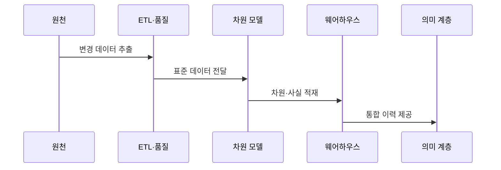

---
sidebar:
  order: 124
  label: "124. 데이터 웨어하우스 (Data Warehouse)"
  badge:
    text: "기출 · 30%"
    variant: note
title: "데이터 웨어하우스 (Data Warehouse)"
date: "2026-07-27T23:59:59+09:00"
tags:
  - "notes-software"
weight: 124
extra:
  question_no: "124"
  source_status: "기출"
  source_history: "122회"
  priority: 30
  priority_note: "122회 기출, 분석 저장소 구조의 기본"
---

## 미리 알고가기

- **온라인 트랜잭션 처리(Online Transaction Processing, OLTP)**: 영문 첫 글자를 딴 OLTP를 '오엘티피'로 읽으며 짧은 거래로 현재 업무 데이터를 처리함
- **온라인 분석 처리(Online Analytical Processing, OLAP)**: 영문 첫 글자를 딴 OLAP를 '오엘에이피'로 읽으며 이력 데이터를 여러 관점에서 대량 집계함
- **데이터 웨어하우스(Data Warehouse, DW)**: 영문 첫 글자를 딴 DW를 '디더블유'로 읽으며 여러 원천의 이력을 공통 기준으로 통합해 분석에 제공함
- **사실 테이블(Fact Table)**: 측정값과 차원 키를 저장하는 분석 모델의 중심 테이블임
- **차원 테이블(Dimension Table)**: 시간·고객·상품처럼 측정값을 분류하는 설명 속성을 저장함
- **스키마 온 라이트(Schema-on-Write)**: 저장 전에 목표 스키마와 품질 규칙으로 데이터를 변환하는 방식임
- **완만하게 변하는 차원(Slowly Changing Dimension, SCD)**: 영문 첫 글자를 딴 SCD를 '에스시디'로 읽으며 차원 속성의 변경 이력을 보존함
- **추출·변환·적재(Extract, Transform, Load, ETL)**: 영문 첫 글자를 처리 순서대로 딴 ETL을 '이티엘'로 읽으며 원천을 추출·변환해 목표 저장소에 적재함
- **스테이징 영역(Staging Area)**: 원천별 추출 데이터를 변환·검사 전에 임시 저장하는 영역임
- **데이터 품질(Data Quality)**: 데이터가 정확성·완전성·일관성·유효성 기준을 만족하는 정도임
- **열 지향 저장(Columnar Storage)**: 같은 열의 값을 모아 저장해 압축과 대량 집계를 효율화하는 방식임
- **의미 계층(Semantic Layer)**: 원천 열을 매출·고객 수 같은 공통 업무 지표와 용어로 제공하는 계층임
- **데이터 마트(Data Mart)**: 특정 부서나 분석 주제에 필요한 데이터를 따로 구성한 분석 저장 영역임
- **데이터 거버넌스(Data Governance)**: 데이터 정의·품질·소유권·접근·수명주기를 조직적으로 통제하는 체계임

## Ⅰ. 개요

- 정의/개념: 주제별 **통합·시계열·비휘발성 분석 저장소**
- 기존 한계: 운영 DB 분석은 **거래 성능 저하·이력 통합 곤란**

### 쉽게 이해하기 (학습용)
- 여러 장부를 공통 기준과 이력으로 정리해 보고서를 만드는 저장소임

## Ⅱ. 특징

- **주제 중심·통합·시계열·비휘발성** 데이터
- **사실·차원 모델**로 측정값·분석 관점 분리
- **스키마 온 라이트·ETL**로 공통 품질 확보

### 쉽게 이해하기 (학습용)
- 데이터 웨어하우스는 여러 부서가 같은 지표 정의를 쓰게 하지만 원천 적재가 늦으면 보고서의 최신 시점도 늦어짐

## Ⅲ. 아키텍처 및 구성요소

| 설계 요소 | 설명 |
|:---|:---|
| 원천·스테이징 | 원천별 **추출 데이터 임시 저장** |
| ETL·품질 | **코드 변환·중복·누락** 검사 |
| 사실·차원 모델 | **측정값·분석 관점** 분리 |
| 웨어하우스 저장소 | 통합 이력의 **열 저장·병렬 질의** |
| 의미 계층·데이터 마트 | **공통 지표·접근 정책** 제공 |

> 요약: 원천을 정제해 사실·차원으로 분석한다

### 쉽게 이해하기 (학습용)
- 원천 데이터를 정제한 뒤 측정값은 사실 테이블에, 분석 기준은 차원 테이블에 나누어 저장한다

## Ⅳ. 원리 및 절차 흐름도

| 절차 | 설명 |
|:---|:---|
| 변경 데이터 추출 | 원천의 **변경분·적재 대상** 추출 |
| 표준 데이터 전달 | 형식·코드 통일과 **오류 격리** |
| 차원·사실 적재 | **차원 이력·사실 측정값** 저장 |
| 통합 이력 제공 | 의미 계층에 **공통 지표** 제공 |

> 요약: 원천을 공통 차원과 이력 사실로 통합한다

### 쉽게 이해하기 (학습용)
- 코드를 차원으로 맞추고 과거 사실을 보존해 지표를 계산함

## Ⅴ. 종류 및 비교

| 데이터 저장소 | 데이터 웨어하우스 | OLTP 데이터베이스 |
|:---|:---|:---|
| 적용 기준 | 이력 조회·**다차원 지표 분석** | 짧은 응답·**현재 거래 처리** |
| 핵심 특징 | 사실·차원의 **통합 이력 집계** | 정규화 모델의 **거래 무결성** |
| 한계 | 적재 지연·**지표 정의 불일치** | 분석 질의의 **운영 부하** |

> 요약: 운영 데이터를 공통 차원과 이력으로 통합해 지표를 제공함

### 쉽게 이해하기 (학습용)
- OLTP는 현재 거래 한 건을 빠르게 처리하고 데이터 웨어하우스는 기간별 이력을 대량 집계한다

## Ⅵ. 실무 사례

1. 수익 분석은 **주문 사실·공통 차원**으로 매출 계산

### 쉽게 이해하기 (학습용)
- 주문 측정값과 상품·시간 차원을 분리하면 여러 보고서가 같은 매출 정의와 분류 기준을 재사용할 수 있음

## Ⅶ. 결론

- 거래 처리는 **OLTP**, 통합 이력 분석은 **DW**

### 쉽게 이해하기 (학습용)
- 데이터 웨어하우스는 저장 용량보다 공통 지표의 정의·출처·시점·품질을 추적할 수 있을 때 분석 신뢰성을 제공함
