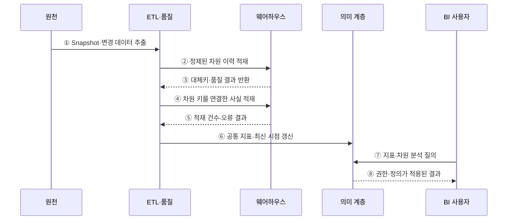

---
sidebar:
  order: 124
  label: "124. 데이터 웨어하우스 (Data Warehouse)"
  badge:
    text: "기출 · 30%"
    variant: note
title: "데이터 웨어하우스 (Data Warehouse)"
date: "2026-07-27T23:59:59+09:00"
tags:
  - "notes-software"
weight: 124
extra:
  question_no: "124"
  source_status: "기출"
  source_history: "122회"
  priority: 30
  priority_note: "122회 기출, 분석 저장소 구조의 기본"
---

## 미리 알고가기

- **온라인 트랜잭션 처리(Online Transaction Processing, OLTP)**: 영문 첫 글자를 딴 OLTP를 '오엘티피'로 읽으며 짧은 거래로 현재 업무 데이터를 처리함
- **온라인 분석 처리(Online Analytical Processing, OLAP)**: 영문 첫 글자를 딴 OLAP를 '오엘에이피'로 읽으며 이력 데이터를 여러 관점에서 대량 집계함
- **데이터 웨어하우스(Data Warehouse, DW)**: 영문 첫 글자를 딴 DW를 '디더블유'로 읽으며 여러 원천의 이력을 공통 기준으로 통합해 분석에 제공함
- **사실 테이블(Fact Table)**: 측정값과 차원 키를 저장하는 분석 모델의 중심 테이블임
- **차원 테이블(Dimension Table)**: 시간·고객·상품처럼 측정값을 분류하는 설명 속성을 저장함
- **스키마 온 라이트(Schema-on-Write)**: 저장 전에 목표 스키마와 품질 규칙으로 데이터를 변환하는 방식임
- **완만하게 변하는 차원(Slowly Changing Dimension, SCD)**: 영문 첫 글자를 딴 SCD를 '에스시디'로 읽으며 차원 속성의 변경 이력을 보존함
- **추출·변환·적재(Extract, Transform, Load, ETL)**: 영문 첫 글자를 처리 순서대로 딴 ETL을 '이티엘'로 읽으며 원천을 추출·변환해 목표 저장소에 적재함
- **스테이징 영역(Staging Area)**: 원천별 추출 데이터를 변환·검사 전에 임시 저장하는 영역임
- **데이터 품질(Data Quality)**: 데이터가 정확성·완전성·일관성·유효성 기준을 만족하는 정도임
- **열 지향 저장(Columnar Storage)**: 같은 열의 값을 모아 저장해 압축과 대량 집계를 효율화하는 방식임
- **의미 계층(Semantic Layer)**: 원천 열을 매출·고객 수 같은 공통 업무 지표와 용어로 제공하는 계층임
- **데이터 마트(Data Mart)**: 특정 부서나 분석 주제에 필요한 데이터를 따로 구성한 분석 저장 영역임
- **데이터 거버넌스(Data Governance)**: 데이터 정의·품질·소유권·접근·수명주기를 조직적으로 통제하는 체계임

## Ⅰ. 개요

- 데이터 웨어하우스는 여러 원천의 데이터를 공통 정의로 통합하고 시간 이력을 보존해 분석에 제공하는 주제 중심 저장소이다.
- 운영 DB와 분석 부하를 분리하고 사실·차원·의미 계층으로 조직의 지표 기준을 일관되게 제공한다.

### 쉽게 이해하기 (학습용)
- 여러 장부를 공통 기준과 이력으로 정리해 보고서를 만드는 저장소임

## Ⅱ. 특징

- **주제 중심**: 고객·상품·매출 등 분석 주제별로 데이터를 구성한다.
- **통합**: 원천마다 다른 코드·단위·키·형식을 공통 기준으로 변환한다.
- **시계열**: 기준 시점과 유효 기간을 보존해 과거 상태를 분석한다.
- **비휘발성**: 운영 거래처럼 계속 덮어쓰기보다 적재·이력 보존·통제된 정정을 중심으로 관리한다.
- **분석 최적화**: 열 지향 저장과 사실·차원 모델로 대량 집계에 맞춘다.

### 쉽게 이해하기 (학습용)
- 데이터 웨어하우스는 여러 부서가 같은 지표 정의를 쓰게 하지만 원천 적재가 늦으면 보고서의 최신 시점도 늦어짐

## Ⅲ. 아키텍처 및 구성요소

**도표안 A — 구조도**

**도표안 B — sequenceDiagram**

| 구성요소 | 역할 |
|:---|:---|
| 원천·Staging | 원천별 Snapshot·변경분 임시 보관 |
| ETL·품질 | 형식·코드·키 변환과 중복·누락·유효성 검사 |
| 사실 테이블 | 측정값·발생 시점·차원 키 저장 |
| 차원 테이블 | 분석 관점의 설명 속성과 변경 이력 저장 |
| 웨어하우스 저장 | 통합 이력의 열 저장·파티션·병렬 질의 |
| 의미 계층·마트 | 공통 지표·용어·권한·주제별 제공 |

**동작 원리**

- ① ETL이 원천의 초기 Snapshot 또는 확정된 변경분을 추출한다.
- ② 표준화·품질 검사를 통과한 차원 속성과 이력을 먼저 적재한다.
- ③ 웨어하우스가 차원 대체키와 적재 품질 결과를 반환한다.
- ④ ETL이 차원 키를 연결한 거래 측정값을 사실 테이블에 적재한다.
- ⑤ 웨어하우스가 적재 건수·거부 건수·처리 시점을 반환한다.
- ⑥ 의미 계층의 공통 지표와 데이터 최신 시점을 갱신한다.
- ⑦ BI 사용자가 지표를 시간·고객·상품 차원으로 분석한다.
- ⑧ 의미 계층이 권한과 공통 정의가 적용된 결과를 반환한다.

### 쉽게 이해하기 (학습용)

- 서로 다른 이름표를 공통 분류표에 맞춘 뒤 거래 이력을 쌓아 같은 매출 지표를 제공한다.

## Ⅳ. 종류 및 비교

| 비교 항목 | 데이터 웨어하우스 | OLTP DB | 데이터 레이크 |
|:---|:---|:---|
| 중심 목적 | 통합 이력·정형 분석 | 현재 거래 처리 | 원시·다형식 데이터 보존 |
| 스키마 시점 | 주로 저장 전 정의 | 거래 스키마 사전 정의 | 주로 읽기·활용 시 해석 |
| 저장 모델 | 사실·차원·열 지향 | 정규화 행·인덱스 | 객체·파일·테이블 형식 |
| 강점 | 공통 지표·대량 집계 | 짧은 원자 거래·무결성 | 저비용 원본 보존·유연성 |
| 주요 위험 | 적재 지연·모델·비용 | 분석 부하·이력 통합 | 품질·발견성·작은 파일 |

> 현대 플랫폼은 레이크와 웨어하우스 기능을 함께 제공할 수 있으므로 이름보다 실제 저장 형식·거버넌스·질의 보장을 확인해야 한다.

### 쉽게 이해하기 (학습용)

- OLTP는 지금 거래를 처리하고 웨어하우스는 정리된 이력을 분석하며 레이크는 원본을 넓게 보관한다.

## Ⅴ. 실무 고려사항 및 대책

| 고려사항 | 위험 | 대책 |
|:---|:---|:---|
| Grain | 사실 한 행의 의미가 혼재 | 거래·일·고객 등 최소 측정 단위 명시 |
| 차원 이력 | 현재 속성으로 과거까지 왜곡 | SCD 유형과 유효 시작·종료 시점 설계 |
| 지표 정의 | 부서별 매출 계산 불일치 | 의미 계층에 공식·필터·소유자 등록 |
| 적재 품질 | 누락·중복·지연이 보고서에 은폐 | 원천-적재 대사·품질 임계치·격리 |
| 최신성 | 보고 시점과 데이터 시점 혼동 | Watermark·적재 완료 시점 노출 |
| 비용·성능 | 무제한 스캔·중복 마트 | 파티션·클러스터링·집계·워크로드 격리 |

> **적용 사례**: 주문 한 건을 사실 Grain으로 정하고 상품·고객·시간 차원의 유효 시점을 연결해 당시 분류 기준의 매출을 계산한다.

### 쉽게 이해하기 (학습용)

- 한 행이 무엇을 뜻하고 어느 시점의 분류를 쓰는지 정해야 과거 매출이 바뀌지 않는다.

## Ⅵ. 결론

- 데이터 웨어하우스는 여러 원천의 이력을 공통 차원과 지표로 통합해 신뢰할 수 있는 분석을 제공한다.
- 사실 Grain·차원 이력·지표 정의·데이터 시점·품질 계보를 저장 성능보다 먼저 설계해야 한다.

### 쉽게 이해하기 (학습용)

- 같은 숫자의 뜻·출처·기준 시점을 모두 설명할 수 있어야 믿을 수 있는 분석 저장소이다.
