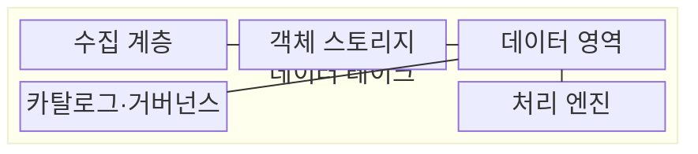
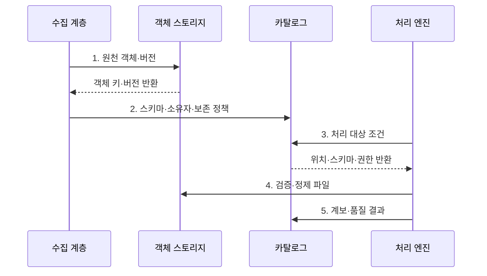

---
sidebar:
  order: 125
  label: "125. 데이터 레이크 (Data Lake)"
  badge:
    text: "기출 · 30%"
    variant: note
title: "데이터 레이크 (Data Lake)"
date: "2026-07-30T23:45:11+09:00"
tags:
  - "notes-software"
weight: 125
extra:
  question_no: "125"
  source_status: "기출"
  source_history: "122회"
  priority: 30
  priority_note: "122회 기출, 원천 데이터 저장 구조의 기본"
---

## 미리 알고가기

- **데이터 레이크(Data Lake)**: 정형·반정형·비정형 원천 데이터를 원형에 가깝게 보존해 여러 처리 목적에 제공하는 저장 체계이다.
- **객체 스토리지(Object Storage)**: 데이터를 버킷과 키로 식별하는 객체에 저장하고 연산과 독립적으로 용량을 확장하는 저장소이다.
- **버킷(Bucket)**: 객체를 논리적으로 모으고 접근·수명주기 정책을 적용하는 최상위 저장 단위이다.
- **객체 키(Object Key)**: 버킷 안에서 객체를 유일하게 식별하는 이름이다.
- **스키마 온 리드(Schema-on-Read)**: 데이터를 읽는 시점에 구조와 타입을 해석하는 방식이다.
- **랜딩 영역(Landing Zone)**: 원천 데이터를 변경하지 않고 처음 수용하는 저장 영역이다.
- **원천 영역(Raw Zone)**: 수집한 원천을 재처리할 수 있도록 표준 저장 형식으로 장기 보존하는 영역이다.
- **검증 영역(Curated Zone)**: 품질·형식·메타데이터를 정리해 재사용 가능한 데이터를 제공하는 영역이다.
- **데이터 카탈로그(Data Catalog)**: 데이터 위치·스키마·소유자·분류·계보 메타데이터를 검색 가능하게 관리하는 목록이다.
- **데이터 계보(Data Lineage)**: 데이터가 어느 원천에서 어떤 변환을 거쳐 결과가 되었는지 추적하는 정보이다.
- **데이터 거버넌스(Data Governance)**: 데이터 정의·품질·소유권·접근·수명주기를 조직적으로 통제하는 체계이다.
- **데이터 늪(Data Swamp)**: 품질·소유자·메타데이터가 없어 저장 데이터의 의미와 사용 가능성을 알기 어려운 상태이다.
- **작은 파일 문제(Small File Problem)**: 작은 파일이 너무 많아 목록 조회·작업 생성·메타데이터 처리 비용이 커지는 현상이다.
- **스키마 온 라이트(Schema-on-Write)**: 저장 전에 목표 구조와 품질 규칙에 맞춰 데이터를 변환하는 방식이다.
- **데이터 웨어하우스(Data Warehouse)**: 여러 원천의 이력을 공통 업무 정의로 통합해 정형 분석에 제공하는 저장소이다.
- **레이크하우스(Data Lakehouse)**: 객체 스토리지의 개방성과 데이터 웨어하우스의 테이블 관리 기능을 결합한 분석 구조이다.
- **원자성·일관성·격리성·지속성(Atomicity, Consistency, Isolation, Durability, ACID)**: 테이블 변경을 원자적으로 커밋하고 동시 작업과 장애 뒤에도 결과를 보존하는 트랜잭션 성질이다.

## Ⅰ. 개요

- 정의/개념: 다형식 원천을 원형에 가깝게 객체로 보존하는 **데이터 저장소**
- 배경/필요성: 사전 스키마 적재는 다양한 원천의 **원본 보존·재해석** 제약

### 쉽게 이해하기 (학습용)
- 문서·로그·사진을 원본 상자째 창고에 보관하고, 꺼내 쓸 때 목적에 맞는 구조로 해석한다.

## Ⅱ. 특징

- 파일·로그·이미지를 원형에 가깝게 보존하는 **다형식 수용**
- 소비 시점에 구조를 해석하는 **스키마 온 리드**
- 원천·검증 영역을 분리한 **데이터 신뢰 수준** 관리

### 쉽게 이해하기 (학습용)
- 원천을 많이 모아도 위치·의미·품질·소유자를 찾을 카탈로그가 없으면 재사용할 수 없는 데이터 늪이 됨

## Ⅲ. 구조 및 구성요소

| 구성요소 | 책임 |
|:---|:---|
| 수집 계층 | 파일·로그·**변경 데이터** 수용 |
| 객체 스토리지 | 원천·정제 데이터를 **객체·버전**으로 보존 |
| 데이터 영역 | 원천·검증 데이터의 **품질·사용 범위** 분리 |
| 카탈로그·거버넌스 | **스키마·계보·접근 정책** 관리 |
| 처리 엔진 | 데이터 **검사·변환·분석** 수행 |

### 쉽게 이해하기 (학습용)

- 수집기, 객체 창고, 품질 구역, 설명 목록, 처리 도구로 구성된다.

## Ⅳ. 흐름도

**동작 원리**

1. **원천 객체·버전**: 원본을 변경하지 않고 재현 가능한 객체 키·버전으로 보존
2. **스키마·소유자·보존 정책**: 데이터 의미와 관리 책임을 카탈로그에 연결
3. **처리 대상 조건**: 소비 목적에 맞는 위치·스키마·권한을 기준으로 탐색
4. **검증·정제 파일**: 품질 규칙과 조회 패턴에 맞춰 형식·파티션·파일 크기 조정
5. **계보·품질 결과**: 입력·변환·산출 관계와 검증 결과를 카탈로그에 공개

### 쉽게 이해하기 (학습용)

- 원본을 그대로 보관하고 이름표·설명·품질표를 붙인 뒤 믿고 쓸 수 있는 자료를 따로 공개한다.

## Ⅴ. 종류 및 비교

| 분석 저장소 | 데이터 레이크 | 데이터 웨어하우스 | 레이크하우스 |
|:---|:---|:---|
| 적용 기준 | 다양한 **원천 보존·재처리** | 정형 지표 기반 **이력 분석** | 객체 기반 **통합 분석** |
| 핵심 특징 | **스키마 온 리드·객체 파일** | **스키마 온 라이트·관리형 표** | 개방 테이블과 **ACID 메타데이터** |
| 한계 | **데이터 늪·작은 파일** 문제 | 모델 경직·**적재 지연** | 메타데이터 정리·**엔진 호환** 비용 |

### 쉽게 이해하기 (학습용)

- 레이크는 원본 창고, 웨어하우스는 정리된 분석 장부, 레이크하우스는 창고 위에 장부 규칙을 더한 구조이다.

## Ⅵ. 실무 고려사항 및 대책

| 고려사항 | 대책 | 효과 |
|:---|:---|:---|
| 원천·검증 데이터가 섞이면 **신뢰 수준** 식별 불가 | 영역별 **승격 기준·관리 책임** 명시 | 데이터의 **사용 가능 범위** 구분 |
| 소유자·스키마·계보가 없으면 **데이터 탐색** 실패 | **데이터 카탈로그**에 관리 메타데이터 등록 | 데이터의 **발견성·책임성** 향상 |
| 작은 파일이 누적되면 **목록 조회·작업 생성** 비용 증가 | 수집 배치와 **파일 병합** 적용 | **메타데이터·작업 계획** 비용 감소 |
| 품질 검사 없이 원천을 공개하면 **데이터 늪** 형성 | **데이터 계약·검증·격리** 적용 | 검증 영역의 **데이터 신뢰도** 유지 |

### 쉽게 이해하기 (학습용)

- 날짜 서랍과 적당한 파일 묶음을 만들면 필요한 기간만 빠르게 읽을 수 있다.

## Ⅶ. 결론

- 원본 재처리가 핵심이면 **카탈로그·품질 구역**을 갖춘 **데이터 레이크** 구축

### 쉽게 이해하기 (학습용)

- 많이 모으는 것보다 무엇인지 찾고 믿고 다시 쓸 수 있게 관리하는 것이 핵심이다.
