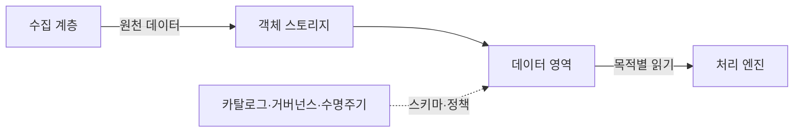
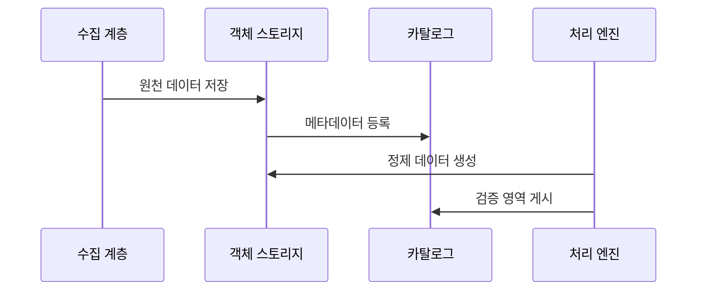

---
sidebar:
  order: 125
  label: "125. 데이터 레이크 (Data Lake)"
  badge:
    text: "기출 · 30%"
    variant: note
title: "데이터 레이크 (Data Lake)"
date: "2026-07-27T23:59:59+09:00"
tags:
  - "notes-software"
weight: 125
extra:
  question_no: "125"
  source_status: "기출"
  source_history: "122회"
  priority: 30
  priority_note: "122회 기출, 원천 데이터 저장 구조의 기본"
---

## 미리 알고가기

- **데이터 레이크(Data Lake)**: 정형·반정형·비정형 원천 데이터를 원형에 가깝게 보존해 여러 처리 목적에 제공하는 저장 체계임
- **객체 스토리지(Object Storage)**: 데이터를 버킷과 키로 식별하는 객체에 저장하고 연산과 독립적으로 용량을 확장하는 저장소임
- **버킷(Bucket)**: 객체를 논리적으로 모으고 접근·수명주기 정책을 적용하는 최상위 저장 단위임
- **객체 키(Object Key)**: 버킷 안에서 객체를 유일하게 식별하는 이름임
- **스키마 온 리드(Schema-on-Read)**: 데이터를 읽는 시점에 구조와 타입을 해석하는 방식임
- **랜딩 영역(Landing Zone)**: 원천 데이터를 변경하지 않고 처음 수용하는 저장 영역임
- **원천 영역(Raw Zone)**: 수집한 원천을 재처리할 수 있도록 표준 저장 형식으로 장기 보존하는 영역임
- **검증 영역(Curated Zone)**: 품질·형식·메타데이터를 정리해 재사용 가능한 데이터를 제공하는 영역임
- **데이터 카탈로그(Data Catalog)**: 데이터 위치·스키마·소유자·분류·계보 메타데이터를 검색 가능하게 관리하는 목록임
- **데이터 계보(Data Lineage)**: 데이터가 어느 원천에서 어떤 변환을 거쳐 결과가 되었는지 추적하는 정보임
- **데이터 거버넌스(Data Governance)**: 데이터 정의·품질·소유권·접근·수명주기를 조직적으로 통제하는 체계임
- **데이터 늪(Data Swamp)**: 품질·소유자·메타데이터가 없어 저장 데이터의 의미와 사용 가능성을 알기 어려운 상태임
- **작은 파일 문제(Small File Problem)**: 작은 파일이 너무 많아 목록 조회·작업 생성·메타데이터 처리 비용이 커지는 현상임
- **머신러닝(Machine Learning, ML)**: 영문 첫 글자를 딴 ML을 '엠엘'로 읽으며 레이크 데이터를 학습해 예측·분류하는 처리 목적임

## Ⅰ. 개요

- 정의/개념: 다양한 원천의 **원형 보존·읽기 시 구조화**
- 기존 한계: 고정 스키마 저장은 **비정형 수용·재처리 제약**

### 쉽게 이해하기 (학습용)
- 형식 다른 자료를 객체 창고에 보존하고 필요할 때 해석함

## Ⅱ. 특징

- **스키마 온 리드**로 다양한 원천 형식 수용
- **원형 보존·저장 연산 분리**로 재처리·확장 지원
- **카탈로그·계보·영역 관리**로 데이터 늪 방지

### 쉽게 이해하기 (학습용)
- 원천을 많이 모아도 위치·의미·품질·소유자를 찾을 카탈로그가 없으면 재사용할 수 없는 데이터 늪이 됨

## Ⅲ. 아키텍처 및 구성요소

| 설계 요소 | 설명 |
|:---|:---|
| 수집 계층 | 파일·로그·변경분을 **배치·스트림 수집** |
| 객체 스토리지 | 저장 용량을 **연산과 독립 확장** |
| 데이터 영역 | **원천·정제·검증 수준** 구분 |
| 카탈로그·거버넌스 | **메타데이터·접근·보존** 관리 |
| 처리 엔진 | 목적별 **읽기 스키마·연산** 적용 |

> 요약: 영역별 데이터와 카탈로그 및 거버넌스가 검색과 처리를 지원함

### 쉽게 이해하기 (학습용)
- 수집 계층이 원천 데이터를 객체 스토리지에 보존하고 카탈로그가 처리 엔진에 위치와 스키마를 알려 준다

## Ⅳ. 원리 및 절차 흐름도

| 절차 | 설명 |
|:---|:---|
| 원천 데이터 저장 | 변경 없이 **랜딩·원천 영역**에 보존 |
| 메타데이터 등록 | **스키마·분류·파티션** 기록 |
| 정제 데이터 생성 | **품질 검사·파일 크기** 최적화 |
| 검증 영역 게시 | 통과 데이터를 **검증 영역**에 공개 |

> 요약: 원천을 보존한 뒤 메타데이터와 품질 기준을 적용해 게시함

### 쉽게 이해하기 (학습용)
- 원형을 보존하고 목록과 품질 정보를 붙여 검증 영역에 게시함

## Ⅴ. 종류 및 비교

| 분석 데이터 저장소 | 데이터 레이크 | 데이터 웨어하우스 |
|:---|:---|:---|
| 적용 기준 | 비정형 탐색·**ML·재처리** | 공통 지표·**고속 집계** |
| 핵심 특징 | 원형 보존·**스키마 온 리드** | 사실·차원·**스키마 온 라이트** |
| 한계 | 데이터 늪·**작은 파일 문제** | 적재 지연·**모델 변경 비용** |

> 요약: 원천을 스토리지에 보존하고 카탈로그로 재사용 범위를 통제함

### 쉽게 이해하기 (학습용)
- 데이터 웨어하우스는 적재 전에 구조를 정하고 데이터 레이크는 원천을 보존한 뒤 읽을 때 구조를 적용한다

## Ⅵ. 실무 사례

1. **날짜 파티션·파일 병합**으로 로그 스캔 축소
2. **버전·계보**로 모델 학습 데이터 재현

### 쉽게 이해하기 (학습용)
- 로그 파일을 날짜별로 묶고 적정 크기로 합치면 필요한 기간만 읽고 작은 파일의 작업 준비 비용도 줄일 수 있음
- 학습 데이터의 버전·원천·변환 계보를 기록하면 모델 결과가 달라졌을 때 같은 입력을 다시 구성할 수 있음

## Ⅶ. 결론

- 원천 재처리는 **레이크**, 공통 지표는 **웨어하우스**

### 쉽게 이해하기 (학습용)
- 데이터 레이크의 가치는 저장량이 아니라 원천을 찾고 이해하고 재처리할 수 있게 하는 카탈로그·품질·계보·수명주기에 달려 있음
