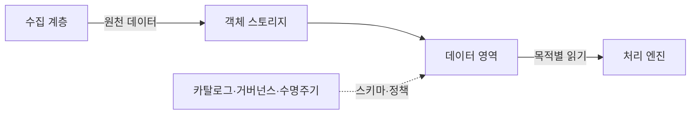
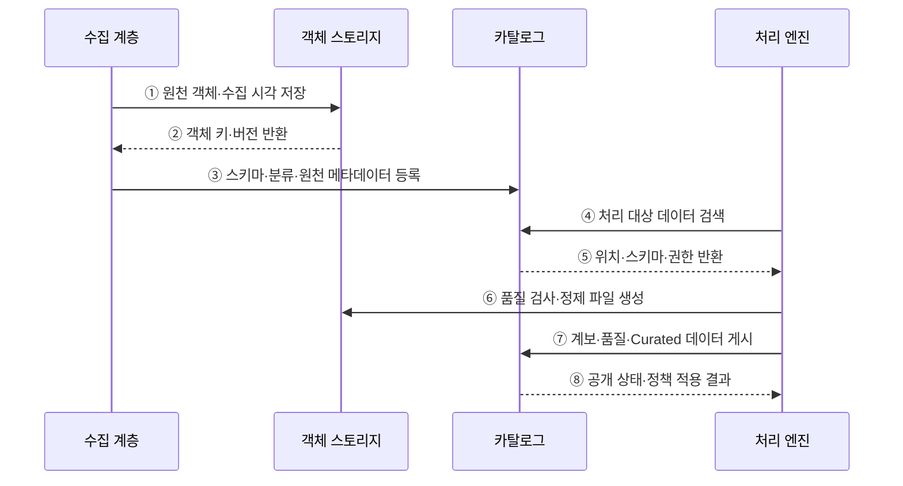

---
sidebar:
  order: 125
  label: "125. 데이터 레이크 (Data Lake)"
  badge:
    text: "기출 · 30%"
    variant: note
title: "데이터 레이크 (Data Lake)"
date: "2026-07-27T23:59:59+09:00"
tags:
  - "notes-software"
weight: 125
extra:
  question_no: "125"
  source_status: "기출"
  source_history: "122회"
  priority: 30
  priority_note: "122회 기출, 원천 데이터 저장 구조의 기본"
---

## 미리 알고가기

- **데이터 레이크(Data Lake)**: 정형·반정형·비정형 원천 데이터를 원형에 가깝게 보존해 여러 처리 목적에 제공하는 저장 체계임
- **객체 스토리지(Object Storage)**: 데이터를 버킷과 키로 식별하는 객체에 저장하고 연산과 독립적으로 용량을 확장하는 저장소임
- **버킷(Bucket)**: 객체를 논리적으로 모으고 접근·수명주기 정책을 적용하는 최상위 저장 단위임
- **객체 키(Object Key)**: 버킷 안에서 객체를 유일하게 식별하는 이름임
- **스키마 온 리드(Schema-on-Read)**: 데이터를 읽는 시점에 구조와 타입을 해석하는 방식임
- **랜딩 영역(Landing Zone)**: 원천 데이터를 변경하지 않고 처음 수용하는 저장 영역임
- **원천 영역(Raw Zone)**: 수집한 원천을 재처리할 수 있도록 표준 저장 형식으로 장기 보존하는 영역임
- **검증 영역(Curated Zone)**: 품질·형식·메타데이터를 정리해 재사용 가능한 데이터를 제공하는 영역임
- **데이터 카탈로그(Data Catalog)**: 데이터 위치·스키마·소유자·분류·계보 메타데이터를 검색 가능하게 관리하는 목록임
- **데이터 계보(Data Lineage)**: 데이터가 어느 원천에서 어떤 변환을 거쳐 결과가 되었는지 추적하는 정보임
- **데이터 거버넌스(Data Governance)**: 데이터 정의·품질·소유권·접근·수명주기를 조직적으로 통제하는 체계임
- **데이터 늪(Data Swamp)**: 품질·소유자·메타데이터가 없어 저장 데이터의 의미와 사용 가능성을 알기 어려운 상태임
- **작은 파일 문제(Small File Problem)**: 작은 파일이 너무 많아 목록 조회·작업 생성·메타데이터 처리 비용이 커지는 현상임
- **머신러닝(Machine Learning, ML)**: 영문 첫 글자를 딴 ML을 '엠엘'로 읽으며 레이크 데이터를 학습해 예측·분류하는 처리 목적임

## Ⅰ. 개요

- 데이터 레이크는 정형·반정형·비정형 원천 데이터를 원형에 가깝게 객체 저장소에 보존하고 여러 분석·재처리 목적에 제공하는 체계이다.
- 저장과 연산을 분리하고 읽을 때 목적별 스키마를 적용하지만 카탈로그·품질·권한이 없으면 데이터 늪이 된다.

### 쉽게 이해하기 (학습용)
- 형식 다른 자료를 객체 창고에 보존하고 필요할 때 해석함

## Ⅱ. 특징

- **다형식 수용**: 파일·로그·이미지·테이블 등 다양한 원천을 보존한다.
- **Schema-on-Read**: 원천을 먼저 저장하고 활용 시점에 구조와 타입을 해석한다.
- **저장·연산 분리**: 객체 저장 용량과 처리 엔진을 독립적으로 확장한다.
- **영역·거버넌스**: Landing·Raw·Curated 영역과 카탈로그·계보·수명주기로 신뢰 수준을 구분한다.

### 쉽게 이해하기 (학습용)
- 원천을 많이 모아도 위치·의미·품질·소유자를 찾을 카탈로그가 없으면 재사용할 수 없는 데이터 늪이 됨

## Ⅲ. 아키텍처 및 구성요소

**도표안 A — 구조도**

**도표안 B — sequenceDiagram**

| 구성요소 | 역할 |
|:---|:---|
| 수집 계층 | 파일·로그·CDC를 배치·스트림으로 수용 |
| 객체 스토리지 | 버킷·키·버전으로 원천·정제 데이터 보존 |
| 데이터 영역 | Landing·Raw·Curated의 품질·사용 범위 분리 |
| 카탈로그·계보 | 위치·스키마·소유자·분류·변환 이력 검색 |
| 거버넌스·수명주기 | 접근·암호화·보존·삭제 정책 적용 |
| 처리 엔진 | 읽기 스키마·품질 검사·변환·분석 수행 |

**동작 원리**

- ① 수집 계층이 원천 객체와 수집 시각을 Landing·Raw 영역에 저장한다.
- ② 객체 저장소가 재현 가능한 객체 키와 버전을 반환한다.
- ③ 수집 계층이 스키마·분류·소유 원천 등의 메타데이터를 등록한다.
- ④ 처리 엔진이 카탈로그에서 목적에 맞는 데이터를 검색한다.
- ⑤ 카탈로그가 저장 위치·읽기 스키마·접근 정책을 반환한다.
- ⑥ 처리 엔진이 품질 검사와 파일 크기 최적화를 거쳐 정제 데이터를 생성한다.
- ⑦ 변환 계보·품질 결과와 Curated 데이터셋을 카탈로그에 게시한다.
- ⑧ 카탈로그가 공개 상태와 정책 적용 결과를 반환한다.

### 쉽게 이해하기 (학습용)

- 원본을 그대로 보관하고 이름표·설명·품질표를 붙인 뒤 믿고 쓸 수 있는 자료를 따로 공개한다.

## Ⅳ. 종류 및 비교

| 비교 항목 | 데이터 레이크 | 데이터 웨어하우스 | 레이크하우스 |
|:---|:---|:---|
| 중심 목적 | 원천 보존·탐색·ML·재처리 | 정제된 통합 지표·BI | 객체 저장 위 신뢰 테이블·통합 분석 |
| 스키마 | 주로 읽기 시 적용 | 저장 전 모델 적용 | 쓰기 제약과 읽기 유연성 병행 |
| 저장 | 객체·파일 | 관리형 표·열 저장 | 객체 저장·개방형 테이블 형식 |
| 강점 | 저비용·다형식·재처리 | 품질·성능·의미 계층 | ACID 메타데이터·배치/스트림 통합 |
| 주요 위험 | 데이터 늪·작은 파일·품질 | 모델 경직·적재 지연·비용 | 메타데이터·Compaction·엔진 호환 |

> 실제 서비스는 기능이 겹치므로 명칭보다 원본 보존·테이블 보장·거버넌스·질의 성능의 요구 수준으로 선택한다.

### 쉽게 이해하기 (학습용)

- 레이크는 원본 창고, 웨어하우스는 정리된 분석 장부, 레이크하우스는 창고 위에 장부 규칙을 더한 구조이다.

## Ⅴ. 실무 고려사항 및 대책

| 고려사항 | 위험 | 대책 |
|:---|:---|:---|
| 영역 기준 | Raw·Curated 의미 혼재 | 불변 원본·검증 조건·승격 책임 명시 |
| 카탈로그 | 저장만 하고 찾을 수 없음 | 소유자·설명·스키마·계보 등록 자동화 |
| 작은 파일 | 목록·계획·작업 생성 비용 폭증 | 적정 파일 크기·Compaction·수집 배치 |
| 파티션 | 고카디널리티·과도한 디렉터리 | 자주 거르는 저카디널리티 열 중심 설계 |
| 보안 | 원천 민감정보가 광범위하게 노출 | 분류·최소 권한·마스킹·감사·삭제 적용 |
| 품질 | Schema-on-Read를 무제약으로 오해 | 계약·검증·격리·품질 점수·대사 |

> **적용 사례**: 로그를 날짜·서비스로 파티션하고 작은 파일을 적정 크기의 열 형식 파일로 병합해 필요한 기간만 읽는다.

### 쉽게 이해하기 (학습용)

- 날짜 서랍과 적당한 파일 묶음을 만들면 필요한 기간만 빠르게 읽을 수 있다.

## Ⅵ. 결론

- 데이터 레이크의 가치는 저장량이 아니라 원천을 찾고 이해하고 재처리할 수 있는 메타데이터와 통제에 있다.
- 영역·카탈로그·품질·계보·보안·파일 수명주기를 함께 운영해 데이터 늪을 방지해야 한다.

### 쉽게 이해하기 (학습용)

- 많이 모으는 것보다 무엇인지 찾고 믿고 다시 쓸 수 있게 관리하는 것이 핵심이다.
