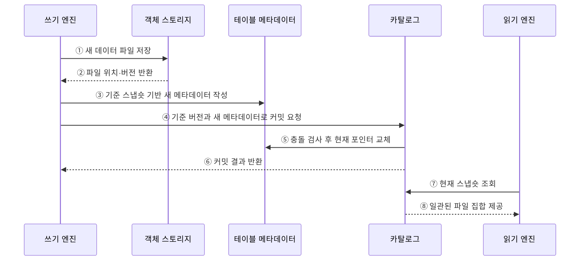

---
sidebar:
  order: 126
  label: "126. 데이터 레이크하우스 (Data Lakehouse)"
  badge:
    text: "기출 · 50%"
    variant: note
title: "데이터 레이크하우스 (Data Lakehouse)"
date: "2026-07-27T23:59:59+09:00"
tags:
  - "notes-software"
weight: 126
extra:
  question_no: "126"
  source_status: "기출"
  source_history: "137회"
  priority: 50
  priority_note: "137회 기출, 레이크·웨어하우스 통합 핵심"
---

## 미리 알고가기

- **데이터 레이크하우스(Data Lakehouse)**: 객체 스토리지 데이터에 테이블 메타데이터와 트랜잭션 기능을 결합한 구조임
- **객체 스토리지(Object Storage)**: 데이터를 버킷과 키로 식별하는 객체에 저장하고 연산과 독립적으로 확장하는 저장소임
- **원자성·일관성·격리성·지속성(Atomicity, Consistency, Isolation, Durability, ACID)**: 네 영문 첫 글자를 딴 ACID를 '애시드'로 읽으며 스냅숏 커밋의 트랜잭션 성질을 뜻함
- **오픈 테이블 포맷(Open Table Format)**: 데이터 파일과 스냅숏·스키마·파티션 메타데이터의 관리 규칙을 공개 명세로 정의한 형식임
- **스냅숏(Snapshot)**: 특정 커밋에서 독자가 읽어야 할 유효 데이터 파일 집합과 테이블 상태임
- **낙관적 동시성 제어(Optimistic Concurrency Control)**: 먼저 변경 파일을 만들고 커밋 시점에 다른 쓰기와의 충돌을 검사하는 방식임
- **과거 버전 조회(Time Travel)**: 지정한 과거 스냅숏이나 시점의 테이블 상태를 조회하는 기능임
- **파일 병합(Compaction)**: 작은 데이터 파일이나 변경 파일을 더 큰 파일로 합쳐 읽기·메타데이터 비용을 줄이는 작업임
- **비즈니스 인텔리전스(Business Intelligence, BI)**: 영문 첫 글자를 딴 BI를 '비아이'로 읽으며 데이터를 지표·보고서로 분석하는 레이크하우스 사용 영역임
- **머신러닝(Machine Learning, ML)**: 영문 첫 글자를 딴 ML을 '엠엘'로 읽으며 공유 테이블에서 규칙을 학습하는 사용 영역임
- **카탈로그(Catalog)**: 테이블 이름과 현재 메타데이터 위치를 처리 엔진에 제공하는 관리 계층임
- **메타데이터 포인터(Metadata Pointer)**: 카탈로그가 현재 유효한 테이블 메타데이터 버전을 가리키는 참조임
- **연산 엔진(Compute Engine)**: 테이블 파일을 읽고 변환·집계·학습 등의 작업을 수행하는 실행 시스템임
- **업서트(Upsert)**: 키가 있으면 수정하고 없으면 삽입하는 병합 연산임

## Ⅰ. 개요

- 데이터 레이크하우스는 객체 스토리지의 개방성과 확장성 위에 ACID 트랜잭션·스키마·테이블 메타데이터를 결합한 분석 구조이다.
- 레이크와 웨어하우스 사이의 데이터 복제·동기화를 줄이고 BI와 ML이 같은 신뢰 테이블을 공유하게 한다.

### 쉽게 이해하기 (학습용)

- 객체 창고에 변경 장부를 더해 여러 분석 도구가 같은 표를 안전하게 쓰게 한다.

## Ⅱ. 특징

- **ACID 스냅숏**: 여러 파일의 변경을 하나의 테이블 버전으로 원자적으로 공개한다.
- **개방형 저장**: 표준 객체·열 형식과 오픈 테이블 포맷을 여러 연산 엔진이 공유한다.
- **스키마·파티션 진화**: 테이블 구조와 배치 방식을 데이터 전체 재작성 없이 변경할 수 있다.
- **저장·연산 분리**: 객체 저장과 질의·학습 엔진을 독립적으로 확장한다.
- **유지관리 필요**: 작은 파일 병합, 스냅숏 만료, 고아 파일 정리가 성능과 비용을 좌우한다.

### 쉽게 이해하기 (학습용)

- 파일은 함께 보관하되 장부가 현재 버전을 정하므로 읽는 도중 표가 반만 바뀌지 않는다.

## Ⅲ. 아키텍처 및 구성요소

**도표안 A — 구조도**

**도표안 B — sequenceDiagram**

| 설계 요소 | 설명 |
|:---|:---|
| 객체 스토리지 | 불변 데이터 파일과 메타데이터 파일 저장 |
| 오픈 테이블 포맷 | 스냅숏·스키마·파티션·파일 참조 규칙 정의 |
| 카탈로그 | 테이블 이름과 현재 메타데이터 포인터 관리 |
| 연산 엔진 | 같은 테이블 규칙으로 읽기·쓰기·분석 수행 |
| 거버넌스·유지관리 | 권한·계보·파일 병합·스냅숏 만료 관리 |

**동작 원리**

- ① 쓰기 엔진이 기존 파일을 덮어쓰지 않고 변경 결과를 새 데이터 파일로 저장한다.
- ② 객체 스토리지가 새 파일의 위치와 버전을 반환한다.
- ③ 쓰기 엔진이 읽기 시작한 기준 스냅숏에 새 파일을 반영한 메타데이터를 작성한다.
- ④ 쓰기 엔진이 기준 버전과 새 메타데이터를 카탈로그에 제출한다.
- ⑤ 카탈로그가 메타데이터 저장소에서 동시 변경과 충돌을 검사하고 성공할 때만 현재 포인터를 원자적으로 교체한다.
- ⑥ 카탈로그가 성공 또는 재시도할 충돌 결과를 쓰기 엔진에 반환한다.
- ⑦ 읽기 엔진이 카탈로그에서 현재 스냅숏을 조회한다.
- ⑧ 카탈로그가 한 커밋에 속한 일관된 파일 집합을 읽기 엔진에 제공한다.

### 쉽게 이해하기 (학습용)

- 새 파일과 장부를 먼저 만들고 마지막에 표지 한 장만 바꿔 완성된 새 버전을 공개한다.

## Ⅳ. 종류 및 비교

| 분석 데이터 저장소 | 데이터 레이크하우스 | 데이터 레이크 | 데이터 웨어하우스 |
|:---|:---|:---|:---|
| 적용 기준 | 트랜잭션·다중 엔진 공유 | 원천 보존·재처리 | 공통 지표·고속 집계 |
| 핵심 구조 | 객체 파일·ACID 테이블 메타데이터 | 원형 객체·읽기 스키마 | 관리형 표·쓰기 스키마 |
| 강점 | 개방형 저장과 신뢰 테이블 결합 | 다형식·저비용·유연성 | 성숙한 질의 최적화·의미 계층 |
| 주요 부담 | 파일·스냅숏·엔진 호환 관리 | 품질·동시 쓰기·데이터 늪 | 복제·종속·확장 비용 |

> 제품 간 기능이 겹치므로 명칭보다 필요한 트랜잭션 보장·개방성·질의 성능·운영 책임으로 선택한다.

### 쉽게 이해하기 (학습용)

- 레이크하우스는 원본 창고 위에 여러 도구가 함께 쓰는 거래 장부를 얹은 구조이다.

## Ⅴ. 실무 고려사항 및 대책

| 고려사항 | 위험 | 대책 |
|:---|:---|:---|
| 동시 쓰기 | 같은 파일·파티션 변경 충돌 | 충돌 범위 설계·재시도·쓰기 직렬화 |
| 작은 파일 | 목록·계획·읽기 비용 증가 | 목표 파일 크기·주기적 Compaction |
| 스냅숏 수명 | 메타데이터·미참조 파일 누적 | 보존 기간·만료·고아 파일 정리 |
| 엔진 호환 | 포맷 기능 지원 수준 차이 | 공통 기능 기준·호환성 시험·버전 통제 |
| 스키마 진화 | 타입·필드 의미 변경으로 오독 | 호환 규칙·계약 검사·계보 기록 |
| 거버넌스 | 여러 엔진의 권한·감사 불일치 | 통합 카탈로그·최소 권한·감사 연계 |

> **적용 사례**: 주문 업서트 결과를 새 파일과 스냅숏으로 만든 뒤 충돌 검사를 통과한 메타데이터 포인터만 교체해 독자가 부분 결과를 보지 않게 한다.

### 쉽게 이해하기 (학습용)

- 새 주문 파일을 모두 준비한 뒤 한 번에 공개하고 오래된 조각은 안전한 보존 기간 후 정리한다.

## Ⅵ. 결론

- 레이크하우스의 핵심은 객체 파일 자체가 아니라 파일 집합을 일관된 테이블 버전으로 공개하는 메타데이터 커밋이다.
- 트랜잭션 범위·엔진 호환·파일 최적화·스냅숏 수명·거버넌스를 함께 운영해야 통합 저장의 이점을 유지할 수 있다.

### 쉽게 이해하기 (학습용)

- 한 창고를 함께 쓰려면 현재 장부와 충돌 규칙, 낡은 파일 정리를 함께 관리해야 한다.
