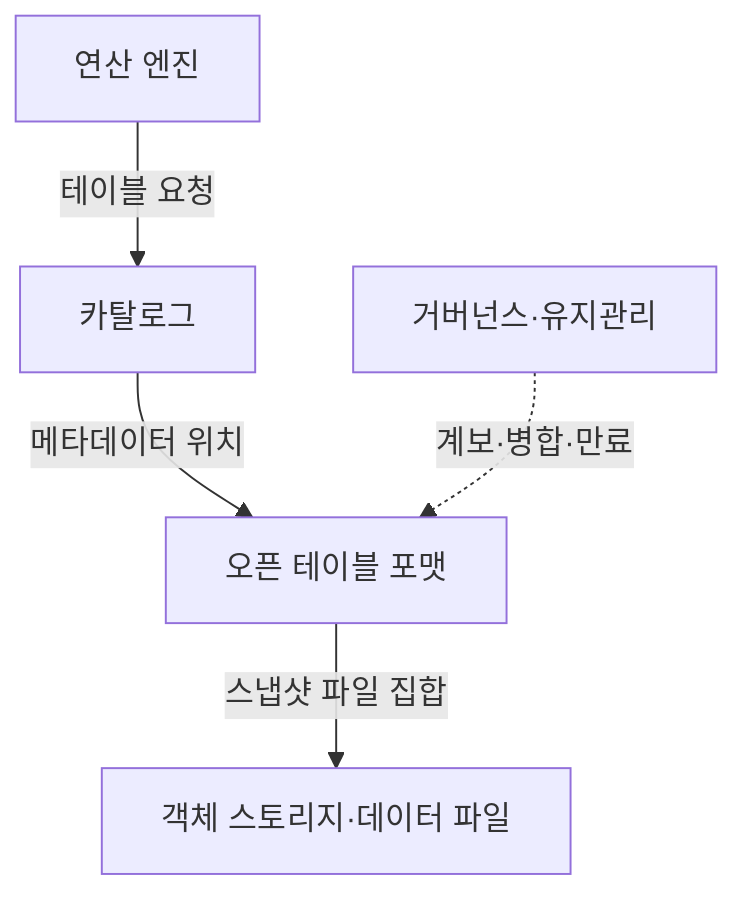
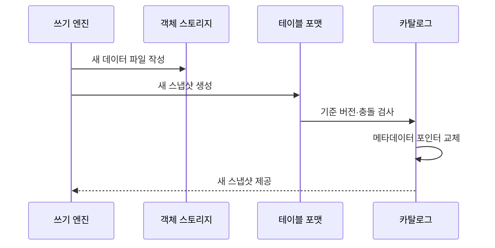

---
sidebar:
  order: 126
  label: "126. 데이터 레이크하우스 (Data Lakehouse)"
  badge:
    text: "기출 · 50%"
    variant: note
title: "데이터 레이크하우스 (Data Lakehouse)"
date: "2026-07-25T11:22:00+09:00"
tags:
  - "notes-software"
weight: 126
extra:
  question_no: "126"
  source_status: "기출"
  source_history: "137회"
  priority: 50
  priority_note: "137회 기출, 레이크·웨어하우스 통합 핵심"
---

## 미리 알고가기

- **데이터 레이크하우스(Data Lakehouse)**: 객체 스토리지 데이터에 테이블 메타데이터와 트랜잭션 기능을 결합한 구조임
- **객체 스토리지(Object Storage)**: 데이터를 버킷과 키로 식별하는 객체에 저장하고 연산과 독립적으로 확장하는 저장소임
- **원자성·일관성·격리성·지속성(Atomicity, Consistency, Isolation, Durability, ACID)**: 네 영문 첫 글자를 딴 ACID를 '애시드'로 읽으며 스냅숏 커밋의 트랜잭션 성질을 뜻함
- **오픈 테이블 포맷(Open Table Format)**: 데이터 파일과 스냅숏·스키마·파티션 메타데이터의 관리 규칙을 공개 명세로 정의한 형식임
- **스냅숏(Snapshot)**: 특정 커밋에서 독자가 읽어야 할 유효 데이터 파일 집합과 테이블 상태임
- **낙관적 동시성 제어(Optimistic Concurrency Control)**: 먼저 변경 파일을 만들고 커밋 시점에 다른 쓰기와의 충돌을 검사하는 방식임
- **과거 버전 조회(Time Travel)**: 지정한 과거 스냅숏이나 시점의 테이블 상태를 조회하는 기능임
- **파일 병합(Compaction)**: 작은 데이터 파일이나 변경 파일을 더 큰 파일로 합쳐 읽기·메타데이터 비용을 줄이는 작업임
- **비즈니스 인텔리전스(Business Intelligence, BI)**: 영문 첫 글자를 딴 BI를 '비아이'로 읽으며 데이터를 지표·보고서로 분석하는 레이크하우스 사용 영역임
- **머신러닝(Machine Learning, ML)**: 영문 첫 글자를 딴 ML을 '엠엘'로 읽으며 공유 테이블에서 규칙을 학습하는 사용 영역임
- **카탈로그(Catalog)**: 테이블 이름과 현재 메타데이터 위치를 처리 엔진에 제공하는 관리 계층임
- **메타데이터 포인터(Metadata Pointer)**: 카탈로그가 현재 유효한 테이블 메타데이터 버전을 가리키는 참조임
- **연산 엔진(Compute Engine)**: 테이블 파일을 읽고 변환·집계·학습 등의 작업을 수행하는 실행 시스템임
- **업서트(Upsert)**: 키가 있으면 수정하고 없으면 삽입하는 병합 연산임

## Ⅰ. 개요

- **정의/개념**: 객체 파일에 ACID 테이블 관리를 결합한다
- **배경/필요성**: 분석·학습 저장소 복제와 불일치를 줄인다

### 쉽게 이해하기 (학습용)
- 객체 창고의 개방성과 트랜잭션 및 스키마 관리를 결합한 구조임

## Ⅱ. 특징

- 스냅숏 커밋은 여러 엔진의 부분 읽기를 막는다
- 새 버전 쓰기는 동시 독자의 결과 변화를 막는다
- 메타데이터가 스키마·파티션 변경의 재작성을 줄인다
- 병합·만료는 파일 조회와 저장 비용 증가를 막는다

### 쉽게 이해하기 (학습용)
- 여러 엔진이 같은 파일을 읽고 쓰므로 현재 버전을 정하는 카탈로그와 오래된 파일의 안전한 정리가 중요함

## Ⅲ. 아키텍처 및 구성요소

| 설계 요소 | 설명 |
|:---|:---|
| 객체 스토리지·데이터 파일 | 원천·분석 데이터를 열 형식으로 저장 |
| 오픈 테이블 포맷 | 스냅숏·스키마·파일 참조 관리 |
| 카탈로그 | 테이블명과 메타데이터 위치 제공 |
| 연산 엔진 | 같은 테이블 스냅숏을 읽고 씀 |
| 거버넌스·유지관리 | 계보·파일 병합·스냅숏 만료 관리 |

> 요약: 포맷이 연산 엔진을 객체 스토리지의 스냅샷에 연결함

### 쉽게 이해하기 (학습용)
- 객체 스토리지가 파일을 보존하고 테이블 포맷과 카탈로그가 여러 처리 엔진에 같은 스냅샷을 제공한다

## Ⅳ. 원리 및 절차 흐름도

| 절차 | 설명 |
|:---|:---|
| 새 데이터 파일 작성 | 기존 파일을 유지하고 변경 결과 기록 |
| 새 스냅샷 생성 | 새 파일 집합·스키마를 메타데이터에 기록 |
| 기준 버전·충돌 검사 | 동시 변경과 쓰기 충돌 확인 |
| 메타데이터 포인터 교체 | 새 스냅샷을 현재 버전으로 확정 |
| 새 스냅샷 제공 | 독자에게 같은 유효 파일 집합 제공 |

> 요약: 새 파일 생성 후 충돌 검사와 커밋으로 스냅샷을 전환함

### 쉽게 이해하기 (학습용)
- 새 파일과 장부를 만든 뒤 충돌이 없으면 스냅샷을 바꿈

## Ⅴ. 종류 및 비교

| 판단 기준 | 데이터 레이크하우스 | 데이터 레이크 | 데이터 웨어하우스 |
|:---|:---|:---|:---|
| 핵심 특징 | 객체 파일과 ACID 스냅숏을 함께 관리함 | 원천 객체에 읽을 때 스키마를 적용함 | 관리형 엔진에 적재 전 스키마를 적용함 |
| 적용 기준 | 트랜잭션과 다중 엔진 공유가 필요함 | 비정형 원천 보존과 재처리가 중요함 | 공통 지표와 고속 집계가 중요함 |
| 주요 위험 | 파일·스냅숏 유지관리 비용 | 데이터 늪·동시 쓰기 충돌 | 저장 종속·데이터 복제 |

> 요약: 객체 저장의 개방성과 트랜잭션 관리를 결합함

### 쉽게 이해하기 (학습용)
- 데이터 레이크는 원천 파일, 웨어하우스는 관리형 엔진, 레이크하우스는 객체 파일 위의 트랜잭션 장부를 중심으로 관리한다

## Ⅵ. 실무 사례

1. 주문 업서트를 새 스냅숏으로 원자 반영한다
2. 스냅숏 버전으로 모델 학습 데이터를 재현한다

### 쉽게 이해하기 (학습용)
- 주문 업서트는 동시 쓰기 충돌을 검사한 뒤 새 스냅숏 포인터를 한 번에 공개해 독자가 부분 결과를 보지 않게 함
- 모델이 사용한 스냅숏 식별자를 기록하면 이후 파일이 바뀌어도 같은 학습 입력을 다시 읽을 수 있음

## Ⅶ. 결론

- ACID·다중 엔진 공유가 필요하면 레이크하우스를 택한다

### 쉽게 이해하기 (학습용)
- 레이크하우스는 여러 엔진이 같은 스냅숏을 읽고 쓰게 하므로 커밋 충돌·파일 병합·스냅숏 만료를 함께 운영해야 함
