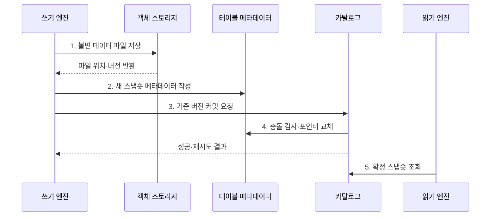

---
sidebar:
  order: 126
  label: "126. 데이터 레이크하우스 (Data Lakehouse)"
  badge:
    text: "기출 · 50%"
    variant: note
title: "데이터 레이크하우스 (Data Lakehouse)"
date: "2026-07-30T20:00:00+09:00"
tags:
  - "notes-software"
weight: 126
extra:
  question_no: "126"
  source_status: "기출"
  source_history: "137회"
  priority: 50
  priority_note: "137회 기출, 레이크·웨어하우스 통합 핵심"
---

## 미리 알고가기

- **데이터 레이크하우스(Data Lakehouse)**: 객체 스토리지 데이터에 테이블 메타데이터와 트랜잭션 기능을 결합한 구조이다.
- **객체 스토리지(Object Storage)**: 데이터를 버킷과 키로 식별하는 객체에 저장하고 연산과 독립적으로 확장하는 저장소이다.
- **원자성·일관성·격리성·지속성(Atomicity, Consistency, Isolation, Durability, ACID)**: 네 영문 첫 글자를 딴 ACID를 '애시드'로 읽으며 스냅숏 커밋의 트랜잭션 성질을 뜻한다.
- **오픈 테이블 포맷(Open Table Format)**: 데이터 파일과 스냅숏·스키마·파티션 메타데이터의 관리 규칙을 공개 명세로 정의한 형식이다.
- **스냅숏(Snapshot)**: 특정 커밋에서 독자가 읽어야 할 유효 데이터 파일 집합과 테이블 상태이다.
- **낙관적 동시성 제어(Optimistic Concurrency Control)**: 먼저 변경 파일을 만들고 커밋 시점에 다른 쓰기와의 충돌을 검사하는 방식이다.
- **과거 버전 조회(Time Travel)**: 지정한 과거 스냅숏이나 시점의 테이블 상태를 조회하는 기능이다.
- **파일 병합(Compaction)**: 작은 데이터 파일이나 변경 파일을 더 큰 파일로 합쳐 읽기·메타데이터 비용을 줄이는 작업이다.
- **비즈니스 인텔리전스(Business Intelligence, BI)**: 영문 첫 글자를 딴 BI를 '비아이'로 읽으며 데이터를 지표·보고서로 분석하는 레이크하우스 사용 영역이다.
- **머신러닝(Machine Learning, ML)**: 영문 첫 글자를 딴 ML을 '엠엘'로 읽으며 공유 테이블에서 규칙을 학습하는 사용 영역이다.
- **카탈로그(Catalog)**: 테이블 이름과 현재 메타데이터 위치를 처리 엔진에 제공하는 관리 계층이다.
- **메타데이터 포인터(Metadata Pointer)**: 카탈로그가 현재 유효한 테이블 메타데이터 버전을 가리키는 참조이다.
- **연산 엔진(Compute Engine)**: 테이블 파일을 읽고 변환·집계·학습 등의 작업을 수행하는 실행 시스템이다.
- **업서트(Upsert)**: 키가 있으면 수정하고 없으면 삽입하는 병합 연산이다.

## Ⅰ. 개요

- 정의/개념: 객체 저장소에 ACID 테이블 계층을 결합한 **구조**
- 배경/필요성: BI·ML의 신뢰 테이블 공유

### 쉽게 이해하기 (학습용)

- 객체 창고에 변경 장부를 더해 여러 분석 도구가 같은 표를 안전하게 쓰게 한다.

## Ⅱ. 특징

- **ACID 스냅숏**: 파일 변경을 원자 버전으로 공개
- **개방형 저장**: 여러 연산 엔진이 파일 공유
- **유지관리**: 파일 병합·스냅숏 만료 필요

### 쉽게 이해하기 (학습용)

- 파일은 함께 보관하되 장부가 현재 버전을 정하므로 읽는 도중 표가 반만 바뀌지 않는다.

## Ⅲ. 구조 및 구성요소

| 구성요소 | 책임 |
|:---|:---|
| 객체 스토리지 | 데이터·메타데이터 파일 저장 |
| 오픈 테이블 포맷 | 스냅숏·스키마·파일 규칙 |
| 카탈로그 | 현재 메타데이터 포인터 |
| 연산 엔진 | 테이블 읽기·쓰기·분석 |
| 거버넌스·유지관리 | 권한·병합·만료 관리 |

### 쉽게 이해하기 (학습용)

- 객체 창고, 장부 규칙, 현재 표지, 분석 도구, 정리 담당자로 구성된다.

## Ⅳ. 흐름도

**동작 원리**

- **1. 불변 데이터 파일 저장**: 기존 파일을 유지한 채 변경 결과를 새 객체로 기록
- **2. 새 스냅숏 메타데이터 작성**: 유효 파일 집합과 스키마·통계를 새 버전으로 구성
- **3. 기준 버전 커밋 요청**: 읽은 기준 버전과 새 메타데이터 위치를 카탈로그에 제출
- **4. 충돌 검사·포인터 교체**: 동시 변경 여부를 판정하고 현재 포인터를 원자적으로 전환
- **5. 확정 스냅숏 조회**: 읽기 엔진이 한 포인터가 가리키는 일관된 파일 집합 사용

### 쉽게 이해하기 (학습용)

- 새 파일과 장부를 먼저 만들고 마지막에 표지 한 장만 바꿔 완성된 새 버전을 공개한다.

## Ⅴ. 종류 및 비교

| 판단 기준 | 데이터 레이크하우스 | 데이터 레이크 | 데이터 웨어하우스 |
|:---|:---|:---|:---|
| 적용 기준 | 트랜잭션·다중 엔진 공유 | 원천 보존·재처리 | 공통 지표·고속 집계 |
| 핵심 특징 | 객체 파일·ACID 메타데이터 | 원형 객체·읽기 스키마 | 관리형 표·쓰기 스키마 |
| 한계 | 파일·스냅숏·엔진 호환 | 품질·동시 쓰기·데이터 늪 | 복제·종속·확장 비용 |

> 제품 간 기능이 겹치므로 명칭보다 필요한 트랜잭션 보장·개방성·질의 성능·운영 책임으로 선택

### 쉽게 이해하기 (학습용)

- 레이크하우스는 원본 창고 위에 여러 도구가 함께 쓰는 거래 장부를 얹은 구조이다.

## Ⅵ. 실무 고려사항 및 대책

| 고려사항 | 대책 | 효과 |
|:---|:---|:---|
| 동시 쓰기 | 충돌 범위·재시도 설계 | 커밋 충돌 통제 |
| 작은 파일 | 목표 크기·주기적 병합 | 목록·읽기 비용 감소 |
| 스냅숏 수명 | 만료·고아 파일 정리 | 메타데이터 누적 방지 |
| 엔진 호환 | 공통 기능·버전 시험 | 해석 차이 방지 |
| 스키마 진화 | 호환 규칙·계약 검사 | 타입 오독 방지 |

> **적용 사례**: 주문 업서트 파일 생성 후 검증된 메타데이터 포인터만 교체해 **부분 결과 노출 방지**

### 쉽게 이해하기 (학습용)

- 새 주문 파일을 모두 준비한 뒤 한 번에 공개하고 오래된 조각은 안전한 보존 기간 후 정리한다.

## Ⅶ. 결론

- **트랜잭션 범위·엔진 호환·파일·스냅숏 수명**으로 Lakehouse를 설계

### 쉽게 이해하기 (학습용)

- 한 창고를 함께 쓰려면 현재 장부와 충돌 규칙, 낡은 파일 정리를 함께 관리해야 한다.
