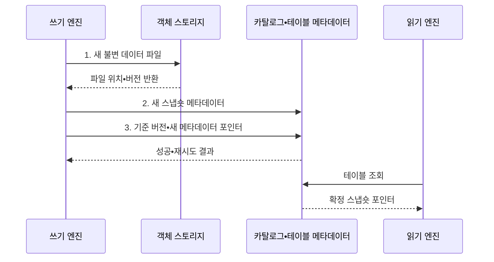

---
sidebar:
  order: 126
  label: "126. 데이터 레이크하우스 (Data Lakehouse)"
  badge:
    text: "기출 • 50%"
    variant: note
title: "데이터 레이크하우스 (Data Lakehouse)"
date: "2026-08-03T09:14:20+09:00"
tags:
  - "notes-software"
weight: 126
extra:
  question_no: "126"
  source_status: "기출"
  source_history: "137회"
  priority: 50
  priority_note: "137회 기출, 레이크•웨어하우스 통합 핵심"
---

## Ⅰ. 개요

핵심 용어

- **데이터 레이크하우스(Data Lakehouse)**: 객체 스토리지에 원자성•일관성•격리성•지속성(Atomicity, Consistency, Isolation, Durability, ACID) 테이블 메타데이터를 결합해 여러 엔진이 공유하는 분석 구조이다.

- 정의/개념: 객체 저장소에 **원자성•일관성•격리성•지속성(Atomicity, Consistency, Isolation, Durability, ACID) 테이블 메타데이터** 를 결합한 **데이터 레이크하우스(Data Lakehouse)**
- 배경/필요성: 레이크의 파일 단위 관리는 **동시 쓰기•일관된 테이블 공유** 제약

#### 한줄 요약

- 객체 창고에 변경 장부를 더해 여러 분석 도구가 같은 표를 안전하게 쓰게 한다.

## Ⅱ. 특징

핵심 용어

- **원자성•일관성•격리성•지속성(Atomicity, Consistency, Isolation, Durability, ACID) 스냅숏**: 완성된 파일 집합만 하나의 원자 버전으로 공개해 일관된 읽기를 제공하는 특성이다.
- **개방형 저장**: 여러 연산 엔진이 공개 명세에 따라 같은 객체 파일과 메타데이터를 공유하는 특성이다.
- **분리형 아키텍처**: 객체 저장 용량과 연산 엔진 자원을 독립적으로 확장하는 구조이다.

- 파일 변경을 원자 버전으로 공개하는 **ACID 스냅숏**
- 여러 연산 엔진이 객체 파일을 공유하는 **개방형 저장**
- 저장•연산 자원을 독립 확장하는 **분리형 아키텍처**

#### 한줄 요약

- 파일은 함께 보관하되 장부가 현재 버전을 정하므로 읽는 도중 표가 반만 바뀌지 않는다.

## Ⅲ. 구조 및 구성요소

핵심 용어

- **메타데이터 포인터**: 카탈로그가 현재 유효한 테이블 메타데이터 버전을 가리키는 참조이다.
- **객체 스토리지**: 불변 데이터 파일과 테이블 메타데이터 파일을 저장하는 계층이다.
- **테이블 메타데이터**: 오픈 테이블 포맷에 따라 스냅숏•스키마•파티션•통계를 관리하는 정보이다.
- **연산 엔진**: 공유 테이블의 읽기•쓰기•변환•분석을 수행하는 실행 계층이다.
- **거버넌스•유지관리**: 권한과 파일 병합 및 오래된 스냅숏 만료를 관리하는 활동이다.

| 구성요소 | 책임 |
|:---|:---|
| 객체 스토리지 | **데이터•메타데이터 파일** 저장 |
| 테이블 메타데이터 | **오픈 테이블 포맷** 에 따른 스냅숏•스키마 관리 |
| 카탈로그 | 현재 **메타데이터 포인터** 제공 |
| 연산 엔진 | 공유 테이블의 **읽기•쓰기•분석** 수행 |
| 거버넌스•유지관리 | **권한•파일 병합•스냅숏 만료** 관리 |

#### 한줄 요약

- 객체 창고, 장부 규칙, 현재 표지, 분석 도구, 정리 담당자로 구성된다.

## Ⅳ. 흐름도

핵심 용어

- **3. 기준 버전•새 메타데이터 포인터**: 동시 변경과 충돌을 검사한 뒤 현재 테이블 참조를 원자적으로 전환하는 단계이다.
- **1. 새 불변 데이터 파일**: 기존 파일을 덮지 않고 변경 결과를 새 객체로 기록한 파일이다.
- **2. 새 스냅숏 메타데이터**: 유효 파일 집합과 스키마•통계를 새 테이블 버전으로 구성한 정보이다.

**동작 원리**

1. **새 불변 데이터 파일**: 기존 파일을 유지한 채 변경 결과를 새 객체로 기록
2. **새 스냅숏 메타데이터**: 유효 파일 집합과 스키마•통계를 새 버전으로 구성
3. **기준 버전•새 메타데이터 포인터**: 동시 변경을 검사해 현재 포인터를 원자적으로 전환

#### 한줄 요약

- 새 파일과 장부를 먼저 만들고 마지막에 표지 한 장만 바꿔 완성된 새 버전을 공개한다.

## Ⅴ. 종류 및 비교

핵심 용어

- **데이터 레이크하우스**: 객체 파일과 원자성•일관성•격리성•지속성(Atomicity, Consistency, Isolation, Durability, ACID) 메타데이터를 결합해 트랜잭션과 다중 엔진 공유를 지원하는 저장소이다.
- **데이터 레이크(Data Lake)**: 다양한 원천을 객체 파일로 원형에 가깝게 보존하고 읽기 시점에 해석하는 저장소이다.
- **데이터 웨어하우스(Data Warehouse)**: 공통 지표와 정형 이력을 관리형 표로 제공하는 분석 저장소이다.

| 분석 저장소 | 데이터 레이크하우스 | 데이터 레이크 | 데이터 웨어하우스 |
|:---|:---|:---|:---|
| 적용 기준 | 트랜잭션과 **다중 엔진 공유** | 다양한 **원천 보존•재처리** | 공통 지표 기반 **고속 집계** |
| 핵심 특징 | 객체 파일과 **원자성•일관성•격리성•지속성(Atomicity, Consistency, Isolation, Durability, ACID) 메타데이터** | 원형 객체와 **스키마 온 리드** | 관리형 표와 **스키마 온 라이트** |
| 한계 | 파일•스냅숏•**엔진 호환** 관리 | 품질•동시 쓰기•**데이터 늪** | 데이터 복제•**플랫폼 종속** 비용 |

#### 한줄 요약

- 레이크하우스는 원본 창고 위에 여러 도구가 함께 쓰는 거래 장부를 얹은 구조이다.

## Ⅵ. 실무 고려사항 및 대책

핵심 용어

- **목록 조회•읽기 계획**: 파일 수 증가로 메타데이터 처리와 쿼리 계획 시간이 커지는 문제이다.
- **충돌 범위•재시도 정책**: 동시에 수정한 파일•파티션의 겹침을 판정하고 안전한 커밋을 다시 시도하는 규칙이다.
- **목표 파일 크기•주기적 파일 병합**: 작은 파일을 적정 크기로 합쳐 메타데이터와 읽기 계획 비용을 줄이는 통제이다.
- **스냅숏 만료•파일 정리**: 보존 기간이 끝난 테이블 버전과 어떤 버전도 참조하지 않는 객체를 제거하는 활동이다.
- **버전 호환 시험**: 여러 엔진이 같은 테이블 형식 버전과 기능을 일관되게 읽고 쓰는지 확인하는 시험이다.

| 문제 | 대책 | 효과 |
|:---|:---|:---|
| 같은 파일 집합을 동시에 바꾸면 **커밋 충돌** 발생 | **충돌 범위•재시도 정책** 설계 | 동시 쓰기의 **원자적 커밋** 유지 |
| 작은 파일이 누적되면 **목록 조회•읽기 계획** 비용 증가 | 목표 파일 크기와 **주기적 파일 병합** 적용 | **메타데이터•읽기 비용** 감소 |
| 오래된 스냅숏과 미참조 파일 누적으로 **저장 비용** 증가 | 보존 기간 기반 **스냅숏 만료•파일 정리** | 메타데이터와 **저장 공간** 회수 |
| 엔진별 지원 기능 차이로 **테이블 해석** 불일치 | 공통 기능 범위와 **버전 호환 시험** 적용 | 다중 엔진의 **읽기•쓰기 일관성** 확보 |

#### 한줄 요약

- 새 주문 파일을 모두 준비한 뒤 한 번에 공개하고 오래된 조각은 안전한 보존 기간 후 정리한다.

## Ⅶ. 결론

핵심 용어

- **오픈 테이블 포맷**: 다중 엔진이 객체 데이터를 같은 테이블 규칙으로 읽고 갱신하게 하는 공개 명세이다.

- 다중 엔진이 객체 데이터를 함께 갱신하면 **오픈 테이블 포맷** 기반 레이크하우스 구축

#### 한줄 요약

- 한 창고를 함께 쓰려면 현재 장부와 충돌 규칙, 낡은 파일 정리를 함께 관리해야 한다.
