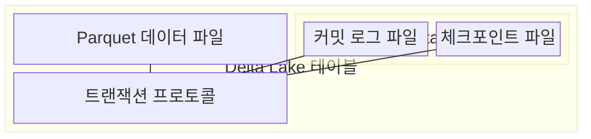
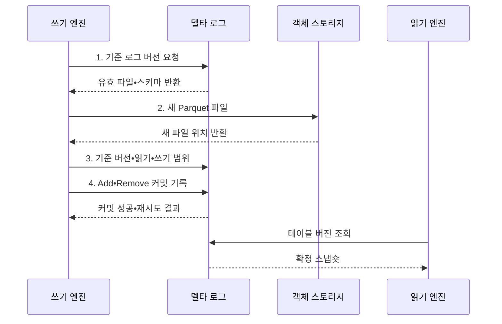

---
sidebar:
  order: 127
  label: "127. Delta Lake (Delta Lake)"
  badge:
    text: "기출 • 30%"
    variant: note
title: "Delta Lake (Delta Lake)"
date: "2026-08-03T09:14:20+09:00"
tags:
  - "notes-software"
weight: 127
extra:
  question_no: "127"
  source_status: "기출"
  source_history: "137회"
  priority: 30
  priority_note: "137회 기출, Delta Lake 구현 사례 성격"
---

## Ⅰ. 개요

핵심 용어

- **Delta Lake**: Parquet 파일의 추가•제거를 트랜잭션 로그에 순서대로 기록해 테이블 상태와 과거 버전을 재현하는 테이블 형식이다.
- **트랜잭션 로그(Transaction Log)**: 파일 추가•제거와 스키마 변경을 버전별로 기록해 원자 커밋과 스냅숏을 제공하는 로그이다.

- 정의/개념: Parquet 파일을 **트랜잭션 로그로 버전 관리**하는 테이블 형식
- 배경/필요성: 객체 스토리지의 **부분 쓰기•동시 변경 충돌** 방지

#### 한줄 요약

- 파일을 직접 고쳐 쓰지 않고 어떤 파일을 넣고 뺐는지 거래 일지에 남긴다.

## Ⅱ. 특징

핵심 용어

- **낙관적 커밋**: 변경 파일을 먼저 만든 뒤 기준 버전 이후의 충돌을 검사해 새 버전을 확정하는 특성이다.
- **로그 스냅숏**: Add•Remove 동작을 특정 버전까지 재생해 그 시점의 유효 파일 집합을 계산한 상태이다.
- **테이블 버전 관리**: 스키마와 과거 조회 및 파일 보존•정리를 로그 버전과 연결하는 방식이다.

- Add•Remove 동작으로 유효 파일을 결정하는 **로그 스냅숏**
- 기준 버전 이후의 변경 충돌을 검사하는 **낙관적 커밋**
- 스키마•과거 조회•파일 정리를 연결한 **테이블 버전 관리**

#### 한줄 요약

- 장부가 남아도 가리키는 옛 파일을 지우면 그 시점으로 돌아갈 수 없으므로 보존 기간을 함께 정해야 한다.

## Ⅲ. 구조 및 구성요소

핵심 용어

- **체크포인트 파일**: 누적 로그 동작을 집약해 현재 스냅숏을 복원할 때 읽을 범위를 줄이는 구성요소이다.
- **Parquet 데이터 파일**: 테이블 행을 불변 열 지향 형식으로 저장하는 객체 파일이다.
- **커밋 로그 파일**: 버전별 Add•Remove와 스키마 변경을 순서대로 기록하는 파일이다.
- **트랜잭션 프로토콜**: 기준 버전과 읽기•쓰기 범위의 충돌을 검사하고 다음 로그 버전을 원자 확정하는 규칙이다.

| 구성요소 | 책임 |
|:---|:---|
| Parquet 데이터 파일 | 테이블 행을 **불변 열 파일** 로 저장 |
| 커밋 로그 파일 | 버전별 **Add•Remove•스키마 변경** 기록 |
| 체크포인트 파일 | 누적 로그를 집약해 **스냅숏 복원** 범위 단축 |
| 트랜잭션 프로토콜 | 기준 버전과 작업 범위의 **충돌 검사•원자 커밋** |

#### 한줄 요약

- 데이터 파일과 변경 장부를 분리해 각 버전의 표를 재현한다.

## Ⅳ. 흐름도

핵심 용어

- **4. Add•Remove 커밋 기록**: 파일 추가와 제거를 하나의 다음 로그 버전으로 원자 확정하는 단계이다.
- **1. 기준 로그 버전 요청**: 현재 유효 파일 집합과 스키마를 얻기 위해 로그 재생 기준을 요청하는 단계이다.
- **2. 새 Parquet 파일**: 기존 파일을 덮지 않고 변경 결과를 불변 객체로 기록한 파일이다.
- **3. 기준 버전•읽기•쓰기 범위**: 기준 이후 동시 변경과 현재 작업의 파일•행 충돌을 판정하는 정보이다.

**동작 원리**

1. **기준 로그 버전 요청**: 트랜잭션 로그를 재생해 현재 파일 집합과 스키마 확보
2. **새 Parquet 파일**: 기존 데이터를 덮지 않고 변경 결과를 불변 객체로 기록
3. **기준 버전•읽기•쓰기 범위**: 기준 이후의 동시 변경과 작업 충돌 판정
4. **Add•Remove 커밋 기록**: 파일 추가•제거를 다음 단일 로그 버전으로 확정

#### 한줄 요약

- 새 파일을 먼저 만들고 겹친 변경이 없을 때만 다음 장부 번호를 차지해 전체 변경을 공개한다.

## Ⅴ. 종류 및 비교

핵심 용어

- **Delta Lake**: 동시 변경과 과거 버전 조회가 필요한 Parquet 테이블에 적합한 저장 방식이다.
- **일반 Parquet 파일 집합**: 별도 트랜잭션 로그 없이 디렉터리의 불변 열 파일 목록을 직접 분석하는 방식이다.

| 테이블 저장 방식 | Delta Lake | 일반 Parquet 파일 집합 |
|:---|:---|:---|
| 적용 기준 | **동시 변경•과거 조회** 가 필요한 테이블 | 변경 없는 **단순 파일 분석** |
| 핵심 특징 | **로그 버전•원자 커밋** | 디렉터리 파일 목록 |
| 한계 | **로그•파일 정리•엔진 호환** 관리 | **부분 결과•버전 복구** 를 직접 구현 |

#### 한줄 요약

- 일반 파일 묶음과 달리 몇 번째 장부인지가 현재 표와 과거 표를 결정한다.

## Ⅵ. 실무 고려사항 및 대책

핵심 용어

- **과거 파일**: 실행 중인 조회나 복구가 참조하는 파일을 보존 기한 전에 지우는 문제이다.
- **병합(MERGE) 범위**: 원천과 대상의 키•파티션 조건으로 갱신할 파일을 좁힌 작업 범위이다.
- **충돌 재시도**: 최신 로그 버전을 다시 읽고 작업을 재계산해 낙관적 커밋을 다시 수행하는 방식이다.
- **파일 병합**: 작은 파일을 적정 크기의 불변 파일로 다시 작성해 열기•메타데이터 비용을 줄이는 처리이다.
- **파일 정리(VACUUM) 보존 기간**: 어떤 활성 조회나 과거 버전도 참조하지 않는 파일만 지우도록 정한 최소 보존 시간이다.

| 문제 | 대책 | 효과 |
|:---|:---|:---|
| 병합 조건이 넓으면 **파일 재작성량** 급증 | 키•파티션 조건으로 **병합(MERGE) 범위** 축소 | 변경 대상의 **파일 읽기•쓰기** 감소 |
| 같은 파일 범위를 갱신하면 **커밋 충돌** 반복 | 작업 범위 분리와 **충돌 재시도** 적용 | 낙관적 커밋의 **성공률** 향상 |
| 작은 파일 누적으로 **파일 열기•로그 처리** 비용 증가 | 배치 크기 조정과 **파일 병합** 적용 | 스캔의 **파일•메타데이터 비용** 감소 |
| 파일 정리 기간이 긴 작업보다 짧으면 **과거 파일** 삭제 | 최대 작업 시간보다 긴 **파일 정리(VACUUM) 보존 기간** 설정 | 실행 중인 조회와 **과거 버전** 보호 |

#### 한줄 요약

- 주문 수정 파일을 모두 준비해 한 장의 거래 기록으로 공개하고, 읽는 중인 옛 파일은 보존 기간 전에 지우지 않는다.

## Ⅶ. 결론

핵심 용어

- **트랜잭션 로그**: 현재와 과거의 유효 파일 집합을 재현하도록 버전별 변경을 기록하는 핵심 구성이다.

- 동시 변경과 버전 복원이 필요하면 **트랜잭션 로그** 기반 **Delta Lake** 채택

#### 한줄 요약

- 장부와 실제 파일이 모두 있어야 현재와 과거의 표를 안전하게 되살릴 수 있다.
