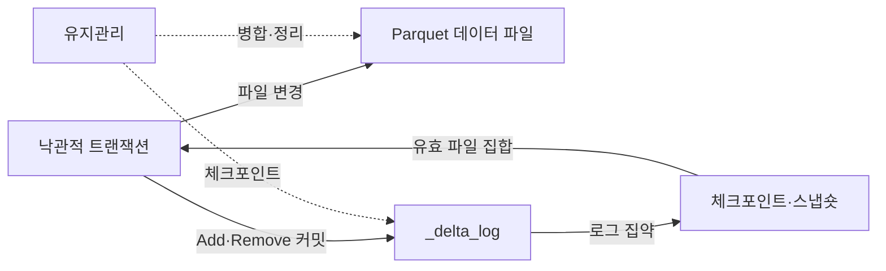
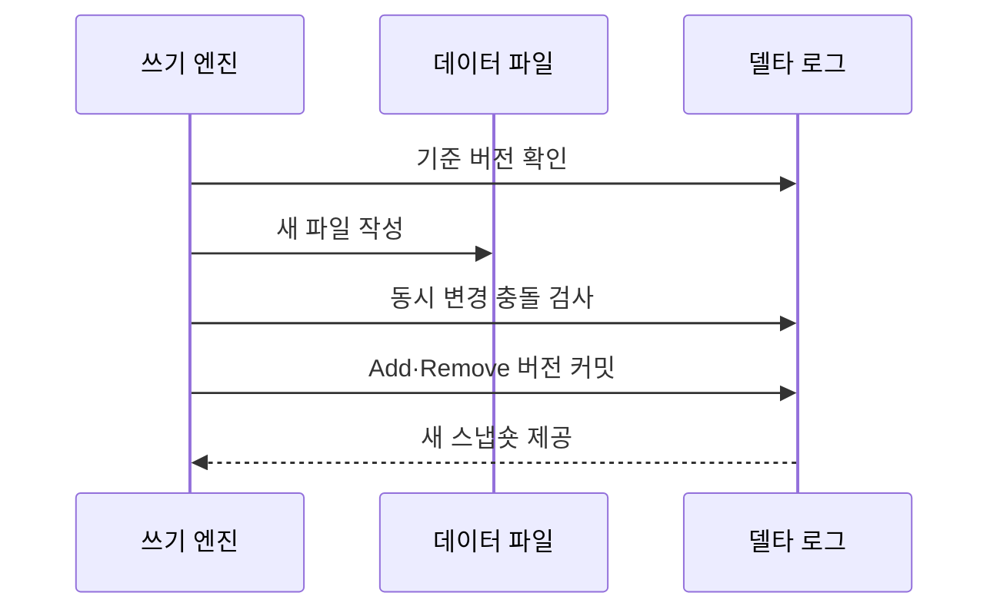

---
sidebar:
  order: 127
  label: "127. Delta Lake (Delta Lake)"
  badge:
    text: "기출 · 30%"
    variant: note
title: "Delta Lake (Delta Lake)"
date: "2026-07-27T23:59:59+09:00"
tags:
  - "notes-software"
weight: 127
extra:
  question_no: "127"
  source_status: "기출"
  source_history: "137회"
  priority: 30
  priority_note: "137회 기출, Delta Lake 구현 사례 성격"
---

## 미리 알고가기

- **밑줄 델타 로그 `_delta_log`(언더스코어 델타 언더스코어 로그)**: 숨김·시스템용 이름을 나타내는 밑줄 표기와 Delta Lake 로그 이름을 결합한 디렉터리로 데이터 파일과 트랜잭션 로그를 분리해 테이블 버전을 관리함
- **델타 레이크(Delta Lake)**: 객체 스토리지의 데이터 파일과 `_delta_log` 트랜잭션 로그로 테이블 버전을 관리하는 오픈 소스 형식임
- **원자성·일관성·격리성·지속성(Atomicity, Consistency, Isolation, Durability, ACID)**: 네 영문 첫 글자를 딴 ACID를 '애시드'로 읽으며 로그 커밋의 트랜잭션 성질을 뜻함
- **파케이(Apache Parquet)**: 열 단위 압축과 분석 읽기에 적합한 공개 파일 형식임
- **델타 트랜잭션 로그(Delta Transaction Log)**: 테이블의 버전별 파일·스키마·프로토콜 변경을 순서대로 기록하는 로그임
- **파일 추가·제거 동작(Add/Remove Action)**: 현재 스냅숏에 포함하거나 제외할 데이터 파일을 로그에 기록하는 메타데이터 동작임
- **체크포인트(Checkpoint)**: 이전 로그 동작을 Parquet 파일로 집약해 독자가 재생할 로그 범위를 줄이는 요약본임
- **스냅숏(Snapshot)**: 특정 로그 버전에서 유효한 파일과 스키마로 구성된 테이블 상태임
- **낙관적 동시성 제어(Optimistic Concurrency Control)**: 변경 파일을 먼저 만들고 커밋 시 현재 버전과 충돌을 검사하는 방식임
- **병합(MERGE)**: '머지'로 읽으며 대문자는 SQL 명령임을 나타내고 키 조건에 따른 수정·삽입을 한 테이블 변경으로 처리함
- **파일 정리(VACUUM)**: '배큠'으로 읽으며 대문자는 유지관리 명령임을 나타내고 보존 기한이 지난 미참조 파일을 삭제함
- **과거 버전 조회(Time Travel)**: 지정한 과거 버전이나 시점의 테이블 스냅숏을 조회하는 기능임
- **스키마 강제(Schema Enforcement)**: 적재 데이터가 테이블의 열 이름과 자료형 규칙을 지키는지 검사하는 기능임

## Ⅰ. 개요

- 정의/개념: Parquet 파일의 **트랜잭션 로그 기반 관리**
- 기존 한계: 일반 파일 집합은 **동시 쓰기·버전 복원 곤란**

### 쉽게 이해하기 (학습용)
- 파일 추가와 삭제를 거래 일지로 기록해 관리하는 포맷임

## Ⅱ. 특징

- **Add·Remove 로그**로 버전별 유효 파일 결정
- **원자 커밋·낙관적 충돌 검사**로 ACID 지원
- **체크포인트·파일 병합·VACUUM** 유지관리

### 쉽게 이해하기 (학습용)
- 로그 커밋은 새 파일 집합을 한 번에 공개하지만 VACUUM으로 파일을 지우면 해당 파일이 필요한 과거 조회도 불가능해질 수 있음

## Ⅲ. 아키텍처 및 구성요소

| 설계 요소 | 설명 |
|:---|:---|
| Parquet 데이터 파일 | 테이블 행을 **불변 열 파일**로 저장 |
| `_delta_log` | Add·Remove를 **커밋 순서로 기록** |
| 체크포인트·스냅숏 | 로그 집약과 **버전별 상태** 제공 |
| 낙관적 트랜잭션 | 기준 버전과 **최신 변경 충돌** 검사 |
| 유지관리 | **파일 병합·통계·보존 기한** 관리 |

> 요약: 데이터 파일은 커밋에 포함된 뒤 스냅숏 유효 파일로 읽힘

### 쉽게 이해하기 (학습용)
- 쓰기 엔진이 Parquet 파일과 Add·Remove 로그를 기록하고 체크포인트가 버전별 유효 파일 집합을 빠르게 복원한다

## Ⅳ. 원리 및 절차 흐름도

| 절차 | 설명 |
|:---|:---|
| 기준 버전 확인 | 대상 파일·스키마·**로그 버전** 확인 |
| 새 파일 작성 | 변경 결과를 **불변 Parquet 파일**로 기록 |
| 동시 변경 충돌 검사 | 이후 커밋과 **작업 범위 비교** |
| Add·Remove 버전 커밋 | 파일 변경을 **다음 로그에 확정** |
| 새 스냅숏 제공 | 로그·체크포인트로 **유효 파일 결정** |

> 요약: 새 파일을 작성하고 충돌 없는 로그를 커밋해 스냅숏을 바꿈

### 쉽게 이해하기 (학습용)
- 파일을 먼저 쓰고 충돌하지 않으면 다음 로그 버전을 확정함

## Ⅴ. 종류 및 비교

| 객체 저장 테이블 | Delta Lake | 일반 Parquet 파일 집합 |
|:---|:---|:---|
| 적용 기준 | 잦은 변경·**동시 쓰기·버전 조회** | 일괄 적재의 **정적 데이터 분석** |
| 핵심 특징 | 로그 기반 **파일·스키마 버전 관리** | 디렉터리 파일의 **직접 해석** |
| 한계 | 작은 파일·로그·**보존 정책 관리** | 쓰기 충돌·**과거 상태 복원 곤란** |

> 요약: 파일 집합을 로그 버전으로 관리해 변경과 조회를 제공함

### 쉽게 이해하기 (학습용)
- 일반 파일과 달리 거래 일지가 현재와 과거 버전을 결정함

## Ⅵ. 실무 사례

1. 주문 MERGE를 **단일 로그 버전**으로 공개

### 쉽게 이해하기 (학습용)
- 주문 MERGE는 겹치는 동시 변경을 검사한 뒤 삽입·수정을 한 버전으로 공개해 독자의 부분 결과를 방지함

## Ⅶ. 결론

- 데이터 레이크의 동시 변경 정합성과 버전 복구를 확보하기 위해 **트랜잭션 로그·MERGE 빈도·스냅숏 보존·파일 정리 정책**을 검토하고, 변경이 많은 테이블에 Delta Lake를 적용한다

### 쉽게 이해하기 (학습용)
- Delta Lake는 로그만 남아도 데이터 파일이 지워지면 과거 상태를 읽을 수 없으므로 로그와 데이터 보존 기간을 함께 설계해야 함
