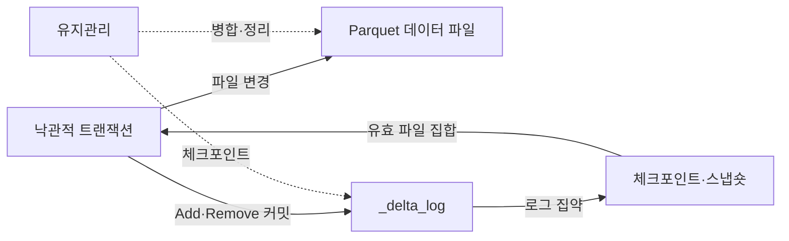
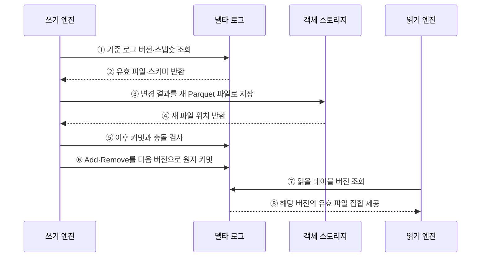

---
sidebar:
  order: 127
  label: "127. Delta Lake (Delta Lake)"
  badge:
    text: "기출 · 30%"
    variant: note
title: "Delta Lake (Delta Lake)"
date: "2026-07-27T23:59:59+09:00"
tags:
  - "notes-software"
weight: 127
extra:
  question_no: "127"
  source_status: "기출"
  source_history: "137회"
  priority: 30
  priority_note: "137회 기출, Delta Lake 구현 사례 성격"
---

## 미리 알고가기

- **밑줄 델타 로그 `_delta_log`(언더스코어 델타 언더스코어 로그)**: 숨김·시스템용 이름을 나타내는 밑줄 표기와 Delta Lake 로그 이름을 결합한 디렉터리로 데이터 파일과 트랜잭션 로그를 분리해 테이블 버전을 관리함
- **델타 레이크(Delta Lake)**: 객체 스토리지의 데이터 파일과 `_delta_log` 트랜잭션 로그로 테이블 버전을 관리하는 오픈 소스 형식임
- **원자성·일관성·격리성·지속성(Atomicity, Consistency, Isolation, Durability, ACID)**: 네 영문 첫 글자를 딴 ACID를 '애시드'로 읽으며 로그 커밋의 트랜잭션 성질을 뜻함
- **파케이(Apache Parquet)**: 열 단위 압축과 분석 읽기에 적합한 공개 파일 형식임
- **델타 트랜잭션 로그(Delta Transaction Log)**: 테이블의 버전별 파일·스키마·프로토콜 변경을 순서대로 기록하는 로그임
- **파일 추가·제거 동작(Add/Remove Action)**: 현재 스냅숏에 포함하거나 제외할 데이터 파일을 로그에 기록하는 메타데이터 동작임
- **체크포인트(Checkpoint)**: 이전 로그 동작을 Parquet 파일로 집약해 독자가 재생할 로그 범위를 줄이는 요약본임
- **스냅숏(Snapshot)**: 특정 로그 버전에서 유효한 파일과 스키마로 구성된 테이블 상태임
- **낙관적 동시성 제어(Optimistic Concurrency Control)**: 변경 파일을 먼저 만들고 커밋 시 현재 버전과 충돌을 검사하는 방식임
- **병합(MERGE)**: '머지'로 읽으며 대문자는 SQL 명령임을 나타내고 키 조건에 따른 수정·삽입을 한 테이블 변경으로 처리함
- **파일 정리(VACUUM)**: '배큠'으로 읽으며 대문자는 유지관리 명령임을 나타내고 보존 기한이 지난 미참조 파일을 삭제함
- **과거 버전 조회(Time Travel)**: 지정한 과거 버전이나 시점의 테이블 스냅숏을 조회하는 기능임
- **스키마 강제(Schema Enforcement)**: 적재 데이터가 테이블의 열 이름과 자료형 규칙을 지키는지 검사하는 기능임

## Ⅰ. 개요

- Delta Lake는 Parquet 데이터 파일의 추가·제거를 `_delta_log`에 버전별로 기록해 객체 스토리지 테이블에 ACID 트랜잭션을 제공하는 오픈 테이블 형식이다.
- 파일 목록만으로 관리할 때 발생하는 부분 쓰기·동시 변경 충돌·과거 상태 복원 문제를 트랜잭션 로그로 해결한다.

### 쉽게 이해하기 (학습용)

- 파일을 직접 고쳐 쓰지 않고 어떤 파일을 넣고 뺐는지 거래 일지에 남긴다.

## Ⅱ. 특징

- **로그 기반 스냅숏**: Add·Remove 동작을 재생해 버전별 유효 파일 집합을 결정한다.
- **낙관적 동시성 제어**: 데이터를 먼저 쓰고 커밋 직전에 이후 변경과 작업 범위의 충돌을 검사한다.
- **스키마 통제**: 적재 스키마를 검사하고 명시적인 진화 규칙으로 열 변경을 관리한다.
- **버전 활용**: Time Travel과 변경 데이터 기능으로 과거 조회·감사·증분 처리를 지원한다.
- **운영 유지관리**: 체크포인트·파일 최적화·VACUUM으로 로그 재생과 작은 파일 비용을 통제한다.

### 쉽게 이해하기 (학습용)

- 장부가 남아도 가리키는 옛 파일을 지우면 그 시점으로 돌아갈 수 없으므로 보존 기간을 함께 정해야 한다.

## Ⅲ. 아키텍처 및 구성요소

**도표안 A — 구조도**

**도표안 B — sequenceDiagram**

| 설계 요소 | 설명 |
|:---|:---|
| Parquet 데이터 파일 | 테이블 행을 불변 열 파일로 저장 |
| `_delta_log` | Add·Remove·스키마·프로토콜 동작을 커밋 순서로 기록 |
| 체크포인트·스냅숏 | 누적 로그를 집약하고 버전별 상태 복원 |
| 낙관적 트랜잭션 | 기준 버전 이후 변경과 읽기·쓰기 범위의 충돌 검사 |
| 유지관리 | 파일 병합·통계·체크포인트·보존 기한 관리 |

**동작 원리**

- ① 쓰기 엔진이 작업을 시작할 기준 로그 버전과 스냅숏을 조회한다.
- ② 델타 로그가 그 버전의 유효 파일·스키마·프로토콜을 반환한다.
- ③ 쓰기 엔진이 변경 결과를 기존 파일과 분리된 새 Parquet 파일로 저장한다.
- ④ 객체 스토리지가 커밋 후보인 새 파일 위치를 반환한다.
- ⑤ 쓰기 엔진이 기준 버전 이후 커밋과 자신의 읽기·쓰기 범위를 비교해 충돌을 검사한다.
- ⑥ 충돌이 없으면 파일 Add·Remove 동작을 다음 로그 버전으로 원자적으로 커밋한다.
- ⑦ 읽기 엔진이 현재 또는 지정한 과거 테이블 버전을 조회한다.
- ⑧ 델타 로그가 체크포인트와 후속 로그를 반영한 유효 파일 집합을 제공한다.

### 쉽게 이해하기 (학습용)

- 새 파일을 먼저 만들고 겹친 변경이 없을 때만 다음 장부 번호를 차지해 전체 변경을 공개한다.

## Ⅳ. 종류 및 비교

| 비교 항목 | Delta Lake | 일반 Parquet 파일 집합 |
|:---|:---|:---|
| 상태 기준 | `_delta_log` 커밋 버전 | 디렉터리에 보이는 파일 |
| 동시 쓰기 | 낙관적 충돌 검사·원자 커밋 | 별도 조정 없으면 부분 결과·충돌 가능 |
| 변경 처리 | MERGE·UPDATE·DELETE를 새 파일과 로그로 반영 | 파일 재작성·목록 교체를 직접 구현 |
| 과거 조회 | 보존된 로그와 파일로 버전 조회 | 별도 버전 보관 체계 필요 |
| 운영 부담 | 로그·작은 파일·VACUUM·호환성 관리 | 목록·파티션·동시성·복구 직접 관리 |

> Delta Lake는 데이터 파일을 데이터베이스 페이지처럼 직접 수정하는 것이 아니라 새 파일과 로그 커밋으로 테이블 상태를 전환한다.

### 쉽게 이해하기 (학습용)

- 일반 파일 묶음과 달리 몇 번째 장부인지가 현재 표와 과거 표를 결정한다.

## Ⅴ. 실무 고려사항 및 대책

| 고려사항 | 위험 | 대책 |
|:---|:---|:---|
| MERGE 조건 | 넓은 검색·대량 파일 재작성 | 키·파티션 조건 축소·변경량 관찰 |
| 동시 쓰기 | 같은 데이터 범위의 반복 충돌 | 작업 범위 분리·재시도·필요 시 직렬화 |
| 작은 파일 | 메타데이터·파일 열기 비용 증가 | 적정 배치 크기·Compaction·쓰기 최적화 |
| VACUUM | 과거 버전·장기 실행 독자의 파일 삭제 | 최대 작업 시간보다 긴 보존·삭제 전 감사 |
| 체크포인트 | 긴 로그 재생으로 시작 지연 | 주기·로그 규모 관찰·체크포인트 검증 |
| 엔진 호환 | 지원 프로토콜·기능 차이 | 최소 호환 버전·기능 시험·업그레이드 통제 |

> **적용 사례**: 주문 MERGE가 만든 Add·Remove를 하나의 로그 버전으로 커밋해 삽입과 수정의 일부만 노출되는 일을 막는다.

### 쉽게 이해하기 (학습용)

- 주문 수정 파일을 모두 준비해 한 장의 거래 기록으로 공개하고, 읽는 중인 옛 파일은 보존 기간 전에 지우지 않는다.

## Ⅵ. 결론

- Delta Lake의 핵심은 Parquet 자체가 아니라 유효 파일 집합을 순서 있는 로그 버전으로 원자적으로 확정하는 데 있다.
- MERGE 충돌·작은 파일·체크포인트·VACUUM 보존 기간·엔진 프로토콜을 함께 관리해야 ACID와 과거 조회를 안정적으로 유지할 수 있다.

### 쉽게 이해하기 (학습용)

- 장부와 실제 파일이 모두 있어야 현재와 과거의 표를 안전하게 되살릴 수 있다.
