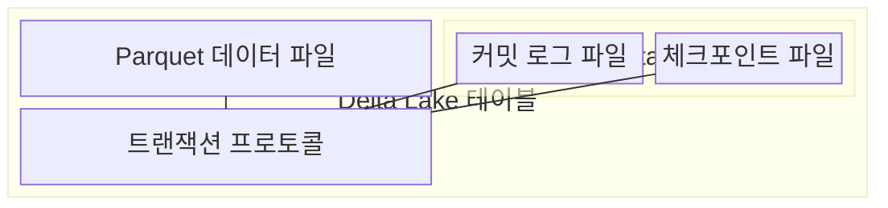
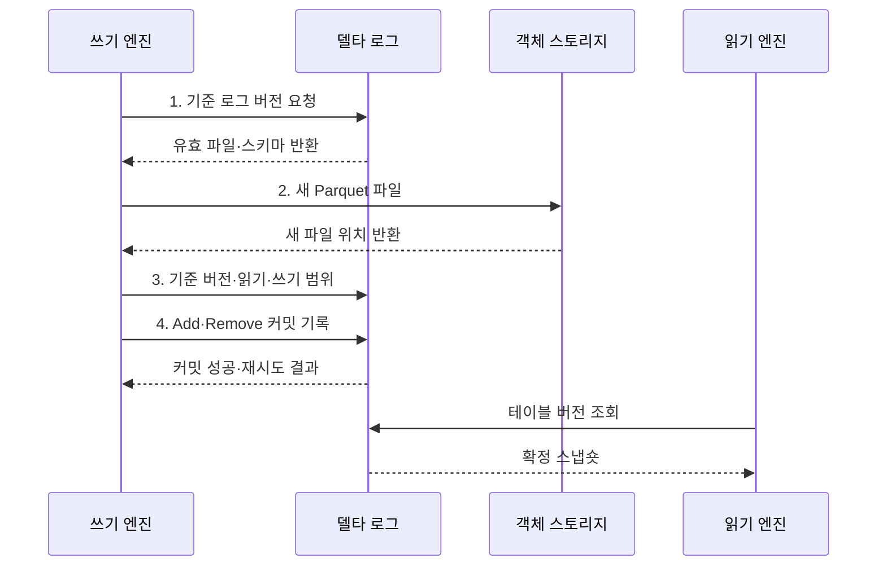

---
sidebar:
  order: 127
  label: "127. Delta Lake (Delta Lake)"
  badge:
    text: "기출 · 30%"
    variant: note
title: "Delta Lake (Delta Lake)"
date: "2026-07-30T23:47:25+09:00"
tags:
  - "notes-software"
weight: 127
extra:
  question_no: "127"
  source_status: "기출"
  source_history: "137회"
  priority: 30
  priority_note: "137회 기출, Delta Lake 구현 사례 성격"
---

## 미리 알고가기

- **밑줄 델타 로그 `_delta_log`(언더스코어 델타 언더스코어 로그)**: 밑줄을 포함한 공식 디렉터리 이름이며 데이터 파일과 트랜잭션 로그를 분리해 테이블 버전을 관리한다.
- **델타 레이크(Delta Lake)**: 객체 스토리지의 데이터 파일과 `_delta_log` 트랜잭션 로그로 테이블 버전을 관리하는 오픈 소스 형식이다.
- **원자성·일관성·격리성·지속성(Atomicity, Consistency, Isolation, Durability, ACID)**: 로그 변경을 원자적으로 커밋하고 동시 작업과 장애 뒤에도 결과를 보존하는 트랜잭션 성질이다.
- **파케이(Apache Parquet)**: 열 단위 압축과 분석 읽기를 지원하는 공개 파일 형식이다.
- **델타 트랜잭션 로그(Delta Transaction Log)**: 테이블의 버전별 파일·스키마·프로토콜 변경을 순서대로 기록하는 로그이다.
- **파일 추가·제거 동작(Add/Remove Action)**: 현재 스냅숏에 포함하거나 제외할 데이터 파일을 로그에 기록하는 메타데이터 동작이다.
- **체크포인트(Checkpoint)**: 이전 로그 동작을 Parquet 파일로 집약해 독자가 재생할 로그 범위를 줄이는 요약본이다.
- **스냅숏(Snapshot)**: 특정 로그 버전에서 유효한 파일과 스키마로 구성된 테이블 상태이다.
- **낙관적 동시성 제어(Optimistic Concurrency Control)**: 변경 파일을 먼저 만들고 커밋 시 현재 버전과 충돌을 검사하는 방식이다.
- **병합(MERGE)**: 키 조건에 따른 수정·삽입을 하나의 테이블 변경으로 처리하는 명령이다.
- **파일 정리(VACUUM)**: 보존 기한이 지난 미참조 데이터 파일을 삭제하는 유지관리 명령이다.
- **과거 버전 조회(Time Travel)**: 지정한 과거 버전이나 시점의 테이블 스냅숏을 조회하는 기능이다.
- **스키마 강제(Schema Enforcement)**: 적재 데이터가 테이블의 열 이름과 자료형 규칙을 지키는지 검사하는 기능이다.

## Ⅰ. 개요

- 정의/개념: Parquet 파일을 **트랜잭션 로그로 버전 관리**하는 테이블 형식
- 배경/필요성: 객체 스토리지의 **부분 쓰기·동시 변경 충돌** 방지

### 쉽게 이해하기 (학습용)

- 파일을 직접 고쳐 쓰지 않고 어떤 파일을 넣고 뺐는지 거래 일지에 남긴다.

## Ⅱ. 특징

- Add·Remove 동작으로 유효 파일을 결정하는 **로그 스냅숏**
- 기준 버전 이후의 변경 충돌을 검사하는 **낙관적 커밋**
- 스키마·과거 조회·파일 정리를 연결한 **테이블 버전 관리**

### 쉽게 이해하기 (학습용)

- 장부가 남아도 가리키는 옛 파일을 지우면 그 시점으로 돌아갈 수 없으므로 보존 기간을 함께 정해야 한다.

## Ⅲ. 구조 및 구성요소

| 구성요소 | 책임 |
|:---|:---|
| Parquet 데이터 파일 | 테이블 행을 **불변 열 파일**로 저장 |
| 커밋 로그 파일 | 버전별 **Add·Remove·스키마 변경** 기록 |
| 체크포인트 파일 | 누적 로그를 집약해 **스냅숏 복원** 범위 단축 |
| 트랜잭션 프로토콜 | 기준 버전과 작업 범위의 **충돌 검사·원자 커밋** |

### 쉽게 이해하기 (학습용)

- 데이터 파일과 변경 장부를 분리해 각 버전의 표를 재현한다.

## Ⅳ. 흐름도

**동작 원리**

1. **기준 로그 버전 요청**: 트랜잭션 로그를 재생해 현재 파일 집합과 스키마 확보
2. **새 Parquet 파일**: 기존 데이터를 덮지 않고 변경 결과를 불변 객체로 기록
3. **기준 버전·읽기·쓰기 범위**: 기준 이후의 동시 변경과 작업 충돌 판정
4. **Add·Remove 커밋 기록**: 파일 추가·제거를 다음 단일 로그 버전으로 확정

### 쉽게 이해하기 (학습용)

- 새 파일을 먼저 만들고 겹친 변경이 없을 때만 다음 장부 번호를 차지해 전체 변경을 공개한다.

## Ⅴ. 종류 및 비교

| 테이블 저장 방식 | Delta Lake | 일반 Parquet 파일 집합 |
|:---|:---|:---|
| 적용 기준 | **동시 변경·과거 조회**가 필요한 테이블 | 변경 없는 **단순 파일 분석** |
| 핵심 특징 | **로그 버전·원자 커밋** | 디렉터리 파일 목록 |
| 한계 | **로그·파일 정리·엔진 호환** 관리 | **부분 결과·버전 복구**를 직접 구현 |

### 쉽게 이해하기 (학습용)

- 일반 파일 묶음과 달리 몇 번째 장부인지가 현재 표와 과거 표를 결정한다.

## Ⅵ. 실무 고려사항 및 대책

| 고려사항 | 대책 | 효과 |
|:---|:---|:---|
| MERGE 조건이 넓으면 **파일 재작성량** 급증 | 키·파티션 조건으로 **MERGE 범위** 축소 | 변경 대상의 **파일 읽기·쓰기** 감소 |
| 같은 파일 범위를 갱신하면 **커밋 충돌** 반복 | 작업 범위 분리와 **충돌 재시도** 적용 | 낙관적 커밋의 **성공률** 향상 |
| 작은 파일 누적으로 **파일 열기·로그 처리** 비용 증가 | 배치 크기 조정과 **파일 병합** 적용 | 스캔의 **파일·메타데이터 비용** 감소 |
| VACUUM 기간이 긴 작업보다 짧으면 **과거 파일** 삭제 | 최대 작업 시간보다 긴 **보존 기간** 설정 | 실행 중인 조회와 **과거 버전** 보호 |

### 쉽게 이해하기 (학습용)

- 주문 수정 파일을 모두 준비해 한 장의 거래 기록으로 공개하고, 읽는 중인 옛 파일은 보존 기간 전에 지우지 않는다.

## Ⅶ. 결론

- 동시 변경과 버전 복원이 필요하면 **트랜잭션 로그** 기반 **Delta Lake** 채택

### 쉽게 이해하기 (학습용)

- 장부와 실제 파일이 모두 있어야 현재와 과거의 표를 안전하게 되살릴 수 있다.
