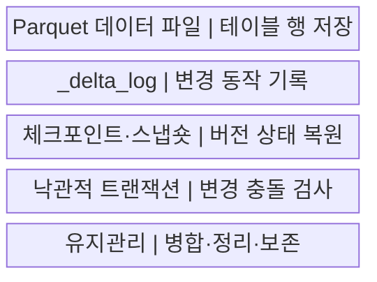
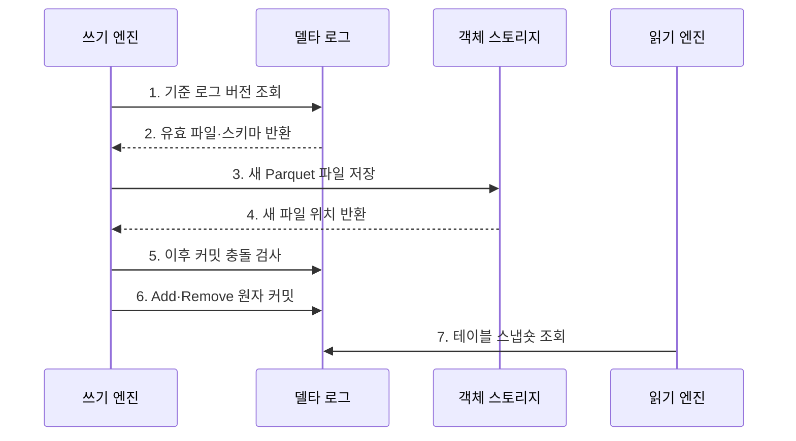

---
sidebar:
  order: 127
  label: "127. Delta Lake (Delta Lake)"
  badge:
    text: "기출 · 30%"
    variant: note
title: "Delta Lake (Delta Lake)"
date: "2026-07-27T23:59:59+09:00"
tags:
  - "notes-software"
weight: 127
extra:
  question_no: "127"
  source_status: "기출"
  source_history: "137회"
  priority: 30
  priority_note: "137회 기출, Delta Lake 구현 사례 성격"
---

## 미리 알고가기

- **밑줄 델타 로그 `_delta_log`(언더스코어 델타 언더스코어 로그)**: 숨김·시스템용 이름을 나타내는 밑줄 표기와 Delta Lake 로그 이름을 결합한 디렉터리로 데이터 파일과 트랜잭션 로그를 분리해 테이블 버전을 관리함
- **델타 레이크(Delta Lake)**: 객체 스토리지의 데이터 파일과 `_delta_log` 트랜잭션 로그로 테이블 버전을 관리하는 오픈 소스 형식임
- **원자성·일관성·격리성·지속성(Atomicity, Consistency, Isolation, Durability, ACID)**: 네 영문 첫 글자를 딴 ACID를 '애시드'로 읽으며 로그 커밋의 트랜잭션 성질을 뜻함
- **파케이(Apache Parquet)**: 열 단위 압축과 분석 읽기를 지원하는 공개 파일 형식임
- **델타 트랜잭션 로그(Delta Transaction Log)**: 테이블의 버전별 파일·스키마·프로토콜 변경을 순서대로 기록하는 로그임
- **파일 추가·제거 동작(Add/Remove Action)**: 현재 스냅숏에 포함하거나 제외할 데이터 파일을 로그에 기록하는 메타데이터 동작임
- **체크포인트(Checkpoint)**: 이전 로그 동작을 Parquet 파일로 집약해 독자가 재생할 로그 범위를 줄이는 요약본임
- **스냅숏(Snapshot)**: 특정 로그 버전에서 유효한 파일과 스키마로 구성된 테이블 상태임
- **낙관적 동시성 제어(Optimistic Concurrency Control)**: 변경 파일을 먼저 만들고 커밋 시 현재 버전과 충돌을 검사하는 방식임
- **병합(MERGE)**: '머지'로 읽으며 대문자는 SQL 명령임을 나타내고 키 조건에 따른 수정·삽입을 한 테이블 변경으로 처리함
- **파일 정리(VACUUM)**: '배큠'으로 읽으며 대문자는 유지관리 명령임을 나타내고 보존 기한이 지난 미참조 파일을 삭제함
- **과거 버전 조회(Time Travel)**: 지정한 과거 버전이나 시점의 테이블 스냅숏을 조회하는 기능임
- **스키마 강제(Schema Enforcement)**: 적재 데이터가 테이블의 열 이름과 자료형 규칙을 지키는지 검사하는 기능임

## Ⅰ. 개요

- 정의/개념: Parquet 파일을 **트랜잭션 로그로 버전 관리**하는 테이블 형식
- 배경/필요성: 객체 스토리지의 **부분 쓰기·동시 변경 충돌** 방지

### 쉽게 이해하기 (학습용)

- 파일을 직접 고쳐 쓰지 않고 어떤 파일을 넣고 뺐는지 거래 일지에 남긴다.

## Ⅱ. 특징

- **로그 스냅숏**: Add·Remove로 유효 파일을 결정한다.
- **낙관 커밋**: 기준 버전 이후의 변경 충돌을 검사한다.
- **버전 관리**: 스키마·과거 조회·파일 정리를 지원한다.

### 쉽게 이해하기 (학습용)

- 장부가 남아도 가리키는 옛 파일을 지우면 그 시점으로 돌아갈 수 없으므로 보존 기간을 함께 정해야 한다.

## Ⅲ. 구조 및 구성요소

| 구성요소 | 책임 |
|:---|:---|
| Parquet 데이터 파일 | 테이블 행을 불변 열 파일로 저장 |
| `_delta_log` | Add·Remove·스키마 변경을 순서대로 기록 |
| 체크포인트·스냅숏 | 누적 로그를 집약해 버전 상태를 복원 |
| 낙관적 트랜잭션 | 기준 버전 이후 변경과 작업 범위의 충돌 검사 |
| 유지관리 | 파일 병합·체크포인트·보존 기한 관리 |

### 쉽게 이해하기 (학습용)

- 데이터 파일과 변경 장부를 분리해 각 버전의 표를 재현한다.

## Ⅳ. 흐름도

**동작 원리**

- **1. 기준 로그 버전 조회**: 쓰기 작업의 기준 스냅숏을 확인한다.
- **2. 유효 파일·스키마 반환**: 현재 파일과 쓰기 규칙을 전달한다.
- **3. 새 Parquet 파일 저장**: 변경 결과를 새 파일로 기록한다.
- **4. 새 파일 위치 반환**: 커밋 후보 파일의 위치를 전달한다.
- **5. 이후 커밋 충돌 검사**: 기준 버전 이후 변경과 범위를 비교한다.
- **6. Add·Remove 원자 커밋**: 다음 로그 버전으로 변경을 확정한다.
- **7. 테이블 스냅숏 조회**: 현재 또는 과거 버전의 상태를 읽는다.

### 쉽게 이해하기 (학습용)

- 새 파일을 먼저 만들고 겹친 변경이 없을 때만 다음 장부 번호를 차지해 전체 변경을 공개한다.

## Ⅴ. 종류 및 비교

| 비교 항목 | Delta Lake | 일반 Parquet 파일 집합 |
|:---|:---|:---|
| 적용 기준 | **동시 변경·과거 조회**가 필요한 테이블 | 단순 파일 분석 |
| 핵심 특징 | **로그 버전·원자 커밋** | 디렉터리 파일 목록 |
| 한계 | 로그·정리·엔진 호환 관리 | 부분 결과·복구를 직접 구현 |

### 쉽게 이해하기 (학습용)

- 일반 파일 묶음과 달리 몇 번째 장부인지가 현재 표와 과거 표를 결정한다.

## Ⅵ. 실무 고려사항 및 대책

| 고려사항 | 대책 | 효과 |
|:---|:---|:---|
| MERGE 범위 | 키·파티션 조건으로 검색 범위 축소 | 파일 재작성량 감소 |
| 동시 쓰기 | 작업 범위 분리·충돌 재시도 | 반복 커밋 실패 억제 |
| 작은 파일 | 배치 크기 조정·파일 병합 | 파일 열기 비용 감소 |
| VACUUM | 최대 작업 시간보다 긴 보존 기간 설정 | 과거 조회 파일 보호 |
| 엔진 호환 | 프로토콜·기능 지원 시험 | 읽기·쓰기 오류 예방 |

### 쉽게 이해하기 (학습용)

- 주문 수정 파일을 모두 준비해 한 장의 거래 기록으로 공개하고, 읽는 중인 옛 파일은 보존 기간 전에 지우지 않는다.

## Ⅶ. 결론

- **충돌 범위·파일 크기·보존 기간·엔진 호환**으로 Delta Lake를 운영한다.

### 쉽게 이해하기 (학습용)

- 장부와 실제 파일이 모두 있어야 현재와 과거의 표를 안전하게 되살릴 수 있다.
