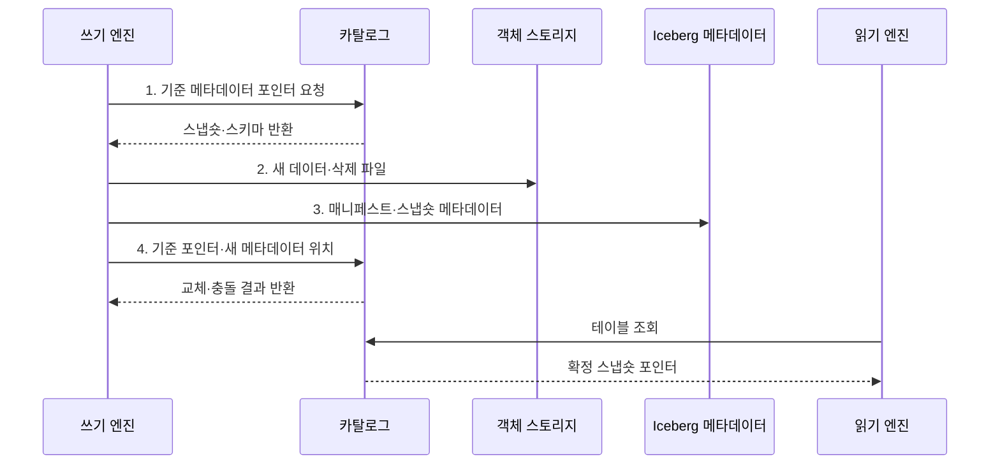

---
sidebar:
  order: 128
  label: "128. Apache Iceberg"
  badge:
    text: "기출 · 30%"
    variant: note
title: "Apache Iceberg"
date: "2026-07-30T23:48:02+09:00"
tags:
  - "notes-software"
weight: 128
extra:
  question_no: "128"
  source_status: "기출"
  source_history: "137회"
  priority: 30
  priority_note: "137회 기출, Iceberg 메타데이터 구조 사례"
---

## 미리 알고가기

- **아파치 아이스버그(Apache Iceberg)**: 데이터 파일을 디렉터리 대신 스냅숏 메타데이터로 추적하는 오픈 테이블 포맷이다.
- **오픈 테이블 포맷(Open Table Format)**: 데이터 파일과 스냅숏·스키마·파티션 메타데이터의 관리 규칙을 공개 명세로 정의한 형식이다.
- **스냅숏(Snapshot)**: 한 시점의 테이블을 구성하는 데이터·삭제 파일과 스키마를 가리키는 버전 상태이다.
- **매니페스트(Manifest)**: 스냅숏이 읽을 데이터 또는 삭제 파일의 경로·파티션 값·열 통계를 기록한 불변 파일이다.
- **매니페스트 목록(Manifest List)**: 한 스냅숏이 참조하는 Manifest와 각 Manifest의 파티션 요약 통계를 기록한 파일이다.
- **필드 식별자(Field Identifier, Field ID)**: 열 이름이나 순서가 바뀌어도 같은 논리 열을 추적하는 고유 번호이다.
- **숨은 파티셔닝(Hidden Partitioning)**: 열 조건을 파티션 변환에 자동 투영해 사용자가 물리 경로 규칙을 직접 쓰지 않게 하는 방식이다.
- **파티션 명세(Partition Specification)**: 원천 열과 변환 함수로 데이터 파일의 파티션 값을 만드는 규칙이다.
- **삭제 파일(Delete File)**: 기존 데이터 파일을 즉시 재작성하지 않고 삭제할 행의 위치나 키를 기록한 파일이다.
- **위치·동등 삭제(Position·Equality Delete)**: 삭제할 행의 파일 위치나 키 값을 기록해 읽을 때 제외하는 두 삭제 방식이다.
- **파일 가지치기(File Pruning)**: 파티션 값과 열 통계로 조건에 맞지 않는 파일을 읽기 전에 제외하는 처리이다.
- **Hive식 파일 테이블(Hive-style File Table)**: `열=값`을 '열 이퀄 값'으로 읽고 등호로 파티션 열과 값을 연결해 디렉터리에서 파일 집합을 찾는 구조이다.
- **메타데이터 포인터(Metadata Pointer)**: 카탈로그가 현재 유효한 Iceberg 메타데이터 파일을 가리키는 참조이다.

> **키워드:** Apache Iceberg

## Ⅰ. 개요

- 정의/개념: 스냅숏과 **매니페스트**로 유효 파일을 추적하는 **오픈 테이블 포맷**
- 배경/필요성: 디렉터리 기반 표는 **파일 탐색·동시 커밋·구조 변경** 일관성 제약

### 쉽게 이해하기 (학습용)

- 폴더를 모두 뒤지지 않고 단계별 목록표로 현재 표에 속한 파일을 찾는다.

## Ⅱ. 특징

- 커밋별 불변 파일 집합을 제공하는 **스냅숏 격리**
- 파티션 요약·열 통계 기반 **매니페스트 가지치기**
- **필드 ID·숨은 파티셔닝** 기반 스키마·파티션 진화

### 쉽게 이해하기 (학습용)

- 열 이름이나 저장 칸이 바뀌어도 번호표와 목록표가 같은 데이터를 찾아 주지만 낡은 목록과 파일은 정리해야 한다.

## Ⅲ. 구조 및 구성요소

| 구성요소 | 책임 |
|:---|:---|
| 카탈로그 | 테이블 이름과 현재 **메타데이터 포인터** 관리 |
| 메타데이터 파일 | **스키마·파티션 명세·스냅숏 이력** 저장 |
| 스냅숏·매니페스트 목록 | 커밋별 **매니페스트 집합·파티션 요약** 정의 |
| 매니페스트 | 데이터·삭제 파일의 **경로·열 통계** 기록 |
| 데이터·삭제 파일 | 실제 행과 **위치·동등 삭제** 정보 저장 |

### 쉽게 이해하기 (학습용)

- 단계별 목록표가 현재 테이블에 속한 파일을 찾아 준다.

## Ⅳ. 흐름도

**동작 원리**

1. **기준 메타데이터 포인터 요청**: 쓰기가 출발할 스냅숏과 필드 ID 기반 스키마 확보
2. **새 데이터·삭제 파일**: 변경 행을 불변 데이터와 위치·동등 삭제 정보로 기록
3. **매니페스트·스냅숏 메타데이터**: 파일 통계와 파티션 정보를 새 메타데이터 트리에 연결
4. **기준 포인터·새 메타데이터 위치**: 기준이 같을 때만 현재 포인터를 원자적으로 전환

### 쉽게 이해하기 (학습용)

- 새 자료와 목록표를 모두 만든 뒤 카탈로그의 현재 위치표 한 칸만 원자적으로 바꾼다.

## Ⅴ. 종류 및 비교

| 테이블 형식 | Apache Iceberg | Hive식 파일 테이블 |
|:---|:---|:---|
| 적용 기준 | **다중 엔진·구조 진화** 테이블 | 단순 경로 기반 파일 테이블 |
| 핵심 특징 | **스냅숏·Manifest·필드 ID** | 디렉터리·파티션 경로 |
| 한계 | **매니페스트·삭제 파일·스냅숏** 관리 | **동시성·구조 변경**을 직접 관리 |

### 쉽게 이해하기 (학습용)

- Hive식 표는 서랍 이름으로 자료를 찾고 Iceberg는 버전 있는 목록표로 자료를 찾는다.

## Ⅵ. 실무 고려사항 및 대책

| 고려사항 | 대책 | 효과 |
|:---|:---|:---|
| 매니페스트가 늘면 **쿼리 계획 읽기** 비용 증가 | 목표 크기와 **매니페스트 병합** 주기 설정 | 계획 단계의 **메타데이터 읽기** 감소 |
| 작은 파일 누적으로 **파일 스캔 횟수** 증가 | 쓰기 크기 조정과 **데이터 파일 재작성** | 스캔의 **파일 열기 비용** 감소 |
| 삭제 파일 누적으로 **읽기 병합 비용** 증가 | 삭제 파일 관찰과 **데이터 파일 재작성** | 조회 시 **삭제 적용 비용** 억제 |
| 스냅숏 보존이 짧으면 실행 중인 **과거 파일** 삭제 | 작업·복구 기간 기반 **스냅숏 보존** | 실행 중인 조회와 **과거 버전** 보호 |

### 쉽게 이해하기 (학습용)

- 사용자는 시각만 검색해도 Iceberg가 맞는 날짜 서랍과 값 범위의 파일만 골라낸다.

## Ⅶ. 결론

- 다중 엔진과 스키마·파티션 진화가 필요하면 **Apache Iceberg** 채택

### 쉽게 이해하기 (학습용)

- 목록표 덕분에 구조를 안전하게 바꿀 수 있지만 오래된 목록과 쓰지 않는 파일은 계속 정리해야 한다.
