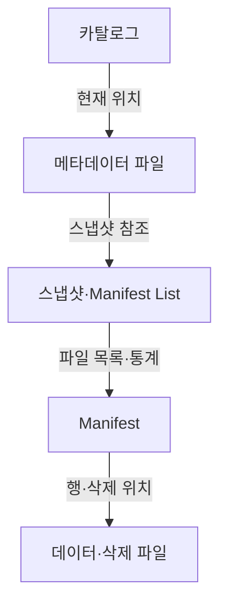
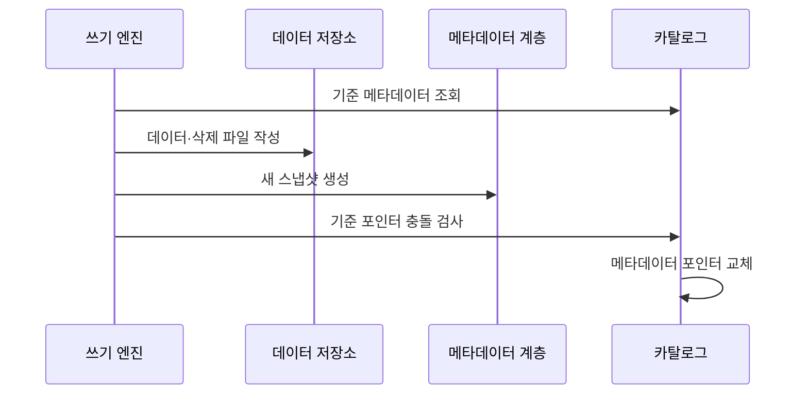

---
sidebar:
  order: 128
  label: "128. Apache Iceberg"
  badge:
    text: "기출 · 30%"
    variant: note
title: "Apache Iceberg"
date: "2026-07-27T23:59:59+09:00"
tags:
  - "notes-software"
weight: 128
extra:
  question_no: "128"
  source_status: "기출"
  source_history: "137회"
  priority: 30
  priority_note: "137회 기출, Iceberg 메타데이터 구조 사례"
---

## 미리 알고가기

- **아파치 아이스버그(Apache Iceberg)**: 데이터 파일을 디렉터리 대신 스냅숏 메타데이터로 추적하는 오픈 테이블 포맷임
- **오픈 테이블 포맷(Open Table Format)**: 데이터 파일과 스냅숏·스키마·파티션 메타데이터의 관리 규칙을 공개 명세로 정의한 형식임
- **스냅숏(Snapshot)**: 한 시점의 테이블을 구성하는 데이터·삭제 파일과 스키마를 가리키는 버전 상태임
- **매니페스트(Manifest)**: 스냅숏이 읽을 데이터 또는 삭제 파일의 경로·파티션 값·열 통계를 기록한 불변 파일임
- **매니페스트 목록(Manifest List)**: 한 스냅숏이 참조하는 Manifest와 각 Manifest의 파티션 요약 통계를 기록한 파일임
- **필드 식별자(Field Identifier, Field ID)**: ID를 '아이디'로 읽고 영문 첫 글자로 식별자를 줄여 쓰며 열 이름이 바뀌어도 같은 논리 열을 추적하는 번호임
- **숨은 파티셔닝(Hidden Partitioning)**: 열 조건을 파티션 변환에 자동 투영해 사용자가 물리 경로 규칙을 직접 쓰지 않게 하는 방식임
- **파티션 명세(Partition Specification)**: 원천 열과 변환 함수로 데이터 파일의 파티션 값을 만드는 규칙임
- **삭제 파일(Delete File)**: 기존 데이터 파일을 즉시 재작성하지 않고 삭제할 행의 위치나 키를 기록한 파일임
- **파일 가지치기(File Pruning)**: 파티션 값과 열 통계로 조건에 맞지 않는 파일을 읽기 전에 제외하는 처리임
- **Hive식 파일 테이블(Hive-style File Table)**: `열=값`을 '열 이퀄 값'으로 읽고 등호로 파티션 열과 값을 연결해 디렉터리에서 파일 집합을 찾는 구조임
- **메타데이터 포인터(Metadata Pointer)**: 카탈로그가 현재 유효한 Iceberg 메타데이터 파일을 가리키는 참조임

## Ⅰ. 개요

- 정의/개념: 스냅숏·Manifest로 **데이터 파일·스키마·파티션**을 관리하는 포맷
- 기존 한계: 디렉터리 경로 기반 테이블은 **동시 커밋·스키마 진화·파일 추적**에 한계

### 쉽게 이해하기 (학습용)
- 목록과 통계를 단계별 목록표로 관리해 상태를 찾음

## Ⅱ. 특징

- Manifest 통계는 파일을 줄여 조회 시간을 단축한다
- 필드 ID는 열 이름 변경의 오독을 막는다
- 숨은 파티셔닝은 배치 변경의 질의 수정을 줄인다
- 삭제 파일은 데이터 재작성을 늦춰 쓰기 비용을 줄인다

### 쉽게 이해하기 (학습용)
- Iceberg는 엔진이 바뀌어도 같은 스냅숏을 읽게 하지만 Manifest 병합·스냅숏 만료·고아 파일 정리가 필요함

## Ⅲ. 아키텍처 및 구성요소

| 설계 요소 | 설명 |
|:---|:---|
| 카탈로그 | 테이블 이름과 현재 메타데이터 위치 관리 |
| 메타데이터 파일 | 스키마·파티션 명세·스냅샷 이력 저장 |
| 스냅샷·Manifest List | 커밋별 Manifest 집합·통계 정의 |
| Manifest | 데이터·삭제 파일 경로·통계 기록 |
| 데이터·삭제 파일 | 실제 행과 위치·키 기반 삭제 저장 |

> 요약: 카탈로그 메타가 스냅샷 계층을 통해 파일을 결정함

### 쉽게 이해하기 (학습용)
- 카탈로그가 현재 메타데이터를 가리키고 스냅샷과 Manifest가 읽을 데이터·삭제 파일을 좁힌다

## Ⅳ. 원리 및 절차 흐름도

| 절차 | 설명 |
|:---|:---|
| 기준 메타데이터 조회 | 현재 스키마·스냅샷·포인터 확인 |
| 데이터·삭제 파일 작성 | 변경 결과와 삭제 위치·키 기록 |
| 새 스냅샷 생성 | Manifest·Manifest List·이력 생성 |
| 기준 포인터 충돌 검사 | 동시 커밋이 포인터를 바꿨는지 확인 |
| 메타데이터 포인터 교체 | 충돌 없으면 새 스냅샷을 현재로 확정 |

> 요약: 새 파일 생성 후 포인터를 원자적으로 바꿔 커밋함

### 쉽게 이해하기 (학습용)
- 새 파일과 목록표를 만든 뒤 포인터를 원자적으로 바꿈

## Ⅴ. 종류 및 비교

| 파일 테이블 관리 | Apache Iceberg | Hive식 파일 테이블 |
|:---|:---|:---|
| 적용 기준 | 다중 엔진·스키마·파티션 진화 | 정적 파티션·단일 엔진 분석 |
| 핵심 특징 | 스냅숏·Manifest의 **파일·통계 추적** | 디렉터리·**파티션 경로 탐색** |
| 한계 | 메타데이터 누적·**커밋 충돌** | 파티션 변경 시 **경로·질의 수정** |

> 요약: 스냅샷으로 파일을 추적하고 포인터 교체로 동시 쓰기를 관리함

### 쉽게 이해하기 (학습용)
- Hive식 경로 목록 대신 스냅샷이 파일과 통계를 추적함

## Ⅵ. 실무 사례

1. 로그 테이블은 **숨은 파티셔닝**으로 파일 탐색 축소

### 쉽게 이해하기 (학습용)
- 로그 질의의 날짜 조건을 Iceberg가 저장 파티션 조건으로 바꾸어 불필요한 파일을 제외한다

## Ⅶ. 결론

- **다중 엔진·스키마·파티션 진화**가 필요하면 Iceberg 선택

### 쉽게 이해하기 (학습용)
- Iceberg는 스키마·파티션 변화와 다중 엔진 읽기를 분리하지만 누적 Manifest·스냅숏·고아 파일을 주기적으로 정리해야 함
